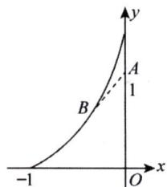

# 1993年数学（一）真题解析

# 一、填空题

(1)【答案】 $\left(0, \frac{1}{4}\right)$ .

【解】由 $F^{\prime}(x) = 2 - \frac{1}{\sqrt{x}} = 0$ 得 $x = \frac{1}{4}$ ，当 $0 < x < \frac{1}{4}$ 时 $F^{\prime}(x) < 0$

故 $F(x)$ 的单调减区间为 $\left(0, \frac{1}{4}\right)$ .

(2)【答案】 $\left\{0, \frac{\sqrt{10}}{5}, \frac{\sqrt{15}}{5}\right\}$ .

【解】 旋转曲面方程为 $\Sigma:3x^{2} + 2y^{2} + 3z^{2} = 12$

法向量为 $n = \{6x,4y,6z\}_{(0,\sqrt{3},\sqrt{2})} = \{0,4\sqrt{3},6\sqrt{2}\}$

所求的单位法向量为 $n^0 = \left\{0, \frac{\sqrt{10}}{5}, \frac{\sqrt{15}}{5}\right\}$ .

(3)【答案】 $\frac{2\pi}{3}$ .

【解】 $b_{3} = \frac{1}{\pi}\int_{-\pi}^{\pi}f(x)\sin 3x\mathrm{d}x = 2\int_{0}^{\pi}x\sin 3x\mathrm{d}x$

$$
= - \frac {2}{3} \int_ {0} ^ {\pi} x \mathrm {d} (\cos 3 x) = - \frac {2}{3} x \cos 3 x \left| _ {0} ^ {\pi} + \frac {2}{3} \int_ {0} ^ {\pi} \cos 3 x \mathrm {d} x = \frac {2 \pi}{3}. \right.
$$

(4)【答案】 $\frac{1}{x^2 + y^2 + z^2}$ .

【解】 $\operatorname{grad} u = \left\{\frac{\partial u}{\partial x}, \frac{\partial u}{\partial y}, \frac{\partial u}{\partial z}\right\} = \left\{\frac{x}{x^2 + y^2 + z^2}, \frac{y}{x^2 + y^2 + z^2}, \frac{z}{x^2 + y^2 + z^2}\right\},$

则 $\operatorname{div}(\mathbf{grad} u) = \frac{\partial}{\partial x}\left(\frac{x}{x^2 + y^2 + z^2}\right) + \frac{\partial}{\partial y}\left(\frac{y}{x^2 + y^2 + z^2}\right) + \frac{\partial}{\partial z}\left(\frac{z}{x^2 + y^2 + z^2}\right)$

$$
\begin{array}{l} = \frac {y ^ {2} + z ^ {2} - x ^ {2}}{\left(x ^ {2} + y ^ {2} + z ^ {2}\right) ^ {2}} + \frac {x ^ {2} + z ^ {2} - y ^ {2}}{\left(x ^ {2} + y ^ {2} + z ^ {2}\right) ^ {2}} + \frac {x ^ {2} + y ^ {2} - z ^ {2}}{\left(x ^ {2} + y ^ {2} + z ^ {2}\right) ^ {2}} \\ = \frac {1}{x ^ {2} + y ^ {2} + z ^ {2}}. \\ \end{array}
$$

(5)【答案】 $X = k(1,1,\dots ,1)^{\mathrm{T}}(k$ 为任意常数).

【解】因为 $r(\mathbf{A}) = n - 1$ ，所以 $\mathbf{AX} = \mathbf{0}$ 的基础解系含一个线性无关的解向量，又因为 $\mathbf{A}\left[ \begin{array}{l}1\\ 1\\ \vdots \\ 1 \end{array} \right] = \mathbf{0}$ ，所以 $\mathbf{AX} = \mathbf{0}$ 的通解为 $\mathbf{X} = k(1,1,\dots ,1)^{\mathrm{T}}(k$ 为任意常数）.

# 二、选择题

(1)【答案】 (B).

【解】 由 $\lim_{x\to 0}\frac{f(x)}{x^3} = \lim_{x\to 0}\frac{\cos x\cdot\sin(\sin^2x)}{3x^2} = \frac{1}{3}$ 得 $f(x)\sim \frac{1}{3} x^{3}$

又 $g(x)\sim x^3$ ，故 $f(x)$ 是 $g(x)$ 的同阶但非等价的无穷小，应选(B).

（2）【答案】 （A）.

【解】 双纽线 $(x^{2} + y^{2})^{2} = x^{2} - y^{2}$ 的极坐标方程为 $r^2 = \cos 2\theta$

由对称性得双纽线所围成的面积为

$$
A = 4 \times \frac {1}{2} \int_ {0} ^ {\frac {\pi}{4}} \cos 2 \theta d \theta = 2 \int_ {0} ^ {\frac {\pi}{4}} \cos 2 \theta d \theta ,
$$

应选(A).

（3）【答案】 (C).

【解】 直线 $L_{1}$ 的方向向量为 $s_1 = \{1, - 2,1\}$

直线 $L_{2}$ 的方向向量为 $\pmb{s}_2 = \{1, - 1,0\} \times \{0,2,1\} = \{-1, - 1,2\}$

设两直线的夹角为 $\theta$ ，由 $\cos \theta = \frac{|s_1 \cdot s_2|}{|s_1| \cdot |s_2|} = \frac{1}{2}$ 得 $\theta = \frac{\pi}{3}$ ，应选(C).

（4）【答案】 （B）.

【解】令 $P(x,y) = [f(x) - \mathrm{e}^x ]\sin y$ ， $Q(x,y) = -f(x)\cos y,$

由 $\frac{\partial Q}{\partial x} = \frac{\partial P}{\partial y}$ 得 $f^{\prime}(x) + f(x) - \mathrm{e}^{x} = 0$ ，即 $f^{\prime}(x) + f(x) = \mathrm{e}^{x}$

解得 $f(x) = \left[\int \mathrm{e}^{x}\cdot \mathrm{e}^{\int \mathrm{d}x}\mathrm{d}x + C\right]\mathrm{e}^{-\int \mathrm{d}x} = \left(\frac{1}{2}\mathrm{e}^{2x} + C\right)\mathrm{e}^{-x},$

再由 $f(0) = 0$ 得 $C = -\frac{1}{2}$ ，故 $f(x) = \frac{\mathrm{e}^x - \mathrm{e}^{-x}}{2}$ ，应选(B).

（5）【答案】 (C).

【解】由 $PQ = O$ 得 $r(P) + r(Q) \leqslant 3$ ，当 $t \neq 6$ 时 $r(Q) = 2$ ，则 $r(P) \leqslant 1$

再由 $\pmb{P}$ 为非零矩阵得 $r(P)\geqslant 1$ ，故 $r(P) = 1$ ，应选(C).

三、

(1)【解】 $\lim_{x\to \infty}\left(\sin {\frac{2}{x}} + \cos {\frac{1}{x}}\right)^{x} = \lim_{x\to \infty}\left\{\left[1 + \left(\sin {\frac{2}{x}} + \cos {\frac{1}{x}} - 1\right)\right]^{\frac{1}{\sin{\frac{2}{x}} + \cos{\frac{1}{x}} - 1}}\right\} x\cdot \left(\sin {\frac{2}{x}} + \cos {\frac{1}{x}} - 1\right)$

$$
= \mathrm {e} ^ {\lim  _ {x \rightarrow \infty} \frac {\sin \frac {2}{x} + \cos \frac {1}{x} - 1}{\frac {1}{x}}} = \mathrm {e} ^ {\lim  _ {t \rightarrow 0} \frac {\sin 2 t + \cos t - 1}{t}} = \mathrm {e} ^ {2}.
$$

（2）【解】 方法一

$$
\int \frac {x \mathrm {e} ^ {x}}{\sqrt {\mathrm {e} ^ {x} - 1}} \mathrm {d} x = \int \frac {x \mathrm {d} (\mathrm {e} ^ {x} - 1)}{\sqrt {\mathrm {e} ^ {x} - 1}} = 2 \int x \mathrm {d} (\sqrt {\mathrm {e} ^ {x} - 1}) = 2 x \sqrt {\mathrm {e} ^ {x} - 1} - 2 \int \sqrt {\mathrm {e} ^ {x} - 1} \mathrm {d} x,
$$

令 $\sqrt{\mathrm{e}^x - 1} = t$ ，即 $x = \ln (1 + t^{2})$ ，则

$$
\begin{array}{l} \int \sqrt {e ^ {x} - 1} d x = \int t \cdot \frac {2 t}{1 + t ^ {2}} d t = 2 \int \left(1 - \frac {1}{1 + t ^ {2}}\right) d t = 2 t - 2 \arctan t + C \\ = 2 \sqrt {\mathrm {e} ^ {x} - 1} - 2 \arctan \sqrt {\mathrm {e} ^ {x} - 1} + C, \\ \end{array}
$$

故 $\int \frac{x\mathrm{e}^x}{\sqrt{\mathrm{e}^x - 1}}\mathrm{d}x = (2x - 4)\sqrt{\mathrm{e}^x - 1} +4\arctan \sqrt{\mathrm{e}^x - 1} +C.$

方法二 令 $\sqrt{\mathrm{e}^x - 1} = t$ ，则 $x = \ln (1 + t^{2}),\mathrm{d}x = \frac{2t}{1 + t^{2}}\mathrm{d}t,$

$$
\begin{array}{l} \int \frac {x e ^ {x}}{\sqrt {e ^ {x} - 1}} d x = \int \frac {\ln (1 + t ^ {2}) \cdot (1 + t ^ {2})}{t} \cdot \frac {2 t}{1 + t ^ {2}} d t \\ = 2 \int \ln (1 + t ^ {2}) d t = 2 t \ln (1 + t ^ {2}) - 2 \int \frac {t \cdot 2 t}{1 + t ^ {2}} d t \\ \end{array}
$$

$$
\begin{array}{l} = 2 t \ln \left(1 + t ^ {2}\right) - 4 t + 4 \arctan t + C \\ = (2 x - 4) \sqrt {\mathrm {e} ^ {x} - 1} + 4 \arctan \sqrt {\mathrm {e} ^ {x} - 1} + C. \\ \end{array}
$$

(3)【解】 将方程 $x^{2}y^{\prime} + xy = y^{2}$ 化为 $y^\prime +\frac{1}{x} y = \frac{1}{x^2} y^2$

令 $u = y^{-1}$ ，则 $\frac{\mathrm{d}u}{\mathrm{d}x} -\frac{1}{x} u = -\frac{1}{x^2},$

解得 $u = \left[\int \left(-\frac{1}{x^2}\right)\mathrm{e}^{\int -\frac{1}{x}\mathrm{d}x}\mathrm{d}x + C\right]\mathrm{e}^{-\int -\frac{1}{x}\mathrm{d}x} = \left(\frac{1}{2x^2} +C\right)x$ ，即 $\frac{1}{y} = \left(\frac{1}{2x^2} +C\right)x$

由 $y(1) = 1$ 得 $C = \frac{1}{2}$ ，故满足条件的特解为 $y = \frac{2x}{1 + x^2}$ .

四、【解】 由 $\sqrt{x^2 + y^2} = \sqrt{2 - x^2 - y^2}$ 得 $x^{2} + y^{2} = 1$

曲面 $\Sigma$ 所围成的几何体 $\Omega = \{(x, y, z) \mid x^2 + y^2 \leqslant 1, \sqrt{x^2 + y^2} \leqslant z \leqslant \sqrt{2 - x^2 - y^2}\}$ , 由高斯公式得

$$
\begin{array}{l} \iint_ {z} 2 x z \mathrm {d} y \mathrm {d} z + y z \mathrm {d} z \mathrm {d} x - z ^ {2} \mathrm {d} x \mathrm {d} y = \iiint_ {\Omega} (2 z + z - 2 z) \mathrm {d} v = \iiint_ {\Omega} z \mathrm {d} v \\ = \iint_ {x ^ {2} + y ^ {2} \leqslant 1} d x d y \int_ {\sqrt {x ^ {2} + y ^ {2}}} ^ {\sqrt {2 - x ^ {2} - y ^ {2}}} z d z = \iint_ {x ^ {2} + y ^ {2} \leqslant 1} (1 - x ^ {2} - y ^ {2}) d x d y \\ = \int_ {0} ^ {2 \pi} d \theta \int_ {0} ^ {1} (r - r ^ {3}) d r = \frac {\pi}{2}. \\ \end{array}
$$

五、【解】 令 $S(x) = \sum_{n=0}^{\infty}(n^{2} - n + 1)x^{n}$ ，

由 $\lim_{n\to \infty}\left|\frac{a_{n + 1}}{a_n}\right| = 1$ 得级数 $\sum_{n = 0}^{\infty}(n^{2} - n + 1)x^{n}$ 的收敛半径为 $R = 1$

当 $x = \pm 1$ 时级数发散，故级数的收敛域为 $(-1,1)$

由 $S(x) = \sum_{n=0}^{\infty}(n^{2} - n + 1)x^{n} = x^{2}\sum_{n=2}^{\infty}n(n - 1)x^{n - 2} + \sum_{n=0}^{\infty}x^{n}$

$$
= x ^ {2} \left(\sum_ {n = 2} ^ {\infty} x ^ {n}\right) ^ {\prime \prime} + \frac {1}{1 - x} = x ^ {2} \left(\frac {x ^ {2}}{1 - x}\right) ^ {\prime \prime} + \frac {1}{1 - x} = \frac {1 - 2 x + 3 x ^ {2}}{(1 - x) ^ {3}},
$$

故 $\sum_{n = 0}^{\infty}\frac{(-1)^n(n^2 - n + 1)}{2^n} = S\left(-\frac{1}{2}\right) = \frac{22}{27}.$

六、【证明】（1） $f(x) - f(0) = f^{\prime}(\xi)x$ $(0 <   \xi <  x)$

由 $f^{\prime}(x)\geqslant k > 0$ 得 $f(x) > f(0) + kx$ ，于是 $\lim_{x\to x_0}f(x) = +\infty .$

再由 $f(0) < 0$ 得 $f(x)$ 在 $(0, +\infty)$ 内至少有一个零点，

因为 $f^{\prime}(x)\geqslant k > 0$ ，所以 $f(x)$ 在 $[0, + \infty)$ 上严格递增，故零点是唯一的.

(2) $a^b > b^a$ 等价于 $b \ln a - a \ln b > 0$ .

令 $f(x) = x\ln a - a\ln x$ ， $f(a) = 0$

$$
f ^ {\prime} (x) = \ln a - \frac {a}{x} > 0 (x > a),
$$

由 $\left\{ \begin{array}{l} f(a) = 0, \\ f'(x) > 0 (x > a), \end{array} \right.$ 得 $f(x) > 0 (x > a)$ ，

由 $b > a$ 得 $f(b) > 0$ ，故 $a^b > b^a$

七、【解】 令 $\mathbf{A} = \begin{pmatrix} 2 & 0 & 0\\ 0 & 3 & a\\ 0 & a & 3 \end{pmatrix} ,\mathbf{X} = \begin{pmatrix} x_{1}\\ x_{2}\\ x_{3} \end{pmatrix} ,f = \mathbf{X}^{\mathrm{T}}\mathbf{A}\mathbf{X},$

显然矩阵 $\mathbf{A}$ 的特征值为 $\lambda_1 = 1, \lambda_2 = 2, \lambda_3 = 5$

由 $|\mathbf{A}| = 10$ 得 $9 - a^{2} = 5$ ，解得 $a = 2$ ，即 $\mathbf{A} = \begin{pmatrix} 2 & 0 & 0 \\ 0 & 3 & 2 \\ 0 & 2 & 3 \end{pmatrix}$

由 $\pmb {E} - \pmb {A} = \left( \begin{array}{rrr} - 1 & 0 & 0\\ 0 & -2 & -2\\ 0 & -2 & -2 \end{array} \right)\sim \left( \begin{array}{rrr}1 & 0 & 0\\ 0 & 1 & 1\\ 0 & 0 & 0 \end{array} \right)$ 得 $\lambda_{1} = 1$ 对应的特征向量为 $\pmb{\alpha}_{1} = \left( \begin{array}{l}0\\ -1\\ 1 \end{array} \right)$

由 $2E - A = \begin{pmatrix} 0 & 0 & 0 \\ 0 & -1 & -2 \\ 0 & -2 & -1 \end{pmatrix} \sim \begin{pmatrix} 0 & 1 & 0 \\ 0 & 0 & 1 \\ 0 & 0 & 0 \end{pmatrix}$ 得 $\lambda_{2} = 2$ 对应的特征向量为 $\pmb{\alpha}_{2} = \begin{pmatrix} 1 \\ 0 \\ 0 \end{pmatrix}$ ;

由 $5\pmb {E} - \pmb {A} = \left( \begin{array}{rrr}3 & 0 & 0\\ 0 & 2 & -2\\ 0 & -2 & 2 \end{array} \right)\sim \left( \begin{array}{rrr}1 & 0 & 0\\ 0 & 1 & -1\\ 0 & 0 & 0 \end{array} \right)$ 得 $\lambda_3 = 5$ 对应的特征向量为 $\alpha_{3} = \left( \begin{array}{l}0\\ 1\\ 1 \end{array} \right),$

规范化得 $\pmb{\gamma}_{1} = \frac{1}{\sqrt{2}}\binom{0}{-1}$ ， $\pmb{\gamma}_{2} = \binom{1}{0},\quad \pmb{\gamma}_{3} = \frac{1}{\sqrt{2}}\binom{0}{1},$

故正交矩阵为 $Q = \left[ \begin{array}{ccc}0 & 1 & 0\\ -\frac{1}{\sqrt{2}} & 0 & \frac{1}{\sqrt{2}}\\ \frac{1}{\sqrt{2}} & 0 & \frac{1}{\sqrt{2}} \end{array} \right].$

八、【证明】 显然 $r(\mathbf{AB}) = n$

由 $r(\mathbf{AB}) \leqslant r(\mathbf{A}), r(\mathbf{AB}) \leqslant r(\mathbf{B})$ 得 $r(\mathbf{A}) \geqslant n, r(\mathbf{B}) \geqslant n$ .

因为矩阵的秩不超过其行数及列数，所以 $r(\mathbf{A}) \leqslant n, r(\mathbf{B}) \leqslant n$ ，于是 $r(\mathbf{B}) = n$

因为矩阵的秩与矩阵的行向量组的秩、列向量组的秩都相等，所以矩阵 $\pmb{B}$ 的列向量组的秩为 $n$ ，故矩阵 $\pmb{B}$ 的列向量组线性无关.

九、【解】 轨迹如右图所示.设在时刻 $t,B$ 位于点 $(x,y)$ 处，则

$$
\frac {\mathrm {d} y}{\mathrm {d} x} = \frac {(1 + v t) - y}{- x}.
$$

上式两边对 $x$ 求导，得

$$
x \frac {\mathrm {d} ^ {2} y}{\mathrm {d} x ^ {2}} = - v \frac {\mathrm {d} t}{\mathrm {d} x}.
$$

由于

（\*）

  
九题图

$$
\begin{array}{l} 2 v = \frac {\mathrm {d} s}{\mathrm {d} t} = \sqrt {1 + \left(\frac {\mathrm {d} y}{\mathrm {d} x}\right) ^ {2}} \cdot \frac {\mathrm {d} x}{\mathrm {d} t}, \\ \frac {\mathrm {d} t}{\mathrm {d} x} = \frac {1}{2 v} \sqrt {1 + \left(\frac {\mathrm {d} y}{\mathrm {d} x}\right) ^ {2}}, \\ \end{array}
$$

将上式代入 $(\ast)$ 式，得到所求的微分方程为

$$
x \frac {\mathrm {d} ^ {2} y}{\mathrm {d} x ^ {2}} + \frac {1}{2} \sqrt {1 + \left(\frac {\mathrm {d} y}{\mathrm {d} x}\right) ^ {2}} = 0,
$$

其初值条件为 $y|_{x = -1} = 0, y'|_{x = -1} = 1.$

# 十、填空题

(1)【答案】 $\frac{1}{6}$ .

【解】设 $A_{1} = \{$ 第一次取到正品 $\}$ , $A_{2} = \{$ 第一次取到次品 $\}$ , $B = \{$ 第二次取到次品 $\}$ ,

$P(A_{1}) = \frac{10}{12},\quad P(A_{2}) = \frac{2}{12},\quad P(B\mid A_{1}) = \frac{2}{11},\quad P(B\mid A_{2}) = \frac{1}{11}$ ，则

$$
\begin{array}{l} P (B) = P \left(A _ {1}\right) P \left(B \mid A _ {1}\right) + P \left(A _ {2}\right) P \left(B \mid A _ {2}\right) \\ = \frac {1 0}{1 2} \times \frac {2}{1 1} + \frac {2}{1 2} \times \frac {1}{1 1} = \frac {2}{1 2} = \frac {1}{6}. \\ \end{array}
$$

(2)【答案】 $\left\{ \begin{array}{ll} \frac{1}{4\sqrt{y}}, & 0 < y < 4, \\ 0, & \text{其他}. \end{array} \right.$

【解】 $F_{Y}(y) = P\{Y \leqslant y\} = P\{X^{2} \leqslant y\}$ ，

当 $y < 0$ 时， $F_{Y}(y) = 0$

当 $y \geqslant 4$ 时， $F_{Y}(y) = 1$

当 $0 \leqslant y < 4$ 时， $F_{Y}(y) = P\{0 \leqslant X \leqslant \sqrt{y}\} = \int_{0}^{\sqrt{y}} \frac{1}{2} \mathrm{d}y = \frac{\sqrt{y}}{2}$ ，

即 $F_{Y}(y) = \left\{ \begin{array}{ll}0, & y <   0,\\ \frac{\sqrt{y}}{2}, & 0\leqslant y <   4,\\ 1, & y\geqslant 4, \end{array} \right.$ 故 $f_{Y}(y) = \left\{ \begin{array}{ll}\frac{1}{4\sqrt{y}}, & 0 <   y <   4,\\ 0, & \text{其他}. \end{array} \right.$

十一、【解】 $(1)E(X) = \int_{-\infty}^{+\infty}xf(x)\mathrm{d}x = 0,$

由 $E(X^2) = \int_{-\infty}^{+\infty}x^2 f(x)\mathrm{d}x = \int_0^{+\infty}x^2\mathrm{e}^{-x}\mathrm{d}x = \Gamma (3) = 2$ ，得

$$
D (X) = E \left(X ^ {2}\right) - [ E (X) ] ^ {2} = 2.
$$

(2) $\operatorname{Cov}(X, |X|) = E(X|X) - E(X) \cdot E(|X|)$ ,

由 $E(X|X|) = \int_{-\infty}^{+\infty}x|x|f(x)\mathrm{d}x = 0$ ，得 $\operatorname {Cov}(X,|X|) = 0$ ，即 $X$ 与 $|X|$ 不相关.

（3）设 $F(x,y)$ 为 $(X,|X|)$ 的联合分布函数，

$$
F (1, 1) = P \{X \leqslant 1, | X | \leqslant 1 \} = P \{- 1 \leqslant X \leqslant 1 \} = \int_ {0} ^ {1} e ^ {- x} d x = 1 - \frac {1}{e},
$$

$$
F _ {X} (1) = P \{X \leqslant 1 \} = \frac {1}{2} \int_ {- \infty} ^ {1} e ^ {- | x |} d x = \frac {1}{2} + \frac {1}{2} \int_ {0} ^ {1} e ^ {- x} d x = 1 - \frac {1}{2 e},
$$

$$
F _ {| X |} (1) = P \{| X | \leqslant 1 \} = \int_ {0} ^ {1} \mathrm {e} ^ {- | x |} \mathrm {d} x = 1 - \frac {1}{\mathrm {e}},
$$

因为 $F(1,1)\neq F_{X}(1)\cdot F_{|X|}(1)$ ，所以 $X$ 与 $\mid X\mid$ 不相互独立.