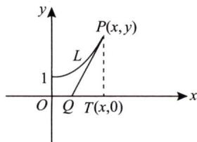

# 1999年数学（一）真题解析

# 一、填空题

(1)【答案】 $\frac{1}{3}$ .

【解】 $\lim_{x\to 0}\left(\frac{1}{x^2} -\frac{1}{x\tan x}\right) = \lim_{x\to 0}\frac{\tan x - x}{x^2\tan x} = \lim_{x\to 0}\frac{\tan x - x}{x^3}$

$$
= \lim  _ {x \rightarrow 0} \frac {\sec^ {2} x - 1}{3 x ^ {2}} = \frac {1}{3}.
$$

(2)【答案】 $\sin x^2$

【解】由 $\int_0^x\sin (x - t)^2\mathrm{d}t\xlongequal{x - t = u}\int_x^0\sin u^2 (-\mathrm{d}u) = \int_0^x\sin u^2\mathrm{d}u$ 得

$$
\frac {\mathrm {d}}{\mathrm {d} x} \int_ {0} ^ {x} \sin (x - t) ^ {2} \mathrm {d} t = \frac {\mathrm {d}}{\mathrm {d} x} \int_ {0} ^ {x} \sin u ^ {2} \mathrm {d} u = \sin x ^ {2}.
$$

(3)【答案】 $C_1\mathrm{e}^{-2x} + C_2\mathrm{e}^{2x} + \frac{1}{4} x\mathrm{e}^{2x}(C_1,C_2$ 为任意常数）.

【解】 特征方程为 $\lambda^2 - 4 = 0$ ，特征根为 $\lambda_1 = -2, \lambda_2 = 2$

则 $y^{\prime \prime} - 4y = 0$ 的通解为 $y = C_{1}\mathrm{e}^{-2x} + C_{2}\mathrm{e}^{2x}$

令 $y^{\prime \prime} - 4y = \mathrm{e}^{2x}$ 的特解为 $y_0(x) = ax\mathrm{e}^{2x}$ ，代入得 $a = \frac{1}{4}$

故 $y^{\prime \prime} - 4y = \mathrm{e}^{2x}$ 的通解为 $y = C_{1}\mathrm{e}^{-2x} + C_{2}\mathrm{e}^{2x} + \frac{1}{4} x\mathrm{e}^{2x}(C_{1},C_{2}$ 为任意常数).

（4）【答案】 $\lambda_{1} = \lambda_{2} = \dots = \lambda_{n - 1} = 0, \lambda_{n} = n$

【解】方法一 由 $|\lambda E - A| = \left| \begin{array}{cccc}\lambda -1 & -1 & \dots & -1\\ -1 & \lambda -1 & \dots & -1\\ \vdots & \vdots & & \vdots \\ -1 & -1 & \dots & \lambda -1 \end{array} \right| = \lambda^{n - 1}(\lambda -n) = 0$ 得

$\mathbf{A}$ 的特征值为 $\lambda_{1} = \lambda_{2} = \dots = \lambda_{n - 1} = 0, \lambda_{n} = n$

方法二 因为 $\mathbf{A}^{\mathrm{T}} = \mathbf{A}$ ，所以 $\mathbf{A}$ 可对角化，从而 $\mathbf{A}$ 的非零特征值的个数与 $r(\mathbf{A})$ 相同，

由 $r(\mathbf{A}) = 1$ 得 $A$ 只有一个非零特征值，

又因为 $\operatorname{tr} A = n = \lambda_1 + \lambda_2 + \dots + \lambda_n$ ，所以 $A$ 的特征值为 $\lambda_1 = \lambda_2 = \dots = \lambda_{n-1} = 0, \lambda_n = n$ .

(5)【答案】 $\frac{1}{4}$ .

【解】 令 $P(A) = p$

而 $P(A \cup B \cup C) = P(A) + P(B) + P(C) - P(AB) - P(AC) - P(BC) + P(ABC)$

$$
= 3 p - 3 p ^ {2},
$$

则 $3p - 3p^2 = \frac{9}{16}$ ，解得 $p = \frac{1}{4}$ 或 $p = \frac{3}{4}$

由 $P(A) < \frac{1}{2}$ 得 $P(A) = \frac{1}{4}$ .

# 二、选择题

（1）【答案】 （A).

【解】 若 $f(x)$ 是奇函数， $F(x) = \int_{a}^{x} f(t) \, \mathrm{d}t$

则 $F(-x) = \int_{a}^{-x}f(t)\mathrm{d}t\frac{t = -u}{-a}\int_{-a}^{x}f(-u)(-\mathrm{d}u) = \int_{-a}^{x}f(u)\mathrm{d}u$

$$
= \int_ {- a} ^ {a} f (u) \mathrm {d} u + \int_ {a} ^ {x} f (u) \mathrm {d} u = \int_ {a} ^ {x} f (u) \mathrm {d} u = F (x),
$$

即 $F(x)$ 为偶函数，应选(A).

(2)【答案】 (D).

【解】 $f_{+}^{\prime}(0) = \lim_{x\to 0^{+}}\frac{f(x) - f(0)}{x - 0} = \lim_{x\to 0^{+}}\frac{1 - \cos x}{x\sqrt{x}} = 0;$

$$
f _ {-} ^ {\prime} (0) = \lim  _ {x \rightarrow 0 ^ {-}} \frac {f (x) - f (0)}{x - 0} = \lim  _ {x \rightarrow 0 ^ {-}} x g (x) = 0,
$$

因为 $f_{+}^{\prime}(0) = f_{-}^{\prime}(0)$ ，所以 $f(x)$ 在 $x = 0$ 处可导，应选(D).

(3)【答案】 (C).

【解】显然 $S(x)$ 是以2为周期的偶函数，则 $S\left(-\frac{5}{2}\right) = S\left(-\frac{1}{2}\right) = S\left(\frac{1}{2}\right)$

而 $S\left(\frac{1}{2}\right) = \frac{f\left(\frac{1}{2} - 0\right) + f\left(\frac{1}{2} + 0\right)}{2} = \frac{3}{4}$ , 应选(C).

(4)【答案】 (B).

【解】 当 $m > n$ 时， $r(\mathbf{A}) \leqslant n, r(\mathbf{B}) \leqslant n$

因为 $r(\mathbf{AB}) \leqslant \min \{r(\mathbf{A}), r(\mathbf{B})\}$ , 所以 $r(\mathbf{AB}) \leqslant n$

于是 $r(\mathbf{AB}) < m$ ，即 $\mathbf{AB}$ 为降秩矩阵，故 $|\mathbf{AB}| = 0$ ，应选(B).

（5）【答案】 (B).

【解】因为 $X, Y$ 相互独立且 $X \sim N(0,1), Y \sim N(1,1)$

所以 $X + Y\sim N(1,2)$ ，故 $P\{X + Y\leqslant 1\} = \frac{1}{2}$ ，应选(B).

三、【解】 $z = xf(x + y)$ 与 $F(x,y,z) = 0$ 两边对 $\mathcal{X}$ 求导得

$$
\left\{ \begin{array}{l l} { \frac {\mathrm {d} z}{\mathrm {d} x} = f + x \left(1 + \frac {\mathrm {d} y}{\mathrm {d} x}\right) f ^ {\prime},} \\ { F _ {x} ^ {\prime} + F _ {y} ^ {\prime} \frac {\mathrm {d} y}{\mathrm {d} x} + F _ {z} ^ {\prime} \frac {\mathrm {d} z}{\mathrm {d} x} = 0,} \end{array} \right. \text {即} \left\{ \begin{array}{l l} {- x f ^ {\prime} \frac {\mathrm {d} y}{\mathrm {d} x} + \frac {\mathrm {d} z}{\mathrm {d} x} = f + x f ^ {\prime},} \\ { F _ {y} ^ {\prime} \frac {\mathrm {d} y}{\mathrm {d} x} + F _ {z} ^ {\prime} \frac {\mathrm {d} z}{\mathrm {d} x} = - F _ {x} ^ {\prime},} \end{array} \right.
$$

解得 $\frac{\mathrm{d}z}{\mathrm{d}x} = \frac{(f + xf')F_y' - xf'F_x'}{F_y' + xf'F_z'}$ （ $F_{y}^{\prime} + xf^{\prime}F_{z}^{\prime}\neq 0)$

四、【解】令 $P(x,y) = \mathrm{e}^{x}\sin y - b(x + y)$ ， $Q(x,y) = \mathrm{e}^{x}\cos y - ax$ ，

$$
\frac {\partial Q}{\partial x} = \mathrm {e} ^ {x} \cos y - a, \quad \frac {\partial P}{\partial y} = \mathrm {e} ^ {x} \cos y - b,
$$

$$
I = \left(\oint_ {L + \overline {{O A}}} - \int_ {\overline {{O A}}}\right) [ e ^ {x} \sin y - b (x + y) ] d x + (e ^ {x} \cos y - a x) d y,
$$

而 $\oint_{L + \overline{OA}}\left[\mathrm{e}^{x}\sin y - b(x + y)\right]\mathrm{d}x + (\mathrm{e}^{x}\cos y - ax)\mathrm{d}y = \iint_{D}(b - a)\mathrm{d}x\mathrm{d}y = \frac{\pi}{2} (b - a)a^{2},$

$$
\int_ {\overline {{O A}}} \left[ e ^ {x} \sin y - b (x + y) \right] d x + \left(e ^ {x} \cos y - a x\right) d y = - \int_ {0} ^ {2 a} b x d x = - 2 a ^ {2} b,
$$

故 $I = \frac{\pi}{2} (b - a)a^2 + 2a^2 b = \left(\frac{\pi}{2} + 2\right)a^2 b - \frac{\pi}{2} a^3.$

五、【解】 方法一 曲线 $y = y(x)$ 上任一点 $P(x,y)$ 处的切线为

$$
Y - y = y ^ {\prime} (X - x),
$$

  
五题图

令 $Y = 0$ 得 $X = x - \frac{y}{y'}$ ，切线与 $x$ 轴的交点为 $Q\left(x - \frac{y}{y'}, 0\right)$ ，垂足为 $T(x, 0)$

则 $S_{1} = \frac{1}{2}\cdot \frac{y}{y^{\prime}}\cdot y = \frac{y^{2}}{2y^{\prime}}, S_{2} = \int_{0}^{x}y(t)\mathrm{d}t,$

由 $2S_{1} - S_{2} = 1$ 得 $\frac{y^2}{y'} -\int_0^x y(t)\mathrm{d}t = 1,$

两边对 $x$ 求导并整理得 $yy^{\prime \prime} = y^{\prime 2}$

令 $y^\prime = p$ ，则 $y^{\prime \prime} = p\frac{\mathrm{d}p}{\mathrm{d}y}$ 代入得 $y p\frac{\mathrm{d}p}{\mathrm{d}y} = p^{2}$

因为 $p \neq 0$ ，所以 $\frac{\mathrm{d}p}{\mathrm{d}y} - \frac{1}{y} p = 0$ ，解得 $p = C_1 \mathrm{e}^{-\int -\frac{1}{y} \mathrm{d}y} = C_1 y$

由 $y(0) = 1, y'(0) = 1$ 得 $C_1 = 1$ ，即 $\frac{\mathrm{dy}}{\mathrm{dx}} - y = 0$

解得 $y = C_2\mathrm{e}^{-\int -\mathrm{d}x} = C_2\mathrm{e}^x$ ，再由 $y(0) = 1$ 得 $C_2 = 1$ ，故 $y = \mathrm{e}^{x}$

方法二 曲线 $y = y(x)$ 上任一点 $P(x, y)$ 处的切线为 $Y - y = y'(X - x)$ ，

令 $Y = 0$ 得 $X = x - \frac{y}{y'}$ ，切线与 $x$ 轴的交点为 $Q\left(x - \frac{y}{y'}, 0\right)$ ，垂足为 $T(x, 0)$

则 $S_{1} = \frac{1}{2}\cdot \frac{y}{y^{\prime}}\cdot y = \frac{y^{2}}{2y^{\prime}}, S_{2} = \int_{0}^{x}y(t)\mathrm{d}t,$

由 $2S_{1} - S_{2} = 1$ 得 $\frac{y^2}{y'} -\int_0^x y(t)\mathrm{d}t = 1,$

两边对 $x$ 求导并整理得 $yy'' = y'^2$ ，从而 $\frac{yy'' - y'^2}{y^2} = 0$ ，即 $\left(\frac{y'}{y}\right)' = 0$ ，于是 $\frac{y'}{y} = C_1$

由 $y(0) = 1, y'(0) = 1$ 得 $C_1 = 1$ ，即 $y' - y = 0$

解得 $y = C_2\mathrm{e}^{-\int -\mathrm{d}x} = C_2\mathrm{e}^x$

再由 $y(0) = 1$ 得 $C_2 = 1$ ，故 $y = \mathrm{e}^x$

六、【证明】 令 $f(x) = (x^{2} - 1)\ln x - (x - 1)^{2},\quad f(1) = 0,$

$$
\begin{array}{l} f ^ {\prime} (x) = 2 x \ln x + x - \frac {1}{x} - 2 (x - 1) = 2 x \ln x - x - \frac {1}{x} + 2, f ^ {\prime} (1) = 0, \\ f ^ {\prime \prime} (x) = 2 \ln x + 2 - 1 + \frac {1}{x ^ {2}} = 2 \ln x + 1 + \frac {1}{x ^ {2}}, f ^ {\prime \prime} (1) = 2 > 0, \\ f ^ {\prime \prime} (x) = \frac {2}{x} - \frac {2}{x ^ {3}} = \frac {2 (x ^ {2} - 1)}{x ^ {3}}, \\ \end{array}
$$

当 $0 < x < 1$ 时 $f^{\prime \prime}(x) < 0$ ; 当 $x > 1$ 时 $f^{\prime \prime}(x) > 0$ , 则 $x = 1$ 为 $f^{\prime \prime}(x)$ 的最小值点, 由 $f^{\prime \prime}(1) = 2 > 0$ 得 $f^{\prime \prime}(x) \geqslant 2 > 0$ ,

由 $\left\{ \begin{array}{l} f^{\prime}(1) = 0, \\ f^{\prime \prime}(x) > 0 (x > 0) \end{array} \right.$ 得 $\left\{ \begin{array}{ll} f^{\prime}(x) < 0, & 0 < x < 1, \\ f^{\prime}(x) > 0, & x > 1, \end{array} \right.$ 从而 $x = 1$ 为 $f(x)$ 的最小值点，于是当 $x > 0$ 时 $f(x) \geqslant f(1) = 0$ ，故当 $x > 0$ 时 $(x^{2} - 1)\ln x \geqslant (x - 1)^{2}$ .

# 七、【解】设将空斗从井底拉至井口拉力做功为 $W_{1}$ ，则

$$
W _ {1} = 4 0 0 \times 3 0 = 1 2 0 0 0 (\mathrm {J});
$$

设拉力对绳做功为 $W_{2}$ ，取井底起点为原点， $\mathcal{X}$ 轴垂直向上，

取 $[x, x + \mathrm{d}x] \subset [0, 30]$ , $\mathrm{d}W_{2} = 50(30 - x)\mathrm{d}x$ ，则

$$
W _ {2} = 5 0 \int_ {0} ^ {3 0} (3 0 - x) \mathrm {d} x = 5 0 \times 4 5 0 = 2 2 5 0 0 (\mathrm {J});
$$

设拉力对污泥做功为 $W_{3}$ ，取 $[t,t + \mathrm{d}t]\subset [0,10],\mathrm{d}W_{3} = (2000 - 20t)\cdot 3\mathrm{d}t$ ，则

$$
W _ {3} = 3 \int_ {0} ^ {1 0} (2 0 0 0 - 2 0 t) \mathrm {d} t = 5 7 0 0 0 (\mathrm {J}),
$$

故拉力所做的功为 $W = 12000 + 22500 + 57000 = 91500(\mathrm{J})$

八、【解】 法向量为 $n = \{x,y,2z\}$ ，切平面为

$$
\pi : x (X - x) + y (Y - y) + 2 z (Z - z) = 0,
$$

整理得 $\pi : \frac{x}{2} X + \frac{y}{2} Y + zZ - 1 = 0$

$$
\rho (x, y, z) = \frac {1}{\sqrt {\frac {x ^ {2}}{4} + \frac {y ^ {2}}{4} + z ^ {2}}},
$$

$$
S: z = \sqrt {1 - \frac {x ^ {2}}{2} - \frac {y ^ {2}}{2}}, D _ {x y} = \{(x, y) | x ^ {2} + y ^ {2} \leqslant 2 \},
$$

由 $\frac{\partial z}{\partial x} = \frac{-x}{2z}, \frac{\partial z}{\partial y} = \frac{-y}{2z}$ 得 $\mathrm{d}S = \sqrt{1 + \left(\frac{\partial z}{\partial x}\right)^2 + \left(\frac{\partial z}{\partial y}\right)^2} \, \mathrm{d}x \, \mathrm{d}y = \frac{\sqrt{4 - x^2 - y^2}}{2z} \, \mathrm{d}x \, \mathrm{d}y,$

则 $\iint_{S} \frac{z}{\rho(x, y, z)} \mathrm{d}S = \iint_{S} z \sqrt{\frac{x^2}{4} + \frac{y^2}{4} + z^2} \mathrm{d}S$

$$
= \frac {1}{4} \iint_ {D _ {x y}} (4 - x ^ {2} - y ^ {2}) \mathrm {d} x \mathrm {d} y = \frac {1}{4} \int_ {0} ^ {2 \pi} \mathrm {d} \theta \int_ {0} ^ {\sqrt {2}} (4 r - r ^ {3}) \mathrm {d} r = \frac {3 \pi}{2}.
$$

九、【解】 $(1)a_{n + 2} + a_n = \int_0^{\frac{\pi}{4}}\tan^{n + 2}x\mathrm{d}x + \int_0^{\frac{\pi}{4}}\tan^n x\mathrm{d}x = \int_0^{\frac{\pi}{4}}\tan^n x\mathrm{d}(\tan x)$

$$
= \frac {1}{n + 1} \tan^ {n + 1} x \left| _ {0} ^ {\frac {\pi}{4}} \right. = \frac {1}{n + 1},
$$

则 $\sum_{n = 1}^{\infty}\frac{1}{n} (a_n + a_{n + 2}) = \sum_{n = 1}^{\infty}\frac{1}{n(n + 1)}$

$$
S _ {n} = \frac {1}{1 \times 2} + \frac {1}{2 \times 3} + \dots + \frac {1}{n (n + 1)} = 1 - \frac {1}{n + 1},
$$

由 $\lim_{n\to \infty}S_n = 1$ 得 $\sum_{n = 1}^{\infty}\frac{1}{n} (a_n + a_{n + 2}) = 1.$

(2) $a_{n} = \int_{0}^{\frac{\pi}{4}}\tan^{n}x\mathrm{d}x\stackrel {\tan x = t}{=}\int_{0}^{1}\frac{t^{n}}{1 + t^{2}}\mathrm{d}t\leqslant \int_{0}^{1}t^{n}\mathrm{d}t = \frac{1}{n + 1}\leqslant \frac{1}{n},$

于是 $0 \leqslant \frac{a_n}{n^\lambda} \leqslant \frac{1}{n^{\lambda + 1}}$ ，由 $\sum_{n = 1}^{\infty} \frac{1}{n^{\lambda + 1}}$ 收敛得出 $\sum_{n = 1}^{\infty} \frac{a_n}{n^\lambda}$ 收敛.

十、【解】 由 $\left( \begin{array}{ccc}a & -1 & c\\ 5 & b & 3\\ 1 - c & 0 & -a \end{array} \right)\left( \begin{array}{c} - 1\\ -1\\ 1 \end{array} \right) = \mu \left( \begin{array}{c} - 1\\ -1\\ 1 \end{array} \right)$ 得 $\left\{ \begin{array}{l} - a + 1 + c = -\mu ,\\ -b - 2 = -\mu ,\\ c - 1 - a = \mu , \end{array} \right.$

解得 $a = c, \mu = -1, b = -3$

再由 $|\mathbf{A}| = \left| \begin{array}{ccc}a & -1 & a\\ 5 & -3 & 3\\ 1 - a & 0 & -a \end{array} \right| = -1$ 得 $a = 2,c = 2$

$\lambda_0 = \frac{|A|}{\mu} = 1$ ，故 $a = 2,b = -3,c = 2,\lambda_0 = 1.$

十一、【证明】（必要性）设 $\pmb{B}^{\mathrm{T}}\pmb{A}\pmb{B}$ 为正定矩阵，由正定矩阵的定义，对任意的 $X\neq 0$ ，有

$$
\mathbf {X} ^ {\mathrm {T}} \mathbf {B} ^ {\mathrm {T}} \mathbf {A} \mathbf {B} \mathbf {X} = (\mathbf {B} \mathbf {X}) ^ {\mathrm {T}} \mathbf {A} (\mathbf {B} \mathbf {X}) > 0,
$$

再由 $\mathbf{A}$ 为正定矩阵得 $BX\neq 0$ ，即 $BX = 0$ 只有零解，故 $r(B) = n$

（充分性）设 $r(\pmb {B}) = n$ ，对任意的 $\pmb {X}\neq \pmb {0},\pmb{X}^{\mathrm{T}}\pmb{B}^{\mathrm{T}}\pmb {A}\pmb {B}\pmb {X} = (\pmb {B}\pmb {X})^{\mathrm{T}}\pmb {A}(\pmb {B}\pmb {X})$

令 $\pmb {B}\pmb {X} = \pmb{Y}$ ，显然 $\mathbf{Y}\neq \mathbf{0}$

若 $\mathbf{Y} = \mathbf{0}$ ，即 $BX = 0$ ，由 $r(B) = n$ 得 $X = 0$ ，矛盾.

因为 $\mathbf{Y} \neq \mathbf{0}$ 且 $\mathbf{A}$ 为正定矩阵，所以 $\mathbf{X}^{\mathrm{T}}\mathbf{B}^{\mathrm{T}}\mathbf{A}\mathbf{B}\mathbf{X} = \mathbf{Y}^{\mathrm{T}}\mathbf{A}\mathbf{Y} > 0$ ，即 $\mathbf{B}^{\mathrm{T}}\mathbf{A}\mathbf{B}$ 为正定矩阵.

# 十二、【解】 由 $p_{11} + \frac{1}{8} = \frac{1}{6}$ 得 $p_{11} = \frac{1}{24}$ .

因为 $X, Y$ 相互独立，所以 $p_{1} \times \frac{1}{6} = \frac{1}{24}$ ，解得 $p_{1} = \frac{1}{4}$

由 $\frac{1}{24} +\frac{1}{8} +p_{13} = \frac{1}{4}$ 得 $p_{13} = \frac{1}{12}$

由 $p_{.2} \times \frac{1}{4} = \frac{1}{8}$ 得 $p_{.2} = \frac{1}{2}$ ,

由 $\frac{1}{8} + p_{22} = \frac{1}{2}$ 得 $p_{22} = \frac{3}{8}$

由 $\frac{1}{6} +\frac{1}{2} +p_{.3} = 1$ 得 $p_{\cdot 3} = \frac{1}{3}$

由 $\frac{1}{12} + p_{23} = \frac{1}{3}$ 得 $p_{23} = \frac{1}{4}$

再由 $\frac{1}{4} + p_{2} = 1$ 得 $p_{2} = \frac{3}{4}$

# 十三、【解】 (1) $E(X) = \int_{0}^{\theta}x\cdot \frac{6x}{\theta^{3}} (\theta -x)\mathrm{d}x = \frac{6}{\theta^{3}}\int_{0}^{\theta}(\theta x^{2} - x^{3})\mathrm{d}x = \frac{\theta}{2},$

由 $E(X) = \overline{X}$ 得 $\theta$ 的矩估计量为 $\hat{\theta} = 2\overline{X}$

(2) $E(X^{2}) = \int_{0}^{\theta}x^{2}\cdot \frac{6x}{\theta^{3}} (\theta -x)\mathrm{d}x = \frac{6}{\theta^{3}}\int_{0}^{\theta}(\theta x^{3} - x^{4})\mathrm{d}x = \frac{3\theta^{2}}{10},$

$$
D (X) = E \left(X ^ {2}\right) - \left[ E (X) \right] ^ {2} = \frac {3 \theta^ {2}}{1 0} - \frac {\theta^ {2}}{4} = \frac {\theta^ {2}}{2 0},
$$

故 $D(\hat{\theta}) = D(2\overline{X}) = \frac{4}{n} D(X) = \frac{\theta^2}{5n}$ .