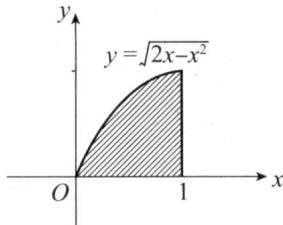
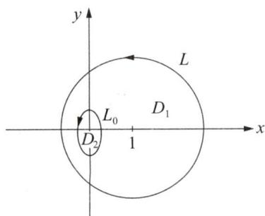

# 2000年数学(一）真题解析

# 一、填空题

(1)【答案】 $\frac{\pi}{4}$ .

【解】 方法一

$$
\begin{array}{l} \int_ {0} ^ {1} \sqrt {2 x - x ^ {2}} d x = \int_ {0} ^ {1} \sqrt {1 - (x - 1) ^ {2}} d (x - 1) = \int_ {- 1} ^ {0} \sqrt {1 - x ^ {2}} d x \\ = \int_ {0} ^ {1} \sqrt {1 - x ^ {2}} \mathrm {d} x \xlongequal {x = \sin t} \int_ {0} ^ {\frac {\pi}{2}} \cos^ {2} t \mathrm {d} t = I _ {2} = \frac {1}{2} \times \frac {\pi}{2} = \frac {\pi}{4}. \\ \end{array}
$$

方法二 根据定积分的几何应用， $\int_0^1\sqrt{2x - x^2}\mathrm{d}x$ 即以曲线 $y = \sqrt{2x - x^2}$ （ $0\leqslant x\leqslant 1$ ）为曲边的曲边梯形的面积.

如图所示，显然 $\int_0^1\sqrt{2x - x^2}\mathrm{d}x = \frac{\pi}{4}.$

(2)【答案】 $\frac{x - 1}{1} = \frac{y + 2}{-4} = \frac{z - 2}{6}$ .

  
一（1）题图

【解】 $n = \{F_x', F_y', F_z'\} \mid_{(1, -2, 2)} = \{2x, 4y, 6z\} \mid_{(1, -2, 2)} = \{2, -8, 12\}$

则曲面在点 $(1, -2, 2)$ 处的法线方程为 $\frac{x - 1}{1} = \frac{y + 2}{-4} = \frac{z - 2}{6}$ .

（3）【答案】 $y = \frac{C_1}{x^2} + C_2 (C_1, C_2$ 为任意常数）.

【解】 方法一 由 $xy^{\prime \prime} + 3y^{\prime} = 0$ ，得 $y^{\prime \prime} + \frac{3}{x} y^{\prime} = 0.$

解得 $y^\prime = C_0\mathrm{e}^{-\int \frac{3}{x}\mathrm{d}x} = \frac{C_0}{x^3}$ 积分得原方程的通解为 $y = \frac{C_1}{x^2} +C_2(C_1,C_2$ 为任意常数）

方法二 由 $xy'' + 3y' = 0$ ，得 $x^3 y'' + 3x^2 y' = 0$ 或 $(x^3 y')' = 0$

于是 $x^{3}y^{\prime} = C_{0}$ ，解得 $y^\prime = \frac{C_0}{x^3}$ 积分得原方程通解为 $y = \frac{C_1}{x^2} +C_2(C_1,C_2$ 为任意常数）

（4）【答案】 -1.

【解】因为原方程组无解，所以 $r(\mathbf{A}) < r(\overline{\mathbf{A}})$ ，而 $r(\overline{\mathbf{A}})\leqslant 3$ ，所以 $r(A) < 3$

于是 $|\mathbf{A}| = 0$ ，解得 $a = -1$ 或 $a = 3$

当 $a = 3$ 时，由 $\overline{\mathbf{A}} = \begin{pmatrix} 1 & 2 & 1 \\ 2 & 3 & 5 \\ 1 & 3 & -2 \end{pmatrix} \to \begin{pmatrix} 1 & 2 & 1 \\ 0 & -1 & 3 \\ 0 & 1 & -3 \end{pmatrix} \to \begin{pmatrix} 1 & 2 & 1 \\ 0 & -1 & 3 \\ 0 & 0 & 0 \end{pmatrix}$ ，

得 $r(\mathbf{A}) = r(\overline{\mathbf{A}}) = 2$ ，原方程组有无数个解，所以 $a \neq 3$ ，故 $a = -1$

(5)【答案】 $\frac{2}{3}$ .

【解】 $P(A\overline{B}) = P(A) - P(AB),\quad P(\overline{A} B) = P(B) - P(AB),$

由 $P(A\overline{B}) = P(\overline{A} B)$ ，得 $P(A) = P(B)$

由 $P(\overline{A}\overline{B}) = P(\overline{A + B}) = 1 - P(A + B) = \frac{1}{9}$ ，得 $P(A + B) = \frac{8}{9}$ .

又 $P(A + B) = P(A) + P(B) - P(AB) = 2P(A) - P^2 (A)$

得 $P^2 (A) - 2P(A) + \frac{8}{9} = 0$ ，解得 $P(A) = \frac{2}{3}$

# 二、选择题

（6）【答案】 （A）.

【解】由 $f^{\prime}(x)g(x) - f(x)g^{\prime}(x) < 0$ ，得 $\left[\frac{f(x)}{g(x)}\right]' = \frac{f'(x)g(x) - f(x)g'(x)}{g^2(x)} < 0,$

即 $\frac{f(x)}{g(x)}$ 为减函数，当 $a < x < b$ 时，有 $\frac{f(a)}{g(a)} > \frac{f(x)}{g(x)} > \frac{f(b)}{g(b)}$ .

于是 $f(x)g(b) > f(b)g(x)$ ，应选(A).

方法点评：本题考查函数单调性

若 $f^{\prime}(x) > 0$ 或 $f^{\prime}(x) < 0$ 时， $f(x)$ 严格递增或严格递减.

注意如下技巧：若题中出现 $f^{\prime}(x)g(x) - f(x)g^{\prime}(x)$ 时，一般构造辅助函数 $\frac{f(x)}{g(x)}$

若题中出现 $f^{\prime}(x)g(x) + f(x)g^{\prime}(x)$ ，一般构造辅助函数 $f(x)g(x)$

（7）【答案】 (C).

【解】 由对面积的曲面积分的对称性质，得

$$
\iint_ {S} x \mathrm {d} S = \iint_ {S} y \mathrm {d} S = 0, \quad \iint_ {S} z \mathrm {d} S = 4 \iint_ {S _ {1}} z \mathrm {d} S,
$$

又因为 $\iint_{S_1}x\mathrm{d}S = \iint_{S_1}y\mathrm{d}S = \iint_{S_1}z\mathrm{d}S$ ，所以 $\iint_{S}z\mathrm{d}S = 4\iint_{S_1}x\mathrm{d}S$ ，应选（C）.

方法点评：二重积分、三重积分、对弧长的曲线积分、对面积的曲面积分有类似的对称性，对面积的曲面积分的对称性如下：

若 $\Sigma$ 关于 $xOy$ 平面对称，其中 $xOy$ 平面上方为 $\Sigma_{1}$ ，则有

$$
\iint_ {\Sigma} f (x, y, z) \mathrm {d} S = \left\{ \begin{array}{l l} 0, & f (x, y, - z) = - f (x, y, z), \\ 2 \iint_ {\Sigma_ {1}} f (x, y, z) \mathrm {d} S, & f (x, y, - z) = f (x, y, z). \end{array} \right.
$$

其他两种情形同上.

（8）【答案】 (D).

【解】方法一 令 $S_{n} = u_{1} + u_{2} + \dots +u_{n}$ ，因为 $\sum_{n = 1}^{\infty}u_n$ 收敛，所以 $\lim_{n\to \infty}u_n = 0$ 且 $\lim_{n\to \infty}S_n$ 存在.设 $\lim_{n\to \infty}S_n = S$ ，令 $S_{n}^{\prime} = (u_{1} + u_{2}) + (u_{2} + u_{3}) + \dots +(u_{n} + u_{n + 1}) = 2S_{n} - u_{1} + u_{n + 1}.$

因为 $\lim_{n\to \infty}S_n' = 2S - u_1$ ，所以级数 $\sum_{n = 1}^{\infty}(u_n + u_{n + 1})$ 收敛，应选(D).

方法二 取 $u_{n} = \frac{(-1)^{n}}{\ln(n + 1)}$ ，级数 $\sum_{n = 1}^{\infty}\frac{(-1)^n}{\ln(n + 1)}$ 收敛，而 $\sum_{n = 1}^{\infty}\frac{1}{n\ln(n + 1)}$ 发散，（A）不对；

取 $u_{n} = \frac{(-1)^{n}}{\sqrt{n}}$ ，级数 $\sum_{n = 1}^{\infty}u_n^2 = \sum_{n = 1}^{\infty}\frac{1}{n}$ 发散，（B）不对；

取 $u_{n} = \frac{(-1)^{n - 1}}{n}$ ，级数 $\sum_{n = 1}^{\infty}(u_{2n - 1} - u_{2n}) = \sum_{n = 1}^{\infty}\frac{1}{n}$ 发散，（C）不对，应选(D).

（9）【答案】 (D).

【解】 令 $A = (\pmb{\alpha}_1, \pmb{\alpha}_2, \dots, \pmb{\alpha}_m)$ , $\pmb{B} = (\pmb{\beta}_1, \pmb{\beta}_2, \dots, \pmb{\beta}_m)$ .

由 $\alpha_{1},\alpha_{2},\dots ,\alpha_{m}$ 线性无关，得 $r(A) = m$

若 $\pmb{\beta}_{1},\pmb{\beta}_{2},\dots ,\pmb{\beta}_{m}$ 线性无关，则 $r(B) = m$ ，因为 $r(A) = r(B) = m$ ，所以矩阵 $\mathbf{A},\mathbf{B}$ 等价；反之，若矩阵 $\mathbf{A},\mathbf{B}$ 等价，则 $r(\mathbf{A}) = r(\mathbf{B})$ ，因为 $r(\mathbf{A}) = m$ ，所以 $r(\mathbf{B}) = m$ ，又因为矩阵的秩与矩阵列向量组的秩相等，所以 $\pmb{\beta}_{1},\pmb{\beta}_{2},\dots ,\pmb{\beta}_{m}$ 的秩为 $m$ ，即 $\pmb{\beta}_{1},\pmb{\beta}_{2},\dots ,\pmb{\beta}_{m}$ 线性无关，应选(D).

（10）【答案】（B）.

【解】 $\xi, \eta$ 不相关的充分必要条件是 $\operatorname{Cov}(\xi, \eta) = 0$ .

而 $\operatorname {Cov}(\xi ,\eta) = \operatorname {Cov}(X + Y,X - Y) = \operatorname {Cov}(X,X) - \operatorname {Cov}(Y,Y) = D(X) - D(Y),$

又 $D(X) = E(X^2) - [E(X)]^2$ ， $D(Y) = E(Y^{2}) - [E(Y)]^{2}$

所以 $\xi, \eta$ 不相关的充分必要条件是 $D(X) = D(Y)$

即 $E(X^2) - [E(X)]^2 = E(Y^2) - [E(Y)]^2$ ，应选（B）.

# 三、解答题

(11)【解】 由 $\lim_{x\to 0^{+}}\left(\frac{2 + \mathrm{e}^{\frac{1}{x}}}{1 + \mathrm{e}^{\frac{4}{x}}} +\frac{\sin x}{|x|}\right) = \lim_{x\to 0^{+}}\frac{2 + \mathrm{e}^{\frac{1}{x}}}{1 + \mathrm{e}^{\frac{4}{x}}} +\lim_{x\to 0^{+}}\frac{\sin x}{x} = 0 + 1 = 1,$

$$
\lim  _ {x \rightarrow 0 ^ {-}} \left(\frac {2 + \mathrm {e} ^ {\frac {1}{x}}}{1 + \mathrm {e} ^ {\frac {4}{x}}} + \frac {\sin x}{| x |}\right) = \lim  _ {x \rightarrow 0 ^ {-}} \frac {2 + \mathrm {e} ^ {\frac {1}{x}}}{1 + \mathrm {e} ^ {\frac {4}{x}}} - \lim  _ {x \rightarrow 0 ^ {-}} \frac {\sin x}{x} = 2 - 1 = 1,
$$

得 $\lim_{x\to 0}\left(\frac{2 + \mathrm{e}^{\frac{1}{x}}}{1 + \mathrm{e}^{\frac{4}{x}}} +\frac{\sin x}{|x|}\right) = 1.$

（12）【解】 由复合函数求偏导法则，得

$$
\begin{array}{l} \frac {\partial z}{\partial x} = y f _ {1} ^ {\prime} + \frac {1}{y} f _ {2} ^ {\prime} - \frac {y}{x ^ {2}} g ^ {\prime}, \\ \frac {\partial^ {2} z}{\partial x \partial y} = f _ {1} ^ {\prime} + y \left(x f _ {1 1} ^ {\prime \prime} - \frac {x}{y ^ {2}} f _ {1 2} ^ {\prime \prime}\right) - \frac {1}{y ^ {2}} f _ {2} ^ {\prime} + \frac {1}{y} \left(x f _ {2 1} ^ {\prime \prime} - \frac {x}{y ^ {2}} f _ {2 2} ^ {\prime \prime}\right) - \frac {1}{x ^ {2}} g ^ {\prime} - \frac {y}{x ^ {3}} g ^ {\prime \prime} \\ = f _ {1} ^ {\prime} - \frac {1}{y ^ {2}} f _ {2} ^ {\prime} + x y f _ {1 1} ^ {\prime \prime} - \frac {x}{y ^ {3}} f _ {2 2} ^ {\prime \prime} - \frac {1}{x ^ {2}} g ^ {\prime} - \frac {y}{x ^ {3}} g ^ {\prime \prime}. \\ \end{array}
$$

(13)【解】 令 $P(x,y) = \frac{-y}{4x^2 + y^2},\quad Q(x,y) = \frac{x}{4x^2 + y^2},$

$$
\frac {\partial Q}{\partial x} = \frac {\partial P}{\partial y} = \frac {y ^ {2} - 4 x ^ {2}}{(4 x ^ {2} + y ^ {2}) ^ {2}} \quad ((x, y) \neq (0, 0)).
$$

如图所示，作 $L_{0}:4x^{2} + y^{2} = r^{2}(r > 0$ 且 $L_{0}$ 位于 $L$ 内，取逆时针方向），设 $L_{0}^{-}$ 与 $L$ 围成的区域为 $D_{1},L_{0}$ 围成的区域为 $D_{2}$ ，由格林公式得

  
三(13)题图

$$
\oint_ {L + L _ {0} ^ {-}} \frac {x d y - y d x}{4 x ^ {2} + y ^ {2}} = \iint_ {D _ {1}} \left(\frac {\partial Q}{\partial x} - \frac {\partial P}{\partial y}\right) d x d y = 0,
$$

于是 $\oint_{L} \frac{x \, \mathrm{d}y - y \, \mathrm{d}x}{4x^2 + y^2} = \oint_{L_0} \frac{x \, \mathrm{d}y - y \, \mathrm{d}x}{4x^2 + y^2} = \frac{1}{r^2} \oint_{L_0} x \, \mathrm{d}y - y \, \mathrm{d}x$

$$
= \frac {1}{r ^ {2}} \iint_ {D _ {2}} 2 \mathrm {d} \sigma = \frac {2}{r ^ {2}} \iint_ {D _ {2}} \mathrm {d} \sigma = \frac {2}{r ^ {2}} \cdot \pi \cdot r \cdot \frac {r}{2} = \pi .
$$

(14)【解】 $P = xf(x)$ ， $Q = -xyf(x)$ ， $R = -\mathrm{e}^{2x}z$

由高斯公式得

$$
\iint_ {S} x f (x) \mathrm {d} y \mathrm {d} z - x y f (x) \mathrm {d} z \mathrm {d} x - \mathrm {e} ^ {2 x} z \mathrm {d} x \mathrm {d} y = \pm \iiint_ {\Omega} \left(\frac {\partial P}{\partial x} + \frac {\partial Q}{\partial y} + \frac {\partial R}{\partial z}\right) \mathrm {d} v
$$

$= \pm \iiint_{\Omega} [f(x) + xf'(x) - xf(x) - \mathrm{e}^{2x}] \, \mathrm{d}v = 0$ ，其中 $\Omega$ 为S围成的有界闭区域.

由曲面 $S$ 的任意性，得 $f(x) + xf'(x) - xf(x) - \mathrm{e}^{2x} = 0$

整理得 $f^{\prime}(x) + \left(\frac{1}{x} - 1\right)f(x) = \frac{\mathrm{e}^{2x}}{x}$ ,

解得 $f(x) = \left[\int \frac{\mathrm{e}^{2x}}{x}\mathrm{e}^{\int \left(\frac{1}{x} - 1\right)\mathrm{d}x}\mathrm{d}x + C\right]\mathrm{e}^{-\int \left(\frac{1}{x} - 1\right)\mathrm{d}x} = \frac{\mathrm{e}^x(\mathrm{e}^x + C)}{x}.$

因为 $\lim_{x\to 0^{+}}f(x) = 1$ ，所以 $C = -1$ ，于是 $f(x) = \frac{\mathrm{e}^x(\mathrm{e}^x - 1)}{x}$

(15)【解】由 $\lim_{n\to \infty}\left|\frac{a_{n + 1}}{a_n}\right| = \lim_{n\to \infty}\frac{n}{n + 1}\cdot \frac{3^n + (-2)^n}{3^{n + 1} + (-2)^{n + 1}} = \frac{1}{3}$ 得 $\sum_{n = 1}^{\infty}\frac{1}{3^n + (-2)^n}\cdot \frac{x^n}{n}$ 的收敛半径为 $R = 3$ ，幂级数 $\sum_{n = 1}^{\infty}\frac{1}{3^n + (-2)^n}\cdot \frac{x^n}{n}$ 的收敛区间为(-3，3).

当 $x = 3$ 时， $\sum_{n = 1}^{\infty}\frac{1}{3^n + (-2)^n}\cdot \frac{3^n}{n} = \sum_{n = 1}^{\infty}\frac{3^n}{3^n + (-2)^n}\cdot \frac{1}{n},$

因为 $\frac{3^n}{3^n + (-2)^n} \cdot \frac{1}{n} > \frac{1}{2n} > 0$ 且 $\sum_{n=1}^{\infty} \frac{1}{2n}$ 发散, 所以 $\sum_{n=1}^{\infty} \frac{1}{3^n + (-2)^n} \cdot \frac{3^n}{n}$ 发散,

即 $x = 3$ 时，级数 $\sum_{n=1}^{\infty} \frac{1}{3^n + (-2)^n} \cdot \frac{x^n}{n}$ 发散；

当 $x = -3$ 时，

$$
\begin{array}{l} \sum_ {n = 1} ^ {\infty} \frac {1}{3 ^ {n} + (- 2) ^ {n}} \cdot \frac {(- 3) ^ {n}}{n} = \sum_ {n = 1} ^ {\infty} \frac {3 ^ {n}}{3 ^ {n} + (- 2) ^ {n}} \cdot \frac {(- 1) ^ {n}}{n} \\ = \sum_ {n = 1} ^ {\infty} \frac {(- 1) ^ {n}}{n} - \sum_ {n = 1} ^ {\infty} \frac {2 ^ {n}}{3 ^ {n} + (- 2) ^ {n}} \cdot \frac {1}{n}, \\ \end{array}
$$

对正项级数 $\sum_{n=1}^{\infty} \frac{2^n}{3^n + (-2)^n} \cdot \frac{1}{n}$ ,

由 $\lim_{n\to \infty}\left\{\left[\frac{2^{n + 1}}{3^{n + 1} + (-2)^{n + 1}}\cdot \frac{1}{n + 1}\right]\Bigg{/}\left[\frac{2^n}{3^n + (-2)^n}\cdot \frac{1}{n}\right]\right\} = \frac{2}{3} < 1$ 得级数 $\sum_{n = 1}^{\infty}\frac{2^n}{3^n + (-2)^n}$

$\frac{1}{n}$ 收敛，再由 $\sum_{n=1}^{\infty} \frac{(-1)^n}{n}$ 收敛得 $x = -3$ 时，级数 $\sum_{n=1}^{\infty} \frac{1}{3^n + (-2)^n} \cdot \frac{x^n}{n}$ 收敛.

（16）【解】设球体为 $\Omega :x^{2} + y^{2} + z^{2}\leqslant R^{2}$ ，点 $P_{0}(0,0,R)$ 为球面 $\Sigma$ 上一点，且设 $\varOmega$ 的重心坐标为 $(\overline{x},\overline{y},\overline{z})$ ，由对称性得 $\overline{x} = 0,\overline{y} = 0$

$$
\bar {z} = \frac {\iiint_ {\Omega} z \cdot k [ x ^ {2} + y ^ {2} + (z - R) ^ {2} ] \mathrm {d} v}{\iiint_ {\Omega} k [ x ^ {2} + y ^ {2} + (z - R) ^ {2} ] \mathrm {d} v} = \frac {\iiint_ {\Omega} z [ x ^ {2} + y ^ {2} + (z - R) ^ {2} ] \mathrm {d} v}{\iiint_ {\Omega} [ x ^ {2} + y ^ {2} + (z - R) ^ {2} ] \mathrm {d} v},
$$

由奇偶性得 $\iiint_{\Omega}[x^2 + y^2 + (z - R)^2] \mathrm{d}v = \iiint_{\Omega}(x^2 + y^2 + z^2) \mathrm{d}v + \iiint_{\Omega}R^2 \mathrm{d}v$

$$
\begin{array}{l} = \int_ {0} ^ {2 \pi} \mathrm {d} \theta \int_ {0} ^ {\pi} \mathrm {d} \varphi \int_ {0} ^ {R} r ^ {4} \sin \varphi \mathrm {d} r + \frac {4 \pi R ^ {5}}{3} \\ = 2 \pi \int_ {0} ^ {\pi} \sin \varphi \mathrm {d} \varphi \int_ {0} ^ {R} r ^ {4} \mathrm {d} r + \frac {4 \pi R ^ {5}}{3} = \frac {3 2 \pi R ^ {5}}{1 5}, \\ \end{array}
$$

$$
\iiint_ {\Omega} z \left[ x ^ {2} + y ^ {2} + (z - R) ^ {2} \right] \mathrm {d} v = - 2 R \iiint_ {\Omega} z ^ {2} \mathrm {d} v = - \frac {2 R}{3} \iiint_ {\Omega} \left(x ^ {2} + y ^ {2} + z ^ {2}\right) \mathrm {d} v = - \frac {8 \pi R ^ {6}}{1 5},
$$

于是 $\overline{z} = -\frac{R}{4}$ 故 $\Omega$ 的重心坐标为 $\left(0,0, - \frac{R}{4}\right)$

方法点评：本题考查三重积分的物理应用.

积分学的物理应用是数学一的考点，主要有：

（1）重心

设 $D$ 为平面区域，面密度为 $\rho (x,y)$ ，则重心坐标为

$$
\bar {x} = \frac {\iint_ {D} x \rho (x , y) \mathrm {d} \sigma}{\iint_ {D} \rho (x , y) \mathrm {d} \sigma}, \quad \bar {y} = \frac {\iint_ {D} y \rho (x , y) \mathrm {d} \sigma}{\iint_ {D} \rho (x , y) \mathrm {d} \sigma};
$$

设 $\Omega$ 为几何体，体密度为 $\rho (x,y,z)$ ，则重心坐标为

$$
\bar {x} = \frac {\iiint_ {\Omega} x \rho (x , y , z) \mathrm {d} v}{\iiint_ {\Omega} \rho (x , y , z) \mathrm {d} v}, \quad \bar {y} = \frac {\iiint_ {\Omega} y \rho (x , y , z) \mathrm {d} v}{\iiint_ {\Omega} \rho (x , y , z) \mathrm {d} v}, \quad \bar {z} = \frac {\iiint_ {\Omega} z \rho (x , y , z) \mathrm {d} v}{\iiint_ {\Omega} \rho (x , y , z) \mathrm {d} v};
$$

设 $L$ 为平面曲线段，线密度为 $\rho (x,y)$ ，则重心坐标为

$$
\bar {x} = \frac {\int_ {L} x \rho (x , y) \mathrm {d} s}{\int_ {L} \rho (x , y) \mathrm {d} s}, \quad \bar {y} = \frac {\int_ {L} y \rho (x , y) \mathrm {d} s}{\int_ {L} \rho (x , y) \mathrm {d} s};
$$

设 $\Sigma$ 为曲面，面密度为 $\rho (x,y,z)$ ，则重心坐标为

$$
\bar {x} = \frac {\iint_ {\Sigma} x \rho (x , y , z) \mathrm {d} S}{\iint_ {\Sigma} \rho (x , y , z) \mathrm {d} S}, \quad \bar {y} = \frac {\iint_ {\Sigma} y \rho (x , y , z) \mathrm {d} S}{\iint_ {\Sigma} \rho (x , y , z) \mathrm {d} S}, \quad \bar {z} = \frac {\iint_ {\Sigma} z \rho (x , y , z) \mathrm {d} S}{\iint_ {\Sigma} \rho (x , y , z) \mathrm {d} S}.
$$

# （2）转动惯量

设 $D$ 为平面区域，面密度为 $\rho (x,y)$ ，则转动惯量为

$$
I _ {x} = \iint_ {D} y ^ {2} \rho (x, y) d \sigma , \quad I _ {y} = \iint_ {D} x ^ {2} \rho (x, y) d \sigma , \quad I _ {o} = \iint_ {D} (x ^ {2} + y ^ {2}) \rho (x, y) d \sigma .
$$

对几何体、空间曲线、空间曲面绕某直线旋转的转动惯量有类似公式.

(17)【解】令 $F(x) = \int_{0}^{x}f(t)\mathrm{d}t,F(0) = F(\pi) = 0.$

由罗尔定理，存在 $c \in (0, \pi)$ ，使得 $F'(c) = 0$ ，即 $f(c) = 0$

用反证法. 不妨设在 $(0, \pi)$ 内 $f(x)$ 除 $c$ 外没有其他零点，则 $f(x)$ 在 $(0, c)$ 与 $(c, \pi)$ 内异号，不妨设当 $x \in (0, c)$ 时， $f(x) > 0$ ；当 $x \in (c, \pi)$ 时， $f(x) < 0$ .

$$
\int_ {0} ^ {\pi} (\cos x - \cos c) f (x) d x = \int_ {0} ^ {c} (\cos x - \cos c) f (x) d x + \int_ {c} ^ {\pi} (\cos x - \cos c) f (x) d x,
$$

因为 $(\cos x - \cos c)f(x)$ 在 $[0, c]$ 上连续， $(\cos x - \cos c)f(x) \geqslant 0$ 且不恒为零，所以 $\int_{0}^{c} (\cos x - \cos c)f(x) \mathrm{d}x > 0.$

同理 $\int_{c}^{\pi} (\cos x - \cos c) f(x) \mathrm{d}x > 0$ ，故 $\int_{0}^{\pi} (\cos x - \cos c) f(x) \mathrm{d}x > 0$ .

而 $\int_0^\pi (\cos x - \cos c)f(x)\mathrm{d}x = \int_0^\pi \cos xf(x)\mathrm{d}x - \cos c\int_0^\pi f(x)\mathrm{d}x = 0$ ，矛盾，所以 $f(x)$ 在 $(0,\pi)$ 内至少有两个零点.

（18）【解】 $|\mathbf{A}^{*}| = 8$ ，由 $|\mathbf{A}^{*}| = |\mathbf{A}|^{3}$ ，得 $|\mathbf{A}| = 2$

由 $\mathbf{A}\mathbf{B}\mathbf{A}^{-1} = \mathbf{B}\mathbf{A}^{-1} + 3\mathbf{E}$ ，得 $\mathbf{AB} = \mathbf{B} + 3\mathbf{A}$ ，解得 $(A - E)\pmb {B} = 3\pmb{A}$

于是 $\pmb {B} = 3(\pmb {A} - \pmb {E})^{-1}\pmb {A} = 3[\pmb{A}^{-1}(\pmb {A} - \pmb {E})]^{-1} = 6(2\pmb {E} - 2\pmb{A}^{-1})^{-1} = 6(2\pmb {E} - \pmb{A}^{*})^{-1},$

因为 $2\pmb {E} - \pmb{A}^{*} = \left[ \begin{array}{cccc}1 & 0 & 0 & 0\\ 0 & 1 & 0 & 0\\ -1 & 0 & 1 & 0\\ 0 & 3 & 0 & -6 \end{array} \right],$ 所以 $(2\pmb {E} - \pmb{A}^{*})^{-1} = \left[ \begin{array}{cccc}1 & 0 & 0 & 0\\ 0 & 1 & 0 & 0\\ 1 & 0 & 1 & 0\\ 0 & \frac{1}{2} & 0 & -\frac{1}{6} \end{array} \right],$

于是 $\pmb{B} = \begin{bmatrix} 6 & 0 & 0 & 0\\ 0 & 6 & 0 & 0\\ 6 & 0 & 6 & 0\\ 0 & 3 & 0 & -1 \end{bmatrix} .$

（19）【解】（I）由题意得

$$
\left\{ \begin{array}{l} x _ {n + 1} = \frac {5}{6} x _ {n} + \frac {2}{5} \left(\frac {1}{6} x _ {n} + y _ {n}\right), \\ y _ {n + 1} = \frac {3}{5} \left(\frac {1}{6} x _ {n} + y _ {n}\right), \end{array} \right.
$$

整理得 $\begin{cases} x_{n + 1} = \frac{9}{10} x_n + \frac{2}{5} y_n, \\ y_{n + 1} = \frac{1}{10} x_n + \frac{3}{5} y_n. \end{cases}$

9 2 10 5 1 3 10 5 5

（Ⅱ）令 $P = (\pmb{\eta}_1, \pmb{\eta}_2) = \begin{pmatrix} 4 & -1 \\ 1 & 1 \end{pmatrix}$ ，因为 $\pmb{\eta}_1, \pmb{\eta}_2$ 不成比例，所以 $\pmb{\eta}_1, \pmb{\eta}_2$ 线性无关.由 $A\pmb{\eta}_1 = \pmb{\eta}_1$ ，得 $\pmb{\eta}_1$ 为 $\mathbf{A}$ 的属于特征值 $\lambda_1 = 1$ 的特征向量；

由 $A\pmb{\eta}_2 = \frac{1}{2}\pmb{\eta}_2$ ，得 $\pmb{\eta}_{2}$ 为 $\mathbf{A}$ 的属于特征值 $\lambda_{2} = \frac{1}{2}$ 的特征向量.

$\binom{x_{n+1}}{y_{n+1}}=\mathbf{A}\binom{x_n}{y_n}=\mathbf{A}^2\binom{x_{n-1}}{y_{n-1}}=\cdots=\mathbf{A}^n\binom{x_1}{y_1},$

由 $P^{-1}AP = \left( \begin{array}{ll}1 & 0\\ 0 & \frac{1}{2} \end{array} \right)$ ，得 $A = P\left( \begin{array}{ll}1 & 0\\ 0 & \frac{1}{2} \end{array} \right)P^{-1}$ ，于是 $A^n = P\left( \begin{array}{ll}1 & 0\\ 0 & \frac{1}{2^n} \end{array} \right)P^{-1}$

而 $P^{-1} = \frac{1}{5}\left( \begin{array}{ll}1 & 1\\ -1 & 4 \end{array} \right)$ ，因此 $A^n = P\left( \begin{array}{cc}1 & 0\\ 0 & \frac{1}{2^n} \end{array} \right)P^{-1} = \frac{1}{5}\left( \begin{array}{cc}4 + \frac{1}{2^n} & 4 - \frac{1}{2^{n - 2}}\\ 1 - \frac{1}{2^n} & 1 + \frac{1}{2^{n - 2}} \end{array} \right),$

故 $\binom{x_{n+1}}{y_{n+1}} = A^n \cdot \frac{1}{2} \binom{1}{1} = \frac{1}{10} \binom{8 - \frac{3}{2^n}}{2 + \frac{3}{2^n}}$ .

（20）【解】 随机变量 $X$ 的分布律为

$$
P \{X = k \} = p (1 - p) ^ {k - 1} (k = 1, 2, \dots),
$$

则 $E(X) = \sum_{k = 1}^{\infty}kP\{X = k\} = p\sum_{k = 1}^{\infty}k(1 - p)^{k - 1}.$

令 $S(x) = \sum_{k=1}^{\infty} kx^{k-1}(|x| < 1)$ ，则 $S(x) = \left(\sum_{k=1}^{\infty} x^k\right)' = \left(\frac{x}{1-x}\right)' = \frac{1}{(1-x)^2}$ .

于是 $E(X) = pS(1 - p) = \frac{1}{p}; E(X^2) = \sum_{k=1}^{\infty} k^2 P\{X = k\} = p \sum_{k=1}^{\infty} k^2 (1 - p)^{k-1}$ ,

令 $S_{1}(x) = \sum_{k = 1}^{\infty}k^{2}x^{k - 1}$

则 $S_{1}(x) = \sum_{k = 1}^{\infty}k(k - 1)x^{k - 1} + \sum_{k = 1}^{\infty}kx^{k - 1}$

$$
\begin{array}{l} = x \sum_ {k = 2} ^ {\infty} k (k - 1) x ^ {k - 2} + \frac {1}{(1 - x) ^ {2}} = x \left(\sum_ {k = 2} ^ {\infty} x ^ {k}\right) ^ {\prime \prime} + \frac {1}{(1 - x) ^ {2}} \\ = x \left(\frac {x ^ {2}}{1 - x}\right) ^ {\prime \prime} + \frac {1}{(1 - x) ^ {2}} = \frac {1 + x}{(1 - x) ^ {3}}, \\ \end{array}
$$

则 $E(X^{2}) = pS_{1}(1 - p) = \frac{2 - p}{p^{2}}$ 于是 $D(X) = E(X^2) - [E(X)]^2 = \frac{1 - p}{p^2}$

（21）【解】 似然函数为

$$
L (\theta) = f (x _ {1}; \theta) f (x _ {2}; \theta) \dots f (x _ {n}; \theta) = 2 ^ {n} \mathrm {e} ^ {- 2 \sum_ {i = 1} ^ {n} x _ {i} + 2 n \theta} (x _ {i} > \theta , i = 1, 2, \dots , n),
$$

$$
\ln L (\theta) = n \ln 2 - 2 \sum_ {i = 1} ^ {n} x _ {i} + 2 n \theta ,
$$

因为 $\frac{\mathrm{d}}{\mathrm{d}\theta}\ln L(\theta) = 2n > 0$ ，所以 $\ln L(\theta)$ 关于 $\theta$ 为增函数，

于是 $\theta$ 的最大似然估计值为 $\hat{\theta} = \min_{1\leqslant i\leqslant n}\{x_i\}$