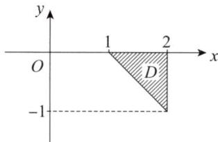

# 2001年数学(一）真题解析

# 一、填空题

(1)【答案】 $y^{\prime \prime} - 2y^{\prime} + 2y = 0.$

【解】由通解形式得二阶常系数齐次线性微分方程的特征值为 $\lambda_{1,2} = 1\pm \mathrm{i}$ 特征方程为 $(\lambda -1 - \mathrm{i})(\lambda -1 + \mathrm{i}) = 0$ ，即 $\lambda^2 -2\lambda +2 = 0.$ 故微分方程为 $y^{\prime \prime} - 2y^{\prime} + 2y = 0.$

(2)【答案】 $\frac{2}{3}$ .

【解】 $\operatorname{grad} r = \left\{\frac{\partial r}{\partial x}, \frac{\partial r}{\partial y}, \frac{\partial r}{\partial z}\right\} = \left\{\frac{x}{r}, \frac{y}{r}, \frac{z}{r}\right\},$

$$
\operatorname {d i v} (\mathbf {g r a d} r) = \frac {r - \frac {x ^ {2}}{r}}{r ^ {2}} + \frac {r - \frac {y ^ {2}}{r}}{r ^ {2}} + \frac {r - \frac {z ^ {2}}{r}}{r ^ {2}} = \frac {2}{r},
$$

于是 $\operatorname{div}(\mathbf{grad}r)\mid_{(1, - 2,2)} = \frac{2}{3}.$

(3)【答案】 $-\int_{1}^{2}\mathrm{d}x\int_{1 - x}^{0}f(x,y)\mathrm{d}y.$

【解】 $\int_{-1}^{0}\mathrm{d}y\int_{2}^{1 - y}f(x,y)\mathrm{d}x = -\int_{-1}^{0}\mathrm{d}y\int_{1 - y}^{2}f(x,y)\mathrm{d}x,$

如图所示，将 $D = \{(x,y)\mid 1 - y\leqslant x\leqslant 2, - 1\leqslant y\leqslant 0\}$ 表示成 $X$ 型区域为

$$
D = \{(x, y) \mid 1 \leqslant x \leqslant 2, 1 - x \leqslant y \leqslant 0 \},
$$

故 $\int_{-1}^{0}\mathrm{d}y\int_{2}^{1 - y}f(x,y)\mathrm{d}x$ 改变积分次序为

$$
\int_ {- 1} ^ {0} \mathrm {d} y \int_ {2} ^ {1 - y} f (x, y) \mathrm {d} x = - \int_ {1} ^ {2} \mathrm {d} x \int_ {1 - x} ^ {0} f (x, y) \mathrm {d} y.
$$

  
一(3)题图

(4)【答案】 $\frac{1}{2} (A + 2E)$ .

【解】由 $A^2 + A - 4E = O$ ，得 $(A - E)(A + 2E) = 2E$

于是 $(\mathbf{A} - \mathbf{E})\cdot \frac{1}{2} (\mathbf{A} + 2\mathbf{E}) = \mathbf{E}$ ，由逆矩阵的定义得 $(\mathbf{A} - \mathbf{E})^{-1} = \frac{1}{2} (\mathbf{A} + 2\mathbf{E})$

（5）【答案】 $\frac{1}{2}$

【解】 由切比雪夫不等式得

$$
P \{| X - E (X) | \geqslant 2 \} \leqslant \frac {D (X)}{2 ^ {2}} = \frac {1}{2}.
$$

# 二、选择题

（6）【答案】 (D).

【解】当 $x < 0$ 时，由 $f(x)$ 单调增加，得 $f^{\prime}(x) \geqslant 0$ ，则(A)，(C）不对；

在 $x = 0$ 的右邻域内，由 $f(x)$ 单调增加，得 $f^{\prime}(x)\geqslant 0$ ，则(B)不对，应选(D).

（7）【答案】 (C).

【解】因为函数可偏导不一定可微，所以（A）不对；

曲线 $\left\{ \begin{array}{l} z = f(x, y), \\ y = 0 \end{array} \right.$ 在 $(0, 0, f(0, 0))$ 处的切向量为

$$
\boldsymbol {T} = \left\{\left| \begin{array}{c c} - f _ {y} ^ {\prime} & 1 \\ 1 & 0 \end{array} \right|, \left| \begin{array}{c c} 1 & - f _ {x} ^ {\prime} \\ 0 & 0 \end{array} \right|, \left| \begin{array}{c c} - f _ {x} ^ {\prime} & - f _ {y} ^ {\prime} \\ 0 & 1 \end{array} \right| \right\} _ {(0, 0)} = \{- 1, 0, - f _ {x} ^ {\prime} \} _ {(0, 0)} = \{- 1, 0, - 3 \},
$$

于是曲线 $\left\{ \begin{array}{l} z = f(x, y), \\ y = 0 \end{array} \right.$ 在 $(0, 0, f(0, 0))$ 处的切向量为 $\{1, 0, 3\}$ ，应选(C).

（8）【答案】 （B）.

【解】 因为当 $h\to 0$ 时， $1 - \cos h\rightarrow 0^{+}$

所以 $\lim_{h\to 0}\frac{f(1 - \cos h)}{h^2} = \lim_{h\to 0}\frac{f(1 - \cos h) - f(0)}{1 - \cos h}\cdot \frac{1 - \cos h}{h^2} = \frac{1}{2} f_+^\prime (0),$

即 $\lim_{h\to 0}\frac{f(1 - \cos h)}{h^2}$ 存在只能使右导数存在，故（A）不对；

$$
\lim  _ {h \rightarrow 0} \frac {f (h - \sin h)}{h ^ {2}} = \lim  _ {h \rightarrow 0} \frac {f (h - \sin h) - f (0)}{h - \sin h} \cdot \frac {h - \sin h}{h ^ {2}},
$$

因为 $\lim_{h\to 0}\frac{h - \sin h}{h^2} = 0$ ，所以 $\lim_{h\to 0}\frac{f(h - \sin h)}{h^2}$ 存在不一定使 $\lim_{h\to 0}\frac{f(h - \sin h) - f(0)}{h - \sin h}$ 存在，即 $f(x)$ 在 $x = 0$ 处不一定可导，（C）不对；

取 $f(x) = \begin{cases} x, & x \neq 0, \\ 2, & x = 0, \end{cases}$ 显然 $\lim_{h \to 0} \frac{f(2h) - f(h)}{h} = 1$ ，因为 $\lim_{x \to 0} f(x) = 0 \neq f(0)$ ，所以 $f(x)$ 在 $x = 0$ 处不连续，故在 $x = 0$ 处不可导，（D）不对，应选（B）.

方法点评：导数定义为 $\lim_{\Delta x \to 0} \frac{\Delta y}{\Delta x} = f'(x_0)$ ，等价定义为 $\lim_{x \to x_0} \frac{f(x) - f(x_0)}{x - x_0} = f'(x_0)$ ，

考查导数定义时一定要准确理解导数定义的本质，注意如下三个方面：

（1）导数定义中 $\Delta x\to 0$ 要同时保证 $\Delta x\to 0^{+}$ 和 $\Delta x\rightarrow 0^{-}$   
（2）定义中函数增量后一项必须为 $f(x_0)$ ，即 $\lim_{h\to 0}\frac{f(x_0 + ah) - f(x_0 + bh)}{h} (ab\neq 0)$ 存在不能保证 $f^{\prime}(x_0)$ 存在；  
（3）分子分母自变量改变量的阶相同，即 $\lim_{\substack{\alpha \to 0\\ \beta \to 0}}\frac{f(x_0 + \beta) - f(x_0)}{\alpha}$ 中 $\alpha ,\beta$ 是同阶无穷小.

（9）【答案】 （A）.

【解】令 $|\lambda E - A| = 0$ ，得 $\mathbf{A}$ 的特征值为 $\lambda_1 = 4, \lambda_2 = \lambda_3 = \lambda_4 = 0$

显然 $\pmb{B}$ 与 $\pmb{A}$ 特征值相同，且 $A,B$ 都是实对称矩阵，故 $A,B$ 相似且合同，应选(A).

方法点评：设 $A, B$ 是两个实对称矩阵，则 $A$ 与 $B$ 相似的充分必要条件是 $|\lambda E - A| = |\lambda E - B|$ ，即两个矩阵的特征值相同；

设 $A, B$ 是两个实对称矩阵，则 $A$ 与 $B$ 合同的充分必要条件是 $A, B$ 正、负特征值的个数相同.

（10）【答案】（A）.

【解】方法一 由 $X + Y = n$ ，得 $Y = -X + n$ ，于是

$$
D (X) = D (Y), \quad \operatorname {C o v} (X, Y) = \operatorname {C o v} (X, - X + n) = - D (X).
$$

故 $\rho_{XY} = \frac{\operatorname{Cov}(X,Y)}{\sqrt{D(X)}\cdot\sqrt{D(Y)}} = -\frac{D(X)}{D(X)} = -1$ ，应选（A）.

方法二 因为 $P\{Y = -X + n\} = 1$ 且 $-1 < 0$ ，所以 $\rho_{XY} = -1$ ，应选(A).

方法点评：设 $X, Y$ 为两个随机变量，若 $\rho_{XY} = 1$ ，称随机变量 $X, Y$ 正相关，其充分必要条件为 $P\{Y = aX + b\} = 1 (a > 0)$

设 $X, Y$ 为两个随机变量，若 $\rho_{XY} = -1$ ，称随机变量 $X, Y$ 负相关，其充分必要条件为 $P\{Y = aX + b\} = 1 (a < 0)$ 。

# 三、解答题

（11）【解】 方法一 令 $\mathrm{e}^x = t$ ，则

$$
\begin{array}{l} \int \frac {\arctan e ^ {x}}{e ^ {2 x}} d x = \int \frac {\arctan t}{t ^ {3}} d t = - \frac {1}{2} \int \arctan t d (t ^ {- 2}) \\ = - \frac {1}{2 t ^ {2}} \arctan t + \frac {1}{2} \int \frac {t ^ {- 2}}{1 + t ^ {2}} d t = - \frac {1}{2 t ^ {2}} \arctan t + \frac {1}{2} \int \frac {1}{t ^ {2} (1 + t ^ {2})} d t \\ = - \frac {1}{2 t ^ {2}} \arctan t + \frac {1}{2} \int \left(\frac {1}{t ^ {2}} - \frac {1}{1 + t ^ {2}}\right) d t \\ = - \frac {1}{2 t ^ {2}} \arctan t - \frac {1}{2 t} - \frac {1}{2} \arctan t + C \\ = - \frac {1}{2 \mathrm {e} ^ {2 x}} \arctan \mathrm {e} ^ {x} - \frac {1}{2 \mathrm {e} ^ {x}} - \frac {1}{2} \arctan \mathrm {e} ^ {x} + C. \\ \end{array}
$$

方法二

$$
\begin{array}{l} \int \frac {\arctan e ^ {x}}{e ^ {2 x}} d x = - \frac {1}{2} \int \arctan e ^ {x} d \left(e ^ {- 2 x}\right) = - \frac {\arctan e ^ {x}}{2 e ^ {2 x}} + \frac {1}{2} \int \frac {e ^ {- 2 x}}{1 + e ^ {2 x}} \cdot e ^ {x} d x \\ = - \frac {\arctan e ^ {x}}{2 e ^ {2 x}} + \frac {1}{2} \int \frac {d (e ^ {x})}{e ^ {2 x} (1 + e ^ {2 x})} = - \frac {\arctan e ^ {x}}{2 e ^ {2 x}} + \frac {1}{2} \int \left(\frac {1}{e ^ {2 x}} - \frac {1}{1 + e ^ {2 x}}\right) d (e ^ {x}) \\ = - \frac {\arctan e ^ {x}}{2 e ^ {2 x}} - \frac {1}{2 e ^ {x}} - \frac {1}{2} \arctan e ^ {x} + C. \\ \end{array}
$$

(12)【解】 $\frac{\mathrm{d}}{\mathrm{d}x}\varphi^3 (x) = 3\varphi^2 (x)\varphi '(x),$

而 $\varphi^{\prime}(x) = f_{1}^{\prime}(x,f(x,x)) + f_{2}^{\prime}(x,f(x,x))\bullet [f_{1}^{\prime}(x,x) + f_{2}^{\prime}(x,x)]$

$$
\varphi (1) = f (1, f (1, 1)) = f (1, 1) = 1,
$$

由 $f_{1}^{\prime}(1,1) = \frac{\partial f}{\partial x}\bigg|_{(1,1)} = 2,f_{2}^{\prime}(1,1) = \frac{\partial f}{\partial y}\bigg|_{(1,1)} = 3,$

得 $\varphi^{\prime}(1) = f_{1}^{\prime}(1,f(1,1)) + f_{2}^{\prime}(1,f(1,1))\cdot [f_{1}^{\prime}(1,1) + f_{2}^{\prime}(1,1)]$

$$
= f _ {1} ^ {\prime} (1, 1) + f _ {2} ^ {\prime} (1, 1) \cdot \left[ f _ {1} ^ {\prime} (1, 1) + f _ {2} ^ {\prime} (1, 1) \right] = 2 + 3 (2 + 3) = 1 7,
$$

故 $\frac{\mathrm{d}}{\mathrm{d}x}\varphi^3 (x)\Big|_{x = 1} = 51.$

(13)【解】由 $(\arctan x)' = \frac{1}{1 + x^2} = \sum_{n=0}^{\infty} (-1)^n x^{2n} (-1 < x < 1)$ ,

所以 $\arctan x = \arctan 0 + \int_{0}^{x}\frac{1}{1 + x^2}\mathrm{d}x = \sum_{n = 0}^{\infty}\frac{(-1)^n}{2n + 1} x^{2n + 1}(-1\leqslant x\leqslant 1),$

于是 $f(x) = \sum_{n=0}^{\infty} \frac{(-1)^n}{2n+1} x^{2n} + \sum_{n=0}^{\infty} \frac{(-1)^n}{2n+1} x^{2n+2}$

$$
\begin{array}{l} = 1 + \sum_ {n = 1} ^ {\infty} \frac {(- 1) ^ {n}}{2 n + 1} x ^ {2 n} + \sum_ {n = 1} ^ {\infty} \frac {(- 1) ^ {n - 1}}{2 n - 1} x ^ {2 n} \\ = 1 + 2 \sum_ {n = 1} ^ {\infty} \frac {(- 1) ^ {n}}{1 - 4 n ^ {2}} x ^ {2 n} (- 1 \leqslant x \leqslant 1), \\ \end{array}
$$

故 $\sum_{n = 1}^{\infty}\frac{(-1)^n}{1 - 4n^2} = \frac{1}{2} [f(1) - 1] = \frac{\pi}{4} -\frac{1}{2}.$

（14）【解】设截口平面为 $\Sigma$ ，按右手准则 $\Sigma$ 取上侧， $\Sigma$ 的方向向量为 $n = \{1,1,1\}$

方向余弦为 $\cos \alpha = \frac{1}{\sqrt{3}}$ ， $\cos \beta = \frac{1}{\sqrt{3}}$ ， $\cos \gamma = \frac{1}{\sqrt{3}}$

由斯托克斯公式得

$$
\begin{array}{l} I = \frac {1}{\sqrt {3}} \iint_ {\Sigma} \left| \begin{array}{c c c} 1 & 1 & 1 \\ \frac {\partial}{\partial x} & \frac {\partial}{\partial y} & \frac {\partial}{\partial z} \\ y ^ {2} - z ^ {2} & 2 z ^ {2} - x ^ {2} & 3 x ^ {2} - y ^ {2} \end{array} \right| d S = - \frac {2}{\sqrt {3}} \iint_ {\Sigma} (4 x + 2 y + 3 z) d S \\ = - \frac {2}{\sqrt {3}} \iint_ {\Sigma} (x - y + 6) d S = - \frac {1 2}{\sqrt {3}} \iint_ {\Sigma} d S = - \frac {1 2}{\sqrt {3}} \iint_ {D} \sqrt {3} d \sigma = - 2 4. \\ \end{array}
$$

方法点评：三维空间对坐标的曲线积分常用两个计算方法：

方法一 定积分法

设 $L:\left\{ \begin{array}{l}x = \varphi (t),\\ y = \psi (t),(\text{起点} t = \alpha ,\text{终点} t = \beta),\\ z = \omega (t) \end{array} \right.$ 则

$$
\begin{array}{l} \int_ {L} P \mathrm {d} x + Q \mathrm {d} y + R \mathrm {d} z = \int_ {\alpha} ^ {\beta} \left\{P [ \varphi (t), \psi (t), \omega (t) ] \varphi^ {\prime} (t) + Q [ \varphi (t), \psi (t), \omega (t) ] \psi^ {\prime} (t) + \right. \\ R [ \varphi (t), \psi (t), \omega (t) ] \omega^ {\prime} (t) \} d t. \\ \end{array}
$$

方法二 斯托克斯公式

$$
\oint_ {L} P \mathrm {d} x + Q \mathrm {d} y + R \mathrm {d} z = \iint_ {\Sigma} \left| \begin{array}{c c c} \cos \alpha & \cos \beta & \cos \gamma \\ \frac {\partial}{\partial x} & \frac {\partial}{\partial y} & \frac {\partial}{\partial z} \\ P & Q & R \end{array} \right| \mathrm {d} S.
$$

（15）【证明】（I）由微分中值定理得 $f(x) - f(0) = f^{\prime}[0 + \theta (x)x]x$

即 $f(x) = f(0) + f^{\prime}[\theta (x)x]x$ ，其中 $\theta (x)\in (0,1)$

不妨设 $f(x) = f(0) + f^{\prime}[\theta_{1}(x)x]x$ ， $f(x) = f(0) + f^{\prime}[\theta_{2}(x)x]x$

两式相减得 $f^{\prime}[\theta_{1}(x)x]x = f^{\prime}[\theta_{2}(x)x]x$

注意到 $x \neq 0$ ，则有 $f^{\prime}[\theta_{1}(x)x] = f^{\prime}[\theta_{2}(x)x]$

因为 $f''(x)$ 连续且 $f''(x) \neq 0$ ，所以 $f''(x) > 0$ 或 $f''(x) < 0$ ，即 $f'(x)$ 单调增加或单调减少，于是 $\theta_1(x) = \theta_2(x)$ ，即存在唯一的 $\theta(x) \in (0,1)$ ，使得

$$
f (x) = f (0) + f ^ {\prime} [ \theta (x) x ] x.
$$

（Ⅱ）由泰勒公式得

$f(x) = f(0) + f'(0)x + \frac{f''(\xi)}{2!} x^2$ ，其中 $\xi$ 介于0与 $x$ 之间，

于是 $f(0) + f'(0)x + \frac{f''(\xi)}{2!} x^2 = f(0) + f'[\theta(x)x]x$

或 $\theta (x)\frac{f^{\prime}[\theta(x)x] - f^{\prime}(0)}{\theta(x)x} = \frac{f^{\prime\prime}(\xi)}{2!},$

由 $f^{\prime \prime}(x)$ 连续及 $f^{\prime \prime}(x)\neq 0$ ，两边取极限得 $f^{\prime \prime}(0)\lim_{x\to 0}\theta (x) = \frac{f^{\prime\prime}(0)}{2!}$ 故 $\lim_{x\to 0}\theta (x) = \frac{1}{2}$

（16）【解】 $t$ 时刻雪堆的体积为

$$
V (t) = \int_ {0} ^ {h (t)} \mathrm {d} z \iint_ {x ^ {2} + y ^ {2} \leqslant \frac {h ^ {2} (t) - h (t) z}{2}} \mathrm {d} x \mathrm {d} y = \frac {\pi}{2} \int_ {0} ^ {h (t)} \left[ h ^ {2} (t) - h (t) z \right] \mathrm {d} z = \frac {\pi h ^ {3} (t)}{4},
$$

侧面积为 $S(t) = \iint_{x^2 + y^2 \leqslant \frac{h^2(t)}{2}} \sqrt{1 + \left(\frac{\partial z}{\partial x}\right)^2 + \left(\frac{\partial z}{\partial y}\right)^2} \, \mathrm{d}x \, \mathrm{d}y = \iint_{x^2 + y^2 \leqslant \frac{h^2(t)}{2}} \sqrt{1 + \frac{16(x^2 + y^2)}{h^2(t)}} \, \mathrm{d}x \, \mathrm{d}y$

$$
= \int_ {0} ^ {2 \pi} \mathrm {d} \theta \int_ {0} ^ {\frac {h (t)}{\sqrt {2}}} r \sqrt {1 + \frac {1 6 r ^ {2}}{h ^ {2} (t)}} \mathrm {d} r = \frac {1 3 \pi h ^ {2} (t)}{1 2},
$$

由题意得 $\frac{\mathrm{d}V(t)}{\mathrm{d}t} = -0.9S(t)$ ，整理得 $h^{\prime}(t) = -\frac{13}{10}$ ，解得 $h(t) = -\frac{13}{10} t + C$ ，由 $h(0) = 130$ 得 $C = 130$ ，于是 $h(t) = -\frac{13}{10} t + 130$ ，令 $h(t) = 0$ 得 $t = 100$ （小时），即高度为130厘米的雪堆经过100小时可以全部融化。

方法点评：本题考查微分的实际应用.重点要理解元素法的思想，元素法的具体步骤为：

（1）先假设有关的自变量和函数（有时需要建立适当的坐标系）；  
（2）取自变量的区间元素，根据问题的实际含义求出所求量的元素；  
（3）将所求量的元素在自变量区间上定积分，

【例】设水桶含 $10\mathrm{L}$ 液体，浓度为 $15\mathrm{g / L}$ ，现往桶中以 $2\mathrm{L} / \mathrm{min}$ 的速度注清水，同时将桶内液体搅拌均匀后以 $2\mathrm{L} / \mathrm{min}$ 的速度排出，问经过几分钟液体浓度降低一半？

【解】设第 $t$ 分钟时溶质为 $m(t)$ ，取 $[t, t + \mathrm{d}t]$ ，则 $\mathrm{dm} = 0 - \frac{m(t)}{10} \times 2\mathrm{d}t$

于是有 $\left\{ \begin{array}{l} \frac{\mathrm{d}m}{\mathrm{d}t} + \frac{1}{5} m = 0, \\ m(0) = 150, \end{array} \right.$ 解得 $m(t) = 150\mathrm{e}^{-\frac{t}{5}}$

令 $m(t) = \frac{1}{2} \times 150$ ，解得 $t = 5\ln 2$ （分钟）.

（17）【解】因为 $\alpha_{1},\alpha_{2},\dots ,\alpha_{s}$ 为 $AX = 0$ 的基础解系，所以 $\alpha_{1},\alpha_{2},\dots ,\alpha_{s}$ 线性无关.

由齐次线性方程组解的结构性质得 $\beta_{1},\beta_{2},\dots ,\beta_{s}$ 仍为方程组 $AX = 0$ 的解，

则 $\pmb{\beta}_{1},\pmb{\beta}_{2},\dots ,\pmb{\beta}_{s}$ 为方程组 $AX = 0$ 的基础解系的充分必要条件是 $\pmb{\beta}_{1},\pmb{\beta}_{2},\dots ,\pmb{\beta}_{s}$ 线性无关，

而 $(\pmb{\beta}_1, \pmb{\beta}_2, \dots, \pmb{\beta}_s) = (\pmb{\alpha}_1, \pmb{\alpha}_2, \dots, \pmb{\alpha}_s)\left[ \begin{array}{cccccc}t_1 & 0 & 0 & \dots & t_2\\ t_2 & t_1 & 0 & \dots & 0\\ 0 & t_2 & t_1 & \dots & 0\\ \vdots & \vdots & \vdots & & \vdots \\ 0 & 0 & 0 & \dots & t_1 \end{array} \right],$

则 $\pmb{\beta}_{1},\pmb{\beta}_{2},\dots ,\pmb{\beta}_{s}$ 线性无关的充分必要条件是 $\begin{array}{r}t_1\quad 0\quad 0\quad \dots \quad t_2\\ t_2\quad t_1\quad 0\quad \dots \quad 0\\ 0\quad t_2\quad t_1\quad \dots \quad 0\\ \vdots \quad \vdots \quad \vdots \quad \vdots \\ 0\quad 0\quad 0\quad \dots \quad t_1 \end{array} = t_1^s +(-1)^{s + 1}t_2^s\neq 0,$

当 $t_1^s + (-1)^{s+1} t_2^s \neq 0$ 时，即当 $s$ 为偶数时， $t_1 \neq \pm t_2$ ；当 $s$ 为奇数时， $t_1 \neq -t_2$ ，向量组 $\pmb{\beta}_1, \pmb{\beta}_2, \dots, \pmb{\beta}_s$ 为方程组 $\mathbf{AX} = \mathbf{0}$ 的基础解系.

(18)【解】（I）由 $\mathbf{A}\mathbf{P} = (\mathbf{A}\mathbf{x},\mathbf{A}^2\mathbf{x},\mathbf{A}^3\mathbf{x}) = (\mathbf{A}\mathbf{x},\mathbf{A}^2\mathbf{x},3\mathbf{A}\mathbf{x} - 2\mathbf{A}^2\mathbf{x}) = \mathbf{P}\left( \begin{array}{ccc}0 & 0 & 0\\ 1 & 0 & 3\\ 0 & 1 & -2 \end{array} \right) = \mathbf{PB}$ ，

得 $\mathbf{A} = \mathbf{P}\mathbf{B}\mathbf{P}^{-1}$ ，其中 $\pmb {B} = \left( \begin{array}{lll}0 & 0 & 0\\ 1 & 0 & 3\\ 0 & 1 & -2 \end{array} \right).$

（Ⅱ）由 $|\lambda \pmb {E} - \pmb {B}| = \left| \begin{array}{ccc}\lambda & 0 & 0\\ -1 & \lambda & -3\\ 0 & -1 & \lambda +2 \end{array} \right| = (\lambda +3)\lambda (\lambda -1) = 0,$

得 $\pmb{B}$ 的特征值为 $\lambda_{1} = -3, \lambda_{2} = 0, \lambda_{3} = 1$

因为 $\mathbf{A} \sim \mathbf{B}$ , 所以 $\mathbf{A}$ 的特征值为 $\lambda_{1} = -3, \lambda_{2} = 0, \lambda_{3} = 1$ , 于是 $\mathbf{A} + \mathbf{E}$ 的特征值为 $\mu_{1} = -2$ , $\mu_{2} = 1, \mu_{3} = 2$ , 故 $|\mathbf{A} + \mathbf{E}| = -4$ .

方法点评：求矩阵的特征值通常有如下三个方法：

（1）定义法，即令 $AX = \lambda X(X\neq 0)$ ，通过矩阵满足的方程求出矩阵的特征值.

【例】设 $\mathbf{A}$ 为方阵，且 $A^2 = 2A$ ，求 $\mathbf{A}$ 的特征值.

【解】令 $AX = \lambda X$ ，由 $A^2 = 2A$ 得 $(\lambda^2 - 2\lambda)X = 0$ ，因为 $X \neq 0$ ，所以 $\lambda = 0$ 或 $\lambda = 2$

（2）公式法，即通过特征方程 $|\lambda E - A| = 0$ 求出特征值.  
（3）关联矩阵法，即若 $\mathbf{A}\sim \mathbf{B}$ ，则 $|\lambda E - A| = |\lambda E - B|$ ，从而 $\mathbf{A},\mathbf{B}$ 特征值相同.

(19)【解】（I） $X$ 的分布律为 $P\{X = k\} = \frac{\lambda^k}{k!}\mathrm{e}^{-\lambda}(k = 0,1,2,\dots)$ .

$$
P \left\{Y = m \mid X = n \right\} = C _ {n} ^ {m} p ^ {m} (1 - p) ^ {n - m} (0 \leqslant m \leqslant n, n = 0, 1, 2, \dots).
$$

$$
\begin{array}{l} (\mathrm {I I}) P \{X = n, Y = m \} = P \{X = n \} P \{Y = m \mid X = n \} \\ = C _ {n} ^ {m} p ^ {m} (1 - p) ^ {n - m} \cdot \frac {\lambda^ {n}}{n !} e ^ {- \lambda} (0 \leqslant m \leqslant n, n = 0, 1, 2, \dots). \\ \end{array}
$$

(20)【解】令 $Y_{i} = X_{i} + X_{n + i}(1\leqslant i\leqslant n)$ ，因为 $X_{1},X_{2},\dots ,X_{2n}$ 相互独立且服从正态分布，所以 $Y_{i}\sim N(2\mu ,2\sigma^{2})(1\leqslant i\leqslant n)$

不妨设 $Y_{1}, Y_{2}, \dots, Y_{n}$ 为来自总体 $N(2\mu, 2\sigma^{2})$ 的简单随机样本， $\overline{Y} = \frac{1}{n} \sum_{i=1}^{n} Y_{i} = 2\overline{X}$ ，

于是统计量 $Y = \sum_{i=1}^{n}(X_i + X_{n+i} - 2\overline{X})^2 = \sum_{i=1}^{n}(Y_i - \overline{Y})^2$

由 $\frac{\sum_{i=1}^{n}(Y_i - \overline{Y})^2}{2\sigma^2} \sim \chi^2(n-1)$ ，得 $E\left(\frac{\sum_{i=1}^{n}(Y_i - \overline{Y})^2}{2\sigma^2}\right) = n-1$ ，故 $E(Y) = 2(n-1)\sigma^2$ .