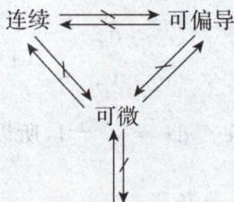
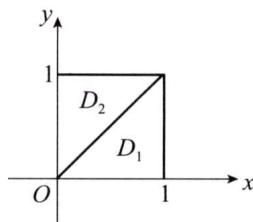

# 2002年数学(一）真题解析

# 一、填空题

（1）【答案】 1.

【解】 $\int_{\mathrm{e}}^{+\infty}\frac{\mathrm{d}x}{x\ln^2x} = \int_{\mathrm{e}}^{+\infty}\frac{\mathrm{d}(\ln x)}{\ln^2x} = -\frac{1}{\ln x}\Big|_{\mathrm{e}}^{+\infty} = 1.$

(2)【答案】 -2.

【解】 当 $x = 0$ 时， $y = 0$

$\mathrm{e}^y + 6xy + x^2 - 1 = 0$ 两边对 $x$ 求导，得 $\mathrm{e}^y \frac{\mathrm{d}y}{\mathrm{d}x} + 6y + 6x \frac{\mathrm{d}y}{\mathrm{d}x} + 2x = 0$ 则 $y'(0) = 0$ . $\mathrm{e}^y \frac{\mathrm{d}y}{\mathrm{d}x} + 6y + 6x \frac{\mathrm{d}y}{\mathrm{d}x} + 2x = 0$ 两边对 $x$ 求导，

得 $\mathrm{e}^{y}\left(\frac{\mathrm{dy}}{\mathrm{dx}}\right)^{2} + \mathrm{e}^{y}\frac{\mathrm{d}^{2}y}{\mathrm{dx}^{2}} +12\frac{\mathrm{dy}}{\mathrm{dx}} +6x\frac{\mathrm{d}^{2}y}{\mathrm{dx}^{2}} +2 = 0$ ，于是 $y^{\prime \prime}(0) = -2.$

(3)【答案】 $y = \sqrt{x + 1}$ .

【解】方法一 令 $y' = p$ ，则 $y'' = p \frac{\mathrm{d}p}{\mathrm{d}y}$ ，方程 $yy'' + y'^2 = 0$ 化为 $yp \frac{\mathrm{d}p}{\mathrm{d}y} + p^2 = 0$ 。因为 $p \neq 0$ ，所以 $\frac{\mathrm{d}p}{\mathrm{d}y} + \frac{1}{y} p = 0$ ，解得 $p = C_1 \mathrm{e}^{-\int \frac{1}{y} \mathrm{d}y} = \frac{C_1}{y}$ 。

由 $y(0) = 1, y'(0) = \frac{1}{2}$ , 得 $C_1 = \frac{1}{2}$ , 于是 $yy' = \frac{1}{2}$ , 解得 $\frac{1}{2} y^2 = \frac{x}{2} + C$ .

由 $y(0) = 1$ ，得 $C = \frac{1}{2}$ 故 $y = \sqrt{x + 1}$

方法二 由 $yy'' + y'^2 = 0$ ，得 $(yy')' = 0$ ，解得 $yy' = C_1$

由 $y(0) = 1, y'(0) = \frac{1}{2}$ , 得 $C_1 = \frac{1}{2}$ , 即 $yy' = \frac{1}{2}$ 或 $(y^2)' = 1$ , 解得 $y^2 = x + C_2$ .

由 $y(0) = 1$ ，得 $C_2 = 1$ ，故满足初始条件的特解为 $y = \sqrt{x + 1}$

方法点评：本题考查可降阶的微分方程的求解。特定类型微分方程的求解可以用相应类型微分方程的解法求解，注意运用灵活简洁的方法，往往可使解题简单且正确率高。

（4）【答案】 2.

【解】 方法一 $A = \begin{pmatrix} a & 2 & 2\\ 2 & a & 2\\ 2 & 2 & a \end{pmatrix}$ ，因为二次型经过正交变换得标准形为 $f = 6y_1^2$

所以矩阵 $\mathbf{A}$ 的特征值为 $\lambda_{1} = 6, \lambda_{2} = \lambda_{3} = 0$ ，由 $\operatorname{tr} \mathbf{A} = \lambda_{1} + \lambda_{2} + \lambda_{3}$ 得 $a = 2$ .

方法二 因为二次型 $f$ 经过正交变换化为 $f = 6y_{1}^{2}$ ，所以 $\lambda_{1} = 6, \lambda_{2} = \lambda_{3} = 0$ ，于是 $|\mathbf{A}| = 0$

由 $|\mathbf{A}| = \left| \begin{array}{lll}a & 2 & 2\\ 2 & a & 2\\ 2 & 2 & a \end{array} \right| = (a + 4)(a - 2)^2 = 0$ ，得 $a = -4$ 或 $a = 2$

当 $a = -4$ 时， $\mathbf{A} = \left( \begin{array}{rrr} - 4 & 2 & 2\\ 2 & -4 & 2\\ 2 & 2 & -4 \end{array} \right).$

由 $|\lambda E - A| = \left| \begin{array}{ccc}\lambda +4 & -2 & -2\\ -2 & \lambda +4 & -2\\ -2 & -2 & \lambda +4 \end{array} \right| = \lambda (\lambda +6)^2 = 0$ ，得 $\lambda_1 = 0,\lambda_2 = \lambda_3 = -6$ ，矛盾，

故 $a = 2$

（5）【答案】 4.

【解】由 $X \sim N(\mu, \sigma^2)$ ，得 $P\{X \leqslant \mu\} = P\{X > \mu\} = \frac{1}{2}$ .

当 $\Delta = 16 - 4X < 0$ ，即 $X > 4$ 时，方程 $y^{2} + 4y + X = 0$ 无实根.

由方程 $y^{2} + 4y + X = 0$ 无实根的概率为 $\frac{1}{2}$ 得 $P\{X > 4\} = \frac{1}{2}$ ，于是 $\mu = 4$

方法点评：若 $X \sim N(\mu, \sigma^2)$ ，常用知识点有：

(1) $P\{X \leqslant \mu\} = P\{X > \mu\} = \frac{1}{2}$ ;   
(2) $\frac{X - \mu}{\sigma} \sim N(0,1)$ ;   
(3) $P\{a < X \leqslant b\} = \Phi \left(\frac{b - \mu}{\sigma}\right) - \Phi \left(\frac{a - \mu}{\sigma}\right)$ ;   
(4) $\Phi(-a) = 1 - \Phi(a)$ .

# 二、选择题

（6）【答案】 （A）.

【解】若 $f(x,y)$ 两个偏导数连续，则 $f(x,y)$ 一定可微，反之不对；

若 $f(x,y)$ 可微，则 $f(x,y)$ 连续且可偏导，反之不对，应选(A).

方法点评：二元函数 $f(x,y)$ 在一点处的连续性、可偏导性、可微性、一阶连续可偏导性之间的关系图如下：

  
一阶连续可偏导

（7）【答案】 (C).

【解】 由 $\lim_{n\to \infty}\frac{n}{u_n} = 1$ ，得 $\lim_{n\to \infty}\frac{1}{u_n} = 0$

$$
S _ {n} = \left(\frac {1}{u _ {1}} + \frac {1}{u _ {2}}\right) - \left(\frac {1}{u _ {2}} + \frac {1}{u _ {3}}\right) + \dots + (- 1) ^ {n + 1} \left(\frac {1}{u _ {n}} + \frac {1}{u _ {n + 1}}\right) = \frac {1}{u _ {1}} + (- 1) ^ {n + 1} \frac {1}{u _ {n + 1}},
$$

因为 $\lim_{n\to \infty}S_n = \frac{1}{u_1}$ 所以级数 $\sum_{n = 1}^{\infty}(-1)^{n + 1}\left(\frac{1}{u_n} +\frac{1}{u_{n + 1}}\right)$ 收敛，（A），（D）不对；

$$
\sum_ {n = 1} ^ {\infty} \left| (- 1) ^ {n + 1} \left(\frac {1}{u _ {n}} + \frac {1}{u _ {n + 1}}\right) \right| = \sum_ {n = 1} ^ {\infty} \left(\frac {1}{u _ {n}} + \frac {1}{u _ {n + 1}}\right),
$$

由 $\lim_{n\to \infty}\frac{n}{u_n} = 1$ 得 $\frac{1}{u_n}\sim \frac{1}{n},\quad \frac{1}{u_{n + 1}}\sim \frac{1}{n + 1},$

因为 $\sum_{n=1}^{\infty} \frac{1}{n}$ 与 $\sum_{n=1}^{\infty} \frac{1}{n+1}$ 发散，所以 $\sum_{n=1}^{\infty} \frac{1}{u_n}$ 与 $\sum_{n=1}^{\infty} \frac{1}{u_{n+1}}$ 都发散，

于是 $\sum_{n=1}^{\infty}\left(\frac{1}{u_n} + \frac{1}{u_{n+1}}\right)$ 发散，即 $\sum_{n=1}^{\infty}(-1)^{n+1}\left(\frac{1}{u_n} + \frac{1}{u_{n+1}}\right)$ 条件收敛，应选(C).

（8）【答案】 （B）.

【解】若 $\lim_{x\to +\infty}f'(x)\neq 0$ ，不妨设 $\lim_{x\to +\infty}f'(x) = A > 0.$

取 $\varepsilon_0 = \frac{A}{2} > 0$ ，则存在 $X > 0$ ，当 $x > X$ 时， $|f'(x) - A| < \frac{A}{2}$ ，于是 $f'(x) > \frac{A}{2}$ .

当 $x > X$ 时， $f(x) - f(X) = f'(\xi)(x - X)$ ，其中 $\xi \in (X, x)$

则 $f(x) > f(X) + \frac{A}{2} (x - X)$

因为 $\lim_{x\to +\infty}\left[f(X) + \frac{A}{2} (x - X)\right] = +\infty$ ，所以 $\lim_{x\to +\infty}f(x) = +\infty$ ，与 $f(x)$ 有界矛盾，应选(B).

（9）【答案】 （B）.

【解】 因为 $A = \begin{pmatrix} a_{11} & a_{12} & a_{13}\\ a_{21} & a_{22} & a_{23}\\ a_{31} & a_{32} & a_{33} \end{pmatrix} ,\pmb {X} = \begin{pmatrix} x\\ y\\ z \end{pmatrix} ,\pmb {b} = \begin{pmatrix} b_1\\ b_2\\ b_3 \end{pmatrix} .$

因为 $r(\mathbf{A}) = r(\overline{\mathbf{A}}) = 2 < 3$ ，所以方程组 $\mathbf{AX} = \mathbf{b}$ 有无数个解，即三个平面有无数个交点，因为（A）只有一个交点，而(C)，(D)没有交点，所以应选(B).

（10）【答案】 (D).

【解】方法一 因为 $\int_{-\infty}^{+\infty}[f_1(x) + f_2(x)]\mathrm{d}x = \int_{-\infty}^{+\infty}f_1(x)\mathrm{d}x + \int_{-\infty}^{+\infty}f_2(x)\mathrm{d}x = 2\neq 1,$ 所以 $f_{1}(x) + f_{2}(x)$ 一定不是某个随机变量的密度函数，（A）不对；

设 $X_{1} \sim E(1), X_{2} \sim E(1)$ ，则

$$
f _ {1} (x) = f _ {2} (x) = \left\{ \begin{array}{l l} 0, & x \leqslant 0, \\ \mathrm {e} ^ {- x}, & x > 0, \end{array} \right. f _ {1} (x) f _ {2} (x) = \left\{ \begin{array}{l l} 0, & x \leqslant 0, \\ \mathrm {e} ^ {- 2 x}, & x > 0, \end{array} \right.
$$

因为 $\int_{-\infty}^{+\infty}f_1(x)f_2(x)\mathrm{d}x = \int_0^{+\infty}\mathrm{e}^{-2x}\mathrm{d}x = \frac{1}{2}\neq 1$ ，所以 $f_{1}(x)f_{2}(x)$ 不是某个随机变量的密度函数，（B）不对；

因为 $F_{1}(+\infty) + F_{2}(+\infty) = 2 \neq 1$ ，所以 $F_{1}(x) + F_{2}(x)$ 不是某个随机变量的分布函数，（C）不对，应选(D).

方法二 因为 $F_{1}(x), F_{2}(x)$ 为两个随机变量的分布函数，所以 $0 \leqslant F_{1}(x) \leqslant 1, 0 \leqslant F_{2}(x) \leqslant 1, F_{1}(x), F_{2}(x)$ 单调不减， $F_{1}(x), F_{2}(x)$ 右连续且

$$
F _ {1} (- \infty) = F _ {2} (- \infty) = 0, \quad F _ {1} (+ \infty) = F _ {2} (+ \infty) = 1,
$$

于是 $F_{1}(x)F_{2}(x)$ 满足： $0\leqslant F_{1}(x)F_{2}(x)\leqslant 1,F_{1}(x)F_{2}(x)$ 单调不减， $F_{1}(x)F_{2}(x)$ 右连续且 $F_{1}(-\infty)F_{2}(-\infty) = 0,F_{1}(+\infty)F_{2}(+\infty) = 1$ ，故 $F_{1}(x)F_{2}(x)$ 为某个随机变量的分布函数，应选(D).

# 三、解答题

(11)【解】将 $h = 0$ 代入 $af(h) + bf(2h) - f(0) = o(h)$ 中，得 $(a + b - 1)f(0) = 0$

由 $f(0) \neq 0$ ，得 $a + b = 1$

由 $a f(h) + b f(2h) - f(0) = o(h)$ ，得 $\lim_{h\to 0}\frac{af(h) + bf(2h) - f(0)}{h} = \lim_{h\to 0}\frac{o(h)}{h} = 0$

而 $\lim_{h\to 0}\frac{af(h) + bf(2h) - f(0)}{h} = \lim_{h\to 0}\frac{af(h) + bf(2h) - (a + b)f(0)}{h}$

$$
\begin{array}{l} = a \lim  _ {h \rightarrow 0} \frac {f (h) - f (0)}{h} + 2 b \lim  _ {h \rightarrow 0} \frac {f (2 h) - f (0)}{2 h} \\ = (a + 2 b) f ^ {\prime} (0), \\ \end{array}
$$

所以 $(a + 2b)f'(0) = 0$ ，由 $f'(0) \neq 0$ 得 $a + 2b = 0$ ，于是 $\left\{ \begin{array}{l} a + b = 1, \\ a + 2b = 0. \end{array} \right.$

由 $\left| \begin{array}{ll}1 & 1\\ 1 & 2 \end{array} \right| = 1\neq 0$ 得方程组 $\left\{ \begin{array}{l}a + b = 1,\\ a + 2b = 0 \end{array} \right.$ 有唯一解，故存在唯一一组 $a = 2,b = -1$ ，使得

$$
a f (h) + b f (2 h) - f (0) = o (h).
$$

(12)【解】 $\frac{\mathrm{d}}{\mathrm{d}x}\int_{0}^{\arctan x}\mathrm{e}^{-t^2}\mathrm{d}t = \mathrm{e}^{-\arctan^2 x}\cdot \frac{1}{1 + x^2},\quad \frac{\mathrm{d}}{\mathrm{d}x}\int_{0}^{\arctan x}\mathrm{e}^{-t^2}\mathrm{d}t\Bigg|_{x = 0} = 1,$

因为曲线 $y = f(x)$ 与 $y = \int_{0}^{\arctan x}\mathrm{e}^{-t^2}\mathrm{d}t$ 在(0，0）处切线相同，所以 $f^{\prime}(0) = 1$ 且 $f(0) = 0$ 所以切线方程为 $y = x$

而且 $\lim_{n\to \infty}nf\left(\frac{2}{n}\right) = 2\lim_{n\to \infty}\frac{f\left(\frac{2}{n}\right)}{\frac{2}{n}} = 2\lim_{n\to \infty}\frac{f\left(\frac{2}{n}\right) - f(0)}{\frac{2}{n}} = 2f'(0) = 2.$

（13）【解】 方法一 如图所示，

令 $D_{1} = \{(x,y)\mid 0\leqslant x\leqslant 1,0\leqslant y\leqslant x\}$

$$
\begin{array}{l} D _ {2} = \{(x, y) \mid 0 \leqslant x \leqslant y, 0 \leqslant y \leqslant 1 \}, \\ \iint_ {D} \mathrm {e} ^ {\max  \left(x ^ {2}, y ^ {2}\right)} \mathrm {d} x \mathrm {d} y = \iint_ {D _ {1}} \mathrm {e} ^ {x ^ {2}} \mathrm {d} x \mathrm {d} y + \iint_ {D _ {2}} \mathrm {e} ^ {y ^ {2}} \mathrm {d} x \mathrm {d} y \\ = \int_ {0} ^ {1} \mathrm {e} ^ {x ^ {2}} \mathrm {d} x \int_ {0} ^ {x} \mathrm {d} y + \int_ {0} ^ {1} \mathrm {e} ^ {y ^ {2}} \mathrm {d} y \int_ {0} ^ {y} \mathrm {d} x \\ = \int_ {0} ^ {1} x \mathrm {e} ^ {x ^ {2}} \mathrm {d} x + \int_ {0} ^ {1} y \mathrm {e} ^ {y ^ {2}} \mathrm {d} y \\ = 2 \int_ {0} ^ {1} x \mathrm {e} ^ {x ^ {2}} \mathrm {d} x = \mathrm {e} ^ {x ^ {2}} \Bigg | _ {0} ^ {1} = \mathrm {e} - 1. \\ \end{array}
$$

方法二 令 $D_{1} = \{(x,y) \mid 0 \leqslant x \leqslant 1, 0 \leqslant y \leqslant x\}$ ,

由对称性得 $\iint_{D} \mathrm{e}^{\max\{x^2, y^2\}} \, \mathrm{d}x \, \mathrm{d}y = 2 \iint_{D_1} \mathrm{e}^{x^2} \, \mathrm{d}x \, \mathrm{d}y$

$$
= 2 \int_ {0} ^ {1} \mathrm {e} ^ {x ^ {2}} \mathrm {d} x \int_ {0} ^ {x} \mathrm {d} y = 2 \int_ {0} ^ {1} x \mathrm {e} ^ {x ^ {2}} \mathrm {d} x = \mathrm {e} ^ {x ^ {2}} \left| _ {0} ^ {1} = \mathrm {e} - 1. \right.
$$

  
三(13)题图

(14)【解】（I） $P(x,y) = \frac{1}{y} [1 + y^2 f(xy)] = \frac{1}{y} +yf(xy),$

$$
\begin{array}{l} \frac {\partial P}{\partial y} = - \frac {1}{y ^ {2}} + f (x y) + x y f ^ {\prime} (x y), \\ Q (x, y) = \frac {x}{y ^ {2}} [ y ^ {2} f (x y) - 1 ] = x f (x y) - \frac {x}{y ^ {2}}, \\ \frac {\partial Q}{\partial x} = - \frac {1}{y ^ {2}} + f (x y) + x y f ^ {\prime} (x y), \\ \end{array}
$$

因为 $\frac{\partial Q}{\partial x} = \frac{\partial P}{\partial y}$ 所以曲线积分 $I$ 与路径 $L$ 无关；

（Ⅱ）方法一 $I = \int_{L}\frac{1}{y} [1 + y^{2}f(xy)]\mathrm{d}x + \frac{x}{y^{2}} [y^{2}f(xy) - 1]\mathrm{d}y$

$$
\begin{array}{l} = \int_ {L} \frac {1}{y} d x - \frac {x}{y ^ {2}} d y + \int_ {L} y f (x y) d x + x f (x y) d y, \\ \int_ {L} \frac {1}{y} d x - \frac {x}{y ^ {2}} d y = \int_ {(a, b)} ^ {(c, d)} d \left(\frac {x}{y}\right) = \frac {x}{y} \Big | _ {(a, b)} ^ {(c, d)} = \frac {c}{d} - \frac {a}{b} = \frac {b c - a d}{b d}; \\ \end{array}
$$

取 $L_{1}:xy = ab$ （起点为 $(a,b)$ ，终点为 $(c,d))$

因为曲线积分与路径无关，所以

$$
\begin{array}{l} \int_ {L} y f (x y) \mathrm {d} x + x f (x y) \mathrm {d} y = \int_ {L _ {1}} y f (x y) \mathrm {d} x + x f (x y) \mathrm {d} y \\ = f (a b) \int_ {L _ {1}} y d x + x d y = f (a b) \int_ {(a, b)} ^ {(c, d)} d (x y) \\ = f (a b) x y \Big | _ {(a, b)} ^ {(c, d)} = 0, \\ \end{array}
$$

于是 $I = \int_{L} \frac{1}{y} [1 + y^{2} f(xy)] \, \mathrm{d}x + \frac{x}{y^{2}} [y^{2} f(xy) - 1] \, \mathrm{d}y = \frac{bc - ad}{bd}$ .

方法二 令 $f(u)$ 的原函数为 $F(u)$ ，则

$$
\int_ {L} y f (x y) \mathrm {d} x + x f (x y) \mathrm {d} y = \int_ {(a, b)} ^ {(c, d)} \mathrm {d} F (x y) = F (x y) \Big | _ {(a, b)} ^ {(c, d)} = F (c d) - F (a b) = 0,
$$

于是 $I = \int_{L} \frac{1}{y} [1 + y^{2} f(xy)] \mathrm{d}x + \frac{x}{y^{2}} [y^{2} f(xy) - 1] \mathrm{d}y = \frac{bc - ad}{bd}$ .

(15)【解】因为级数 $\sum_{n=0}^{\infty} \frac{x^{3n}}{(3n)!}$ 的收敛半径为 $R = +\infty$ ，所以其收敛域为 $(- \infty, +\infty)$ .

（I）由 $y^\prime (x) = \frac{x^2}{2!} +\frac{x^5}{5!} +\frac{x^8}{8!} +\dots +\frac{x^{3n - 1}}{(3n - 1)!} +\dots ,$

$$
\begin{array}{l} y ^ {\prime \prime} (x) = x + \frac {x ^ {4}}{4 !} + \frac {x ^ {7}}{7 !} + \dots + \frac {x ^ {3 n - 2}}{(3 n - 2) !} + \dots , \\ y ^ {\prime \prime} (x) = 1 + \frac {x ^ {3}}{3 !} + \frac {x ^ {6}}{6 !} + \dots + \frac {x ^ {3 n - 3}}{(3 n - 3) !} + \dots , \\ \end{array}
$$

得 $y^{\prime \prime} + y^{\prime} + y = 1 + x + \frac{x^{2}}{2!} +\frac{x^{3}}{3!} +\frac{x^{4}}{4!} +\dots +\frac{x^{n}}{n!} +\dots = \mathrm{e}^{x}$

（Ⅱ）令 $y(x) = \sum_{n = 0}^{\infty}\frac{x^{3n}}{(3n)!}$ ，由(1）得 $y(x)$ 满足 $y'' + y' + y = \mathrm{e}^x$

$y^{\prime \prime} + y^{\prime} + y = 0$ 的特征方程为 $\lambda^2 +\lambda +1 = 0$ ，特征根为 $\lambda_{1,2} = -\frac{1}{2}\pm \frac{\sqrt{3}}{2}\mathrm{i},$

$y^{\prime \prime} + y^{\prime} + y = 0$ 的通解为 $y = \mathrm{e}^{-\frac{x}{2}}\left(C_1\cos \frac{\sqrt{3}}{2} x + C_2\sin \frac{\sqrt{3}}{2} x\right)$

又 $y^{\prime \prime} + y^{\prime} + y = \mathrm{e}^{x}$ 有特解 $y = \frac{1}{3}\mathrm{e}^{x}$ ，故 $y^{\prime \prime} + y^{\prime} + y = \mathrm{e}^{x}$ 的通解为

$$
y = \mathrm {e} ^ {- \frac {x}{2}} \left(C _ {1} \cos \frac {\sqrt {3}}{2} x + C _ {2} \sin \frac {\sqrt {3}}{2} x\right) + \frac {1}{3} \mathrm {e} ^ {x}.
$$

由 $y(0) = 1, y'(0) = 0$ 得 $C_1 = \frac{2}{3}, C_2 = 0$ 故 $\sum_{n=0}^{\infty} \frac{x^{3n}}{(3n)!}$ 的和函数为

$$
y (x) = \frac {2}{3} \mathrm {e} ^ {- \frac {x}{2}} \cos \frac {\sqrt {3}}{2} x + \frac {1}{3} \mathrm {e} ^ {x} (- \infty <   x <   + \infty).
$$

(16)【解】（I） $h(x, y)$ 在 $M(x_0, y_0)$ 处沿梯度的方向方向导数最大，且方向导数的最大值即为梯度的模，而梯度为

$$
\operatorname {g r a d} h \mid_ {M} = \left\{y _ {0} - 2 x _ {0}, x _ {0} - 2 y _ {0} \right\},
$$

故 $g(x_0, y_0) = \sqrt{(y_0 - 2x_0)^2 + (x_0 - 2y_0)^2} = \sqrt{5x_0^2 + 5y_0^2 - 8x_0y_0}$ .

（Ⅱ）由题意，求目标函数 $g(x,y)$ 在约束条件 $x^{2} + y^{2} - xy - 75 = 0$ 下的最大值.

令 $F(x,y,\lambda) = 5x^{2} + 5y^{2} - 8xy + \lambda (x^{2} + y^{2} - xy - 75)$

令 $\left\{ \begin{array}{l} F_{x}^{\prime} = 10x - 8y + \lambda (2x - y) = 0, \\ F_{y}^{\prime} = 10y - 8x + \lambda (2y - x) = 0, \\ F_{\lambda}^{\prime} = x^{2} + y^{2} - xy - 75 = 0, \end{array} \right.$

前两式相加得 $(x + y)(\lambda + 2) = 0$ ，则 $y = -x$ 或 $\lambda = -2$

当 $y = -x$ 时，解得 $\left\{ \begin{array}{l} x = -5, \\ y = 5, \end{array} \right.$ 或 $\left\{ \begin{array}{l} x = 5, \\ y = -5; \end{array} \right.$

当 $\lambda = -2$ 时，代入第一式得 $y = x$ ，解得 $\left\{ \begin{array}{l}x = 5\sqrt{3},\\ y = 5\sqrt{3}, \end{array} \right.$ 或 $\left\{ \begin{array}{l}x = -5\sqrt{3},\\ y = -5\sqrt{3}. \end{array} \right.$

因为 $g(5, - 5) = g(-5,5) = 15\sqrt{2},g(5\sqrt{3},5\sqrt{3}) = g(-5\sqrt{3}, - 5\sqrt{3}) = 5\sqrt{6}$ ，所以可以选择（5，-5）或（-5，5）作为攀登的起点.

(17)【解】因为 $\alpha_{2},\alpha_{3},\alpha_{4}$ 线性无关，而 $\pmb{\alpha}_{1} = 2\pmb{\alpha}_{2} - \pmb{\alpha}_{3}$ ，所以 $\alpha_{1},\alpha_{2},\alpha_{3},\alpha_{4}$ 的秩为3，于是 $r(A) = 3$ 又因为 $\pmb {\beta} = \pmb {\alpha}_1 + \pmb {\alpha}_2 + \pmb {\alpha}_3 + \pmb {\alpha}_4$ ，所以 $r(\mathbf{A}) = r(\overline{\mathbf{A}}) = 3,\mathbf{AX} = \mathbf{0}$ 的基础解系含一个线性无关的解向量.

而 $\mathbf{AX} = \mathbf{0}$ 等价于 $x_{1}\pmb{\alpha}_{1} + x_{2}\pmb{\alpha}_{2} + x_{3}\pmb{\alpha}_{3} + x_{4}\pmb{\alpha}_{4} = \mathbf{0}$ ，由 $\pmb{\alpha}_{1} - 2\pmb{\alpha}_{2} + \pmb{\alpha}_{3} + 0\pmb{\alpha}_{4} = \mathbf{0}$ ，得 $\mathbf{AX} = \mathbf{0}$ 的基础解系为 $\xi = (1, -2, 1, 0)^{\mathrm{T}}$

又 $AX = \beta$ 等价于 $x_{1}\alpha_{1} + x_{2}\alpha_{2} + x_{3}\alpha_{3} + x_{4}\alpha_{4} = \beta$ 且 $\pmb {\beta} = \pmb {\alpha}_1 + \pmb {\alpha}_2 + \pmb {\alpha}_3 + \pmb {\alpha}_4$ ，则方程组 $AX = \beta$ 的特解为 $\pmb {\eta} = (1,1,1,1)^{\mathrm{T}}$ ，故方程组 $AX = \beta$ 的通解为

$$
\mathbf {X} = k \left[ \begin{array}{l} 1 \\ - 2 \\ 1 \\ 0 \end{array} \right] + \left[ \begin{array}{l} 1 \\ 1 \\ 1 \\ 1 \end{array} \right] (k \text {为 任 意 常 数}).
$$

方法点评：本题考查方程组解向量形式与方程组的通解

本题关键需要使用 $AX = 0$ 的向量形式 $x_{1}\pmb{\alpha}_{1} + x_{2}\pmb{\alpha}_{2} + x_{3}\pmb{\alpha}_{3} + x_{4}\pmb{\alpha}_{4} = \mathbf{0}$ 及 $AX = b$ 的向量形式 $x_{1}\pmb{\alpha}_{1} + x_{2}\pmb{\alpha}_{2} + x_{3}\pmb{\alpha}_{3} + x_{4}\pmb{\alpha}_{4} = \pmb{b}$ .

（18）【解】（I）设 $A\sim B$ ，则存在可逆矩阵 $\pmb{P}$ ，使得 $P^{-1}AP = B$

于是 $|\lambda \pmb {E} - \pmb {B}| = |\lambda \pmb {E} - \pmb{P}^{-1}\pmb {A}\pmb {P}| = |\lambda \pmb{P}^{-1}\pmb {P} - \pmb{P}^{-1}\pmb {A}\pmb{P}|$

$$
= | \boldsymbol {P} ^ {- 1} | | \lambda \boldsymbol {E} - \boldsymbol {A} | | \boldsymbol {P} | = | \lambda \boldsymbol {E} - \boldsymbol {A} |.
$$

（Ⅱ）令 $\mathbf{A} = \begin{pmatrix} 0 & 0 \\ 0 & 0 \end{pmatrix}, \mathbf{B} = \begin{pmatrix} 0 & 1 \\ 0 & 0 \end{pmatrix}$ ，显然 $|\lambda \mathbf{E} - \mathbf{A}| = |\lambda \mathbf{E} - \mathbf{B}| = \lambda^2$ .

因为 $r(\mathbf{A}) = 0 \neq r(\mathbf{B}) = 1$ ，所以 $\mathbf{A}$ 与 $\mathbf{B}$ 不相似

（Ⅲ）设 $\mathbf{A}^{\mathrm{T}} = \mathbf{A},\mathbf{B}^{\mathrm{T}} = \mathbf{B}$

若 $|\lambda E - A| = |\lambda E - B|$ ，则 $\mathbf{A},\mathbf{B}$ 有相同的特征值，设为 $\lambda_1,\lambda_2,\dots ,\lambda_n$

因为 $\mathbf{A},\mathbf{B}$ 可对角化，所以存在可逆矩阵 $P_{1},P_{2}$ ，使得

$$
\pmb {P} _ {1} ^ {- 1} \pmb {A} \pmb {P} _ {1} = \left[ \begin{array}{c c c c} \lambda_ {1} & 0 & \dots & 0 \\ 0 & \lambda_ {2} & \dots & 0 \\ \vdots & \vdots & & \vdots \\ 0 & 0 & \dots & \lambda_ {n} \end{array} \right], \quad \pmb {P} _ {2} ^ {- 1} \pmb {B} \pmb {P} _ {2} = \left[ \begin{array}{c c c c} \lambda_ {1} & 0 & \dots & 0 \\ 0 & \lambda_ {2} & \dots & 0 \\ \vdots & \vdots & & \vdots \\ 0 & 0 & \dots & \lambda_ {n} \end{array} \right],
$$

从而 $P_{1}^{-1}AP_{1} = P_{2}^{-1}BP_{2}$ 或 $(P_{1}P_{2}^{-1})^{-1}AP_{1}P_{2}^{-1} = B$ ，令 $P = P_{1}P_{2}^{-1}$ ，则 $P^{-1}AP = B$ ，即 $A\sim B$

（19）【解】 显然 $Y\sim B(4,p)$ ，其中

$$
p = P \left\{X > \frac {\pi}{3} \right\} = \int_ {\frac {\pi}{3}} ^ {\pi} f (x) \mathrm {d} x = \int_ {\frac {\pi}{3}} ^ {\pi} \cos \frac {x}{2} \mathrm {d} \left(\frac {x}{2}\right) = \sin \frac {x}{2} \Bigg | _ {\frac {\pi}{3}} ^ {\pi} = \frac {1}{2},
$$

于是 $Y\sim B\left(4,\frac{1}{2}\right)$

由 $E(Y) = 4 \times \frac{1}{2} = 2, D(Y) = 4 \times \frac{1}{2} \times \frac{1}{2} = 1$ ，得 $E(Y^2) = D(Y) + [E(Y)]^2 = 5.$

(20)【解】 $E(X) = 0 \times \theta^2 + 1 \times 2\theta (1 - \theta) + 2\theta^2 + 3 (1 - 2\theta) = 3 - 4\theta,$

$$
\bar {x} = \frac {3 + 1 + 3 + 0 + 3 + 1 + 2 + 3}{8} = 2,
$$

令 $E(X) = \overline{x}$ 得 $\theta$ 的矩估计值为 $\hat{\theta} = \frac{1}{4}$ .

似然函数为 $L(\theta) = 4\theta^6 (1 - \theta)^2 (1 - 2\theta)^4$

$$
\ln L (\theta) = \ln 4 + 6 \ln \theta + 2 \ln (1 - \theta) + 4 \ln (1 - 2 \theta),
$$

由 $\frac{\mathrm{d}}{\mathrm{d}\theta}\ln L(\theta) = \frac{6}{\theta} -\frac{2}{1 - \theta} -\frac{8}{1 - 2\theta} = 0$ ，得 $\theta = \frac{7\pm\sqrt{13}}{12}$

因为 $\theta = \frac{7 + \sqrt{13}}{12} >\frac{1}{2}$ 所以 $\theta$ 的极大似然估计值为 $\hat{\theta} = \frac{7 - \sqrt{13}}{12}$