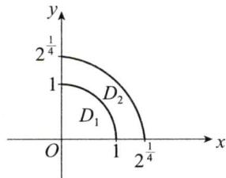
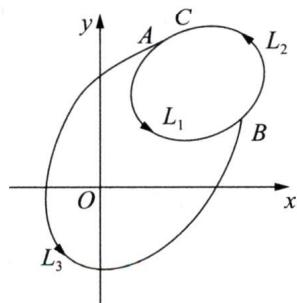
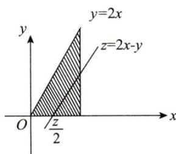

# 2005年数学(一）真题解析

# 一、填空题

(1)【答案】 $y = \frac{1}{2} x - \frac{1}{4}$ .

【解】 由 $\lim_{x\to \infty}\frac{y}{x} = \lim_{x\to \infty}\frac{x^2}{x(2x + 1)} = \frac{1}{2},$

$$
\lim  _ {x \rightarrow \infty} \left(y - \frac {1}{2} x\right) = \lim  _ {x \rightarrow \infty} \left(\frac {x ^ {2}}{2 x + 1} - \frac {x}{2}\right) = \lim  _ {x \rightarrow \infty} \frac {- x}{2 (2 x + 1)} = - \frac {1}{4},
$$

得曲线 $y = \frac{x^2}{2x + 1}$ 的斜渐近线方程为 $y = \frac{1}{2} x - \frac{1}{4}$ .

(2)【答案】 $y = \frac{x\ln x}{3} - \frac{x}{9}$ .

【解】方法一 将 $xy' + 2y = x\ln x$ 化为 $y' + \frac{2}{x} y = \ln x$ ，解得

$$
y = \left[ \int \ln x \cdot \mathrm {e} ^ {\int \frac {2}{x} \mathrm {d} x} \mathrm {d} x + C \right] \mathrm {e} ^ {- \int \frac {2}{x} \mathrm {d} x} = \frac {1}{x ^ {2}} \left(\int x ^ {2} \ln x \mathrm {d} x + C\right) = \frac {1}{x ^ {2}} \left(\frac {x ^ {3}}{3} \ln x - \frac {1}{9} x ^ {3} + C\right),
$$

由 $y(1) = -\frac{1}{9}$ ，得 $C = 0$ ，故 $y = \frac{x \ln x}{3} - \frac{x}{9}$ .

方法二 由 $xy' + 2y = x \ln x$ ，得 $x^2 y' + 2xy = x^2 \ln x$ ，即 $(x^2 y)' = x^2 \ln x$ ，解得

$$
x ^ {2} y = \int x ^ {2} \ln x \mathrm {d} x + C = \frac {x ^ {3}}{3} \ln x - \frac {1}{9} x ^ {3} + C,
$$

于是 $y = \frac{1}{x^2}\left(\frac{x^3}{3}\ln x - \frac{1}{9} x^3 + C\right)$ , 由 $y(1) = -\frac{1}{9}$ 得 $C = 0$ , 故 $y = \frac{x\ln x}{3} - \frac{x}{9}$ .

(3)【答案】 $\frac{\sqrt{3}}{3}$ .

【解】 $\frac{\partial u}{\partial x} = \frac{x}{3}, \frac{\partial u}{\partial y} = \frac{y}{6}, \frac{\partial u}{\partial z} = \frac{z}{9},$

由 $\frac{\partial u}{\partial x}\bigg|_{(1,2,3)} = \frac{1}{3},\quad \frac{\partial u}{\partial y}\bigg|_{(1,2,3)} = \frac{1}{3},\quad \frac{\partial u}{\partial z}\bigg|_{(1,2,3)} = \frac{1}{3}$ 得

$$
\left. \frac {\partial u}{\partial n} \right| _ {(1, 2, 3)} = \frac {1}{3} \times \frac {1}{\sqrt {3}} + \frac {1}{3} \times \frac {1}{\sqrt {3}} + \frac {1}{3} \times \frac {1}{\sqrt {3}} = \frac {\sqrt {3}}{3}.
$$

（4）【答案】 $(2 - \sqrt{2})\pi R^3$

【解】 方法一 由 $\left\{ \begin{array}{l} z = \sqrt{x^2 + y^2}, \\ z = \sqrt{R^2 - x^2 - y^2}, \end{array} \right.$ 得 $x^2 + y^2 = \frac{R^2}{2}$ .

令 $D: x^2 + y^2 \leqslant \frac{R^2}{2}$ , 由高斯公式得

$$
\iint_ {\Sigma} x \mathrm {d} y \mathrm {d} z + y \mathrm {d} z \mathrm {d} x + z \mathrm {d} x \mathrm {d} y = 3 \iiint_ {\Omega} \mathrm {d} v = 3 \iint_ {D} \mathrm {d} x \mathrm {d} y \int_ {\sqrt {x ^ {2} + y ^ {2}}} ^ {\sqrt {R ^ {2} - x ^ {2} - y ^ {2}}} \mathrm {d} z
$$

$$
\begin{array}{l} = 3 \iint_ {D} \left(\sqrt {R ^ {2} - x ^ {2} - y ^ {2}} - \sqrt {x ^ {2} + y ^ {2}}\right) d x d y \\ = 3 \int_ {0} ^ {2 \pi} \mathrm {d} \theta \int_ {0} ^ {\frac {R}{\sqrt {2}}} r \left(\sqrt {R ^ {2} - r ^ {2}} - r\right) \mathrm {d} r = 6 \pi \int_ {0} ^ {\frac {R}{\sqrt {2}}} r \sqrt {R ^ {2} - r ^ {2}} \mathrm {d} r - \frac {\pi R ^ {3}}{\sqrt {2}} \\ = - 3 \pi \int_ {0} ^ {\frac {R}{\sqrt {2}}} \sqrt {R ^ {2} - r ^ {2}} d \left(R ^ {2} - r ^ {2}\right) - \frac {\pi R ^ {3}}{\sqrt {2}} = (2 - \sqrt {2}) \pi R ^ {3}. \\ \end{array}
$$

方法二 由高斯公式得

$$
\begin{array}{l} \iint_ {\Sigma} x \mathrm {d} y \mathrm {d} z + y \mathrm {d} z \mathrm {d} x + z \mathrm {d} x \mathrm {d} y = 3 \iiint_ {\Omega} \mathrm {d} v = 3 \int_ {0} ^ {2 \pi} \mathrm {d} \theta \int_ {0} ^ {\frac {\pi}{4}} \mathrm {d} \varphi \int_ {0} ^ {R} r ^ {2} \sin \varphi \mathrm {d} r = 6 \pi \int_ {0} ^ {\frac {\pi}{4}} \sin \varphi \mathrm {d} \varphi \int_ {0} ^ {R} r ^ {2} \mathrm {d} r \\ = 2 \pi R ^ {3} \left(1 - \frac {\sqrt {2}}{2}\right) = (2 - \sqrt {2}) \pi R ^ {3}. \\ \end{array}
$$

（5）【答案】2.

【解】方法一 因为 $B = (\alpha_{1} + \alpha_{2} + \alpha_{3},\alpha_{1} + 2\alpha_{2} + 4\alpha_{3},\alpha_{1} + 3\alpha_{2} + 9\alpha_{3})$

$$
= \mathbf {A} \left( \begin{array}{c c c} 1 & 1 & 1 \\ 1 & 2 & 3 \\ 1 & 4 & 9 \end{array} \right),
$$

所以 $|\pmb {B}| = |\pmb {A}|\cdot \left| \begin{array}{lll}1 & 1 & 1\\ 1 & 2 & 3\\ 1 & 4 & 9 \end{array} \right| = (3 - 1)(3 - 2)(2 - 1) = 2.$

方法二 $|\pmb {B}| = |\pmb {\alpha}_1 + \pmb {\alpha}_2 + \pmb {\alpha}_3,\pmb {\alpha}_1 + 2\pmb {\alpha}_2 + 4\pmb {\alpha}_3,\pmb {\alpha}_1 + 3\pmb {\alpha}_2 + 9\pmb {\alpha}_3|$

$$
\begin{array}{l} = \left| \boldsymbol {\alpha} _ {1} + \boldsymbol {\alpha} _ {2} + \boldsymbol {\alpha} _ {3}, \boldsymbol {\alpha} _ {2} + 3 \boldsymbol {\alpha} _ {3}, \boldsymbol {\alpha} _ {2} + 5 \boldsymbol {\alpha} _ {3} \right| \\ = \left| \boldsymbol {\alpha} _ {1} + \boldsymbol {\alpha} _ {2} + \boldsymbol {\alpha} _ {3}, \boldsymbol {\alpha} _ {2} + 3 \boldsymbol {\alpha} _ {3}, 2 \boldsymbol {\alpha} _ {3} \right| = 2 \left| \boldsymbol {\alpha} _ {1} + \boldsymbol {\alpha} _ {2} + \boldsymbol {\alpha} _ {3}, \boldsymbol {\alpha} _ {2} + 3 \boldsymbol {\alpha} _ {3}, \boldsymbol {\alpha} _ {3} \right| \\ = 2 \left| \boldsymbol {\alpha} _ {1} + \boldsymbol {\alpha} _ {2}, \boldsymbol {\alpha} _ {2}, \boldsymbol {\alpha} _ {3} \right| = 2 \left| \boldsymbol {\alpha} _ {1}, \boldsymbol {\alpha} _ {2}, \boldsymbol {\alpha} _ {3} \right| = 2. \\ \end{array}
$$

方法点评：本题注意范德蒙德行列式的使用.

(6)【答案】 $\frac{13}{48}$ .

【解】令 $A_{i} = \{X = i\} (i = 1,2,3,4),B = \{Y = 2\}$ ，则 $P(A_{i}) = \frac{1}{4} (i = 1,2,3,4)$

$$
P (B \mid A _ {1}) = 0, \quad P (B \mid A _ {2}) = \frac {1}{2}, \quad P (B \mid A _ {3}) = \frac {1}{3}, \quad P (B \mid A _ {4}) = \frac {1}{4},
$$

由全概率公式得 $P\{Y = 2\} = P(B) = \sum_{i = 1}^{4}P(A_i)P(B\mid A_i) = \frac{1}{4}\left(\frac{1}{2} +\frac{1}{3} +\frac{1}{4}\right) = \frac{13}{48}.$

# 二、选择题

（7）【答案】 (C).

【解】当 $|x|\leqslant 1$ 时， $1\leqslant \sqrt[n]{1 + |x|^3n}\leqslant \sqrt[n]{2}$ ，由夹逼定理得 $\lim_{n\to \infty}\sqrt[n]{1 + |x|^3n} = 1;$

当 $|x| > 1$ 时， $|x|^3 = \sqrt[n]{|x|^{3n}} \leqslant \sqrt[n]{1 + |x|^{3n}} \leqslant \sqrt[n]{|x|^{3n} + |x|^{3n}} = \sqrt[n]{2}|x|^3,$

由夹逼定理得 $\lim_{n\to \infty}\sqrt[n]{1 + |x|^{\frac{3n}{2}}} = |x|^3$

即 $f(x) = \left\{ \begin{array}{ll}1, & |x|\leqslant 1,\\ |x|^3, & |x| > 1. \end{array} \right.$

$$
f _ {-} ^ {\prime} (- 1) = \lim  _ {x \rightarrow - 1 ^ {-}} \frac {f (x) - f (- 1)}{x + 1} = \lim  _ {x \rightarrow - 1 ^ {-}} \frac {- x ^ {3} - 1}{x + 1} = - 3,
$$

$$
f _ {+} ^ {\prime} (- 1) = \lim  _ {x \rightarrow - 1 ^ {+}} \frac {f (x) - f (- 1)}{x + 1} = \lim  _ {x \rightarrow - 1 ^ {+}} \frac {1 - 1}{x + 1} = 0,
$$

因为 $f_{-}^{\prime}(-1) \neq f_{+}^{\prime}(-1)$ ，所以 $f(x)$ 在 $x = -1$ 处不可导；

$$
f _ {-} ^ {\prime} (1) = \lim  _ {x \rightarrow 1 ^ {-}} \frac {f (x) - f (1)}{x - 1} = \lim  _ {x \rightarrow 1 ^ {-}} \frac {1 - 1}{x - 1} = 0,
$$

$$
f _ {+} ^ {\prime} (1) = \lim  _ {x \rightarrow 1 ^ {+}} \frac {f (x) - f (1)}{x - 1} = \lim  _ {x \rightarrow - 1 ^ {+}} \frac {x ^ {3} - 1}{x - 1} = 3,
$$

因为 $f_{-}^{\prime}(1)\neq f_{+}^{\prime}(1)$ ，所以 $f(x)$ 在 $x = 1$ 处不可导，

即 $f(x)$ 在 $(-\infty , + \infty)$ 内连续，但有两个不可导点，应选(C).

方法点评：讨论由极限形式表示的函数的连续性与可导性时，先计算极限，求出函数的表达式，再讨论函数的有关特性.

（8）【答案】 （A）.

【解】方法一 $f(x) = 3x^{2}$ 为偶函数，但 $F(x) = x^{3} + C$ 不一定是奇函数，(B)不对； $f(x) = \cos x - 1$ 为周期函数， $F(x) = \sin x - x + C$ 不是周期函数，(C)不对； $f(x) = 2x$ 为单调增函数， $F(x) = x^{2} + C$ 不是单调函数，(D)不对，应选(A).

方法二 设 $f(-x) = -f(x)$ ，令 $F(x) = \int_{a}^{x} f(t) \, \mathrm{d}t$ ，

则 $F(-x) = \int_{a}^{-x}f(t)\mathrm{d}t\stackrel {t = -u}{=}\int_{-a}^{x}f(-u)(-\mathrm{d}u) = \int_{-a}^{x}f(u)\mathrm{d}u$

$$
= \int_ {- a} ^ {a} f (u) d u + \int_ {a} ^ {x} f (u) d u = \int_ {a} ^ {x} f (u) d u = F (x),
$$

于是 $F(x)$ 为偶函数；

反之，设 $F(-x) = F(x)$ ，两边求导得 $-F'(-x) = F'(x)$ ，或 $f(-x) = -f(x)$ ，即 $f(x)$ 为奇函数，应选(A).

方法点评：设 $F(x)$ 为 $f(x)$ 的原函数，则 $f(x)$ 与 $F(x)$ 的奇偶性、周期性如下：

(1) $f(x)$ 是奇函数的充要条件是 $F(x)$ 为偶函数；  
(2) $f(x)$ 是偶函数时， $F(x)$ 不一定是奇函数， $f(x)$ 的所有原函数中只有

$F(x) = \int_{0}^{x}f(t)\mathrm{d}t$ 为奇函数，但当 $F(x)$ 是奇函数时， $f(x)$ 一定是偶函数；

（3）若 $f(x)$ 为周期函数， $F(x)$ 不一定是周期函数，但当 $F(x)$ 为周期函数时， $f(x)$ 一定为周期函数.

（9）【答案】 （B）.

【解】 由 $\frac{\partial u}{\partial x} = \varphi'(x + y) + \varphi'(x - y) + \psi(x + y) - \psi(x - y)$ ，

$$
\frac {\partial u}{\partial y} = \varphi^ {\prime} (x + y) - \varphi^ {\prime} (x - y) + \psi (x + y) + \psi (x - y),
$$

得 $\frac{\partial^2 u}{\partial x^2} = \varphi''(x + y) + \varphi''(x - y) + \psi'(x + y) - \psi'(x - y)$ ,

$$
\frac {\partial^ {2} u}{\partial y ^ {2}} = \varphi^ {\prime \prime} (x + y) + \varphi^ {\prime \prime} (x - y) + \psi^ {\prime} (x + y) - \psi^ {\prime} (x - y),
$$

显然 $\frac{\partial^2u}{\partial x^2} = \frac{\partial^2u}{\partial y^2}$ ，应选（B）.

（10）【答案】 (D).

【解】 令 $F(x,y,z) = xy - z\ln y + \mathrm{e}^{xz} - 1$

$$
F _ {x} ^ {\prime} (x, y, z) = y + z \mathrm {e} ^ {x z}, \quad F _ {y} ^ {\prime} (x, y, z) = x - \frac {z}{y}, \quad F _ {z} ^ {\prime} (x, y, z) = - \ln y + x \mathrm {e} ^ {x z},
$$

因为 $F_{x}^{\prime}(0,1,1) = 2\neq 0,F_{y}^{\prime}(0,1,1) = -1\neq 0,F_{z}^{\prime}(0,1,1) = 0$ ，所以 $xy - z\ln y + \mathrm{e}^{xz} = 1$ 在点(0，1，1）确定两个具有连续偏导数的函数 $x = x(y,z)$ 及 $y = y(x,z)$ ，应选(D).

方法点评：本题需要掌握多元隐函数的存在定理，

设 $F(x,y,z)$ 连续可偏导， $F(x_0,y_0,z_0) = 0$ ，若 $F_x'(x_0,y_0,z_0) \neq 0$ ，则在点 $(x_0,y_0,z_0)$ 的邻域内确定二元函数 $x = x(y,z)$ ，其他情况类似.

（11）【答案】 (B).

【解】方法一 因为矩阵的不同特征值对应的特征向量线性无关，所以 $\alpha_{1},\alpha_{2}$ 线性无关由 $A\pmb{\alpha}_{1} = \lambda_{1}\pmb{\alpha}_{1},A\pmb{\alpha}_{2} = \lambda_{2}\pmb{\alpha}_{2}$ ，得 $A(\pmb {\alpha}_1 + \pmb {\alpha}_2) = \lambda_1\pmb {\alpha}_1 + \lambda_2\pmb {\alpha}_2$

$(\pmb{\alpha}_{1}, \pmb{A}(\pmb{\alpha}_{1} + \pmb{\alpha}_{2})) = (\pmb{\alpha}_{1}, \pmb{\alpha}_{2})\left( \begin{array}{cc} 1 & \lambda_{1} \\ 0 & \lambda_{2} \end{array} \right), \pmb{\alpha}_{1}, \pmb{A}(\pmb{\alpha}_{1} + \pmb{\alpha}_{2})$ 线性无关的充分必要条件是矩阵 $\left( \begin{array}{cc} 1 & \lambda_{1} \\ 0 & \lambda_{2} \end{array} \right)$ 可逆，即 $\left| \begin{array}{cc} 1 & \lambda_{1} \\ 0 & \lambda_{2} \end{array} \right| \neq 0$ 故 $\lambda_{2} \neq 0$ ，应选(B).

方法二 令 $k_{1}\pmb{\alpha}_{1} + k_{2}\pmb{A}(\pmb{\alpha}_{1} + \pmb{\alpha}_{2}) = \mathbf{0}$ , 由 $\mathbf{A}(\pmb{\alpha}_{1} + \pmb{\alpha}_{2}) = \lambda_{1}\pmb{\alpha}_{1} + \lambda_{2}\pmb{\alpha}_{2}$ , 得 $k_{1}\pmb{\alpha}_{1} + k_{2}(\lambda_{1}\pmb{\alpha}_{1} + \lambda_{2}\pmb{\alpha}_{2}) = \mathbf{0}$ , 整理得 $(k_{1} + \lambda_{1}k_{2})\pmb{\alpha}_{1} + \lambda_{2}k_{2}\pmb{\alpha}_{2} = \mathbf{0}$ .

因为 $\alpha_{1},\alpha_{2}$ 线性无关，所以 $\begin{cases} k_1 + \lambda_1k_2 = 0,\\ \lambda_2k_2 = 0, \end{cases}$ 于是 $\pmb{\alpha}_{1},\pmb {A}(\pmb{\alpha}_{1} + \pmb{\alpha}_{2})$ 线性无关的充分必要条件是 $k_{1}\pmb{\alpha}_{1} + k_{2}\pmb {A}(\pmb{\alpha}_{1} + \pmb{\alpha}_{2}) = \mathbf{0}$ 当且仅当 $k_{1} = k_{2} = 0$ ，即方程组 $\left\{ \begin{array}{l}k_{1} + \lambda_{1}k_{2} = 0,\\ \lambda_{2}k_{2} = 0 \end{array} \right.$ 只有零解，于是 $\left| \begin{array}{ll}1 & \lambda_1\\ 0 & \lambda_2 \end{array} \right|\neq 0$ ，故 $\lambda_{2}\neq 0$ ，应选(B).

（12）【答案】 (C).

【解】 令 $E_{12} = \begin{pmatrix} 0 & 1 & 0\\ 1 & 0 & 0\\ 0 & 0 & 1 \end{pmatrix}$ ，由题意得 $\pmb {B} = \pmb{E}_{12}\pmb{A}$

由 $|\pmb {B}| = |\pmb{E}_{12}|\cdot |\pmb {A}| = -|\pmb {A}|,\quad \pmb{B}^{-1} = \pmb{A}^{-1}\pmb{E}_{12}^{-1} = \pmb{A}^{-1}\pmb{E}_{12},$

得 $\pmb{B}^{*} = |\pmb{B}| \pmb{B}^{-1} = -|\pmb{A}| \cdot \pmb{A}^{-1} \pmb{E}_{12} = -\pmb{A}^{*} \pmb{E}_{12}$ 或 $-\pmb{B}^{*} = \pmb{A}^{*} \pmb{E}_{12}$ ,

即交换 $\mathbf{A}^{*}$ 的第1、2两列得 $-\mathbf{B}^{*}$ ，应选(C).

方法点评：本题考查初等变换与伴随矩阵.

设 $\mathbf{A}$ 为可逆矩阵，当研究 $A^{*}$ 时，一般需要使用公式 $A^{*} = |A|A^{-1}$ ，即将伴随矩阵问题转化为逆矩阵问题，注意使用如下结论：

（1）设 $\mathbf{A},\mathbf{B}$ 为可逆的 $n$ 阶矩阵，则 $(\mathbf{AB})^{*} = \mathbf{B}^{*}\mathbf{A}^{*}$   
（2）设 $\mathbf{A},\mathbf{B}$ 分别为可逆的 $m$ 阶及 $n$ 阶矩阵，则

$$
\begin{array}{l} \left( \begin{array}{c c} \mathbf {A} & \mathbf {O} \\ \mathbf {O} & \mathbf {B} \end{array} \right) ^ {*} = \left| \begin{array}{c c} \mathbf {A} & \mathbf {O} \\ \mathbf {O} & \mathbf {B} \end{array} \right| \cdot \left( \begin{array}{c c} \mathbf {A} & \mathbf {O} \\ \mathbf {O} & \mathbf {B} \end{array} \right) ^ {- 1} = \left( \begin{array}{c c} | \mathbf {B} | \mathbf {A} ^ {*} & \mathbf {O} \\ \mathbf {O} & | \mathbf {A} | \mathbf {B} ^ {*} \end{array} \right); \\ \left( \begin{array}{l l} \mathbf {O} & \mathbf {A} \\ \mathbf {B} & \mathbf {O} \end{array} \right) ^ {*} = \left| \begin{array}{l l} \mathbf {O} & \mathbf {A} \\ \mathbf {B} & \mathbf {O} \end{array} \right| \cdot \left( \begin{array}{l l} \mathbf {O} & \mathbf {A} \\ \mathbf {B} & \mathbf {O} \end{array} \right) ^ {- 1} = (- 1) ^ {m n} \binom {\mathbf {O}} {| \mathbf {B} | \mathbf {A} ^ {*}} \begin{array}{c c} | \mathbf {A} | \mathbf {B} ^ {*} \\ \mathbf {O} \end{array} . \\ \end{array}
$$

（13）【答案】（B）.

【解】 $P\{X = 0\} = 0.4 + a$

$$
\begin{array}{l} P \{X + Y = 1 \} = P \{X = 0, Y = 1 \} + P \{X = 1, Y = 0 \} = a + b, \\ P \{X = 0, X + Y = 1 \} = P \{X = 0, Y = 1 \} = a, \\ \end{array}
$$

因为 $\{X = 0\}$ 与 $\{X + Y = 1\}$ 相互独立，所以 $(a + b)(0.4 + a) = a$ ，又因为 $a + b = 0.5$ 所以 $a = 0.4, b = 0.1$ ，应选(B).

（14）【答案】 (D).

【解】 由 $X_{1} \sim N(0,1)$ ，得 $X_{1}^{2} \sim X^{2}(1)$

由 $X_{i}\sim N(0,1)(i = 2,3,\dots ,n)$ ，得 $\sum_{i = 2}^{n}X_{i}^{2}\sim \chi^{2}(n - 1)$ 且 $X_{1}^{2}$ 与 $\sum_{i = 2}^{n}X_{i}^{2}$ 独立，

由 $F$ 分布的定义得 $\frac{X_1^2 / 1}{\sum_{i = 2}^{n}X_i^2 / (n - 1)}\sim F(1,n - 1)$ ，即 $\frac{(n - 1)X_1^2}{\sum_{i = 2}^{n}X_i^2}\sim F(1,n - 1)$ ，应选(D).

方法点评：设总体 $X \sim N(\mu, \sigma^2), X_1, X_2, \dots, X_n$ 为来自总体 $X$ 的简单随机样本，熟练掌握如下结论：

(1) $\frac{\overline{X} - \mu}{\frac{\sigma}{\sqrt{n}}} \sim N(0, 1)$ ;

(2) $\frac{\overline{X} - \mu}{\frac{S}{\sqrt{n}}} \sim t(n - 1)$ ;

(3) $\frac{(n - 1)S^2}{\sigma^2} \sim \chi^2(n - 1)$ ;

(4) $\frac{1}{\sigma^2} \sum_{i=1}^{n} (X_i - \mu)^2 \sim \chi^2(n)$ .

# 三、解答题

（15）【解】如图所示，令 $D_{1} = \{(x,y)\mid x^{2} + y^{2} < 1,x\geqslant 0,y\geqslant 0\}$

则 $\iint_{D} xy[1 + x^2 + y^2] \, \mathrm{d}x \, \mathrm{d}y = \iint_{D_1} xy \, \mathrm{d}x \, \mathrm{d}y + 2\iint_{D_2} xy \, \mathrm{d}x \, \mathrm{d}y$

$$
\begin{array}{l} D _ {2} = \{(x, y) \mid 1 \leqslant x ^ {2} + y ^ {2} \leqslant \sqrt {2}, x \geqslant 0, y \geqslant 0 \}, \\ = \int_ {0} ^ {\frac {\pi}{2}} d \theta \int_ {0} ^ {1} r ^ {3} \sin \theta \cos \theta d r + 2 \int_ {0} ^ {\frac {\pi}{2}} d \theta \int_ {1} ^ {4 \sqrt {2}} r ^ {3} \sin \theta \cos \theta d r \\ = \frac {1}{4} \int_ {0} ^ {\frac {\pi}{2}} \sin \theta \cos \theta d \theta + \frac {1}{2} \int_ {0} ^ {\frac {\pi}{2}} \sin \theta \cos \theta d \theta \\ = \frac {3}{4} \int_ {0} ^ {\frac {\pi}{2}} \sin \theta d (\sin \theta) = \frac {3}{8}. \\ \end{array}
$$

  
三（15）题图

方法点评：本题考查分段函数二重积分的计算. 若积分区域的边界曲线中含 $x^{2} + y^{2}$ 或被积函数 $f(x, y)$ 中含 $x^{2} + y^{2}$ ，一般使用极坐标变换法计算二重积分.

（16）【解】方法一 由 $\lim_{n\to \infty}\left|\frac{a_{n + 1}}{a_n}\right| = 1$ ，得级数的收敛半径为 $R = 1$ ，收敛区间为 $(-1,1)$

令 $f(x) = \sum_{n=1}^{\infty}(-1)^{n-1}\left[1 + \frac{1}{n(2n-1)}\right]x^{2n}$ ,

则 $f(x) = \sum_{n = 1}^{\infty}(-1)^{n - 1}x^{2n} + \sum_{n = 1}^{\infty}(-1)^{n - 1}\frac{x^{2n}}{n(2n - 1)}$

$$
\begin{array}{l} = - \sum_ {n = 1} ^ {\infty} (- x ^ {2}) ^ {n} + 2 \sum_ {n = 1} ^ {\infty} (- 1) ^ {n - 1} \frac {x ^ {2 n}}{2 n (2 n - 1)} \\ = \frac {x ^ {2}}{1 + x ^ {2}} + 2 \sum_ {n = 1} ^ {\infty} (- 1) ^ {n - 1} \frac {x ^ {2 n}}{2 n (2 n - 1)}, \\ \end{array}
$$

令 $S_{1}(x) = \sum_{n = 1}^{\infty}(-1)^{n - 1}\frac{x^{2n}}{2n(2n - 1)}$ ， $S_{1}(0) = 0$

$$
S _ {1} ^ {\prime} (x) = \sum_ {n = 1} ^ {\infty} (- 1) ^ {n - 1} \frac {x ^ {2 n - 1}}{2 n - 1}, \quad S _ {1} ^ {\prime} (0) = 0,
$$

$$
S _ {1} ^ {\prime \prime} (x) = \sum_ {n = 1} ^ {\infty} (- 1) ^ {n - 1} x ^ {2 n - 2} = \sum_ {n = 1} ^ {\infty} (- x ^ {2}) ^ {n - 1} = \frac {1}{1 + x ^ {2}},
$$

于是 $S_1'(x) = S_1'(x) - S_1'(0) = \int_{0}^{x} \frac{1}{1 + x^2} \, \mathrm{d}x = \arctan x$

$$
\begin{array}{l} S _ {1} (x) = S _ {1} (x) - S _ {1} (0) = \int_ {0} ^ {x} \arctan x \mathrm {d} x = x \arctan x - \int_ {0} ^ {x} \frac {x}{1 + x ^ {2}} \mathrm {d} x \\ = x \arctan x - \frac {1}{2} \ln \left(1 + x ^ {2}\right), \\ \end{array}
$$

故 $f(x) = \frac{x^2}{1 + x^2} + 2x\arctan x - \ln (1 + x^2)$ .

方法二 由 $\lim_{n\to \infty}\left|\frac{a_{n + 1}}{a_n}\right| = 1$ 得级数的收敛半径为 $R = 1$ ，级数的收敛区间为 $(-1,1)$

$$
\begin{array}{l} S (x) = \sum_ {n = 1} ^ {\infty} (- 1) ^ {n - 1} \left[ 1 + \frac {1}{n (2 n - 1)} \right] x ^ {2 n} \\ = \sum_ {n = 1} ^ {\infty} (- 1) ^ {n - 1} x ^ {2 n} + 2 \sum_ {n = 1} ^ {\infty} (- 1) ^ {n - 1} \frac {x ^ {2 n}}{2 n (2 n - 1)} \\ \end{array}
$$

而 $\sum_{n = 1}^{\infty}(-1)^{n - 1}x^{2n} = \frac{x^2}{1 - (-x^2)} = \frac{x^2}{1 + x^2},$

又 $\sum_{n=1}^{\infty}(-1)^{n-1}\frac{x^{2n}}{2n(2n-1)}=\sum_{n=1}^{\infty}(-1)^{n-1}\frac{x^{2n}}{2n-1}-\sum_{n=1}^{\infty}(-1)^{n-1}\frac{x^{2n}}{2n},$

$$
\begin{array}{l} \sum_ {n = 1} ^ {\infty} (- 1) ^ {n - 1} \frac {x ^ {2 n}}{2 n - 1} = x \sum_ {n = 1} ^ {\infty} (- 1) ^ {n - 1} \frac {x ^ {2 n - 1}}{2 n - 1} = x \sum_ {n = 1} ^ {\infty} \int_ {0} ^ {x} (- 1) ^ {n - 1} x ^ {2 n - 2} d x \\ = x \int_ {0} ^ {x} \left[ \sum_ {n = 1} ^ {\infty} (- x ^ {2}) ^ {n - 1} \right] d x = x \int_ {0} ^ {x} \frac {1}{1 + x ^ {2}} d x = x \arctan x, \\ \end{array}
$$

$$
\begin{array}{l} \sum_ {n = 1} ^ {\infty} (- 1) ^ {n - 1} \frac {x ^ {2 n}}{2 n} = \sum_ {n = 1} ^ {\infty} \int_ {0} ^ {x} (- 1) ^ {n - 1} x ^ {2 n - 1} d x = \int_ {0} ^ {x} \left[ \sum_ {n = 1} ^ {\infty} (- 1) ^ {n - 1} x ^ {2 n - 1} \right] d x \\ = \int_ {0} ^ {x} x \left[ \sum_ {n = 1} ^ {\infty} (- 1) ^ {n - 1} x ^ {2 n - 2} \right] d x = \int_ {0} ^ {x} \frac {x}{1 + x ^ {2}} d x = \frac {1}{2} \ln (1 + x ^ {2}), \\ \end{array}
$$

故 $f(x) = \frac{x^2}{1 + x^2} + 2x\arctan x - \ln (1 + x^2)$ .

(17)【解】由已知条件得 $f(0) = 0, f(3) = 2, f'(0) = 2, f'(3) = -2, f''(3) = 0.$

由分部积分得

$$
\begin{array}{l} \int_ {0} ^ {3} \left(x ^ {2} + x\right) f ^ {\prime \prime} (x) d x = \int_ {0} ^ {3} \left(x ^ {2} + x\right) d f ^ {\prime \prime} (x) \\ = (x ^ {2} + x) f ^ {\prime \prime} (x) \left| _ {0} ^ {3} - \int_ {0} ^ {3} (2 x + 1) f ^ {\prime \prime} (x) d x \right. \\ = - \int_ {0} ^ {3} (2 x + 1) d f ^ {\prime} (x) = - (2 x + 1) f ^ {\prime} (x) \left| _ {0} ^ {3} + 2 \int_ {0} ^ {3} f ^ {\prime} (x) d x \right. \\ = - 7 f ^ {\prime} (3) + f ^ {\prime} (0) + 2 \int_ {0} ^ {3} f ^ {\prime} (x) d x = 1 6 + 2 f (x) \Bigg | _ {0} ^ {3} = 2 0. \\ \end{array}
$$

（18）【证明】（I）令 $\varphi (x) = f(x) - 1 + x,\varphi (0) = -1,\varphi (1) = 1.$

因为 $\varphi (0)\varphi (1) < 0$ ，所以由零点定理，存在 $\xi \in (0,1)$ ，使得 $\varphi (\xi) = 0$ ，即 $f(\xi) = 1 - \xi$

（Ⅱ）由微分中值定理，存在 $\eta \in (0,c),\zeta \in (c,1)$ ，使得

$$
f ^ {\prime} (\eta) = \frac {f (\xi) - f (0)}{\xi} = \frac {1 - \xi}{\xi}, \quad f ^ {\prime} (\zeta) = \frac {f (1) - f (\xi)}{1 - \xi} = \frac {\xi}{1 - \xi},
$$

故 $f^{\prime}(\eta)f^{\prime}(\zeta) = 1$

方法点评：本题考查零点定理与拉格朗日中值定理

设 $f(x)$ 在 $[a,b]$ 上连续，在 $(a,b)$ 内可导，若题中只出现 $f^{\prime}(\xi),f^{\prime}(\eta)$ ，则一般需要找出三个点，两次使用拉格朗日中值定理.本题已知条件出现 $f(0) = 0,f(1) = 1$ 连同 $f(\xi) = 1 - \xi$ 故三个点为 $0,\xi ,1$

(19)【解】（I） $P(x, y) = \frac{\varphi(y)}{2x^2 + y^4}, Q(x, y) = \frac{2xy}{2x^2 + y^4}$ ,

$$
\frac {\partial Q}{\partial x} = \frac {2 y (2 x ^ {2} + y ^ {4}) - 8 x ^ {2} y}{(2 x ^ {2} + y ^ {4}) ^ {2}}, \quad \frac {\partial P}{\partial y} = \frac {(2 x ^ {2} + y ^ {4}) \varphi^ {\prime} (y) - 4 y ^ {3} \varphi (y)}{(2 x ^ {2} + y ^ {4}) ^ {2}},
$$

设 $C$ 是任意一条右半平面 $x > 0$ 内正向闭曲线，如图所示，在 $C$ 上取两点 $A,B$ 将 $C$ 分为 $L_{1},L_{2}$ ，再取从点 $A$ 至点 $B$ 的有向曲线 $L_{3}$ 使得 $L_1^-$ + $L_{3}$ 与 $L_{2} + L_{3}$ 都是绕原点的正向闭曲线，由已知条件得 $\oint_{L_1^- +L_3}\frac{\varphi(y)\mathrm{d}x + 2xy\mathrm{d}y}{2x^2 + y^4} = A,\oint_{L_2 + L_3}\frac{\varphi(y)\mathrm{d}x + 2xy\mathrm{d}y}{2x^2 + y^4} = A,$

两式相减得

$$
\oint_ {c} \frac {\varphi (y) d x + 2 x y d y}{2 x ^ {2} + y ^ {4}} = 0.
$$

  
三(19)题图

（Ⅱ）因为对任意右半平面的闭曲线 $C$ 都有 $\oint_{C} \frac{\varphi(y) \mathrm{d}x + 2xy \mathrm{d}y}{2x^2 + y^4} = 0$ ，所以曲线积分与路径无关，于是 $\frac{\partial Q}{\partial x} = \frac{\partial P}{\partial y}$ ，即 $2y^5 - 4x^2 y = 2x^2 \varphi'(y) + \varphi'(y)y^4 - 4y^3 \varphi(y)$ ，

比较 $x$ 相同次数的系数得 $\left\{ \begin{array}{l}\varphi^{\prime}(y) = -2y,\\ \varphi^{\prime}(y)y - 4\varphi (y) = 2y^{2}. \end{array} \right.$

由 $\varphi'(y) = -2y$ ，得 $\varphi(y) = -y^2 + C$ ，代入 $y\varphi'(y) - 4\varphi(y) = 2y^2$ 中得 $C = 0$ 故 $\varphi(y) = -y^2$

方法点评：本题考查对坐标的曲线积分、格林公式、曲线积分与路径无关的条件及积分学与微分方程相结合的应用. 曲线积分与路径无关的等价命题有：

（1）曲线积分 $\int_{L} P \mathrm{d}x + Q \mathrm{d}y$ 与路径无关；  
(2) 对区域 $D$ 内任意的闭曲线 $C$ 有 $\oint_{C} P \mathrm{~d} x + Q \mathrm{~d} y = 0$ ;  
(3) 在区域 $D$ 内 $\frac{\partial Q}{\partial x} = \frac{\partial P}{\partial y}$ ;  
（4）存在二元函数 $u(x,y)$ ，使得 $\mathrm{d}u = P\mathrm{d}x + Q\mathrm{d}y$

本题对任意一条不绕原点的闭曲线的曲线积分为零，则有 $\frac{\partial Q}{\partial x} = \frac{\partial P}{\partial y}$ ，从而可得一微分方程，解出未知函数.

(20)【解】 令 $\mathbf{A} = \begin{pmatrix} 1 - a & 1 + a & 0 \\ 1 + a & 1 - a & 0 \\ 0 & 0 & 2 \end{pmatrix}, \mathbf{X} = \begin{pmatrix} x_1 \\ x_2 \\ x_3 \end{pmatrix}$ , 则二次型可表示为 $f = \mathbf{X}^{\mathrm{T}}\mathbf{A}\mathbf{X}$ .

（I）因为 $r(\mathbf{A}) = 2$ ，所以 $\left|\mathbf{A}\right| = 0$ ，于是 $a = 0$

（Ⅱ） $\mathbf{A} = \left( \begin{array}{lll}1 & 1 & 0\\ 1 & 1 & 0\\ 0 & 0 & 2 \end{array} \right)$ ，由 $|\lambda E - A| = \left| \begin{array}{ccc}\lambda -1 & -1 & 0\\ -1 & \lambda -1 & 0\\ 0 & 0 & \lambda -2 \end{array} \right| = \lambda (\lambda -2)^2 = 0$ ，得 $\mathbf{A}$ 的特征值为 $\lambda_1 = 0,\lambda_2 = \lambda_3 = 2.$

当 $\lambda_{1} = 0$ 时，由 $(0E - A)X = 0$ ，即 $AX = 0$ ，得 $\xi_{1} = (-1,1,0)^{\mathrm{T}}$

当 $\lambda_{2} = \lambda_{3} = 2$ 时，由 $(2\pmb {E} - \pmb {A})\pmb {X} = \pmb{0}$ ，得 $\pmb {\xi}_2 = (1,1,0)^{\mathrm{T}},\pmb {\xi}_3 = (0,0,1)^{\mathrm{T}}$

单位化得 $\gamma_{1} = \frac{1}{\sqrt{2}}\binom{-1}{0},\quad \gamma_{2} = \frac{1}{\sqrt{2}}\binom{1}{0},\quad \gamma_{3} = \binom{0}{0},$

令 $Q = \left[ \begin{array}{ccc} - \frac{1}{\sqrt{2}} & \frac{1}{\sqrt{2}} & 0\\ \frac{1}{\sqrt{2}} & \frac{1}{\sqrt{2}} & 0\\ 0 & 0 & 1 \end{array} \right]$ 则 $\pmb {Q}^{\mathrm{T}}\pmb {A}\pmb {Q} = \left( \begin{array}{lll}0 & 0 & 0\\ 0 & 2 & 0\\ 0 & 0 & 2 \end{array} \right),$

于是 $f(x_{1},x_{2},x_{3}) = \mathbf{X}^{\mathrm{T}}\mathbf{A}\mathbf{X}\frac{\mathbf{X} = \mathbf{Q}\mathbf{Y}}{}\\ 2y_{2}^{2} + 2y_{3}^{2},$

（Ⅲ）由 $f(x_{1},x_{2},x_{3}) = x_{1}^{2} + x_{2}^{2} + 2x_{3}^{2} + 2x_{1}x_{2} = (x_{1} + x_{2})^{2} + 2x_{3}^{2} = 0$ ，得 $\left\{ \begin{array}{l}x_{1} + x_{2} = 0,\\ x_{3} = 0, \end{array} \right.$ 则 $f(x_{1},x_{2},x_{3}) = 0$ 的解为 $C\binom{-1}{0}$ （C为任意常数）.

（21）【解】由 $\mathbf{AB} = \mathbf{0}$ ，得 $r(\mathbf{A}) + r(\mathbf{B})\leqslant 3$

因为 $\mathbf{A}$ 为非零矩阵，所以 $r(\mathbf{A})\geqslant 1$

当 $k \neq 9$ 时，由 $r(\mathbf{B}) = 2$ 得 $r(\mathbf{A}) = 1$

因为 $AB = 0$ ，所以 $\pmb{B}$ 的列向量为方程组 $AX = 0$ 的解，于是方程组 $AX = 0$ 的通解为

$$
\pmb {X} = C _ {1} \binom {1} {2} + C _ {2} \binom {3} {6} (C _ {1}, C _ {2} \text {为 任 意 常 数}).
$$

当 $k = 9$ 时， $r(\mathbf{B}) = 1$ ，则 $1 \leqslant r(\mathbf{A}) \leqslant 2$ .

当 $r(\mathbf{A}) = 2$ 时，因为 $\mathbf{AB} = \mathbf{0}$ ，所以 $\mathbf{B}$ 的列向量为 $\mathbf{AX} = \mathbf{0}$ 的解，于是方程组 $\mathbf{AX} = \mathbf{0}$ 的通解为 $\mathbf{X} = C\left( \begin{array}{l}1\\ 2\\ 3 \end{array} \right)$ （ $C$ 为任意常数）.

当 $r(\mathbf{A}) = 1$ 时，不妨设 $a \neq 0$ ，由 $\mathbf{A} \rightarrow \left( \begin{array}{ccc} a & b^* & c \\ 0 & 0 & 0 \\ 0 & 0 & 0 \end{array} \right) \rightarrow \left( \begin{array}{ccc} 1 & \frac{b}{a} & \frac{c}{a} \\ 0 & 0 & 0 \\ 0 & 0 & 0 \end{array} \right)$ ，得方程组 $\mathbf{AX} = \mathbf{0}$ 的通

解为 $\mathbf{X} = C_{1}\left[ \begin{array}{c} - \frac{b}{a}\\ 1\\ 0 \end{array} \right] + C_{2}\left[ \begin{array}{c} - \frac{c}{a}\\ 0\\ 1 \end{array} \right](C_{1},C_{2}$ 为任意常数）.

方法点评：设 $\mathbf{A},\mathbf{B}$ 分别为 $m\times n$ 与 $n\times s$ 两个矩阵，对 $\mathbf{AB} = \mathbf{O}$ 有两种解读：

(1) $r(\mathbf{A}) + r(\mathbf{B}) \leqslant n$ ;   
(2) 矩阵 $\pmb{B}$ 的列向量为齐次线性方程组 $\mathbf{A}\mathbf{X} = \mathbf{0}$ 的一组解.

(22)【解】 $(\mathrm{I})f_{X}(x) = \int_{-\infty}^{+\infty}f(x,y)\mathrm{d}y,$

当 $x \leqslant 0$ 或 $x \geqslant 1$ 时， $f_{X}(x) = 0$ ；当 $0 < x < 1$ 时， $f_{X}(x) = \int_{0}^{2x} \mathrm{d}y = 2x$

则 $X$ 的边缘密度为 $f_{X}(x) = \left\{ \begin{array}{ll}2x, & 0 <   x <   1,\\ 0, & \text{其他}, \end{array} \right.$

$$
f _ {Y} (y) = \int_ {- \infty} ^ {+ \infty} f (x, y) \mathrm {d} x,
$$

当 $y \leqslant 0$ 或 $y \geqslant 2$ 时， $f_{Y}(y) = 0$ ；当 $0 < y < 2$ 时， $f_{Y}(y) = \int_{\frac{y}{2}}^{1} \mathrm{d}x = 1 - \frac{y}{2}$ ，

则 $Y$ 的边缘密度为 $f_{Y}(y) = \left\{ \begin{array}{ll}1 - \frac{y}{2}, & 0 < y < 2,\\ 0, & \text{其他}. \end{array} \right.$

$$
\begin{array}{l} (\mathrm {I I}) F _ {Z} (z) = P \{Z \leqslant z \} = P \{2 X - Y \leqslant z \} \\ = \iint_ {2 x - y \leqslant z} f (x, y) \mathrm {d} x \mathrm {d} y, \\ \end{array}
$$

当 $z < 0$ 时， $F_{Z}(z) = 0$

当 $0 \leqslant z < 2$ 时（如图所示），

$$
F _ {Z} (z) = 1 - \int_ {\frac {z}{2}} ^ {1} \mathrm {d} x \int_ {0} ^ {2 x - z} \mathrm {d} y = 1 - \int_ {\frac {z}{2}} ^ {1} (2 x - z) \mathrm {d} x = z - \frac {z ^ {2}}{4};
$$

当 $z \geqslant 2$ 时， $F_{Z}(z) = 1$

  
三（22）题图

即 $F_{Z}(z) = \left\{ \begin{array}{ll}0, & z < 0,\\ z - \frac{z^{2}}{4}, & 0\leqslant z < 2,\\ 1, & z\geqslant 2. \end{array} \right.$ 于是 $Z$ 的密度函数为 $f_{Z}(z) = \left\{ \begin{array}{ll}1 - \frac{z}{2}, & 0 <   z <   2,\\ 0, & \text{其他}. \end{array} \right.$

(23)【解】（I）方法一 $Y_{1} = X_{1} - \overline{X} = X_{1} - \frac{1}{n}\sum_{i = 1}^{n}X_{i} = \left(1 - \frac{1}{n}\right)X_{1} - \frac{1}{n} X_{2} - \dots -\frac{1}{n} X_{n},$

因为 $X_{i}\sim N(0,1)(1\leqslant i\leqslant n)$ 且 $X_{1},X_{2},\dots ,X_{n}$ 相互独立，所以 $Y_{1}$ 服从正态分布.

又因为 $E(Y_{1}) = 0, D(Y_{1}) = \left(1 - \frac{1}{n}\right)^{2}D(X_{1}) + \frac{1}{n^{2}}D(X_{2}) + \dots +\frac{1}{n^{2}}D(X_{n}) = \frac{n - 1}{n},$

所以 $Y_{1}\sim N\left(0,\frac{n - 1}{n}\right)$ ，同理 $Y_{i}\sim N\left(0,\frac{n - 1}{n}\right)(1\leqslant i\leqslant n)$

于是 $D(Y_{i}) = \frac{n - 1}{n} (1\leqslant i\leqslant n)$

方法二 因为 $X_{i}\sim N(0,1)$ ，所以 $E(X_{i}) = 0,D(X_{i}) = 1(i = 1,2,\dots ,n)$

$$
E (\bar {X}) = \frac {1}{n} \sum_ {i = 1} ^ {n} E (X _ {i}) = 0, \quad D (\bar {X}) = \frac {1}{n ^ {2}} \sum_ {i = 1} ^ {n} D (X _ {i}) = \frac {1}{n}, \quad E (\bar {X} ^ {2}) = D (\bar {X}) + (E \bar {X}) ^ {2} = \frac {1}{n}.
$$

$$
\begin{array}{l} E \left(Y _ {i}\right) = E \left(X _ {i} - \bar {X}\right) = E \left(X _ {i}\right) - E (\bar {X}) = 0, \\ D \left(Y _ {i}\right) = E \left(Y _ {i} ^ {2}\right) - \left(E Y _ {i}\right) ^ {2} = E \left(Y _ {i} ^ {2}\right) = E \left(X _ {i} ^ {2} - 2 X _ {i} \bar {X} + \bar {X} ^ {2}\right) \\ = E \left(X _ {i} ^ {2}\right) - \frac {2}{n} E \left[ X _ {i} \left(X _ {1} + \dots + X _ {n}\right) \right] + E \left(\overline {{X}} ^ {2}\right) \\ = 1 - \frac {2}{n} E \left(X _ {i} ^ {2}\right) + \frac {1}{n} = 1 - \frac {1}{n}. \\ \end{array}
$$

$$
\begin{array}{l} (\mathrm {I I}) \operatorname {C o v} \left(Y _ {1}, Y _ {n}\right) = \operatorname {C o v} \left(X _ {1} - \bar {X}, X _ {n} - \bar {X}\right) \\ = \operatorname {C o v} \left(X _ {1}, X _ {n}\right) - \operatorname {C o v} \left(X _ {1}, \bar {X}\right) - \operatorname {C o v} \left(X _ {n}, \bar {X}\right) + \operatorname {C o v} (\bar {X}, \bar {X}) \\ = - \frac {1}{n} \operatorname {C o v} \left(X _ {1}, X _ {1} + X _ {2} + \dots + X _ {n}\right) - \frac {1}{n} \operatorname {C o v} \left(X _ {n}, X _ {1} + X _ {2} + \dots + X _ {n}\right) + D (\bar {X}) \\ = - \frac {1}{n} \operatorname {C o v} \left(X _ {1}, X _ {1}\right) - \frac {1}{n} \operatorname {C o v} \left(X _ {n}, X _ {n}\right) + \frac {1}{n} = \frac {1}{n} - \frac {2}{n} = - \frac {1}{n}. \\ \end{array}
$$