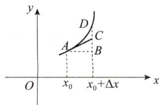
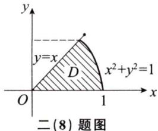

# 2006年数学(一）真题解析

# 一、填空题

(1)【答案】2.

【解】 $\lim_{x\to 0}\frac{x\ln(1 + x)}{1 - \cos{x}} = \lim_{x\to 0}\frac{x^2}{1 - \cos{x}} = 2.$

(2)【答案】 $y = Cx\mathrm{e}^{-x}$ （ $C$ 为任意常数）.

【解】方法一 由 $y' = \frac{y(1 - x)}{x}$ ，得 $y' - \left(\frac{1}{x} - 1\right)y = 0$

通解为 $y = C\mathrm{e}^{-\int -(\frac{1}{x} -1)\mathrm{d}x} = Cx\mathrm{e}^{-x}$ （C为任意常数）.

方法二 $y^\prime = \frac{y(1 - x)}{x}$ 化为 $\frac{y^{\prime}}{y} = \frac{1}{x} -1$ ，即 $(\ln y)' = \frac{1}{x} -1$ ，从而 $\ln y = \ln x + \ln e^{-x} + \ln C,$

故原方程的通解为 $y = Cx\mathrm{e}^{-x}$ （ $C$ 为任意常数）.

（3）【答案】 $2\pi$

【解】补充 $\Sigma_0: z = 1(x^2 + y^2 \leqslant 1)$ 取上侧，则

$$
\begin{array}{l} \iint_ {\Sigma} x \mathrm {d} y \mathrm {d} z + 2 y \mathrm {d} z \mathrm {d} x + 3 (z - 1) \mathrm {d} x \mathrm {d} y = \oiint_ {\Sigma + \Sigma_ {0}} x \mathrm {d} y \mathrm {d} z + 2 y \mathrm {d} z \mathrm {d} x + 3 (z - 1) \mathrm {d} x \mathrm {d} y - \\ \iint_ {\Sigma_ {0}} x \mathrm {d} y \mathrm {d} z + 2 y \mathrm {d} z \mathrm {d} x + 3 (z - 1) \mathrm {d} x \mathrm {d} y, \\ \end{array}
$$

由高斯公式得

$$
\oiint_ {\Sigma + \Sigma_ {0}} x \mathrm {d} y \mathrm {d} z + 2 y \mathrm {d} z \mathrm {d} x + 3 (z - 1) \mathrm {d} x \mathrm {d} y = 6 \iiint_ {\Omega} \mathrm {d} v = 6 \int_ {0} ^ {1} \mathrm {d} z \iint_ {x ^ {2} + y ^ {2} \leqslant z ^ {2}} \mathrm {d} x \mathrm {d} y = 6 \pi \int_ {0} ^ {1} z ^ {2} \mathrm {d} z = 2 \pi ,
$$

而 $\iint_{\Sigma_0}x\mathrm{d}y\mathrm{d}z + 2y\mathrm{d}z\mathrm{d}x + 3(z - 1)\mathrm{d}x\mathrm{d}y = 0,$

所以 $\iint_{\Sigma} x \, \mathrm{d}y \, \mathrm{d}z + 2y \, \mathrm{d}z \, \mathrm{d}x + 3(z - 1) \, \mathrm{d}x \, \mathrm{d}y = 2\pi.$

（4）【答案】 $\sqrt{2}$

【解】点（2，1，0）到平面 $3x + 4y + 5z = 0$ 的距离为 $d = \frac{|3\times 2 + 4\times 1|}{\sqrt{3^2 + 4^2 + 5^2}} = \sqrt{2}.$

方法点评：本题考查点到平面的距离.

空间解析几何部分需要掌握如下几个距离公式：

（1）两点之间的距离：设 $A(x_{1},y_{1},z_{1}),B(x_{2},y_{2},z_{2})$ ，则两点之间的距离公式为

$$
d = \sqrt {\left(x _ {2} - x _ {1}\right) ^ {2} + \left(y _ {2} - y _ {1}\right) ^ {2} + \left(z _ {2} - z _ {1}\right) ^ {2}};
$$

（2）点到平面的距离：设平面 $\pi :Ax + By + Cz + D = 0$ ，点 $M_0(x_0,y_0,z_0)\notin D$ ，则 $M_0$ 到 $\pi$ 的距离为

$$
d = \frac {\left| A x _ {0} + B y _ {0} + C z _ {0} + D \right|}{\sqrt {A ^ {2} + B ^ {2} + C ^ {2}}};
$$

（3）点到直线的距离：设 $L:\frac{x - x_0}{m} = \frac{y - y_0}{n} = \frac{z - z_0}{p},M_1(x_1,y_1,z_1)\notin L,$

令 $M_0(x_0, y_0, z_0), s = \{m, n, p\}$ ，则点 $M_1$ 到直线 $L$ 的距离为

$$
d = \frac {\left| \overrightarrow {M _ {0} M _ {1}} \times s \right|}{\left| s \right|}.
$$

（5）【答案】2.

【解】由 $\mathbf{BA} = \mathbf{B} + 2\mathbf{E}$ ，得 $\pmb {B}(\pmb {A} - \pmb {E}) = 2\pmb{E}$ ，两边取行列式，得 $|\textbf{B} |\cdot |\textbf{A} -\textbf{E}| = 4$ 因为 $\mathbf{A} - \mathbf{E} = \left( \begin{array}{ll}1 & 1\\ -1 & 1 \end{array} \right)$ ，所以 $|\mathbf{A} - \mathbf{E}| = 2$ ，于是 $|\textbf{B}| = 2$

(6)【答案】 $\frac{1}{9}$ .

【解】由 $X\sim U(0,3),Y\sim U(0,3)$ 得 $X,Y$ 的边缘密度函数为

$$
f _ {X} (x) = \left\{ \begin{array}{l l} \frac {1}{3}, & 0 <   x <   3, \\ 0, & \text {其 他}. \end{array} \right. f _ {Y} (y) = \left\{ \begin{array}{l l} \frac {1}{3}, & 0 <   y <   3, \\ 0, & \text {其 他}. \end{array} \right.
$$

由 $X,Y$ 独立得

$$
\begin{array}{l} P \left\{\max  (X, Y) \leqslant 1 \right\} = P \left\{X \leqslant 1, Y \leqslant 1 \right\} \\ = P \{X \leqslant 1 \} P \{Y \leqslant 1 \} = \int_ {0} ^ {1} \frac {1}{3} d x \cdot \int_ {0} ^ {1} \frac {1}{3} d y = \frac {1}{9}. \\ \end{array}
$$

# 二、选择题

（7）【答案】 （A）.

【解】 方法一

$$
\mathrm {d} y = f ^ {\prime} (x) \Delta x, \quad \Delta y = f (x + \Delta x) - f (x) = f ^ {\prime} (\xi) \Delta x (x <   \xi <   x + \Delta x),
$$

因为 $f^{\prime \prime}(x) > 0$ ，所以 $f^{\prime}(x)$ 单调增加，于是 $0 < f^{\prime}(x) < f^{\prime}(\xi)$

再由 $\Delta x > 0$ ，得 $0 < f'(x)\Delta x < f'(\xi)\Delta x$ ，即 $0 < \mathrm{d}y < \Delta y$ ，应选(A).

方法二 由泰勒公式得

$f(x) = f(x_0) + f'(x_0)(x - x_0) + \frac{f''(\xi)}{2!} (x - x_0)^2$ ，其中 $\xi$ 介于 $x_0$ 与 $x$ 之间，

因为 $f''(x) > 0$ ，所以 $f(x) - f(x_0) \geqslant f'(x_0)(x - x_0)$ ，等号成立当且仅当 $x = x_0$ 故 $\Delta y \geqslant \mathrm{d}y$

因为 $f^{\prime}(x_0) > 0, \Delta x = x - x_0 > 0$ ，所以 $\mathrm{dy} = f^{\prime}(x_0)(x - x_0) > 0$ ，于是 $\Delta y > \mathrm{dy} > 0$ ，应选(A).

方法三 $\Delta y = f(x_0 + \Delta x) - f(x_0) = f'(\xi)\Delta x (x_0 < \xi < x_0 + \Delta x),$

则 $\Delta y - \mathrm{d}y = [f'(\xi) - f'(x_0)]\Delta x$

$$
= f ^ {\prime \prime} (\eta) (\xi - x _ {0}) \Delta x (x _ {0} <   \eta <   \xi),
$$

由 $f^{\prime \prime}(x) > 0$ 得 $\Delta y - \mathrm{d}y > 0$ ，即 $\Delta y > \mathrm{d}y$ ，又 $\mathrm{d}y > 0$

故 $\Delta y > \mathrm{d}y > 0$ ，应选（A）.

方法四 因为 $f^{\prime}(x) > 0, f^{\prime \prime}(x) > 0$ ，所以 $y = f(x)$ 为单调增加的凹函数，如图所示，

因为 $\Delta x > 0$ ，所以 $\mathrm{dy} = |BC| > 0, \Delta y = |BD| > |BC|$ ，应选(A).

  
二（7）题图

（8）【答案】 (C).

【解】将 $D = \left\{(r, \theta) \mid 0 \leqslant \theta \leqslant \frac{\pi}{4}, 0 \leqslant r \leqslant 1\right\}$ 转化为 $Y$ 型区域为

$$
D = \left\{(x, y) \mid y \leqslant x \leqslant \sqrt {1 - y ^ {2}}, 0 \leqslant y \leqslant \frac {\sqrt {2}}{2} \right\},
$$

则 $\int_{0}^{\frac{\pi}{4}}\mathrm{d}\theta \int_{0}^{1}f(r\cos \theta ,r\sin \theta)r\mathrm{d}r = \int_{0}^{\frac{\sqrt{2}}{2}}\mathrm{d}y\int_{y}^{\sqrt{1 - y^2}}f(x,y)\mathrm{d}x$ ，应选(C).

(9)【答案】 (D).

【解】方法一 令 $S_{n} = a_{1} + a_{2} + \dots +a_{n}$ ，因为 $\sum_{n = 1}^{\infty}a_{n}$ 收敛，所以 $\lim_{n\to \infty}a_n = 0$ 且 $\lim_{n\to \infty}S_n$ 存在，令 $\lim_{n\to \infty}S_n = S.$

令 $S_{n}^{(1)} = \frac{a_{1} + a_{2}}{2} +\frac{a_{2} + a_{3}}{2} +\dots +\frac{a_{n} + a_{n + 1}}{2} = S_{n} - \frac{a_{1}}{2} +\frac{a_{n + 1}}{2},$

因为 $\lim_{n\to \infty}S_n^{(1)} = S - \frac{a_1}{2}$ 存在，所以 $\sum_{n = 1}^{\infty}\frac{a_n + a_{n + 1}}{2}$ 收敛，应选(D).

方法二

取 $a_{n} = \frac{(-1)^{n}}{n}$ ，级数 $\sum_{n = 1}^{\infty}a_{n}$ 收敛，但 $\sum_{n = 1}^{\infty}|a_n| = \sum_{n = 1}^{\infty}\frac{1}{n}$ 及 $\sum_{n = 1}^{\infty}(-1)^{n}a_{n} = \sum_{n = 1}^{\infty}\frac{1}{n}$ 发散，(A)，(B)不对；

取 $a_{n} = \frac{(-1)^{n}}{\sqrt{n}}$ ，级数 $\sum_{n=1}^{\infty} a_{n}$ 收敛， $\sum_{n=1}^{\infty} a_{n} a_{n+1} = -\sum_{n=1}^{\infty} \frac{1}{\sqrt{n(n+1)}}$

因为 $\frac{1}{\sqrt{n(n + 1)}} \sim \frac{1}{n}$ 且级数 $\sum_{n = 1}^{\infty} \frac{1}{n}$ 发散，所以 $-\sum_{n = 1}^{\infty} \frac{1}{\sqrt{n(n + 1)}}$ 发散，即 $\sum_{n = 1}^{\infty} a_n a_{n + 1}$ 发散，（C）不对，应选(D).

方法三 由级数 $\sum_{n=1}^{\infty} a_n$ 收敛得 $\sum_{n=1}^{\infty} \frac{1}{2} a_n$ 与 $\sum_{n=1}^{\infty} \frac{1}{2} a_{n+1}$ 收敛，由级数收敛的基本性质得 $\sum_{n=1}^{\infty} \frac{a_n + a_{n+1}}{2}$ 收敛.

方法点评：常数项级数敛散性判断通常考虑如下几个方面：

（1）是否满足级数收敛的必要条件，若不满足必要条件，则级数一定发散；  
(2) 是否可以由级数收敛的定义判断, 即 $\lim_{n\to \infty}S_n$ 是否存在.

确定具体的级数类型，如正项级数或交错级数，再根据该类级数敛散判别法.

(10)【答案】 (D).

【解】方法一 因为 $\varphi_y'(x, y) \neq 0$ 且 $\varphi(x_0, y_0) = 0$ ，所以 $\varphi(x, y) = 0$ 确定 $y$ 为 $x$ 的函数，设为 $y = y(x)$ ，代入 $z = f(x, y)$ 中，得 $z = f[x, y(x)]$ .

因为 $(x_0, y_0)$ 为极值点，所以 $\frac{\mathrm{d}z}{\mathrm{d}x}\Big|_{x = x_0} = f_x'(x_0, y_0) + f_y'(x_0, y_0) \cdot y'(x_0) = 0,$

若 $f_{x}^{\prime}(x_{0},y_{0}) \neq 0$ ，则 $f_{y}^{\prime}(x_{0},y_{0}) \neq 0$ ，应选(D).

方法二 令 $F(x, y, \lambda) = f(x, y) + \lambda \varphi(x, y)$ ，因为 $(x_0, y_0)$ 是 $f(x, y)$ 在约束条件 $\varphi(x, y) = 0$ 下的极值点，所以 $\left\{ \begin{array}{l} F_x'(x_0, y_0) = f_x'(x_0, y_0) + \lambda \varphi_x'(x_0, y_0) = 0, \\ F_y'(x_0, y_0) = f_y'(x_0, y_0) + \lambda \varphi_y'(x_0, y_0) = 0. \end{array} \right.$

若 $f_{x}^{\prime}(x_{0},y_{0})\neq 0$ ，则由 $f_{x}^{\prime}(x_{0},y_{0}) + \lambda \varphi_{x}^{\prime}(x_{0},y_{0}) = 0$ 得 $\lambda \neq 0$

因为 $\varphi_y'(x_0, y_0) \neq 0$ ，所以 $f_y'(x_0, y_0) \neq 0$ ，应选(D).

方法点评：本题需要正确区分二元函数无条件极值与条件极值的区别.

（1）设 $z = f(x,y)$ 可微，且 $(x_0,y_0)$ 为 $z = f(x,y)$ 的极值点，则 $(x_0,y_0)$ 为 $f(x,y)$ 的驻点，即 $f_{x}^{\prime}(x_{0},y_{0}) = 0,f_{y}^{\prime}(x_{0},y_{0}) = 0$ ，反之不对；  
（2）设 $z = f(x,y)$ 可微， $(x_0,y_0)$ 为函数 $f(x,y)$ 在约束条件 $h(x,y) = 0$ 下的极值点，则 $(x_0,y_0)$ 满足 $\begin{cases} F_x'(x_0,y_0) = f_x'(x_0,y_0) + \lambda h_x'(x_0,y_0) = 0,\\ F_y'(x_0,y_0) = f_y'(x_0,y_0) + \lambda h_y'(x_0,y_0) = 0,\\ h(x_0,y_0) = 0, \end{cases}$ 反之不对.

（11）【答案】（A）.

【解】方法一 令 $Q = (\pmb{\alpha}_{1},\pmb{\alpha}_{2},\dots ,\pmb{\alpha}_{s})$ ， $(A\pmb{\alpha}_{1},A\pmb{\alpha}_{2},\dots ,A\pmb{\alpha}_{s}) = AQ$

则 $r(A\pmb{\alpha}_1, A\pmb{\alpha}_2, \dots, A\pmb{\alpha}_s) = r(\pmb{A}\pmb{Q}) \leqslant r(\pmb{Q})$

若 $\pmb{\alpha}_{1},\pmb{\alpha}_{2},\dots ,\pmb{\alpha}_{s}$ 线性相关，则 $r(Q) < s$ ，于是 $r(A\pmb{\alpha}_{1},A\pmb{\alpha}_{2},\dots ,A\pmb{\alpha}_{s})\leqslant r(Q) < s.$

即 $A\alpha_{1}, A\alpha_{2}, \dots, A\alpha_{s}$ 线性相关，应选（A）.

方法二 若 $\alpha_{1},\alpha_{2},\dots ,\alpha_{s}$ 线性相关，则存在不全为零的常数 $k_{1},k_{2},\dots ,k_{s}$ ，使得

$$
k _ {1} \boldsymbol {\alpha} _ {1} + k _ {2} \boldsymbol {\alpha} _ {2} + \dots + k _ {s} \boldsymbol {\alpha} _ {s} = \mathbf {0},
$$

等式两边左乘 $\mathbf{A}$ 得

$$
k _ {1} \boldsymbol {A} \boldsymbol {\alpha} _ {1} + k _ {2} \boldsymbol {A} \boldsymbol {\alpha} _ {2} + \dots + k _ {s} \boldsymbol {A} \boldsymbol {\alpha} _ {s} = \boldsymbol {0},
$$

由线性相关的定义得 $A\pmb{\alpha}_{1}, A\pmb{\alpha}_{2}, \dots, A\pmb{\alpha}_{s}$ 线性相关，应选（A）.

（12）【答案】（B）.

【解】 由矩阵的初等变换与初等矩阵的定义，得

$$
\boldsymbol {B} = \left( \begin{array}{c c c} 1 & 1 & 0 \\ 0 & 1 & 0 \\ 0 & 0 & 1 \end{array} \right) \boldsymbol {A} = \boldsymbol {P} \boldsymbol {A}, \quad \boldsymbol {C} = \boldsymbol {B} \left( \begin{array}{c c c} 1 & - 1 & 0 \\ 0 & 1 & 0 \\ 0 & 0 & 1 \end{array} \right) = \boldsymbol {B} \boldsymbol {P} ^ {- 1},
$$

于是 $C = PAP^{-1}$ ，应选（B）.

（13）【答案】 (C).

【解】由 $P(A|B) = 1$ ，得 $\frac{P(AB)}{P(B)} = 1$ ，即 $P(B) = P(AB)$

于是 $P(A \cup B) = P(A) + P(B) - P(AB) = P(A)$ ，应选(C).

（14）【答案】（A）.

【解】由 $X \sim N(\mu_1, \sigma_1^2), Y \sim N(\mu_2, \sigma_2^2)$ ，得 $\frac{X - \mu_1}{\sigma_1} \sim N(0, 1), \frac{Y - \mu_2}{\sigma_2} \sim N(0, 1)$

$$
\begin{array}{l} P \left\{\mid X - \mu_ {1} \mid <   1 \right\} = P \left\{- \frac {1}{\sigma_ {1}} <   \frac {X - \mu_ {1}}{\sigma_ {1}} <   \frac {1}{\sigma_ {1}} \right\} = \Phi \left(\frac {1}{\sigma_ {1}}\right) - \Phi \left(- \frac {1}{\sigma_ {1}}\right) = 2 \Phi \left(\frac {1}{\sigma_ {1}}\right) - 1, \\ P \left\{\mid Y - \mu_ {2} \mid <   1 \right\} = P \left\{- \frac {1}{\sigma_ {2}} <   \frac {Y - \mu_ {2}}{\sigma_ {2}} <   \frac {1}{\sigma_ {2}} \right\} = \Phi \left(\frac {1}{\sigma_ {2}}\right) - \Phi \left(- \frac {1}{\sigma_ {2}}\right) = 2 \Phi \left(\frac {1}{\sigma_ {2}}\right) - 1, \\ \end{array}
$$

由 $P\{|X - \mu_1| < 1\} > P\{|Y - \mu_2| < 1\}$ , 得 $\Phi \left(\frac{1}{\sigma_1}\right) > \Phi \left(\frac{1}{\sigma_2}\right)$ , 即 $\frac{1}{\sigma_1} > \frac{1}{\sigma_2}$ 或 $\sigma_1 < \sigma_2$ , 应选(A).

# 三、解答题

(15)【解】 $I = \iint_{D} \frac{1 + xy}{1 + x^2 + y^2} \, \mathrm{d}x \, \mathrm{d}y = \iint_{D} \frac{1}{1 + x^2 + y^2} \, \mathrm{d}x \, \mathrm{d}y = \int_{-\frac{\pi}{2}}^{\frac{\pi}{2}} \mathrm{d}\theta \int_{0}^{1} \frac{r \, \mathrm{d}r}{1 + r^2}$

$$
= \pi \int_ {0} ^ {1} \frac {r \mathrm {d} r}{1 + r ^ {2}} = \frac {\pi}{2} \ln (1 + r ^ {2}) \Bigg | _ {0} ^ {1} = \frac {\pi}{2} \ln 2.
$$

方法点评：二重积分的计算注意如下的对称性：

（1）设 $D$ 关于 $y$ 轴对称， $y$ 轴右侧区域为 $D_{1}$ ，则

$$
\iint_ {D} f (x, y) \mathrm {d} \sigma = \left\{ \begin{array}{l l} 0, & \text {若} f (- x, y) = - f (x, y), \\ 2 \iint_ {D _ {1}} f (x, y) \mathrm {d} \sigma , & \text {若} f (- x, y) = f (x, y). \end{array} \right.
$$

（2）设 $D$ 关于 $x$ 轴对称， $x$ 轴上侧区域为 $D_{1}$ ，则

$$
\iint_ {D} f (x, y) \mathrm {d} \sigma = \left\{ \begin{array}{l l} 0, & \text {若} f (x, - y) = - f (x, y), \\ 2 \iint_ {D _ {1}} f (x, y) \mathrm {d} \sigma , & \text {若} f (x, - y) = f (x, y). \end{array} \right.
$$

（3）设 $D$ 关于直线 $y = x$ 对称，则 $\iint_{D} f(x, y) \, \mathrm{d}\sigma = \iint_{D} f(y, x) \, \mathrm{d}\sigma.$

(16)【解】（I）由 $0 < x_{1} < \pi$ ，得 $x_{2} = \sin x_{1} \in (0, 1] \subset \left(0, \frac{\pi}{2}\right)$

于是 $x_{n}\in (0,1)(n = 2,3,\dots)$ ，故数列 $\{x_{n}\}$ 有界.

又当 $x \geqslant 0$ 时， $\sin x \leqslant x$ ，所以 $x_{n+1} = \sin x_n \leqslant x_n$ ，即数列 $\{x_n\}$ 单调递减，由极限存在准则， $\lim_{n \to \infty} x_n$ 存在.

令 $\lim_{n\to \infty}x_n = A$ ，对 $x_{n + 1} = \sin x_{n}$ 两边求极限得 $A = \sin A$ ，则 $A = 0$ ，即 $\lim_{n\to \infty}x_n = 0$

（Ⅱ） $\lim_{n\to \infty}\left(\frac{x_{n + 1}}{x_n}\right)^{\frac{1}{x_n^2}} = \lim_{n\to \infty}\left(\frac{\sin x_n}{x_n}\right)^{\frac{1}{x_n^2}} = \lim_{n\to \infty}\left(1 + \frac{\sin x_n - x_n}{x_n}\right)^{\frac{1}{x_n^2}}$

$$
= \lim  _ {n \rightarrow \infty} \left[\left(1 + \frac {\sin x _ {n} - x _ {n}}{x _ {n}}\right) ^ {\frac {x _ {n}}{\sin x _ {n} - x _ {n}}} \right] ^ {\frac {\sin x _ {n} - x _ {n}}{x _ {n} ^ {3}}} = e ^ {\lim  _ {n \rightarrow \infty} \frac {\sin x _ {n} - x _ {n}}{x _ {n} ^ {3}}},
$$

由 $\lim_{t\to 0}\frac{\sin t - t}{t^3} = \lim_{t\to 0}\frac{\cos t - 1}{3t^2} = -\frac{1}{6}$ 得 $\lim_{n\to \infty}\frac{\sin x_n - x_n}{x_n^3} = -\frac{1}{6}$ 故 $\lim_{n\to \infty}\left(\frac{x_{n + 1}}{x_n}\right)^{\frac{1}{x_n^2}} = \mathrm{e}^{-\frac{1}{6}}.$

(17)【解】 $f(x) = \frac{x}{2 + x - x^2} = \frac{x}{(x + 1)(2 - x)} = \frac{x}{3}\left(\frac{1}{1 + x} +\frac{1}{2 - x}\right),$

而 $\frac{1}{1 + x} = \sum_{n=0}^{\infty} (-1)^n x^n (-1 < x < 1)$ ,

$$
\frac {1}{2 - x} = \frac {1}{2} \cdot \frac {1}{1 - \frac {x}{2}} = \frac {1}{2} \sum_ {n = 0} ^ {\infty} \frac {x ^ {n}}{2 ^ {n}} = \sum_ {n = 0} ^ {\infty} \frac {x ^ {n}}{2 ^ {n + 1}} (- 2 <   x <   2),
$$

于是 $f(x) = \sum_{n=0}^{\infty} \frac{1}{3}\left[(-1)^n + \frac{1}{2^{n+1}}\right]x^{n+1} (-1 < x < 1)$ .

（18）【解】（I）令 $u = \sqrt{x^2 + y^2}$ ，则 $\frac{\partial z}{\partial x} = \frac{x}{u} f'(u)$

$$
\frac {\partial^ {2} z}{\partial x ^ {2}} = \frac {u - \frac {x ^ {2}}{u}}{u ^ {2}} f ^ {\prime} (u) + \frac {x ^ {2}}{u ^ {2}} f ^ {\prime \prime} (u) = \frac {y ^ {2}}{u ^ {3}} f ^ {\prime} (u) + \frac {x ^ {2}}{u ^ {2}} f ^ {\prime \prime} (u),
$$

由对称性得 $\frac{\partial^2z}{\partial y^2} = \frac{x^2}{u^3} f'(u) + \frac{y^2}{u^2} f''(u)$ .

将 $\frac{\partial^2z}{\partial x^2},\frac{\partial^2z}{\partial y^2}$ 代人 $\frac{\partial^2z}{\partial x^2} +\frac{\partial^2z}{\partial y^2} = 0$ ，得 $f''(u) + \frac{f'(u)}{u} = 0.$

（Ⅱ）方法一 由 $f^{\prime \prime}(u) + \frac{f^{\prime}(u)}{u} = 0$ 即 $f^{\prime \prime}(u) + \frac{1}{u} f^{\prime}(u) = 0$ ，得 $f^{\prime}(u) = C_{1}\mathrm{e}^{-\int \frac{1}{u}\mathrm{d}u} = \frac{C_{1}}{u}$ 由 $f^{\prime}(1) = 1$ 得 $C_1 = 1$ ，即 $f^{\prime}(u) = \frac{1}{u}$ ，于是 $f(u) = \ln u + C_2$ ，再由 $f(1) = 0$ 得 $C_2 = 0$ 故 $f(u) = \ln u$

方法二 由 $f^{\prime \prime}(u) + \frac{f^{\prime}(u)}{u} = 0$ ，得 $u f^{\prime \prime}(u) + f^{\prime}(u) = 0$ ，即 $\frac{\mathrm{d}}{\mathrm{d}u} [u f^{\prime}(u)] = 0$

解得 $u f^{\prime}(u) = C_{1}$ ，由 $f^{\prime}(1) = 1$ 得 $C_1 = 1$

由 $f^{\prime}(u) = \frac{1}{u}$ 得 $f(u) = \ln u + C_2$ ，由 $f(1) = 0$ 得 $C_2 = 0$ ，故 $f(u) = \ln u$ .

(19)【证明】令 $P(x,y) = yf(x,y)$ ， $Q(x,y) = -xf(x,y)$ ，

则 $\frac{\partial P}{\partial y} = f(x,y) + yf_y'(x,y),\quad \frac{\partial Q}{\partial x} = -f(x,y) - xf_x'(x,y).$

$f(tx,ty) = t^{-2}f(x,y)$ 两边对 $t$ 求导数，得 $x f_{x}^{\prime}(tx,ty) + y f_{y}^{\prime}(tx,ty) = -2t^{-3}f(x,y)$ ，取 $t = 1$ 得 $x f_{x}^{\prime}(x,y) + y f_{y}^{\prime}(x,y) = -2f(x,y)$ ，

或 $x f_{x}^{\prime}(x, y) + y f_{y}^{\prime}(x, y) + 2 f(x, y) = 0$

由格林公式得

$$
\begin{array}{l} \oint_ {L} y f (x, y) \mathrm {d} x - x f (x, y) \mathrm {d} y = \iint_ {D} \left(\frac {\partial Q}{\partial x} - \frac {\partial P}{\partial y}\right) \mathrm {d} x \mathrm {d} y \\ = - \iint_ {D} \left[ x f _ {x} ^ {\prime} (x, y) + y f _ {y} ^ {\prime} (x, y) + 2 f (x, y) \right] d x d y = 0. \\ \end{array}
$$

(20)【解】（I）令 $\mathbf{A} = \begin{pmatrix} 1 & 1 & 1 & 1 \\ 4 & 3 & 5 & -1 \\ a & 1 & 3 & b \end{pmatrix}, \mathbf{X} = \begin{bmatrix} x_1 \\ x_2 \\ x_3 \\ x_4 \end{bmatrix}, \mathbf{b} = \begin{pmatrix} -1 \\ -1 \\ 1 \end{pmatrix}$ ，原方程组可表示为 $\mathbf{AX} = \mathbf{b}$ .

因为 $\mathbf{A}$ 至少有两行不成比例，所以 $r(A)\geqslant 2$

设 $\alpha_{1},\alpha_{2},\alpha_{3}$ 为 $AX = b$ 的三个线性无关解，则 $\alpha_{1} - \alpha_{2},\alpha_{1} - \alpha_{3}$ 为 $AX = 0$ 的两个解.令 $k_{1}(\pmb{\alpha}_{1} - \pmb{\alpha}_{2}) + k_{2}(\pmb{\alpha}_{1} - \pmb{\alpha}_{3}) = 0$ ，则 $(k_{1} + k_{2})\pmb{\alpha}_{1} - k_{1}\pmb{\alpha}_{2} - k_{2}\pmb{\alpha}_{3} = 0$ ，因为 $\alpha_{1},\alpha_{2},\alpha_{3}$ 线性无关，所以 $k_{1} = k_{2} = 0$ ，从而 $\alpha_{1} - \alpha_{2},\alpha_{1} - \alpha_{3}$ 线性无关，即 $AX = 0$ 至少有两个线性无关解，于是 $4 - r(A)\geqslant 2$ 或 $r(A)\leqslant 2$ ，故 $r(A) = 2$

（Ⅱ）方法一 $\overline{\mathbf{A}} = \begin{pmatrix} 1 & 1 & 1 & 1 \\ 4 & 3 & 5 & -1 \\ a & 1 & 3 & b \end{pmatrix} \rightarrow \begin{pmatrix} 1 & 1 & 1 & 1 \\ 0 & -1 & 1 & -5 \\ 0 & 1 - a & 3 - a & b - a \end{pmatrix} \rightarrow 1 + a,$

因为 $r(\mathbf{A}) = r(\overline{\mathbf{A}}) = 2$ ，所以 $\frac{-1}{1 - a} = \frac{1}{3 - a} = \frac{-5}{b - a} = \frac{3}{1 + a}$ 解得 $a = 2, b = -3$

由 $\overline{\mathbf{A}}\rightarrow \left( \begin{array}{cccccc}1 & 1 & 1 & 1 & -1\\ 0 & -1 & 1 & -5 & 3\\ 0 & 0 & 0 & 0 & 0 \end{array} \right)\rightarrow \left( \begin{array}{cccccc}1 & 1 & 1 & 1 & -1\\ 0 & 1 & -1 & 5 & -3\\ 0 & 0 & 0 & 0 & 0 \end{array} \right)\rightarrow \left( \begin{array}{cccccc}1 & 0 & 2 & -4 & 2\\ 0 & 1 & -1 & 5 & -3\\ 0 & 0 & 0 & 0 & 0 \end{array} \right),$

得原方程的通解为 $X = C_{1}\left[ \begin{array}{c} - 2\\ 1\\ 1\\ 0 \end{array} \right] + C_{2}\left[ \begin{array}{c}4\\ -5\\ 0\\ 1 \end{array} \right] + \left[ \begin{array}{c}2\\ -3\\ 0\\ 0 \end{array} \right](C_{1},C_{2}$ 为任意常数）.

方法二 因为 $r(\mathbf{A}) = 2$ ，所以 $\mathbf{A}$ 的所有三阶子式都为零.

由 $\left| \begin{array}{lll}1 & 1 & 1\\ 4 & 3 & 5\\ a & 1 & 3 \end{array} \right| = 0,\left| \begin{array}{lll}1 & 1 & 1\\ 3 & 5 & -1\\ 1 & 3 & b \end{array} \right| = 0$ 得 $a = 2,b = -3.$

由 $\overline{\mathbf{A}} = \begin{pmatrix} 1 & 1 & 1 & 1 \\ 4 & 3 & 5 & -1 \\ 2 & 1 & 3 & -3 \end{pmatrix} \to \begin{pmatrix} 1 & 1 & 1 & 1 \\ 0 & -1 & 1 & -5 \\ 0 & -1 & 1 & -5 \end{pmatrix} \to \begin{pmatrix} 1 & 1 & 1 & 1 \\ 0 & 1 & -1 & 5 \\ 0 & 0 & 0 & 0 \end{pmatrix}$

$$
\rightarrow \left(\begin{array}{c c c c c}1&0&2&- 4&2\\0&1&- 1&5&- 3\\0&0&0&0&0\end{array}\right),
$$

得原方程组的通解为 $\mathbf{X} = k_{1}\left[ \begin{array}{c} - 2\\ 1\\ 1\\ 0 \end{array} \right] + k_{2}\left[ \begin{array}{c}4\\ -5\\ 0\\ 1 \end{array} \right] + \left[ \begin{array}{c}2\\ -3\\ 0\\ 0 \end{array} \right](k_{1},k_{2}$ 为任意常数）.

方法点评：设 $\mathbf{A}$ 为 $m\times n$ 矩阵，若 $r(A) = r(A\vdots b)$ 时， $AX = b$ 有解.

若 $r(\mathbf{A}) = r$ ，则 $\mathbf{AX} = \mathbf{0}$ 的基础解系含 $n - r(\mathbf{A})$ 个解向量，但 $\mathbf{AX} = \mathbf{b}$ 线性无关的解向量组所含解向量的个数最多含 $n - r(\mathbf{A}) + 1$ 个.

(21)【解】（I）根据特征值与特征向量的定义，由 $A\begin{pmatrix} 1 \\ 1 \\ 1 \end{pmatrix} = 3\begin{pmatrix} 1 \\ 1 \\ 1 \end{pmatrix}$ 得 $\lambda_3 = 3$ 为 $A$ 的特征值，

$\pmb{\alpha}_{3} = \begin{pmatrix} 1 \\ 1 \\ 1 \end{pmatrix}$ 为其对应的特征向量.

因为 $\mathbf{A}\mathbf{X} = \mathbf{0}$ 有非零解，所以 $\lambda = 0$ 为 $\mathbf{A}$ 的特征值，其对应的特征向量为 $\pmb{\alpha}_{1} = \begin{pmatrix} -1 \\ 2 \\ -1 \end{pmatrix}$ ， $\pmb{\alpha}_{2} = \begin{pmatrix} 0 \\ -1 \\ 1 \end{pmatrix}$ ，因为 $\pmb{\alpha}_{1}, \pmb{\alpha}_{2}$ 线性无关，所以 $\lambda = 0$ 为 $\mathbf{A}$ 的二重特征值，于是 $\lambda_{1} = \lambda_{2} = 0$ ，其对应的线性无关的特征向量为 $\pmb{\alpha}_{1}, \pmb{\alpha}_{2}$ 。

故 $\mathbf{A}$ 的特征值为 $\lambda_{1} = \lambda_{2} = 0, \lambda_{3} = 3$ ，其中 $\lambda_{3} = 3$ 对应的所有特征向量为 $k\pmb{\alpha}_{3}(k$ 为任意的非零常数）； $\lambda_{1} = \lambda_{2} = 0$ 对应的所有特征向量为 $k_{1}\pmb{\alpha}_{1} + k_{2}\pmb{\alpha}_{2}(k_{1}, k_{2}$ 为不全为零的任意常数）.

（Ⅱ）令 $\pmb{\beta}_{1} = \pmb{\alpha}_{1} = \begin{pmatrix} -1 \\ 2 \\ -1 \end{pmatrix}$ ， $\pmb{\beta}_{2} = \pmb{\alpha}_{2} - \frac{(\pmb{\alpha}_{2}, \pmb{\beta}_{1})}{(\pmb{\beta}_{1}, \pmb{\beta}_{1})} \pmb{\beta}_{1} = \frac{1}{2} \begin{pmatrix} -1 \\ 0 \\ 1 \end{pmatrix}$ ， $\pmb{\beta}_{3} = \pmb{\alpha}_{3} = \begin{pmatrix} 1 \\ 1 \\ 1 \end{pmatrix}$

单位化得 $\pmb{\gamma}_{1} = \frac{1}{\sqrt{6}}\binom{-1}{2},\quad \pmb{\gamma}_{2} = \frac{1}{\sqrt{2}}\binom{-1}{0},\quad \pmb{\gamma}_{3} = \frac{1}{\sqrt{3}}\binom{1}{1}$

令 $\pmb{Q} = \left[ \begin{array}{ccc} - \frac{1}{\sqrt{6}} & -\frac{1}{\sqrt{2}} & \frac{1}{\sqrt{3}}\\ \frac{2}{\sqrt{6}} & 0 & \frac{1}{\sqrt{3}}\\ -\frac{1}{\sqrt{6}} & \frac{1}{\sqrt{2}} & \frac{1}{\sqrt{3}} \end{array} \right]$ 则 $\pmb {Q}^{\mathrm{T}}\pmb {A}\pmb {Q} = \left( \begin{array}{lll}0 & 0 & 0\\ 0 & 0 & 0\\ 0 & 0 & 3 \end{array} \right).$

(22)【解】 $(\mathrm{I})F_{Y}(y) = P\{Y\leqslant y\} = P\{X^{2}\leqslant y\}$

当 $y < 0$ 时， $F_{Y}(y) = 0$

当 $0 \leqslant y < 1$ 时， $F_{Y}(y) = P\{-\sqrt{y} \leqslant X \leqslant \sqrt{y}\} = \int_{-\sqrt{y}}^{0} \frac{1}{2} \mathrm{d}x + \int_{0}^{\sqrt{y}} \frac{1}{4} \mathrm{d}x = \frac{3\sqrt{y}}{4}$ ;

当 $1 \leqslant y < 4$ 时， $F_{Y}(y) = P\{-\sqrt{y} \leqslant X \leqslant \sqrt{y}\} = P\{-1 \leqslant X \leqslant \sqrt{y}\}$

$$
= \int_ {- 1} ^ {0} \frac {1}{2} \mathrm {d} x + \int_ {0} ^ {\sqrt {y}} \frac {1}{4} \mathrm {d} x = \frac {1}{2} + \frac {\sqrt {y}}{4};
$$

当 $y \geqslant 4$ 时， $F_{Y}(y) = 1$

于是 $F_{Y}(y) = \left\{ \begin{array}{ll}0, & y <   0,\\ \frac{3\sqrt{y}}{4} & 0\leqslant y <   1,\\ \frac{1}{2} +\frac{\sqrt{y}}{4}, & 1\leqslant y <   4,\\ 1, & y\geqslant 4, \end{array} \right.$ 故 $f_{Y}(y) = \left\{ \begin{array}{ll}\frac{3}{8\sqrt{y}}, & 0 <   y <   1,\\ \frac{1}{8\sqrt{y}}, & 1\leqslant y <   4,\\ 0, & \text{其他}. \end{array} \right.$

$(\mathrm{II})F\left(-\frac{1}{2},4\right) = P\left\{X\leqslant -\frac{1}{2},Y\leqslant 4\right\} = P\left\{X\leqslant -\frac{1}{2}, - 2\leqslant X\leqslant 2\right\}$

$$
= P \left\{- 2 \leqslant X \leqslant - \frac {1}{2} \right\} = P \left\{- 1 \leqslant X \leqslant - \frac {1}{2} \right\} = \int_ {- 1} ^ {- \frac {1}{2}} \frac {1}{2} d x = \frac {1}{4}.
$$

方法点评：本题考查一维随机变量函数的分布，

一维连续型随机变量函数的分布通常有：

(1) 定义法：设 $X$ 为连续型随机变量，其密度函数为 $f_{X}(x), Y = \varphi(X)$ 为随机变量 $X$ 的函数，则 $Y$ 的分布函数为 $P\{Y \leqslant y\} = P\{\varphi(X) \leqslant y\} = \int_{\varphi(x) \leqslant y} f_{X}(x) \, \mathrm{d}x$ ；

(2) 公式法.

(23)【解】 似然函数为 $L(\theta) = P\{X_1 = x_1\} P\{X_2 = x_2\} \dots P\{X_n = x_n\}$

$$
\begin{array}{l} = P \left\{X = x _ {1} \right\} P \left\{X = x _ {2} \right\} \dots P \left\{X = x _ {n} \right\} \\ = \theta^ {N} (1 - \theta) ^ {n - N}, \\ \ln L (\theta) = N \ln \theta + (n - N) \ln (1 - \theta), \\ \end{array}
$$

由 $\frac{\mathrm{d}}{\mathrm{d}\theta}\ln L(\theta) = \frac{N}{\theta} -\frac{n - N}{1 - \theta} = 0$ 得参数 $\theta$ 的最大似然估计为 $\hat{\theta} = \frac{N}{n}$