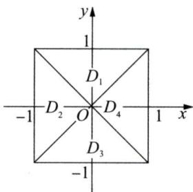

# 2009年数学(一）真题解析

# 一、选择题

（1）【答案】 （A）.

【解】方法一 $g(x) = x^{2}\ln (1 - bx)\sim -bx^{3},$

$$
f (x) = x - \sin a x = (1 - a) x + \frac {a ^ {3}}{3 !} x ^ {3} + o \left(x ^ {3}\right),
$$

由 $f(x)\sim g(x)$ ，得 $a = 1,b = -\frac{1}{6}$ ，应选(A).

方法二 由 $\lim_{x\to 0}\frac{f(x)}{g(x)} = \lim_{x\to 0}\frac{x - \sin ax}{x^2\ln(1 - bx)} = -\frac{1}{b}\lim_{x\to 0}\frac{x - \sin ax}{x^3} = -\frac{1}{b}\lim_{x\to 0}\frac{1 - a\cos ax}{3x^2} = 1,$

得 $a = 1$

再由 $\lim_{x\to 0}\frac{f(x)}{g(x)} = -\frac{1}{b}\lim_{x\to 0}\frac{1 - \cos x}{3x^2} = -\frac{1}{6b} = 1$ ，得 $b = -\frac{1}{6}$ ，应选(A).

方法三 $g(x)\sim -bx^3$ ，显然 $a = 1$ ，且 $f(x) = x - \sin x\sim \frac{1}{6} x^3$

再由 $f(x)\sim g(x)$ 得 $b = -\frac{1}{6}$ ，应选(A).

（2）【答案】 （A）.

【解】 由 $I_{1} = \iint_{D_{1}}y\cos x\mathrm{d}x\mathrm{d}y = 2\int_{0}^{1}\cos x\mathrm{d}x\int_{x}^{1}y\mathrm{d}y$

$$
= \int_ {0} ^ {1} (1 - x ^ {2}) \cos x \mathrm {d} x > 0,
$$

$$
\begin{array}{l} I _ {2} = \iint_ {D _ {2}} y \cos x \mathrm {d} x \mathrm {d} y = 0, \\ I _ {3} = \iint_ {D _ {3}} y \cos x d x d y = 2 \int_ {0} ^ {1} \cos x d x \int_ {- 1} ^ {- x} y d y = \int_ {0} ^ {1} (x ^ {2} - 1) \cos x d x <   0, \\ I _ {4} = \iint_ {D _ {4}} y \cos x \mathrm {d} x \mathrm {d} y = 0 \text {, 应 选 (A)}. \\ \end{array}
$$

  
一（2）题图

方法点评：二重积分的对称性是考查的一个重点，关于对称性有：

（1）设 $D$ 关于 $y$ 轴对称，位于 $y$ 轴右侧的部分为 $D_{1}$ ，则

当 $f(-x,y) = -f(x,y)$ 时 $\iint_{D} f(x,y) \, \mathrm{d}\sigma = 0$ ;

当 $f(-x,y) = f(x,y)$ 时 $\iint_{D}f(x,y)\mathrm{d}\sigma = 2\iint_{D_1}f(x,y)\mathrm{d}\sigma .$

（2）设 $D$ 关于 $\mathcal{X}$ 轴对称，位于 $\mathcal{X}$ 轴上侧的部分为 $D_{1}$ ，则

当 $f(x, -y) = -f(x, y)$ 时 $\iint_{D} f(x, y) \mathrm{d}\sigma = 0$ ;

当 $f(x, -y) = f(x, y)$ 时 $\iint_{D} f(x, y) \mathrm{d}\sigma = 2\iint_{D_1} f(x, y) \mathrm{d}\sigma.$

(3) 当 $D$ 关于 $y = x$ 对称时, $\iint_{D} f(x, y) \, \mathrm{d}x \, \mathrm{d}y = \iint_{D} f(y, x) \, \mathrm{d}x \, \mathrm{d}y$ .

（3）【答案】 (D).

【解】当 $-1\leqslant x <   0$ 时， $f(x) = 1$ ，则 $F(x) = \int_0^x f(t)\mathrm{d}t = x$ ，排除（A），（C）；

因为 $f(x)$ 在 $[-1,3]$ 上只有两个第一类间断点，所以 $F(x)$ 为连续函数，排除(B)，应选(D).

方法点评：本题考查定积分的几何意义、变积分限的函数与可积. 这类问题需要注意如下几点：

(1) 若 $f(x)$ 连续, 则 $F(x) = \int_{a}^{x} f(t) \mathrm{d}t$ 可导;

(2) 若 $f(x)$ 只有有限个第一类间断点, 则 $f(x)$ 可积, 且 $F(x) = \int_{a}^{x} f(t) \mathrm{d}t$ 连续, 在 $f(x)$ 的第一类间断点处 $F(x)$ 不可导.

（4）【答案】 (C).

【解】方法一 因为 $\lim_{n\to \infty}a_n = 0$ ，所以存在 $M > 0$ ，使得 $\left|a_{n}\right|\leqslant M$ ；由级数 $\sum_{n = 1}^{\infty}\left|b_n\right|$ 收敛得 $\lim_{n\to \infty}|b_n| = 0$

由极限的定义，对 $\varepsilon = 1$ ，存在 $N > 0$ ，当 $n > N$ 时， $|b_n| < 1$ ，从而 $b_n^2 \leqslant |b_n|$ ，于是当 $n > N$ 时， $a_n^2 b_n^2 \leqslant M^2 |b_n|$

因为 $\sum_{n=1}^{\infty} M^{2} |b_{n}|$ 收敛，所以由正项级数比较审敛法得 $\sum_{n=1}^{\infty} a_{n}^{2} b_{n}^{2}$ 收敛，应选(C).

方法二 取 $a_{n} = \frac{(-1)^{n}}{\sqrt{n}}, b_{n} = \frac{(-1)^{n}}{\sqrt{n}}$ 显然 $\lim_{n\to \infty}a_n = 0$ 且级数 $\sum_{n = 1}^{\infty}b_n$ 收敛，但 $\sum_{n = 1}^{\infty}a_nb_n = \sum_{n = 1}^{\infty}\frac{1}{n}$ 发散，排除（A）；

取 $a_{n} = \frac{1}{n}, b_{n} = \frac{1}{n}$ ，显然 $\lim_{n\to \infty}a_n = 0$ 且 $\sum_{n = 1}^{\infty}b_n$ 发散，但 $\sum_{n = 1}^{\infty}a_nb_n = \sum_{n = 1}^{\infty}\frac{1}{n^2}$ 收敛，排除(B)；

取 $a_{n} = \frac{1}{\sqrt{n}}, b_{n} = \frac{1}{\sqrt{n}}$ ，显然 $\lim_{n \to \infty} a_{n} = 0$ 且 $\sum_{n=1}^{\infty} b_{n}$ 发散，但 $\sum_{n=1}^{\infty} a_{n}^{2} b_{n}^{2} = \sum_{n=1}^{\infty} \frac{1}{n^{2}}$ 收敛，排除(D)，应选(C).

（5）【答案】 (A).

【解】 令 $\mathbf{A} = (\pmb{\alpha}_1, \pmb{\alpha}_2, \pmb{\alpha}_3)$ ，

由 $\left(\pmb{\alpha}_{1},\frac{1}{2}\pmb{\alpha}_{2},\frac{1}{3}\pmb{\alpha}_{3}\right) = \pmb{A}\left[ \begin{array}{ccc}1 & 0 & 0\\ 0 & \frac{1}{2} & 0\\ 0 & 0 & \frac{1}{3} \end{array} \right]$ 得 $A = \left(\pmb {\alpha}_1,\frac{1}{2}\pmb {\alpha}_2,\frac{1}{3}\pmb {\alpha}_3\right)\left( \begin{array}{ccc}1 & 0 & 0\\ 0 & 2 & 0\\ 0 & 0 & 3 \end{array} \right),$

又由 $(\pmb{\alpha}_{1} + \pmb{\alpha}_{2}, \pmb{\alpha}_{2} + \pmb{\alpha}_{3}, \pmb{\alpha}_{3} + \pmb{\alpha}_{1}) = \mathbf{A}\left( \begin{array}{lll} 1 & 0 & 1 \\ 1 & 1 & 0 \\ 0 & 1 & 1 \end{array} \right)$ ，得

$$
\begin{array}{l} \left(\boldsymbol {\alpha} _ {1} + \boldsymbol {\alpha} _ {2}, \boldsymbol {\alpha} _ {2} + \boldsymbol {\alpha} _ {3}, \boldsymbol {\alpha} _ {3} + \boldsymbol {\alpha} _ {1}\right) = \left(\boldsymbol {\alpha} _ {1}, \frac {1}{2} \boldsymbol {\alpha} _ {2}, \frac {1}{3} \boldsymbol {\alpha} _ {3}\right) \left( \begin{array}{l l l} 1 & 0 & 0 \\ 0 & 2 & 0 \\ 0 & 0 & 3 \end{array} \right) \left( \begin{array}{l l l} 1 & 0 & 1 \\ 1 & 1 & 0 \\ 0 & 1 & 1 \end{array} \right) \\ = \left(\boldsymbol {\alpha} _ {1}, \frac {1}{2} \boldsymbol {\alpha} _ {2}, \frac {1}{3} \boldsymbol {\alpha} _ {3}\right) \left( \begin{array}{l l l} 1 & 0 & 1 \\ 2 & 2 & 0 \\ 0 & 3 & 3 \end{array} \right), \\ \end{array}
$$

即从 $\pmb{\alpha}_{1},\frac{1}{2}\pmb{\alpha}_{2},\frac{1}{3}\pmb{\alpha}_{3}$ 到 $\pmb{\alpha}_{1} + \pmb{\alpha}_{2},\pmb{\alpha}_{2} + \pmb{\alpha}_{3},\pmb{\alpha}_{3} + \pmb{\alpha}_{1}$ 的过渡矩阵为 $\begin{pmatrix} 1 & 0 & 1 \\ 2 & 2 & 0 \\ 0 & 3 & 3 \end{pmatrix}$ ，应选(A).

方法点评：本题考查向量空间两组基之间的过渡矩阵. $n$ 维向量空间有如下三个概念是数学一考生需要掌握的内容：

设 $\mathbf{R}^n$ 为 $n$ 维向量空间，则

（1）设 $\alpha_{1},\alpha_{2},\dots ,\alpha_{n}$ 为 $n$ 个 $n$ 维线性无关的向量组，称 $\pmb{\alpha}_{1},\pmb{\alpha}_{2},\dots ,\pmb{\alpha}_{n}$ 为 $\mathbf{R}^n$ 的一组基；  
（2）设 $\alpha_{1},\alpha_{2},\dots ,\alpha_{n}$ 与 $\beta_{1},\beta_{2},\dots ,\beta_{n}$ 为 $\mathbf{R}^n$ 的两组基，若 $(\pmb {\beta}_1,\pmb {\beta}_2,\dots ,\pmb {\beta}_n) = (\pmb {\alpha}_1,\pmb {\alpha}_2,\dots ,\pmb {\alpha}_n)\pmb {Q}$ 则称矩阵 $Q$ 为从基 $\alpha_{1},\alpha_{2},\dots ,\alpha_{n}$ 到基 $\beta_1,\beta_2,\dots ,\beta_n$ 的过渡矩阵；  
（3）设 $\alpha_{1},\alpha_{2},\dots ,\alpha_{n}$ 为 $\mathbf{R}^n$ 的一组基， $\pmb {\alpha}\in \mathbb{R}^{n}$ ，若 $\pmb {\alpha} = a_{1}\pmb{\alpha}_{1} + a_{2}\pmb{\alpha}_{2} + \dots +a_{n}\pmb{\alpha}_{n}$ ，称 $\{a_1,a_2,\dots ,a_n\}$ 为向量 $\pmb{\alpha}$ 在基 $\alpha_{1},\alpha_{2},\dots ,\alpha_{n}$ 下的坐标.

（6）【答案】 (B).

【解】 $\left| \begin{array}{ll}O & A\\ B & O \end{array} \right| = (-1)^{2\times 2}\left|A\right|\cdot \left|B\right| = 6$ ，则

$$
\left( \begin{array}{l l} \mathbf {O} & \mathbf {A} \\ \mathbf {B} & \mathbf {O} \end{array} \right) ^ {*} = \left| \begin{array}{l l} \mathbf {O} & \mathbf {A} \\ \mathbf {B} & \mathbf {O} \end{array} \right| \left( \begin{array}{l l} \mathbf {O} & \mathbf {A} \\ \mathbf {B} & \mathbf {O} \end{array} \right) ^ {- 1} = 6 \left( \begin{array}{l l} \mathbf {O} & \mathbf {B} ^ {- 1} \\ \mathbf {A} ^ {- 1} & \mathbf {O} \end{array} \right) = \left( \begin{array}{l l} \mathbf {O} & 6 \mathbf {B} ^ {- 1} \\ 6 \mathbf {A} ^ {- 1} & \mathbf {O} \end{array} \right) = \left( \begin{array}{l l} \mathbf {O} & 2 \mathbf {B} ^ {*} \\ 3 \mathbf {A} ^ {*} & \mathbf {O} \end{array} \right),
$$

应选(B).

方法点评：本题需要熟练掌握如下知识点：

（1）设 $\mathbf{A},\mathbf{B}$ 分别为 $m$ 阶和 $n$ 阶矩阵，则 $\left| \begin{array}{ll}\mathbf{O} & \mathbf{A}\\ \mathbf{B} & \mathbf{O} \end{array} \right| = (-1)^{mn}\left|\mathbf{A}\right|\cdot \left|\mathbf{B}\right|$   
（2）设 $\mathbf{A}$ 可逆，则 $A^{*} = |A|A^{-1}$   
(3) $\left( \begin{array}{ll} \mathbf{O} & \mathbf{A} \\ \mathbf{B} & \mathbf{O} \end{array} \right)^{-1} = \left( \begin{array}{ll} \mathbf{O} & \mathbf{B}^{-1} \\ \mathbf{A}^{-1} & \mathbf{O} \end{array} \right)$ .

更一般地有：设 $\mathbf{A},\mathbf{B}$ 为 $m,n$ 阶可逆矩阵，且 $|\mathbf{A}| = a,|\mathbf{B}| = b$ ，则

$$
\begin{array}{l} \left( \begin{array}{c c} \mathbf {A} & \mathbf {O} \\ \mathbf {O} & \mathbf {B} \end{array} \right) ^ {*} = \left| \begin{array}{c c} \mathbf {A} & \mathbf {O} \\ \mathbf {O} & \mathbf {B} \end{array} \right| \left( \begin{array}{c c} \mathbf {A} & \mathbf {O} \\ \mathbf {O} & \mathbf {B} \end{array} \right) ^ {- 1} = a b \left( \begin{array}{c c} \mathbf {A} ^ {- 1} & \mathbf {O} \\ \mathbf {O} & \mathbf {B} ^ {- 1} \end{array} \right) = \left( \begin{array}{c c} a b \mathbf {A} ^ {- 1} & \mathbf {O} \\ \mathbf {O} & a b \mathbf {B} ^ {- 1} \end{array} \right) = \left( \begin{array}{c c} b \mathbf {A} ^ {*} & \mathbf {O} \\ \mathbf {O} & a \mathbf {B} ^ {*} \end{array} \right); \\ \left( \begin{array}{c c} \mathbf {O} & \mathbf {A} \\ \mathbf {B} & \mathbf {O} \end{array} \right) ^ {*} = \left| \begin{array}{c c} \mathbf {O} & \mathbf {A} \\ \mathbf {B} & \mathbf {O} \end{array} \right| \left( \begin{array}{c c} \mathbf {O} & \mathbf {A} \\ \mathbf {B} & \mathbf {O} \end{array} \right) ^ {- 1} = (- 1) ^ {m n} a b \left( \begin{array}{c c} \mathbf {O} & \mathbf {B} ^ {- 1} \\ \mathbf {A} ^ {- 1} & \mathbf {O} \end{array} \right) = (- 1) ^ {m n} \left( \begin{array}{c c} \mathbf {O} & a \mathbf {B} ^ {*} \\ b \mathbf {A} ^ {*} & \mathbf {O} \end{array} \right). \\ \end{array}
$$

（7）【答案】 (C).

【解】 $f(x) = 0.3\varphi (x) + 0.35\varphi \left(\frac{x - 1}{2}\right),$

$$
\begin{array}{l} E (X) = 0. 3 \int_ {- \infty} ^ {+ \infty} x \varphi (x) d x + 0. 3 5 \int_ {- \infty} ^ {+ \infty} x \varphi \left(\frac {x - 1}{2}\right) d x = 1. 4 \int_ {- \infty} ^ {+ \infty} \frac {(x - 1) + 1}{2} \varphi \left(\frac {x - 1}{2}\right) d \left(\frac {x - 1}{2}\right) \\ = 1. 4 \int_ {- \infty} ^ {+ \infty} \frac {x - 1}{2} \varphi \left(\frac {x - 1}{2}\right) d \left(\frac {x - 1}{2}\right) + 0. 7 \int_ {- \infty} ^ {+ \infty} \varphi \left(\frac {x - 1}{2}\right) d \left(\frac {x - 1}{2}\right) \\ = 1. 4 \int_ {- \infty} ^ {+ \infty} x \varphi (x) d x + 0. 7 \int_ {- \infty} ^ {+ \infty} \varphi (x) d x = 0. 7, \\ \end{array}
$$

应选(C).

(8)【答案】 (B).

【解】 $F_{Z}(z) = P\{Z \leqslant z\} = P\{XY \leqslant z\}$

$$
\begin{array}{l} = P \{Y = 0 \} P \{X Y \leqslant z \mid Y = 0 \} + P \{Y = 1 \} P \{X Y \leqslant z \mid Y = 1 \} \\ = P \{Y = 0 \} P \{z \geqslant 0 \} + P \{Y = 1 \} P \{X \leqslant z \} = \frac {1}{2} P \{z \geqslant 0 \} + \frac {1}{2} P \{X \leqslant z \}, \\ \end{array}
$$

当 $z < 0$ 时， $F_{Z}(z) = \frac{1}{2}\Phi(z)$

当 $z \geqslant 0$ 时， $F_{Z}(z) = \frac{1}{2} + \frac{1}{2}\Phi(z)$ ，

即 $F_{Z}(z) = \left\{ \begin{array}{ll} \frac{1}{2}\Phi (z), & z < 0,\\ \frac{1}{2} +\frac{1}{2}\Phi (z), & z\geqslant 0, \end{array} \right.$ 显然 $F_{Z}(z)$ 只有一个间断点，应选(B).

方法点评：设 $(X,Y)$ 为二维随机变量，其中 $X$ 为连续型随机变量， $Y$ 为非连续型随机变量， $Z = \varphi(X,Y)$ 为二维随机变量 $(X,Y)$ 的函数，求 $Z = \varphi(X,Y)$ 的分布函数时，一定要根据 $Y$ 形成的完备组使用全概率公式.

# 二、填空题

(9)【答案】 $x f_{12}^{\prime \prime} + f_{2}^{\prime} + x y f_{22}^{\prime \prime}$ .

【解】方法一 由 $\frac{\partial z}{\partial x} = f_1' + yf_2'$ ，得 $\frac{\partial^2z}{\partial x\partial y} = xf_{12}'' + f_2' + xyf_{22}''$

方法二 $z = f(x,xy)$ 两边求微分，得

$$
\mathrm {d} z = f _ {1} ^ {\prime} \mathrm {d} x + f _ {2} ^ {\prime} \mathrm {d} (x y) = f _ {1} ^ {\prime} \mathrm {d} x + f _ {2} ^ {\prime} (y \mathrm {d} x + x \mathrm {d} y) = \left(f _ {1} ^ {\prime} + y f _ {2} ^ {\prime}\right) \mathrm {d} x + x f _ {2} ^ {\prime} \mathrm {d} y,
$$

于是 $\frac{\partial z}{\partial x} = f_1' + yf_2'$ ，故 $\frac{\partial^2z}{\partial x\partial y} = xf_{12}'' + f_2' + xyf_{22}''$

(10)【答案】 $x\left(1 - \mathrm{e}^{x}\right) + 2.$

【解】因为 $y^{\prime \prime} + ay^{\prime} + by = 0$ 的通解为 $y = (C_1 + C_2x)\mathrm{e}^x$ ，所以特征方程为 $\lambda^2 +a\lambda +b = 0$ 特征值为 $\lambda_{1} = \lambda_{2} = 1$ ，于是 $a = -(\lambda_1 + \lambda_2) = -2$ ， $b = \lambda_{1}\lambda_{2} = 1$

显然微分方程 $y^{\prime \prime} - 2y^{\prime} + y = x$ 的一个特解为 $y_0 = x + 2$ ，其通解为

$$
y = \left(C _ {1} + C _ {2} x\right) \mathrm {e} ^ {x} + x + 2,
$$

由 $y(0) = 2, y'(0) = 0$ ，得 $C_1 = 0, C_2 = -1$ ，故满足条件的特解为 $y = x(1 - \mathrm{e}^x) + 2.$

(11)【答案】 $\frac{13}{6}$ .

【解】 由 $\mathrm{ds} = \sqrt{1 + y^{\prime 2}}\mathrm{dx} = \sqrt{1 + 4x^2}\mathrm{dx}$ ，得

$$
\int_ {L} x \mathrm {d} s = \int_ {0} ^ {\sqrt {2}} x \sqrt {1 + 4 x ^ {2}} \mathrm {d} x = \frac {1}{8} \int_ {0} ^ {\sqrt {2}} (1 + 4 x ^ {2}) ^ {\frac {1}{2}} \mathrm {d} (1 + 4 x ^ {2}) = \frac {1}{1 2} (1 + 4 x ^ {2}) ^ {\frac {3}{2}} \Bigg | _ {0} ^ {\sqrt {2}} = \frac {1 3}{6}.
$$

(12)【答案】 $\frac{4}{15}\pi$ .

【解】方法一 由对称性，得 $\iiint_{\Omega} z^2 \, \mathrm{d}x \, \mathrm{d}y \, \mathrm{d}z = \iiint_{\Omega} x^2 \, \mathrm{d}x \, \mathrm{d}y \, \mathrm{d}z = \iiint_{\Omega} y^2 \, \mathrm{d}x \, \mathrm{d}y \, \mathrm{d}z$

于是 $\iiint_{\Omega} z^2 \, \mathrm{d}x \, \mathrm{d}y \, \mathrm{d}z = \frac{1}{3} \iiint_{\Omega} (x^2 + y^2 + z^2) \, \mathrm{d}x \, \mathrm{d}y \, \mathrm{d}z$

$$
= \frac {1}{3} \int_ {0} ^ {2 \pi} \mathrm {d} \theta \int_ {0} ^ {\pi} \mathrm {d} \varphi \int_ {0} ^ {1} r ^ {4} \sin \varphi \mathrm {d} r = \frac {2 \pi}{1 5} \int_ {0} ^ {\pi} \sin \varphi \mathrm {d} \varphi = \frac {4 \pi}{1 5} \int_ {0} ^ {\frac {\pi}{2}} \sin \varphi \mathrm {d} \varphi = \frac {4 \pi}{1 5}.
$$

方法二 $\Omega = \{(x,y,z) \mid (x,y) \in D_z, -1 \leqslant z \leqslant 1\}$ ，其中 $D_z: x^2 + y^2 \leqslant 1 - z^2$

则 $\iiint_{\Omega} z^2 \, \mathrm{d}x \, \mathrm{d}y \, \mathrm{d}z = \int_{-1}^{1} z^2 \, \mathrm{d}z \iint_{D_z} \, \mathrm{d}x \, \mathrm{d}y = \pi \int_{-1}^{1} z^2 (1 - z^2) \, \mathrm{d}z$

$$
= 2 \pi \int_ {0} ^ {1} \left(z ^ {2} - z ^ {4}\right) d z = 2 \pi \left(\frac {1}{3} - \frac {1}{5}\right) = \frac {4 \pi}{1 5}.
$$

方法点评：本题考查三重积分的对称性与三重积分的球面坐标法.

三重积分计算过程中需要注意使用对称性，具体对称性质为：

（1）若 $\Omega$ 关于 $xOy$ 面对称，且位于 $xOy$ 面上方的部分为 $\Omega_{1}$

若 $f(x,y, - z) = -f(x,y,z)$ ，则 $\iiint_{\Omega}f(x,y,z)\mathrm{d}v = 0;$

若 $f(x,y, - z) = f(x,y,z)$ ，则 $\iiint_{\Omega}f(x,y,z)\mathrm{d}v = 2\iiint_{\Omega_1}f(x,y,z)\mathrm{d}v.$

关于其他几个平面对称有同样的结论.

(2) 若 $\Omega$ 关于三个坐标面都对称, 则有 $\iiint_{\Omega} x^2 \mathrm{d}v = \iiint_{\Omega} y^2 \mathrm{d}v = \iiint_{\Omega} z^2 \mathrm{d}v.$

(13)【答案】2.

【解】 令 $A = \pmb{\beta}\pmb{\alpha}^{\mathrm{T}}$ ，则 $A^2 = \pmb {\beta}\pmb{\alpha}^{\mathrm{T}}\cdot \pmb {\beta}\pmb{\alpha}^{\mathrm{T}} = 2\pmb {\beta}\pmb{\alpha}^{\mathrm{T}} = 2\pmb{A}$

令 $AX = \lambda X(X\neq 0)$ ，由 $A^2 = 2A$ ，得 $\lambda^2 X = 2\lambda X$ 或 $(\lambda^2 -2\lambda)\pmb {X} = \mathbf{0}$

因为 $X \neq 0$ ，所以 $\lambda^2 - 2\lambda = 0$ ，故 $\pmb{\beta} \pmb{\alpha}^{\mathrm{T}}$ 的非零特征值为2.

方法点评：设 $\pmb{\alpha} = \begin{bmatrix} a_1 \\ a_2 \\ \vdots \\ a_n \end{bmatrix}$ ， $\pmb{\beta} = \begin{bmatrix} b_1 \\ b_2 \\ \vdots \\ b_n \end{bmatrix}$ ，且 $(\pmb{\alpha}, \pmb{\beta}) = k (\neq 0)$ 。

若 $\mathbf{A} = \pmb{\alpha}\pmb{\beta}^{\mathrm{T}} = \begin{bmatrix} a_{1}b_{1} & a_{1}b_{2} & \dots & a_{1}b_{n}\\ a_{2}b_{1} & a_{2}b_{2} & \dots & a_{2}b_{n}\\ \vdots & \vdots & & \vdots \\ a_{n}b_{1} & a_{n}b_{2} & \dots & a_{n}b_{n} \end{bmatrix}$ ，设 $\mathbf{A}$ 的特征值为 $\lambda_1,\lambda_2,\dots ,\lambda_n$ ，则有：

(1) $\mathbf{A}$ 的特征值只能是0与 $k$   
（2）因为 $\lambda_1 + \lambda_2 + \dots +\lambda_n = \operatorname {tr}\mathbf{A} = (\pmb {\alpha},\pmb {\beta}) = k$ ，所以 $\lambda_{1} = \lambda_{2} = \dots = \lambda_{n - 1} = 0,\lambda_{n} = k.$

（14）【答案】 -1.

【解】因为 $X_{i}\sim B(n,p)(i = 1,2,\dots ,m)$ ，所以

$$
E (\bar {X}) = E \left(X _ {1}\right) = n p, \quad E \left(S ^ {2}\right) = D \left(X _ {1}\right) = n p (1 - p),
$$

于是 $E(\overline{X} + kS^2) = np + knp(1 - p)$ .

因为 $\overline{X} + kS^2$ 为 $np^2$ 的无偏估计量，所以 $np + knp(1 - p) = np^2$ ，故 $k = -1$ .

# 三、解答题

(15)【解】 $f_{x}^{\prime}(x,y) = 2x(2 + y^{2})$ ， $f_{y}^{\prime}(x,y) = 2x^{2}y + \ln y + 1.$

令 $\left\{ \begin{array}{l} f_{x}^{\prime}(x, y) = 2x(2 + y^{2}) = 0, \\ f_{y}^{\prime}(x, y) = 2x^{2}y + \ln y + 1 = 0, \end{array} \right.$ 解得唯一驻点 $\left(0, \frac{1}{\mathrm{e}}\right)$ .

因为 $A = f_{xx}^{\prime \prime}\left(0,\frac{1}{\mathrm{e}}\right) = 2(2 + y^{2})\Bigg|_{(0,\frac{1}{e})} = 2\left(2 + \frac{1}{\mathrm{e}^{2}}\right),$

$$
B = f _ {x y} ^ {\prime \prime} \left(0, \frac {1}{\mathrm {e}}\right) = 4 x y \Big | _ {(0, \frac {1}{\mathrm {e}})} = 0, \quad C = f _ {y y} ^ {\prime \prime} \left(0, \frac {1}{\mathrm {e}}\right) = \left(2 x ^ {2} + \frac {1}{y}\right) \Big | _ {(0, \frac {1}{\mathrm {e}})} = \mathrm {e},
$$

所以 $B^{2} - AC = -2\mathrm{e}\left(2 + \frac{1}{\mathrm{e}^{2}}\right) < 0$ ，又 $A > 0$ ，于是 $\left(0, \frac{1}{\mathrm{e}}\right)$ 是 $f(x, y)$ 的极小值点，极小值为 $f\left(0, \frac{1}{\mathrm{e}}\right) = -\frac{1}{\mathrm{e}}$ .

方法点评：本题需要熟练掌握二元函数无条件极值步骤：

（1）确定二元函数 $f(x,y)$ 的定义域 $D$ （开区域）；  
（2）由 $\left\{ \begin{array}{l} \frac{\partial f}{\partial x} = 0, \\ \frac{\partial f}{\partial y} = 0, \end{array} \right.$ 求出函数 $f(x,y)$ 的驻点；  
(3) 若 $(x_0, y_0)$ 为一个驻点，求出 $A = f_{xx}^{\prime \prime}(x_0, y_0), B = f_{xy}^{\prime \prime}(x_0, y_0), C = f_{yy}^{\prime \prime}(x_0, y_0)$ ，

当 $AC - B^2 > 0$ 时， $(x_0, y_0)$ 为 $f(x, y)$ 的极值点，其中当 $A > 0$ 时， $(x_0, y_0)$ 为极小值点；当 $A < 0$ 时， $(x_0, y_0)$ 为极大值点.

当 $AC - B^2 < 0$ 时， $(x_0,y_0)$ 不是极值点.

(16)【解】由 $\left\{ \begin{array}{l} y = x^n, \\ y = x^{n+1} \end{array} \right.$ 得曲线 $y = x^n$ 与 $y = x^{n+1}$ 的交点为 $(0,0)$ 与 $(1,1)$ ,

由题意得 $a_{n} = \int_{0}^{1}(x^{n} - x^{n + 1})\mathrm{d}x = \frac{1}{n + 1} -\frac{1}{n + 2}.$

$$
S _ {1} = \sum_ {n = 1} ^ {\infty} a _ {n} = \sum_ {n = 1} ^ {\infty} \left(\frac {1}{n + 1} - \frac {1}{n + 2}\right),
$$

其部分和为 $S_{n}^{(1)} = \left(\frac{1}{2} -\frac{1}{3}\right) + \left(\frac{1}{3} -\frac{1}{4}\right) + \dots +\left(\frac{1}{n + 1} -\frac{1}{n + 2}\right) = \frac{1}{2} -\frac{1}{n + 2},$

由 $\lim_{n\to \infty}S_n^{(1)} = \frac{1}{2}$ 得 $S_{1} = \frac{1}{2}$

$$
S _ {2} = \sum_ {n = 1} ^ {\infty} a _ {2 n - 1} = \sum_ {n = 1} ^ {\infty} \left(\frac {1}{2 n} - \frac {1}{2 n + 1}\right) = 1 + \sum_ {n = 1} ^ {\infty} \frac {(- 1) ^ {n}}{n},
$$

令 $S(x) = \sum_{n=1}^{\infty} \frac{(-1)^n}{n} x^n$ ，则

$$
S (x) = \sum_ {n = 1} ^ {\infty} \frac {(- x) ^ {n}}{n} = - \ln [ 1 - (- x) ] = - \ln (1 + x) (- 1 <   x \leqslant 1),
$$

故 $S_{2} = 1 + S(1) = 1 - \ln 2$

方法点评：本题需要熟练掌握微分与积分的几何应用及应用幂级数的和求常数项级数的和的方法.

（17）【解】（I）方法一 椭球面 $S_{1}$ 的方程为 $\frac{x^2}{4} +\frac{y^2 + z^2}{3} = 1.$

设切点为 $(x_0, y_0)$ ，则 $\frac{x^2}{4} + \frac{y^2}{3} = 1$ 在 $(x_0, y_0)$ 处的切线方程为 $\frac{x_0x}{4} + \frac{y_0y}{3} = 1$ .

将 $x = 4, y = 0$ 代入切线方程得 $x_0 = 1$ ，从而 $y_0 = \pm \frac{\sqrt{3}}{2}\sqrt{4 - x_0^2} = \pm \frac{3}{2}$ .

所以切线方程为 $\frac{x}{4} \pm \frac{y}{2} = 1$ ，从而圆锥面 $S_{2}$ 的方程为 $\left(\frac{x}{4} - 1\right)^{2} = \frac{y^{2} + z^{2}}{4}$ ，即

$$
(x - 4) ^ {2} - 4 y ^ {2} - 4 z ^ {2} = 0.
$$

方法二 椭球面 $S_{1}$ 的方程为 $S_{1}:\frac{x^{2}}{4} +\frac{y^{2}}{3} +\frac{z^{2}}{3} = 1.$

从点（4，0）作椭圆 $\frac{x^2}{4} +\frac{y^2}{3} = 1$ 的切线，并设切点为 $(a,b)$

$\frac{x^2}{4} + \frac{y^2}{3} = 1$ 两边对 $x$ 求导得 $\frac{x}{2} + \frac{2y}{3} \cdot \frac{\mathrm{d}y}{\mathrm{d}x} = 0$ ，解得 $\frac{\mathrm{d}y}{\mathrm{d}x} = -\frac{3x}{4y}$

切线的斜率为 $k = -\frac{3a}{4b}$ 又 $k = \frac{b - 0}{a - 4}$

由 $\left\{ \begin{array}{l} \frac{a^2}{4} + \frac{b^2}{3} = 1, \\ -\frac{3a}{4b} = \frac{b - 0}{a - 4} \end{array} \right.$ 得 $a = 1, b = \pm \frac{3}{2}$ , 从而 $k = \pm \frac{1}{2}$ , 切线方程为 $y = \pm \frac{1}{2}(x - 4)$ ,

圆锥面 $S_{2}$ 的方程为 $S_{2}:y^{2} + z^{2} = \frac{1}{4} (x - 4)^{2}$ ，或 $(x - 4)^{2} = 4y^{2} + 4z^{2}$

（Ⅱ）方法一 $S_{1}$ 与 $S_{2}$ 之间的体积等于一个底面半径为 $\frac{3}{2}$ ，高为3的锥体体积 $\frac{9}{4}\pi$ 与部分椭球体体积 $V$ 之差，其中 $V = \frac{3\pi}{4}\int_{1}^{2}(4 - x^2)\mathrm{d}x = \frac{5}{4}\pi$ ，故所求体积为 $\frac{9}{4}\pi -\frac{5}{4}\pi = \pi$

方法二 所求的体积为 $V = V_{1} - V_{2}$

其中 $V_{1} = \pi \int_{1}^{4}\frac{1}{4} (x - 4)^{2}\mathrm{d}x = \frac{\pi}{12} (x - 4)^{3}\Bigg|_{1}^{4} = \frac{9\pi}{4},$

$$
V _ {2} = \pi \int_ {1} ^ {2} 3 \left(1 - \frac {x ^ {2}}{4}\right) d x = \frac {3 \pi}{4} \int_ {1} ^ {2} (4 - x ^ {2}) d x = \frac {5 \pi}{4},
$$

故 $V = \frac{9\pi}{4} -\frac{5\pi}{4} = \pi .$

方法点评：本题需要熟练掌握空间解析几何的方法及定积分的几何应用.

(18)【证明】（I）令 $\varphi (x) = f(x) - f(a) - \frac{f(b) - f(a)}{b - a} (x - a)$ ，显然 $\varphi (x)$ 在 $[a,b]$ 上连续，在 $(a,b)$ 内可导.

又 $\varphi(a) = \varphi(b) = 0$ ，所以由罗尔定理，存在 $\xi \in (a, b)$ ，使得 $\varphi'(\xi) = 0$

而 $\varphi^{\prime}(x) = f^{\prime}(x) - \frac{f(b) - f(a)}{b - a}$ ，所以 $f^{\prime}(\xi) - \frac{f(b) - f(a)}{b - a} = 0$ ，即

$$
f (b) - f (a) = f ^ {\prime} (\xi) (b - a).
$$

（Ⅱ）取 $x\in (0,\delta)$ ，因为 $f(x)$ 在 $[0,\delta ]$ 上连续，在 $(0,\delta)$ 内可导，所以由拉格朗日中值定理，存在 $\xi \in (0,x)$ ，使得 $f(x) - f(0) = f^{\prime}(\xi)x$ ，即 $\frac{f(x) - f(0)}{x} = f^{\prime}(\xi)$ ，两边取极限得

$$
\lim  _ {x \rightarrow 0 ^ {+}} \frac {f (x) - f (0)}{x} = \lim  _ {x \rightarrow 0 ^ {+}} f ^ {\prime} (\xi).
$$

因为 $\lim_{x\to 0^{+}}f^{\prime}(x) = A$ ，所以 $\lim_{x\to 0^{+}}f^{\prime}(\xi) = \lim_{\xi \to 0^{+}}f^{\prime}(\xi) = A.$

于是 $\lim_{x\to 0^{+}}\frac{f(x) - f(0)}{x} = \lim_{x\to 0^{+}}f^{\prime}(\xi) = A$ ，即 $f_{+}^{\prime}(0) = A$

(19)【解】 $P = \frac{x}{\left(x^{2} + y^{2} + z^{2}\right)^{\frac{3}{2}}},\quad Q = \frac{y}{\left(x^{2} + y^{2} + z^{2}\right)^{\frac{3}{2}}},\quad R = \frac{z}{\left(x^{2} + y^{2} + z^{2}\right)^{\frac{3}{2}}},$

$$
\frac {\partial P}{\partial x} = \frac {(x ^ {2} + y ^ {2} + z ^ {2}) ^ {\frac {3}{2}} - x \cdot \frac {3}{2} (x ^ {2} + y ^ {2} + z ^ {2}) ^ {\frac {1}{2}} \cdot 2 x}{(x ^ {2} + y ^ {2} + z ^ {2}) ^ {3}} = \frac {y ^ {2} + z ^ {2} - 2 x ^ {2}}{(x ^ {2} + y ^ {2} + z ^ {2}) ^ {\frac {5}{2}}},
$$

$$
\frac {\partial Q}{\partial y} = \frac {x ^ {2} + z ^ {2} - 2 y ^ {2}}{\left(x ^ {2} + y ^ {2} + z ^ {2}\right) ^ {\frac {5}{2}}}, \quad \frac {\partial R}{\partial z} = \frac {x ^ {2} + y ^ {2} - 2 z ^ {2}}{\left(x ^ {2} + y ^ {2} + z ^ {2}\right) ^ {\frac {5}{2}}}.
$$

令 $\Sigma_0: x^2 + y^2 + z^2 = 1$ ，取外侧，且设 $\Sigma$ 与 $\Sigma_0^-$ 围成的区域为 $\Omega$ ，

由高斯公式得

$$
\iint_ {\Sigma + \Sigma_ {0} ^ {-}} \frac {x d y d z + y d z d x + z d x d y}{(x ^ {2} + y ^ {2} + z ^ {2}) ^ {\frac {3}{2}}} = \iiint_ {\Omega} \left(\frac {\partial P}{\partial x} + \frac {\partial Q}{\partial y} + \frac {\partial R}{\partial z}\right) d v = 0,
$$

故 $\iint_{\Sigma} \frac{x \, \mathrm{d}y \, \mathrm{d}z + y \, \mathrm{d}z \, \mathrm{d}x + z \, \mathrm{d}x \, \mathrm{d}y}{(x^2 + y^2 + z^2)^{\frac{3}{2}}} = \iint_{\Sigma_0} \frac{x \, \mathrm{d}y \, \mathrm{d}z + y \, \mathrm{d}z \, \mathrm{d}x + z \, \mathrm{d}x \, \mathrm{d}y}{(x^2 + y^2 + z^2)^{\frac{3}{2}}}$

$$
\begin{array}{l} = \iint_ {\Sigma_ {0}} x \mathrm {d} y \mathrm {d} z + y \mathrm {d} z \mathrm {d} x + z \mathrm {d} x \mathrm {d} y \\ = 3 \iiint_ {x ^ {2} + y ^ {2} + z ^ {2} \leqslant 1} \mathrm {d} v = 4 \pi . \\ \end{array}
$$

方法点评：计算对坐标的曲面积分时，先可以考虑有无项可以代替。若 $P, Q, R$ 连续可偏导，则可以考虑使用高斯公式，若曲面不封闭可以补充曲面。

(20)【角

(I) 由 $(\mathbf{A} \mid \pmb{\xi}_1) = \begin{pmatrix} 1 & -1 & -1 \\ -1 & 1 & 1 \\ 0 & -4 & -2 \end{pmatrix} \rightarrow \begin{bmatrix} 1 & -1 & -1 \\ 0 & 1 & \frac{1}{2} \\ 0 & 0 & 0 \end{bmatrix} \rightarrow \begin{bmatrix} 1 & 0 & -\frac{1}{2} \\ 0 & 1 & \frac{1}{2} \\ 0 & 0 & 0 \end{bmatrix}$

得 $\xi_{2} = k_{1}\left[ \begin{array}{c} \frac{1}{2}\\ -\frac{1}{2}\\ 1 \end{array} \right] + \left[ \begin{array}{c} - \frac{1}{2}\\ \frac{1}{2}\\ 0 \end{array} \right] = \left[ \begin{array}{c} \frac{1}{2} k_{1} - \frac{1}{2}\\ -\frac{1}{2} k_{1} + \frac{1}{2}\\ k_{1} \end{array} \right](k_{1}$ 为任意常数）.

$$
\boldsymbol {A} ^ {2} = \left( \begin{array}{c c c} 1 & - 1 & - 1 \\ - 1 & 1 & 1 \\ 0 & - 4 & - 2 \end{array} \right) \left( \begin{array}{c c c} 1 & - 1 & - 1 \\ - 1 & 1 & 1 \\ 0 & - 4 & - 2 \end{array} \right) = \left( \begin{array}{c c c} 2 & 2 & 0 \\ - 2 & - 2 & 0 \\ 4 & 4 & 0 \end{array} \right),
$$

由 $(A^2\mid \pmb {\xi}_1) = \left( \begin{array}{rrr}2 & 2 & 0\\ -2 & -2 & 0\\ 4 & 4 & 0 \end{array} \right)\rightarrow \left[ \begin{array}{rrr}1 & 1 & 0\\ 0 & 0 & 0\\ 0 & 0 & 0 \end{array} \right]$ 得

$\pmb{\xi}_{3} = k_{2}\binom{-1}{0} + k_{3}\binom{0}{1} + \left[ \begin{array}{c} - \frac{1}{2}\\ 0\\ 0 \end{array} \right] = \left[ \begin{array}{c} - k_{2} - \frac{1}{2}\\ k_{2}\\ k_{3} \end{array} \right](k_{2},k_{3}$ 为任意常数）.

（Ⅱ）方法一

由 $|\pmb{\xi}_1, \pmb{\xi}_2, \pmb{\xi}_3| = \left| \begin{array}{ccc} -1 & \frac{1}{2}k_1 - \frac{1}{2} & -k_2 - \frac{1}{2} \\ 1 & -\frac{1}{2}k_1 + \frac{1}{2} & k_2 \\ -2 & k_1 & k_3 \end{array} \right| = \left| \begin{array}{ccc} 0 & 0 & -\frac{1}{2} \\ 1 & -\frac{1}{2}k_1 + \frac{1}{2} & k_2 \\ -2 & k_1 & k_3 \end{array} \right|$

$$
= - \frac {1}{2} \neq 0,
$$

得 $\xi_{1},\xi_{2},\xi_{3}$ 线性无关.

方法二

设

$$
k _ {1} \xi_ {1} + k _ {2} \xi_ {2} + k _ {3} \xi_ {3} = 0 \tag {①}
$$

① 两边左乘 $\mathbf{A}$ 得 $k_{1} \mathbf{A} \pmb{\xi}_{1} + k_{2} \mathbf{A} \pmb{\xi}_{2} + k_{3} \mathbf{A} \pmb{\xi}_{3} = \mathbf{0}$ ，由 $\mathbf{A} \pmb{\xi}_{1} = \mathbf{0}$ 得

$$
k _ {2} \boldsymbol {\xi} _ {1} + k _ {3} \mathbf {A} \boldsymbol {\xi} _ {3} = \mathbf {0} \tag {②}
$$

② 两边左乘 $\mathbf{A}$ 得 $k_{3} \mathbf{A}^{2} \pmb{\xi}_{3} = \mathbf{0}$ ，即 $k_{3} \pmb{\xi}_{1} = \mathbf{0}$ .

由 $\xi_{1} \neq 0$ 得 $k_{3} = 0$ ，代入 ② 得 $k_{2} = 0$ ，再代入 ① 得 $k_{1} = 0$

故 $\xi_1, \xi_2, \xi_3$ 线性无关.

方法点评：本题第一问考查非齐次线性方程组，属于基础知识范畴.

第二问考查向量组的无关性，判断向量组线性相关性一般有如下重要思路：

（1）利用向量组相关性定义证明；

(2) 利用向量组相关性性质证明. 本题向量组的个数与向量组的维数相等, 则向量组线性无关的充分必要条件是该向量组构成的行列式不等于零.

(21)【解】（I）二次型的矩阵 $\mathbf{A} = \begin{pmatrix} a & 0 & 1 \\ 0 & a & -1 \\ 1 & -1 & a - 1 \end{pmatrix}$ ,

由 $|\lambda \pmb {E} - \pmb {A}| = \left| \begin{array}{ccc}\lambda -a & 0 & -1\\ 0 & \lambda -a & 1\\ -1 & 1 & \lambda -a + 1 \end{array} \right| = (\lambda -a)[\lambda -(a + 1)][\lambda -(a - 2)] = 0,$

得 $\mathbf{A}$ 的特征值为 $\lambda_1 = a, \lambda_2 = a + 1, \lambda_3 = a - 2$ .

（Ⅱ）方法一 由于 $f$ 的规范形为 $y_{1}^{2} + y_{2}^{2}$ ，所以 $\mathbf{A}$ 合同于 $\left( \begin{array}{lll}1 & 0 & 0\\ 0 & 1 & 0\\ 0 & 0 & 0 \end{array} \right)$ ，其秩为2，于是 $|\mathbf{A}| = \lambda_1\lambda_2\lambda_3 = 0$ ，故 $a = 0$ 或 $a = -1$ 或 $a = 2$

当 $a = 0$ 时， $\lambda_1 = 0,\lambda_2 = 1,\lambda_3 = -2$ ，此时 $f$ 的规范形为 $y_{1}^{2} - y_{2}^{2}$ ，不合题意；

当 $a = -1$ 时， $\lambda_1 = -1, \lambda_2 = 0, \lambda_3 = -3$ ，此时 $f$ 的规范形为 $-y_1^2 - y_2^2$ ，不合题意；

当 $a = 2$ 时， $\lambda_1 = 2,\lambda_2 = 3,\lambda_3 = 0$ ，此时 $f$ 的规范形为 $y_{1}^{2} + y_{2}^{2}$

综上可知， $a = 2$

方法二 由于 $f$ 的规范形为 $y_1^2 + y_2^2$ , 所以 $\mathbf{A}$ 的特征值有 2 个为正数, 1 个为零, 因为 $a - 2 < a < a + 1$ , 所以 $a = 2$ .

(22)【解】（I） $P\{X = 1 \mid Z = 0\} = \frac{P\{X = 1, Z = 0\}}{P\{Z = 0\}} = \frac{\frac{\mathrm{C}_2^1 \times \mathrm{C}_2^1}{6 \times 6}}{\left(\frac{1}{2}\right)^2} = \frac{4}{9}.$

（Ⅱ）由题意知 $(X,Y)$ 的可能取值为 $(0,0),(0,1),(0,2),(1,0),(1,1),(2,0),(2,1),(2,2)$ .

$$
P \{X = 0, Y = 0 \} = \frac {3 ^ {2}}{6 ^ {2}} = \frac {1}{4}, \quad P \{X = 0, Y = 1 \} = \frac {\mathrm {C} _ {2} ^ {1} \times \mathrm {C} _ {2} ^ {1} \times \mathrm {C} _ {3} ^ {1}}{6 ^ {2}} = \frac {1}{3},
$$

$$
P \{X = 0, Y = 2 \} = \frac {2 ^ {2}}{6 ^ {2}} = \frac {1}{9}, \quad P \{X = 1, Y = 0 \} = \frac {\mathrm {C} _ {2} ^ {1} \times \mathrm {C} _ {3} ^ {1}}{6 ^ {2}} = \frac {1}{6},
$$

$$
P \{X = 1, Y = 1 \} = \frac {C _ {2} ^ {1} \times C _ {2} ^ {1}}{6 ^ {2}} = \frac {1}{9}, \quad P \{X = 1, Y = 2 \} = 0,
$$

$$
P \{X = 2, Y = 0 \} = \frac {1 \times 1}{6 ^ {2}} = \frac {1}{3 6},
$$

$$
P \{X = 2, Y = 1 \} = 0, \quad P \{X = 2, Y = 2 \} = 0,
$$

<table><tr><td rowspan="2">X</td><td colspan="3">Y</td></tr><tr><td>0</td><td>1</td><td>2</td></tr><tr><td>0</td><td>1/4</td><td>1/3</td><td>1/9</td></tr><tr><td>1</td><td>1/6</td><td>1/9</td><td>0</td></tr><tr><td>2</td><td>1/36</td><td>0</td><td>0</td></tr></table>

方法点评：求二维离散型随机变量 $(X,Y)$ 的联合分布，首先求 $(X,Y)$ 的可能取值，再求可能取值的概率.

(23)【解】 $(\mathrm{I})E(X) = \int_{-\infty}^{+\infty}xf(x)\mathrm{d}x = \int_{0}^{+\infty}\lambda^{2}x^{2}\mathrm{e}^{-\lambda x}\mathrm{d}x$

$$
= \frac {1}{\lambda} \int_ {0} ^ {+ \infty} (\lambda x) ^ {2} e ^ {- \lambda x} d (\lambda x) \xlongequal {\lambda x = t} \frac {1}{\lambda} \int_ {0} ^ {+ \infty} t ^ {2} e ^ {- t} d t = \frac {1}{\lambda} \Gamma (3) = \frac {2}{\lambda}.
$$

故 $\overline{X} = \frac{2}{\lambda}$ 即 $\hat{\lambda} = \frac{2}{\overline{X}}$ 为 $\lambda$ 的矩估计量.

（Ⅱ）设 $x_{1}, x_{2}, \dots, x_{n} (x_{i} > 0, i = 1, 2, \dots, n)$ 为样本观测值，则似然函数为

$$
L \left(x _ {1}, x _ {2}, \dots , x _ {n}; \lambda\right) = \lambda^ {2 n} e ^ {- \lambda \sum_ {i = 1} ^ {n} x _ {i}} \prod_ {i = 1} ^ {n} x _ {i},
$$

$$
\ln L = 2 n \ln \lambda - \lambda \sum_ {i = 1} ^ {n} x _ {i} + \sum_ {i = 1} ^ {n} \ln x _ {i},
$$

由 $\frac{\mathrm{d}\ln L}{\mathrm{d}\lambda} = \frac{2n}{\lambda} -\sum_{i = 1}^{n}x_{i} = 0$ ，得 $\lambda$ 的最大似然估计量为 $\hat{\lambda}_2 = \frac{2}{X}$

方法点评：参数的矩估计即通过总体的矩与样本相应阶的矩相等求出参数的估计量. 参数的极大似然估计有如下两种情形：

（1）总体 $X$ 为离散型

第一步，求似然函数 $L(\theta) = P\{X_1 = x_1\} P\{X_2 = x_2\} \dots P\{X_n = x_n\}$

第二步，由 $\frac{\mathrm{d}}{\mathrm{d}\theta}\ln L(\theta) = 0$ 得参数 $\theta$ 的极大似然估计.

（2）总体 $X$ 为连续型

第一步，求似然函数 $L(\theta) = f(x_{1};\theta)f(x_{2};\theta)\dots f(x_{n};\theta)$

第二步，由 $\frac{\mathrm{d}}{\mathrm{d}\theta}\ln L(\theta) = 0$ 得参数 $\theta$ 的极大似然估计.