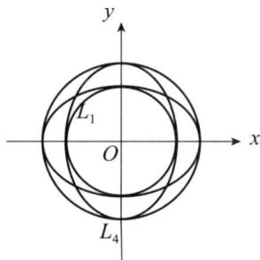

# 2013年数学（一）真题解析

# 一、选择题

(1)【答案】 (D).

【解】 方法一 由洛必达法则，得

$$
\lim  _ {x \rightarrow 0} \frac {x - \arctan x}{x ^ {k}} = \lim  _ {x \rightarrow 0} \frac {1 - \frac {1}{1 + x ^ {2}}}{k x ^ {k - 1}} = \lim  _ {x \rightarrow 0} \frac {x ^ {2}}{k (1 + x ^ {2}) x ^ {k - 1}} = \frac {1}{k} \lim  _ {x \rightarrow 0} \frac {x ^ {2}}{x ^ {k - 1}},
$$

于是 $k - 1 = 2$ ，即 $k = 3$ ，且 $\lim_{x\to 0}\frac{x - \arctan x}{x^k} = \frac{1}{3}$ ，应选(D).

方法二 由 $\arctan x = x - \frac{x^3}{3} + o(x^3)$ 得 $x - \arctan x \sim \frac{x^3}{3}$ ,

于是 $k = 3$ ，且 $\lim_{x\to 0}\frac{x - \arctan x}{x^k} = \lim_{x\to 0}\frac{x - \arctan x}{x^3} = \frac{1}{3}$ ，应选(D).

（2）【答案】 （A）.

【解】 令 $F(x,y,z) = x^{2} + \cos (xy) + yz + x$

则 $n = (F_x', F_y', F_z') = (2x - y\sin(xy) + 1, -x\sin(xy) + z, y)$ ,

曲面 $x^{2} + \cos (xy) + yz + x = 0$ 在点(0,1，-1）处的法向量为 $\pmb {n} = (1, - 1,1)$

切平面方程为 $\pi : (x - 0) - (y - 1) + (z + 1) = 0$ ，即 $\pi : x - y + z = -2$ ，应选(A).

（3）【答案】 (C).

【解】将函数 $f(x)$ 进行奇延拓，再进行周期延拓，函数 $f(x)$ 的正弦级数为 $\sum_{n=1}^{\infty} b_n \sin n\pi x$ 。 $S(x)$ 为正弦级数的和函数，显然 $S(x)$ 是以2为周期的函数。

于是 $S\left(-\frac{9}{4}\right) = S\left(-\frac{1}{4}\right) = -S\left(\frac{1}{4}\right)$ .

因为 $x = \frac{1}{4}$ 为 $f(x)$ 的连续点，所以 $S\left(-\frac{9}{4}\right) = S\left(-\frac{1}{4}\right) = -S\left(\frac{1}{4}\right) = -f\left(\frac{1}{4}\right) = -\frac{1}{4}$ ，应选(C).

（4）【答案】 (D).

【解】如图所示，令 $D_{1}:x^{2} + y^{2}\leqslant 1$ ， $D_{2}:x^{2} + y^{2}\leqslant 2$

$$
D _ {3}: x ^ {2} + 2 y ^ {2} \leqslant 2, \quad D _ {4}: 2 x ^ {2} + y ^ {2} \leqslant 2,
$$

由格林公式，得 $I_{1} = \iint_{D_{1}}\left(2 - x^{2} - 1 - \frac{y^{2}}{2}\right)\mathrm{d}x\mathrm{d}y$

$$
\begin{array}{l} = \iint_ {D _ {1}} \left(1 - x ^ {2} - \frac {y ^ {2}}{2}\right) d x d y \\ = \pi - \iint_ {D _ {1}} x ^ {2} \mathrm {d} x \mathrm {d} y - \frac {1}{2} \iint_ {D _ {1}} y ^ {2} \mathrm {d} x \mathrm {d} y \\ \end{array}
$$

  
一（4）题图

$$
\begin{array}{l} = \pi - \frac {3}{2} \iint_ {D _ {1}} x ^ {2} d x d y \\ = \pi - \frac {3}{4} \iint_ {D _ {1}} \left(x ^ {2} + y ^ {2}\right) \mathrm {d} x \mathrm {d} y = \pi - \frac {3}{4} \int_ {0} ^ {2 \pi} \mathrm {d} \theta \int_ {0} ^ {1} r ^ {3} \mathrm {d} r = \frac {5 \pi}{8}; \\ \end{array}
$$

$$
\begin{array}{l} I _ {2} = \iint_ {D _ {2}} \left(2 - x ^ {2} - 1 - \frac {y ^ {2}}{2}\right) d x d y = \iint_ {D _ {2}} \left(1 - x ^ {2} - \frac {y ^ {2}}{2}\right) d x d y \\ = 2 \pi - \frac {3}{2} \iint_ {D _ {2}} x ^ {2} d x d y = 2 \pi - \frac {3}{4} \iint_ {D _ {2}} \left(x ^ {2} + y ^ {2}\right) d x d y \\ = 2 \pi - \frac {3}{4} \int_ {0} ^ {2 \pi} \mathrm {d} \theta \int_ {0} ^ {\sqrt {2}} r ^ {3} \mathrm {d} r = \frac {\pi}{2}, \\ \end{array}
$$

$$
\begin{array}{l} I _ {3} = \iint_ {D _ {3}} \left(2 - x ^ {2} - 1 - \frac {y ^ {2}}{2}\right) d x d y = \iint_ {D _ {3}} \left(1 - x ^ {2} - \frac {y ^ {2}}{2}\right) d x d y \\ = \int_ {0} ^ {2 \pi} d \theta \int_ {0} ^ {1} \left(1 - 2 r ^ {2} \cos^ {2} \theta - \frac {1}{2} r ^ {2} \sin^ {2} \theta\right) \sqrt {2} r d r = \frac {3 \sqrt {2}}{8} \pi , \\ \end{array}
$$

$$
\begin{array}{l} I _ {4} = \iint_ {D _ {4}} \left(2 - x ^ {2} - 1 - \frac {y ^ {2}}{2}\right) d x d y = \iint_ {D _ {4}} \left(1 - x ^ {2} - \frac {y ^ {2}}{2}\right) d x d y \\ = \int_ {0} ^ {2 \pi} d \theta \int_ {0} ^ {1} (1 - r ^ {2} \cos^ {2} \theta - r ^ {2} \sin^ {2} \theta) \sqrt {2} r d r = \frac {\sqrt {2}}{2} \pi , \\ \end{array}
$$

因为 $I_{4}$ 最大，所以应选(D).

（5）【答案】 (B).

【解】令 $\pmb {B} = (\pmb {\beta}_1,\pmb {\beta}_2,\dots ,\pmb {\beta}_n)$ ， $C = (\gamma_{1},\gamma_{2},\dots ,\gamma_{n})$

由 $AB = C$ ，即 $\mathbf{A}(\pmb{\beta}_1, \pmb{\beta}_2, \dots, \pmb{\beta}_n) = (\gamma_1, \gamma_2, \dots, \gamma_n)$ ，得 $\mathbf{A}\pmb{\beta}_i = \pmb{\gamma}_i (i = 1, 2, \dots, n)$ ，即矩阵 $C$ 的列向量组可由矩阵 $\mathbf{A}$ 的列向量组线性表示.

因为 $\pmb{B}$ 可逆，所以 $A = CB^{-1}$ ，即 $\mathbf{A}$ 的列向量组可由 $\pmb{C}$ 的列向量组线性表示.

故 $C$ 的列向量组与 $\mathbf{A}$ 的列向量组等价，应选(B).

方法点评：令 $A = (\pmb{\alpha}_1, \pmb{\alpha}_2, \dots, \pmb{\alpha}_n)$ , $\pmb{X} = \begin{bmatrix} x_1 \\ x_2 \\ \vdots \\ x_n \end{bmatrix}$ , $\pmb{b}$ 为列向量，则 $\pmb{AX} = \pmb{b}$ 等价于

$x_{1}\pmb{\alpha}_{1} + x_{2}\pmb{\alpha}_{2} + \dots +x_{n}\pmb{\alpha}_{n} = \pmb{b}$ ，即 $\pmb{b}$ 可由 $\mathbf{A}$ 的列向量表示.

令 $\mathbf{A} = (\pmb{\alpha}_1, \pmb{\alpha}_2, \dots, \pmb{\alpha}_n), \mathbf{B} = (\pmb{\beta}_1, \pmb{\beta}_2, \dots, \pmb{\beta}_n), \mathbf{C} = (\pmb{\gamma}_1, \pmb{\gamma}_2, \dots, \pmb{\gamma}_n)$ ，则 $\mathbf{AB} = \mathbf{C}$ 等价于 $\mathbf{A}\pmb{\beta}_i = \pmb{\gamma}_i (i = 1, 2, \dots, n)$ ，即 $\mathbf{C}$ 的列向量可由 $\mathbf{A}$ 的列向量线性表示.

（6）【答案】 （B）.

【解】 令 $\mathbf{A} = \begin{pmatrix} 1 & a & 1 \\ a & b & a \\ 1 & a & 1 \end{pmatrix}$ , $\mathbf{B} = \begin{pmatrix} 2 & 0 & 0 \\ 0 & b & 0 \\ 0 & 0 & 0 \end{pmatrix}$ .

因为 $A, B$ 都是实对称矩阵，所以 $A \sim B$ 的充分必要条件是 $A, B$ 特征值相同.

$\pmb{B}$ 的特征值为 $\lambda_1 = 2, \lambda_2 = b, \lambda_3 = 0$

而 $|2E - A| = \left| \begin{array}{ccc}1 & -a & -1\\ -a & 2 - b & -a\\ -1 & -a & 1 \end{array} \right| = \left| \begin{array}{ccc}1 & -a & -1\\ -a & 2 - b & -a\\ 0 & -2a & 0 \end{array} \right| = 2a\left| \begin{array}{cc}1 & -1\\ -a & -a \end{array} \right| = -4a^2,$

所以 $a = 0$ ，即 $\mathbf{A} = \begin{pmatrix} 1 & 0 & 1\\ 0 & b & 0\\ 1 & 0 & 1 \end{pmatrix}$ ，且 $\mathbf{A}$ 的特征值也为 $\lambda_1 = 2,\lambda_2 = b,\lambda_3 = 0.$

故当 $a = 0, b$ 为任意常数时， $\mathbf{A} \sim \mathbf{B}$ ，应选（B）.

（7）【答案】 （A）.

【解】 由 $X_{1}\sim N(0,1)$ ，得

$$
p _ {1} = P \{- 2 \leqslant X _ {1} \leqslant 2 \} = \Phi (2) - \Phi (- 2) = 2 \Phi (2) - 1.
$$

由 $X_{2} \sim N(0, 2^{2})$ ，得 $\frac{X_{2}}{2} \sim N(0, 1)$ ，于是 $p_{2} = P\left\{-1 \leqslant \frac{X_{2}}{2} \leqslant 1\right\} = 2\Phi(1) - 1.$

由 $X_{3}\sim N(5,3^{2})$ ，得 $\frac{X_3 - 5}{3}\sim N(0,1)$ ，于是

$$
p _ {3} = P \left\{- \frac {7}{3} \leqslant \frac {X _ {3} - 5}{3} \leqslant - 1 \right\} = \Phi (- 1) - \Phi \left(- \frac {7}{3}\right) = \Phi \left(\frac {7}{3}\right) - \Phi (1).
$$

由 $p_1 > p_2, p_2 > p_3$ ，得 $p_1 > p_2 > p_3$ ，应选(A).

（8）【答案】 (C).

【解】因为 $X \sim t(n)$ ，所以存在 $U \sim N(0,1), V \sim \chi^2(n)$ 且 $U, V$ 相互独立，使得

$X = \frac{U}{\sqrt{V / n}}$ $X^{2} = \frac{U^{2} / 1}{V / n}\sim F(1,n)$ ，从而 $Y = X^2$

于是 $P\{Y > c^2\} = P\{X^2 >c^2\} = P\{X > c\} +P\{X <   - c\}$

由 $X\sim t(n)$ 得 $P\{X > c\} = P\{X <   - c\}$

故 $P\{Y > c^2\} = P\{X > c\} + P\{X < -c\} = 2\alpha$ ，应选(C).

# 二、填空题

（9）【答案】 1.

【解】 将 $x = 0$ 代入 $y - x = \mathrm{e}^{x(1 - y)}$ 中，得 $y = 1$

$y - x = \mathrm{e}^{x(1 - y)}$ 两边对 $x$ 求导，得 $\frac{\mathrm{dy}}{\mathrm{dx}} - 1 = \mathrm{e}^{x(1 - y)} \cdot \left(1 - y - x\frac{\mathrm{dy}}{\mathrm{dx}}\right)$

将 $x = 0, y = 1$ 代入，得 $\left.\frac{\mathrm{dy}}{\mathrm{dx}}\right|_{x = 0} = f'(0) = 1.$

于是 $\lim_{n\to \infty}n\left[f\left(\frac{1}{n}\right) - 1\right] = \lim_{n\to \infty}\frac{f\left(\frac{1}{n}\right) - f(0)}{\frac{1}{n}} = f'(0) = 1.$

(10)【答案】 $C_1\mathrm{e}^x + C_2\mathrm{e}^{3x} - x\mathrm{e}^{2x}(C_1, C_2$ 为任意常数).

【解】设二阶常系数非齐次线性微分方程为 $y^{\prime \prime} + py^{\prime} + qy = f(x)$

由线性微分方程解的结构得 $y_{1} - y_{3} = \mathrm{e}^{3x},y_{2} - y_{3} = \mathrm{e}^{x}$ 为方程 $y^{\prime \prime} + py^{\prime} + qy = 0$ 的两个解，则该方程的特征值为 $\lambda_1 = 1,\lambda_2 = 3$ ，故方程 $y'' + py' + qy = f(x)$ 的通解为

$y = C_{1}\mathrm{e}^{x} + C_{2}\mathrm{e}^{3x} - x\mathrm{e}^{2x}(C_{1},C_{2}$ 为任意常数）.

（11）【答案】 $\sqrt{2}$

【解】 $\frac{\mathrm{dy}}{\mathrm{dx}} = \frac{\mathrm{dy} / \mathrm{dt}}{\mathrm{dx} / \mathrm{dt}} = \frac{\sin t + t\cos t - \sin t}{\cos t} = t$

$$
\frac {\mathrm {d} ^ {2} y}{\mathrm {d} x ^ {2}} = \frac {\mathrm {d} \left(\frac {\mathrm {d} y}{\mathrm {d} x}\right)}{\mathrm {d} x} = \frac {\frac {\mathrm {d}}{\mathrm {d} t} \left(\frac {\mathrm {d} y}{\mathrm {d} x}\right)}{\frac {\mathrm {d} x}{\mathrm {d} t}} = \frac {1}{\cos t},
$$

于是 $\left.\frac{\mathrm{d}^2y}{\mathrm{d}x^2}\right|_{x = \frac{\pi}{4}} = \sqrt{2}.$

(12)【答案】 $\ln 2$

【解】 $\int_{1}^{+\infty}\frac{\ln x}{(1 + x)^{2}}\mathrm{d}x = -\int_{1}^{+\infty}\ln x\mathrm{d}\left(\frac{1}{1 + x}\right) = -\frac{\ln x}{1 + x}\Bigg|_{1}^{+\infty} + \int_{1}^{+\infty}\frac{1}{x(1 + x)}\mathrm{d}x$

$$
= \int_ {1} ^ {+ \infty} \frac {1}{x (1 + x)} d x = \ln \left. \frac {x}{1 + x} \right| _ {1} ^ {+ \infty} = \ln 2.
$$

（13）【答案】 -1.

【解】由 $A_{ij} = -a_{ij}$ ，得 $\mathbf{A}^{\mathrm{T}} = -\mathbf{A}^{*}$ ，两边取行列式，得 $|\mathbf{A}| = (-1)^3 |\mathbf{A}^*| = -|\mathbf{A}|^2$ 于是 $|\mathbf{A}| = 0$ 或 $|\mathbf{A}| = -1$

因为 $\mathbf{A}$ 为非零矩阵，所以 $a_{ij}(i,j = 1,2,3)$ 不全为零，不妨设 $a_{11}\neq 0$

由 $|\mathbf{A}| = a_{11}A_{11} + a_{12}A_{12} + a_{13}A_{13} = -(a_{11}^2 +a_{12}^2 +a_{13}^2) <   0$ ，得 $|\mathbf{A}| = -1$

方法点评：在行列式计算中，若出现 $A_{ij}$ 或者 $\mathbf{A}^{*}$ 时，一般使用如下两个性质：

(1) $a_{i1}A_{i1} + a_{i2}A_{i2} + \dots + a_{in}A_{in} = |\mathbf{A}| (i = 1,2,\dots ,n)$ ;   
(2) $|\mathbf{A}^{*}| = |\mathbf{A}|^{n - 1}$

(14)【答案】 $1 - \frac{1}{\mathrm{e}}$ .

【解】由 $Y \sim E(1)$ ，得 $Y$ 的分布函数为 $F(x) = \begin{cases} 1 - \mathrm{e}^{-x}, & x \geqslant 0, \\ 0, & x < 0. \end{cases}$

于是 $P\{Y \leqslant a + 1 \mid Y > a\} = \frac{P\{a < Y \leqslant a + 1\}}{P\{Y > a\}} = \frac{F(a + 1) - F(a)}{1 - F(a)}$

$$
= \frac {\mathrm {e} ^ {- a} - \mathrm {e} ^ {- (a + 1)}}{\mathrm {e} ^ {- a}} = 1 - \frac {1}{\mathrm {e}}.
$$

# 三、解答题

(15)【解】 $\int_0^1\frac{f(x)}{\sqrt{x}}\mathrm{d}x = 2\int_0^1 f(x)\mathrm{d}(\sqrt{x}) = 2\sqrt{x} f(x)\Big|_0^1 -2\int_0^1 f'(x)\sqrt{x}\mathrm{d}x$

$$
\begin{array}{l} = - 2 \int_ {0} ^ {1} f ^ {\prime} (x) \sqrt {x} d x = - 2 \int_ {0} ^ {1} \frac {\ln (x + 1)}{\sqrt {x}} d x = - 4 \int_ {0} ^ {1} \ln (x + 1) d (\sqrt {x}) \\ = - 4 \sqrt {x} \ln (x + 1) \left| _ {0} ^ {1} + 4 \int_ {0} ^ {1} \frac {\sqrt {x}}{x + 1} d x = - 4 \ln 2 + 4 \int_ {0} ^ {1} \frac {\sqrt {x}}{x + 1} d x \right. \\ \frac {\sqrt {x} = t}{- 4 \ln 2 + 8 \int_ {0} ^ {1} \frac {t ^ {2}}{1 + t ^ {2}} \mathrm {d} t} = - 4 \ln 2 + 8 \int_ {0} ^ {1} \left(1 - \frac {1}{1 + t ^ {2}}\right) \mathrm {d} t \\ = - 4 \ln 2 + 8 - 8 \arctan t \mid_ {0} ^ {1} = - 4 \ln 2 + 8 - 2 \pi . \\ \end{array}
$$

方法点评：计算定积分时，若出现变积分限函数求定积分时，一般采用分部积分法.如：设 $f(x) = \int_{1}^{x}\mathrm{e}^{t^2}\mathrm{d}t$ ，则

$$
\int_ {0} ^ {1} f (x) \mathrm {d} x = x f (x) \left| _ {0} ^ {1} - \int_ {0} ^ {1} x f ^ {\prime} (x) \mathrm {d} x = - \int_ {0} ^ {1} x \mathrm {e} ^ {x ^ {2}} \mathrm {d} x = - \frac {1}{2} \mathrm {e} ^ {x ^ {2}} \right| _ {0} ^ {1} = \frac {1 - \mathrm {e}}{2}.
$$

（16）【解】（I）由逐项可导性得 $S^{\prime}(x) = \sum_{n = 1}^{\infty}na_{n}x^{n - 1}$

$$
S ^ {\prime \prime} (x) = \sum_ {n = 2} ^ {\infty} n (n - 1) a _ {n} x ^ {n - 2} = \sum_ {n = 0} ^ {\infty} (n + 2) (n + 1) a _ {n + 2} x ^ {n}.
$$

由 $a_{n - 2} - n(n - 1)a_n = 0$ ，得 $a_{n} = (n + 2)(n + 1)a_{n + 2}(n = 0,1,2,\dots)$

于是 $S''(x) = S(x)$ 或 $S''(x) - S(x) = 0$

（Ⅱ） $S^{\prime \prime}(x) - S(x) = 0$ 的特征方程为 $\lambda^2 -1 = 0$ ，特征值为 $\lambda_{1} = -1,\lambda_{2} = 1$

$$
S (x) = C _ {1} \mathrm {e} ^ {- x} + C _ {2} \mathrm {e} ^ {x};
$$

由 $S(0) = a_0 = 3, S'(0) = a_1 = 1$ 得 $\left\{ \begin{array}{l} C_1 + C_2 = 3, \\ -C_1 + C_2 = 1, \end{array} \right.$ 解得 $C_1 = 1, C_2 = 2$ ，故幂级数的和函数 $S(x) = \mathrm{e}^{-x} + 2\mathrm{e}^{x}$ .

（17）【解】 函数 $f(x,y)$ 在整个平面上有定义.

由 $\left\{ \begin{array}{l} f_{x}^{\prime} = \left(x^{2} + \frac{x^{3}}{3} + y\right) \mathrm{e}^{x + y} = 0, \\ f_{y}^{\prime} = \left(y + \frac{x^{3}}{3} + 1\right) \mathrm{e}^{x + y} = 0, \end{array} \right.$ 得 $\left\{ \begin{array}{l} x = -1, \\ y = -\frac{2}{3}, \end{array} \right.$

$$
f _ {x x} ^ {\prime \prime} = \left(2 x + 2 x ^ {2} + \frac {x ^ {3}}{3} + y\right) e ^ {x + y}, f _ {x y} ^ {\prime \prime} = \left(x ^ {2} + \frac {x ^ {3}}{3} + y + 1\right) e ^ {x + y}, f _ {y y} ^ {\prime \prime} = \left(y + \frac {x ^ {3}}{3} + 2\right) e ^ {x + y},
$$

当 $\left\{ \begin{array}{l}x = -1,\\ y = -\frac{2}{3} \end{array} \right.$ 时，

$$
A = f _ {x x} ^ {\prime \prime} \left(- 1, - \frac {2}{3}\right) = - \mathrm {e} ^ {- \frac {5}{3}}, B = f _ {x y} ^ {\prime \prime} \left(- 1, - \frac {2}{3}\right) = \mathrm {e} ^ {- \frac {5}{3}}, C = f _ {y y} ^ {\prime \prime} \left(- 1, - \frac {2}{3}\right) = \mathrm {e} ^ {- \frac {5}{3}},
$$

由 $AC - B^2 < 0$ ，得 $\left(-1, -\frac{2}{3}\right)$ 不是函数 $f(x,y)$ 的极值点；

当 $\left\{ \begin{array}{l}x = 1,\\ y = -\frac{4}{3} \end{array} \right.$ 时，

$$
A = f _ {x x} ^ {\prime \prime} \left(1, - \frac {4}{3}\right) = 3 \mathrm {e} ^ {- \frac {1}{3}}, B = f _ {x y} ^ {\prime \prime} \left(1, - \frac {4}{3}\right) = \mathrm {e} ^ {- \frac {1}{3}}, C = f _ {y y} ^ {\prime \prime} \left(1, - \frac {4}{3}\right) = \mathrm {e} ^ {- \frac {1}{3}},
$$

由 $AC - B^2 = 2\mathrm{e}^{-\frac{2}{3}} > 0$ 且 $A > 0$ ，得 $\left(1, - \frac{4}{3}\right)$ 为 $f(x,y)$ 的极小值点，极小值为 $f\left(1, - \frac{4}{3}\right) = -\mathrm{e}^{-\frac{1}{3}}.$

（18）【证明】（I）方法一 因为 $f(x)$ 为奇函数，所以 $f(-x) = -f(x)$ ，于是 $f(0) = 0$

由拉格朗日中值定理，存在 $\xi \in (0,1)$ ，使得 $f^{\prime}(\xi) = \frac{f(1) - f(0)}{1 - 0} = 1$

方法二 因为 $f(x)$ 为奇函数，所以 $f(-x) = -f(x)$ ，于是 $f(0) = 0$

令 $\varphi (x) = f(x) - x$ ，则 $\varphi (0) = 0,\varphi (1) = f(1) - 1 = 0$ ，由罗尔定理，存在 $\xi \in (0,1)$ ，使得 $\varphi^{\prime}(\xi) = 0$

而 $\varphi^{\prime}(x) = f^{\prime}(x) - 1$ ，于是 $f^{\prime}(\xi) = 1$

（Ⅱ）因为 $f^{\prime}(x)$ 为偶函数，所以 $f^{\prime}(-\xi) = 1$

令 $h(x) = [f'(x) - 1]\mathrm{e}^x, h(-\xi) = h(\xi) = 0$ ，由罗尔定理，存在 $\eta \in (-1,1)$ ，使得 $h'(\eta) = 0$

而 $h^{\prime}(x) = f^{\prime \prime}(x)\mathrm{e}^{x} + [f^{\prime}(x) - 1]\mathrm{e}^{x} = [f^{\prime \prime}(x) + f^{\prime}(x) - 1]\mathrm{e}^{x}$ 且 $\mathrm{e}^x\neq 0$

所以 $f^{\prime \prime}(\eta) + f^{\prime}(\eta) = 1$

方法点评：本题考查中值定理. 中值定理部分最难以掌握的部分就是辅助函数的构造，事实上构造辅助函数有一整套的方法，就本题辅助函数构造作如下补充：

（1）若结论为 $f^{\prime}(\xi) + kf(\xi) = 0$ ，辅助函数为 $F(x) = \mathrm{e}^{kx}f(x)$   
（2）若结论为 $\xi f'(\xi) + kf(\xi) = 0$ ，辅助函数为 $F(x) = x^{k}f(x)$   
（3）本题第二问，先将 $f''(\eta) + f'(\eta) = 1$ 改为 $f''(x) + f'(x) - 1 = 0$ ，整理得 $[f'(x) - 1]' + [f'(x) - 1] = 0$ ，显然辅助函数为 $F(x) = \mathrm{e}^{x}[f'(x) - 1]$

（19）【解】（I）直线 $L$ 的方向向量为 $\overrightarrow{AB} = (-1, 1, 1)$

直线 $L:\frac{x - 1}{-1} = \frac{y}{1} = \frac{z}{1}$

设 $M(x,y,z)$ 为曲面 $\Sigma$ 上任意一点，其所在的圆位于 $L$ 上的点为 $M_0(x_0,y_0,z)$ ，圆心为 $T(0,0,z)$ ，由 $|MT| = |M_0T|$ ，得 $x^2 + y^2 = x_0^2 + y_0^2$ .

因为 $M_0(x_0, y_0, z) \in L$ ，所以 $\frac{x_0 - 1}{-1} = \frac{y_0}{1} = \frac{z}{1}$ ，从而 $\left\{ \begin{array}{l} x_0 = 1 - z, \\ y_0 = z, \end{array} \right.$ 代入 $x^2 + y^2 = x_0^2 + y_0^2$ ，得 $\Sigma: x^2 + y^2 = (1 - z)^2 + z^2$ ，即 $\Sigma: x^2 + y^2 = 2z^2 - 2z + 1$ .

（Ⅱ）设 $\Omega$ 的形心坐标为 $(\overline{x},\overline{y},\overline{z})$ ，由对称性得 $\overline{x} = 0,\overline{y} = 0,\overline{z} = \frac{\iiint_{\Omega}z\mathrm{d}v}{\iiint_{\Omega}\mathrm{d}v}.$

由 $\iiint_{\Omega} \mathrm{d}v = \int_{0}^{2} \mathrm{d}z \iint_{x^2 + y^2 \leqslant 2z^2 - 2z + 1} \mathrm{d}x \mathrm{d}y = \pi \int_{0}^{2} (2z^2 - 2z + 1) \mathrm{d}z = \frac{10}{3}\pi,$

$$
\iiint_ {\Omega} z \mathrm {d} v = \int_ {0} ^ {2} z \mathrm {d} z \iint_ {x ^ {2} + y ^ {2} \leqslant 2 z ^ {2} - 2 z + 1} \mathrm {d} x \mathrm {d} y = \pi \int_ {0} ^ {2} (2 z ^ {3} - 2 z ^ {2} + z) \mathrm {d} z = \frac {1 4}{3} \pi ,
$$

得 $\overline{z} = \frac{7}{5}$ 故形心坐标为 $\left(0,0,\frac{7}{5}\right)$

（20）【解】 令 $C = \begin{pmatrix} x_{1} & x_{2}\\ x_{3} & x_{4} \end{pmatrix}$

$$
\mathbf {A C} = \left( \begin{array}{l l} 1 & a \\ 1 & 0 \end{array} \right) \left( \begin{array}{l l} x _ {1} & x _ {2} \\ x _ {3} & x _ {4} \end{array} \right) = \left( \begin{array}{c c} x _ {1} + a x _ {3} & x _ {2} + a x _ {4} \\ x _ {1} & x _ {2} \end{array} \right),
$$

$$
\mathbf {C A} = \left( \begin{array}{l l} x _ {1} & x _ {2} \\ x _ {3} & x _ {4} \end{array} \right) \left( \begin{array}{l l} 1 & a \\ 1 & 0 \end{array} \right) = \left( \begin{array}{l l} x _ {1} + x _ {2} & a x _ {1} \\ x _ {3} + x _ {4} & a x _ {3} \end{array} \right),
$$

$$
\mathbf {A C} - \mathbf {C A} = \left( \begin{array}{c c} - x _ {2} + a x _ {3} & - a x _ {1} + x _ {2} + a x _ {4} \\ x _ {1} - x _ {3} - x _ {4} & x _ {2} - a x _ {3} \end{array} \right),
$$

由 $\mathbf{AC} - \mathbf{CA} = \mathbf{B}$ ，得 $\begin{cases} -x_{2} + ax_{3} = 0,\\ -ax_{1} + x_{2} + ax_{4} = 1,\\ x_{1} - x_{3} - x_{4} = 1,\\ x_{2} - ax_{3} = b. \end{cases}$

设以上方程组对应的系数矩阵为 $D$ ，则

$$
\begin{array}{l} \overline {{\boldsymbol {D}}} = \left[\begin{array}{c c c c c}0&- 1&a&0&0\\- a&1&0&a&1\\1&0&- 1&- 1&1\\0&1&- a&0&b\end{array}\right]\rightarrow \left[\begin{array}{c c c c c}0&- 1&a&0&0\\0&1&- a&0&1 + a\\1&0&- 1&- 1&1\\0&1&- a&0&b\end{array}\right] \\ \rightarrow \left(\begin{array}{c c c c c}1&0&- 1&- 1&1\\0&1&- a&0&1 + a\\0&0&0&0&1 + a\\0&0&0&0&b\end{array}\right). \\ \end{array}
$$

当 $a = -1, b = 0$ 时，线性方程组 $\mathbf{A}\mathbf{C} - \mathbf{C}\mathbf{A} = \mathbf{B}$ 有解，

由 $\overline{\pmb{D}}\rightarrow \left[ \begin{array}{cccc}1 & 0 & -1 & -1\\ 0 & 1 & 1 & 0\\ 0 & 0 & 0 & 0\\ 0 & 0 & 0 & 0 \end{array} \right]$ ，得 $AC - CA = B$ 的通解为

$$
\mathbf {X} = k _ {1} \left[ \begin{array}{l} 1 \\ - 1 \\ 1 \\ 0 \end{array} \right] + k _ {2} \left[ \begin{array}{l} 1 \\ 0 \\ 0 \\ 1 \end{array} \right] + \left[ \begin{array}{l} 1 \\ 0 \\ 0 \\ 0 \end{array} \right] = \left[ \begin{array}{l} k _ {1} + k _ {2} + 1 \\ - k _ {1} \\ k _ {1} \\ k _ {2} \end{array} \right],
$$

故 $C = \binom{k_1 + k_2 + 1}{k_1} - \binom{k_1}{k_2}$ （ $k_1, k_2$ 为任意常数）.

（21）【证明】（I）令 $X = \begin{pmatrix} x_1 \\ x_2 \\ x_3 \end{pmatrix}$ ，则

$$
\begin{array}{l} f = 2 \mathbf {X} ^ {\mathrm {T}} \left( \begin{array}{l} a _ {1} \\ a _ {2} \\ a _ {3} \end{array} \right) \cdot (a _ {1}, a _ {2}, a _ {3}) \mathbf {X} + \mathbf {X} ^ {\mathrm {T}} \left( \begin{array}{l} b _ {1} \\ b _ {2} \\ b _ {3} \end{array} \right) (b _ {1}, b _ {2}, b _ {3}) \mathbf {X} \\ = \boldsymbol {X} ^ {\mathrm {T}} \left(2 \boldsymbol {\alpha} \boldsymbol {\alpha} ^ {\mathrm {T}}\right) \boldsymbol {X} + \boldsymbol {X} ^ {\mathrm {T}} \left(\boldsymbol {\beta} \boldsymbol {\beta} ^ {\mathrm {T}}\right) \boldsymbol {X} = \boldsymbol {X} ^ {\mathrm {T}} \left(2 \boldsymbol {\alpha} \boldsymbol {\alpha} ^ {\mathrm {T}} + \boldsymbol {\beta} \boldsymbol {\beta} ^ {\mathrm {T}}\right) \boldsymbol {X}, \\ \end{array}
$$

则二次型 $f$ 的矩阵为 $2\alpha \alpha^{\mathrm{T}} + \beta \beta^{\mathrm{T}}$

（Ⅱ）由 $A\pmb {\alpha} = (2\pmb {\alpha}\pmb{\alpha}^{\mathrm{T}} + \pmb {\beta}\pmb{\beta}^{\mathrm{T}})\pmb {\alpha} = 2\pmb{\alpha}$ ，得 $\pmb{\alpha}$ 为 $\mathbf{A}$ 的属于特征值 $\lambda_1 = 2$ 的特征向量；由 $A\pmb {\beta} = (2\pmb {\alpha}\pmb{\alpha}^{\mathrm{T}} + \pmb {\beta}\pmb{\beta}^{\mathrm{T}})\pmb {\beta} = \pmb{\beta}$ ，得 $\pmb{\beta}$ 为 $\mathbf{A}$ 的属于特征值 $\lambda_{2} = 1$ 的特征向量；

因为 $r(\mathbf{A}) = r(2\alpha \pmb{\alpha}^{\mathrm{T}} + \pmb{\beta}\pmb{\beta}^{\mathrm{T}})\leqslant r(2\pmb{\alpha}\pmb{\alpha}^{\mathrm{T}}) + r(\pmb {\beta}\pmb {\beta}^{\mathrm{T}}) = r(\pmb {\alpha}) + r(\pmb {\beta}) = 2 <   3$ 所以 $\lambda_3 = 0$ 为 $\mathbf{A}$ 的特征值，故二次型 $f$ 在正交变换下的标准形为 $2y_{1}^{2} + y_{2}^{2}$

(22)【解】（I） $P\{Y = 1\} = P\{X \geqslant 2\} = \int_{2}^{3} \frac{1}{9} x^2 \, \mathrm{d}x = \frac{19}{27}$ ,

$$
P \{Y = 2 \} = P \{X \leqslant 1 \} = \int_ {0} ^ {1} \frac {1}{9} x ^ {2} \mathrm {d} x = \frac {1}{2 7},
$$

$$
P \{1 <   Y <   2 \} = 1 - \frac {1 9}{2 7} - \frac {1}{2 7} = \frac {7}{2 7},
$$

$$
F _ {Y} (y) = P \{Y \leqslant y \},
$$

当 $y < 1$ 时， $F_{Y}(y) = 0$

当 $1 \leqslant y < 2$ 时， $F_{Y}(y) = P\{Y = 1\} + P\{1 < Y < y\}$

$$
= \frac {1 9}{2 7} + \int_ {1} ^ {y} \frac {1}{9} x ^ {2} d x = \frac {1 9}{2 7} + \frac {y ^ {3} - 1}{2 7} = \frac {1 8 + y ^ {3}}{2 7};
$$

当 $y \geqslant 2$ 时， $F_{Y}(y) = 1$

于是 $F_{Y}(y) = \left\{ \begin{array}{ll}0, & y < 1,\\ \frac{18 + y^{3}}{27}, & 1\leqslant y < 2,\\ 1, & y\geqslant 2. \end{array} \right.$

$$
\begin{array}{l} (\mathrm {I I}) P \{X \leqslant Y \} = P \{X \leqslant Y \mid Y = 1 \} P \{Y = 1 \} + \\ P \{X \leqslant Y \mid Y = 2 \} P \{Y = 2 \} + P \{X \leqslant Y \mid 1 <   Y <   2 \} P \{1 <   Y <   2 \} \\ = \frac {1 9}{2 7} P \{X \leqslant 1 \} + \frac {1}{2 7} P \{X \leqslant 2 \} + \frac {7}{2 7} P \{X \leqslant Y \} \\ = \frac {1 9}{2 7 \times 2 7} + \frac {8}{2 7 \times 2 7} + \frac {7}{2 7} = \frac {8}{2 7}. \\ \end{array}
$$

方法点评：本题考查随机变量函数的概率分布。本题 $X$ 为连续型随机变量，由 $X$ 生成的随机变量 $Y$ 既不是连续型随机变量又不是离散型随机变量，在计算关于 $X, Y$ 的概率分布时，一定要针对 $Y$ 使用全概率公式。

(23)【解】 $(\mathrm{I})E(X) = \int_{-\infty}^{+\infty}xf(x)\mathrm{d}x = \int_{0}^{+\infty}\frac{\theta^{2}}{x^{2}}\mathrm{e}^{-\frac{\theta}{x}}\mathrm{d}x$

$$
= - \theta \int_ {0} ^ {+ \infty} \mathrm {e} ^ {- \frac {\theta}{x}} \mathrm {d} \left(\frac {\theta}{x}\right) \frac {\frac {\theta}{x} = t}{- \theta \int_ {+ \infty} ^ {0} \mathrm {e} ^ {- t} \mathrm {d} t} = \theta \int_ {0} ^ {+ \infty} \mathrm {e} ^ {- t} \mathrm {d} t = \theta ,
$$

令 $E(X) = \overline{X}$ ，则参数 $\theta$ 的矩估计量为 $\hat{\theta} = \overline{X}$

（Ⅱ）最大似然函数 $L(\theta) = f(x_{1};\theta)f(x_{2};\theta)\dots f(x_{n};\theta)$

$$
= \frac {\theta^ {2 n}}{\left(x _ {1} x _ {2} \cdots x _ {n}\right) ^ {3}} \mathrm {e} ^ {- \theta \left(\frac {1}{x _ {1}} + \frac {1}{x _ {2}} + \dots + \frac {1}{x _ {n}}\right)} \left(x _ {i} > 0, i = 1, 2, \dots , n\right),
$$

$$
\ln L (\theta) = 2 n \ln \theta - 3 \sum_ {i = 1} ^ {n} \ln x _ {i} - \theta \sum_ {i = 1} ^ {n} \frac {1}{x _ {i}},
$$

由 $\frac{\mathrm{d}}{\mathrm{d}\theta}\ln L(\theta) = \frac{2n}{\theta} -\sum_{i = 1}^{n}\frac{1}{x_i} = 0$ ，得 $\theta$ 的最大似然估计值为 $\hat{\theta} = \frac{2n}{\sum_{i = 1}^{n}\frac{1}{x_i}}$

最大似然估计量为 $\hat{\theta} = \frac{2n}{\sum_{i=1}^{n} \frac{1}{X_i}}$