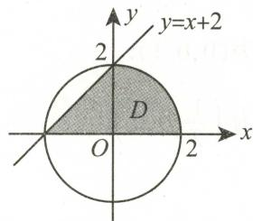
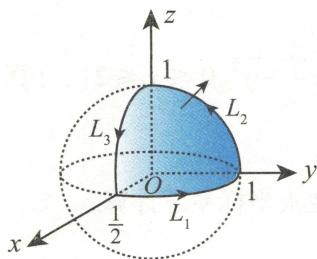
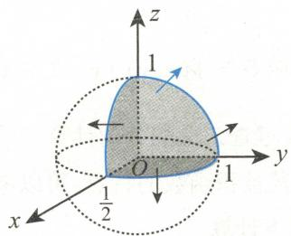

# 2022年全国硕士研究生招生考试

# 数学（一）试题解析

# 一、选择题

1 设 $\lim_{x\to 1}\frac{f(x)}{\ln x} = 1$ ，则（

(A) $f(1) = 0$ .

(B) $\lim_{x\to 1}f(x) = 0.$

$\mathrm{(C)}f^{\prime}(1) = 1.$

(D) $\lim_{x\to 1}f'(x) = 1.$

答案 B.

分析 本题主要考查极限与导数的概念

本题中关于 $f(x)$ 的条件相当有限，仅有 $\lim_{x\to 1}\frac{f(x)}{\ln x} = 1$ 这一个条件，而由这个条件仅能保证 $f(x)$ 在 $x = 1$ 的某去心邻域内有定义，且极限存在，但不能保证 $f(x)$ 在 $x = 1$ 处的连续性，更不能保证 $f(x)$ 在 $x = 1$ 处的可导性.

解 当 $x \to 1$ 时, $\lim_{x \to 1} \ln x = 0$ , 而 $\lim_{x \to 1} \frac{f(x)}{\ln x} = 1$ , 故分子 $f(x)$ 满足 $\lim_{x \to 1} f(x) = 0$ . 应选 B.

下面说明选项A、C、D不正确

对选项A、C，可以举函数 $f(x)$ 在 $x = 1$ 处不连续，从而也不可导的例子

对选项D，若 $f(x)$ 在 $x = 1$ 的某去心邻域内可导，且 $\lim_{x\to 1}f'(x)$ 存在，则由洛必达法则，

$$
\lim  _ {x \to 1} {\frac {f (  x  )}{\ln   x}} {\stackrel {\text {洛 必 达}} {=}} \lim  _ {x \to 1} {\frac {f ^ {\prime} (  x  )}{\frac {1}{x}}} = \lim  _ {x \to 1} f ^ {\prime} (  x  ).
$$

于是， $\lim_{x\to 1}f^{\prime}(x) = \lim_{x\to 1}\frac{f(x)}{\ln x} = 1.$ 因此，要举出选项D的反例，需考虑 $f(x)$ 在 $x = 1$ 的某去心邻域内不可导或者 $\lim_{x\to 1}f^{\prime}(x)$ 不存在的例子

考虑 $f(x) = \left\{ \begin{array}{ll}x - 1 + 2(x - 1)^2\sin \frac{1}{x - 1}, & x\neq 1,\\ 1, & x = 1, \end{array} \right.$ 则 $\lim_{x\to 1}f(x) = 0$ ，但 $f(1) = 1,f(x)$ 在 $x = 1$ 处不连续，也就不可导.

当 $x \neq 1$ 时, $f'(x) = 1 + 4(x - 1)\sin \frac{1}{x - 1} - 2\cos \frac{1}{x - 1}$ . 不难发现, $x = 1$ 是 $f'(x)$ 的振荡间断点, $\lim_{x \to 1} f'(x)$ 不存在.

2 设 $f(u)$ 可导， $z = xyf\left(\frac{y}{x}\right)$ ，若 $x \frac{\partial z}{\partial x} + y \frac{\partial z}{\partial y} = y^2 (\ln y - \ln x)$ ，则（ ）

$\mathrm{(A)}f(1) = \frac{1}{2},f^{\prime}(1) = 0.$

(B) $f(1) = 0, f'(1) = \frac{1}{2}$ .

$\mathrm{(C)}f(1) = \frac{1}{2},f^{\prime}(1) = 1.$

$\mathrm{(D)}f(1) = 0,f^{\prime}(1) = 1.$

答案 B.

分析 本题主要考查偏导数的计算

本题中的 $f(x)$ 表达式未知， $z(x, y)$ 是与 $f(u)$ 有关的复合函数，故可以先通过计算 $\frac{\partial z}{\partial x}$ 和 $\frac{\partial z}{\partial y}$ 并代入已知等式得到 $f(u)$ 的表达式，再计算 $f(1), f'(1)$ .

解 分别求 $\frac{\partial z}{\partial x}$ 和 $\frac{\partial z}{\partial y}$ . 利用链式法则，

$$
\frac {\partial z}{\partial x} = y f \left(\frac {y}{x}\right) + x y f ^ {\prime} \left(\frac {y}{x}\right) \cdot \left(- \frac {y}{x ^ {2}}\right) = y f \left(\frac {y}{x}\right) - \frac {y ^ {2}}{x} f ^ {\prime} \left(\frac {y}{x}\right),
$$

$$
\frac {\partial z}{\partial y} = x f \left(\frac {y}{x}\right) + x y f ^ {\prime} \left(\frac {y}{x}\right) \cdot \frac {1}{x} = x f \left(\frac {y}{x}\right) + y f ^ {\prime} \left(\frac {y}{x}\right).
$$

于是， $x\frac{\partial z}{\partial x} +y\frac{\partial z}{\partial y} = 2xyf\left(\frac{y}{x}\right).$

与 $x\frac{\partial z}{\partial x} +y\frac{\partial z}{\partial y} = y^2 (\ln y - \ln x) = y^2\ln \frac{y}{x}$ 比较可得， $f\left(\frac{y}{x}\right) = \frac{y}{2x}\ln \frac{y}{x}.$ 从而， $f(u) = \frac{1}{2} u\ln u$ $f^{\prime}(u) = \frac{1}{2} (\ln u + 1).$

因此， $f(1) = 0,f^{\prime}(1) = \frac{1}{2}.$ 应选B.

设数列 $\{x_{n}\}$ 满足 $-\frac{\pi}{2} \leqslant x_{n} \leqslant \frac{\pi}{2}$ , 则（ ）

(A) 若 $\lim_{n\to \infty}\cos (\sin x_n)$ 存在, 则 $\lim_{n\to \infty}x_n$ 存在.  
(B) 若 $\lim_{n\to \infty}\sin (\cos x_n)$ 存在, 则 $\lim_{n\to \infty}x_n$ 存在.  
(C) 若 $\lim_{n\to \infty}\cos (\sin x_n)$ 存在, 则 $\lim_{n\to \infty}\sin x_n$ 存在, 但 $\lim_{n\to \infty}x_n$ 不一定存在.  
(D) 若 $\lim_{n\to \infty}\sin (\cos x_n)$ 存在, 则 $\lim_{n\to \infty}\cos x_n$ 存在, 但 $\lim_{n\to \infty}x_n$ 不一定存在.

答案 D.

分析 本题主要考查数列极限与函数极限的关系

题目中出现的 $\sin (\cos x)$ 与 $\cos (\sin x)$ 均为复合函数，要将 $\lim_{n\to \infty}\sin (\cos x_n)$ 与 $\lim_{n\to \infty}\cos (\sin x_n)$ 内层的数列取出来，可以考虑在外层再复合上外层函数的反函数(如果存在的话).

解 若 $\lim_{n\to \infty}\sin (\cos x_n)$ 存在，则将其记为 $a$ 由于 $\sin x$ 在 $\left[-\frac{\pi}{2},\frac{\pi}{2}\right]$ 上存在反函数 $\arcsin x$ ，故

$$
\lim  _ {n \rightarrow \infty} \cos x _ {n} = \lim  _ {n \rightarrow \infty} \arcsin (\sin (\cos x _ {n})) = \arcsin (\lim  _ {n \rightarrow \infty} \sin (\cos x _ {n})) = \arcsin a.
$$

但是 $\lim_{n\to \infty}\cos x_n$ 存在并不能保证 $\lim_{n\to \infty}x_n$ 存在.例如取 $x_{n} = (-1)^{n}\frac{\pi}{2}$ 则 $\lim_{n\to \infty}\cos x_n = 0$ ，但 $\lim_{n\to \infty}x_n$ 不存在.选项B错误，选项D正确.应选D.

由于 $\cos x$ 在 $\left[-\frac{\pi}{2}, \frac{\pi}{2}\right]$ 上并不单调, 故由 $\lim_{n \to \infty} \cos (\sin x_n)$ 存在并不能保证 $\lim_{n \to \infty} \sin x_n$ 存在. 同样取 $x_n = (-1)^n \frac{\pi}{2}$ , 则 $\lim_{n \to \infty} \cos (\sin x_n) = \cos 1$ , 但 $\lim_{n \to \infty} \sin x_n$ 和 $\lim_{n \to \infty} x_n$ 均不存在. 选项 A、C 不正确.

注 ① 考虑到 $\cos x$ 是偶函数, 形如 $x_{n} = (-1)^{n}a, a \in \left[-\frac{\pi}{2}, \frac{\pi}{2}\right]$ 的数列均可作为选项 A、B、C 的反例.

② 这道题的出题思路在2017年的一道数二真题当中也出现过

【例】设数列 $\{x_{n}\}$ 收敛，则（ ）(2017年数学二试题）

(A) 当 $\lim_{n\to \infty}\sin x_n = 0$ 时, $\lim_{n\to \infty}x_n = 0.$   
(B) 当 $\lim_{n\to \infty}\left(x_n + \sqrt{|x_n|}\right) = 0$ 时, $\lim_{n\to \infty}x_n = 0.$   
(C) 当 $\lim_{n\to \infty}(x_n + x_n^2) = 0$ 时, $\lim_{n\to \infty}x_n = 0.$   
(D) 当 $\lim_{n\to \infty}(x_n + \sin x_n) = 0$ 时, $\lim_{n\to \infty}x_n = 0.$

答案 D.

若 $I_{1} = \int_{0}^{1}\frac{x}{2(1 + \cos x)}\mathrm{d}x,I_{2} = \int_{0}^{1}\frac{\ln(1 + x)}{1 + \cos x}\mathrm{d}x,I_{3} = \int_{0}^{1}\frac{2x}{1 + \sin x}\mathrm{d}x$ ，则（

(A) $I_{1} < I_{2} < I_{3}$ .

(B) $I_{2} < I_{1} < I_{3}$ .

(C) $I_{1} < I_{3} < I_{2}$ .

$(\mathrm{D})I_{3} < I_{2} < I_{1}$

答案 A.

分析 本题主要考查定积分比较大小

三个定积分的积分区间相同，故只需比较被积函数的大小

解 通过观察可发现，要比较 $I_{1}$ 与 $I_{2}$ 的大小，只需比较 $\frac{x}{2}$ 与 $\ln (1 + x)$ 的大小

令 $f(x) = \ln (1 + x) - \frac{x}{2}$ , 则 $f(0) = 0$ , $f'(x) = \frac{1}{1 + x} - \frac{1}{2}$ . 当 $x \in (0,1)$ 时, $f'(x) > 0$ , $f(x)$ 单调增加, 从而 $f(x) > f(0) = 0$ , 即 $\ln (1 + x) > \frac{x}{2}, \frac{\ln(1 + x)}{1 + \cos x} > \frac{x}{2(1 + \cos x)}$ . 因此, $I_2 > I_1$ .

此外，同样的方法不难证明在 $(0,1)$ 内， $\ln (1 + x) <   x$

另一方面，由于在 $(0,1)$ 内， $0 < \sin x, \cos x < 1, 1 < 1 + \sin x < 2$ ，故 $I_3$ 的被积函数 $\frac{2x}{1 + \sin x} > x.$ 结合 $\ln (1 + x) < x$ 可得， $\frac{\ln(1 + x)}{1 + \cos x} < \frac{x}{1 + \cos x} < x.$ 于是， $\frac{2x}{1 + \sin x} > x > \frac{\ln(1 + x)}{1 + \cos x}.$ 因此， $I_3 > I_2$ .

综上所述，应选A.

下列4个条件中，3阶矩阵 $\mathbf{A}$ 可相似对角化的一个充分非必要条件是（ ）

(A) $A$ 有3个不同的特征值  
(B) $A$ 有3个线性无关的特征向量  
(C) $A$ 有3个两两线性无关的特征向量  
(D) $A$ 的属于不同特征值的特征向量相互正交

答案 A.

分析

本题主要考查矩阵可相似对角化的条件

要找的充分非必要条件应满足由该条件可推出3阶矩阵 $\mathbf{A}$ 可相似对角化，但由3阶矩阵 $\mathbf{A}$ 可相似对角化却推不出该条件.

$n$ 阶矩阵 $\mathbf{A}$ 与对角矩阵相似的判定条件  

<table><tr><td rowspan="2">充分条件</td><td>A有n个不同的特征值</td></tr><tr><td>A为实对称矩阵</td></tr><tr><td rowspan="2">充分必要条件</td><td>A有n个线性无关的特征向量</td></tr><tr><td>A的每个特征值对应的线性无关的特征向量的个数等于该特征值的重数</td></tr></table>

请注意, 条件“A有 $n$ 个不同的特征值”与“A为实对称矩阵”均能推出“A有 $n$ 个线性无关的特征向量”和“A的每个特征值对应的线性无关的特征向量的个数等于该特征值的重数”, 但它们之间并没有相互蕴含的关系. 这四个条件之间的关系如下.

解

依次分析四个选项

选项A是充分非必要条件.若矩阵 $\pmb{A}$ 具有3个不同的特征值，则该矩阵有3个线性无关的特征向量，从而能够相似对角化.但是矩阵 $\pmb{A}$ 能相似对角化并不意味着 $\pmb{A}$ 一定有3个不同的特征值.例如3阶单位矩阵 $E$ ，该矩阵自身即为对角矩阵，但仅有一个三重特征值1，没有不同的特征值.应选A.

选项B是充分必要条件

选项C是必要非充分条件.若A能相似对角化，则A必然有3个线性无关的特征向量，从而有3个两两线性无关的特征向量.

但反之并不成立，因为3个向量两两线性无关并不意味着3个向量线性无关。要举选项C不充分的例子，可以找到一个具有3重特征值，但却只有两个线性无关的特征向量的3阶矩阵。

取 $A = \begin{pmatrix} 0 & 0 & 1 \\ 0 & 0 & 0 \\ 0 & 0 & 0 \end{pmatrix}$ , 则 0 是 $A$ 的 3 重特征值, $\pmb{\xi}_1 = \begin{pmatrix} 1 \\ 0 \\ 0 \end{pmatrix}$ 和 $\pmb{\xi}_2 = \begin{pmatrix} 0 \\ 1 \\ 0 \end{pmatrix}$ 是 $A$ 的属于特征值 0 的两个线性无关的特征向量. 取 $\pmb{\xi}_3 = \begin{pmatrix} 1 \\ 1 \\ 0 \end{pmatrix}$ , 则 $\pmb{\xi}_3$ 也是 $A$ 的属于特征值 0 的一个特征向量, $\pmb{\xi}_1, \pmb{\xi}_2, \pmb{\xi}_3$ 两两线性无关, 但是 $\pmb{\xi}_1, \pmb{\xi}_2, \pmb{\xi}_3$ 线性相关, $A$ 也不能相似对角化.

选项D既不是充分条件，也不是必要条件

下面说明选项D的不必要性

取 $\pmb{\xi}_{1} = \begin{pmatrix} 1 \\ 0 \\ 0 \end{pmatrix}, \pmb{\xi}_{2} = \begin{pmatrix} 1 \\ 1 \\ 0 \end{pmatrix}, \pmb{\xi}_{3} = \begin{pmatrix} 1 \\ 0 \\ 1 \end{pmatrix}$ , 则 $\pmb{\xi}_{1}, \pmb{\xi}_{2}, \pmb{\xi}_{3}$ 两两不正交. 令 $\pmb{P} = (\pmb{\xi}_{1}, \pmb{\xi}_{2}, \pmb{\xi}_{3}), \pmb{A} =$

$\left( \begin{array}{rrr}1 & 0 & 0\\ 0 & -1 & 0\\ 0 & 0 & 0 \end{array} \right)$ 则

$$
A = P A P ^ {- 1} = \left( \begin{array}{l l l} 1 & 1 & 1 \\ 0 & 1 & 0 \\ 0 & 0 & 1 \end{array} \right) \left( \begin{array}{c c c} 1 & 0 & 0 \\ 0 & - 1 & 0 \\ 0 & 0 & 0 \end{array} \right) \left( \begin{array}{c c c} 1 & - 1 & - 1 \\ 0 & 1 & 0 \\ 0 & 0 & 1 \end{array} \right) = \left( \begin{array}{c c c} 1 & - 2 & - 1 \\ 0 & - 1 & 0 \\ 0 & 0 & 0 \end{array} \right).
$$

$A$ 与对角矩阵 $A$ 相似, 但是 $A$ 的属于不同特征值的特征向量均不正交.

若 $\pmb{A}$ 是具有3个不同特征值的3阶矩阵，则 $\pmb{A}$ 必然可相似对角化，故选项D不充分的例子，可以找只有两个不同特征值，且属于这两个不同特征值的特征向量相互正交，但是却不可以相似对角化的矩阵.

取 $A = \begin{pmatrix} 1 & 0 & 0 \\ 0 & 0 & 1 \\ 0 & 0 & 0 \end{pmatrix}$ . 通过计算可发现该矩阵的特征值为0,1,其中0为二重特征值,但0没有两个线性无关的特征向量,从而 $A$ 不能相似对角化.

解 $(E - A)x = 0$ 可得 $\pmb{\xi}_{1} = \begin{pmatrix} 1 \\ 0 \\ 0 \end{pmatrix}$ 为 $A$ 的属于特征值1的一个特征向量. 解 $(0E - A)x = 0$ 可得 $\pmb{\xi}_{2} = \begin{pmatrix} 0 \\ 1 \\ 0 \end{pmatrix}$ 为 $A$ 的属于特征值0的一个特征向量.

$\xi_{1}$ 与 $\xi_{2}$ 为 $A$ 的属于不同特征值的特征向量，它们相互正交，且 $A$ 的任意属于不同特征值的特征向量均相互正交，但是 $A$ 不能相似对角化

注 若 $A$ 为2阶矩阵，则 $A$ 的属于不同特征值的特征向量相互正交是 $A$ 可相似对角化的充分非必要条件.

充分性是比较显然的. 若 $A$ 为具有不同特征值的2阶矩阵, 则其必然可相似对角化. 下面说明必要性不成立.

取 $\pmb{\xi}_{1} = \begin{pmatrix} 1 \\ 0 \end{pmatrix}, \pmb{\xi}_{2} = \begin{pmatrix} 1 \\ 1 \end{pmatrix}$ , 则 $\pmb{\xi}_{1}$ 与 $\pmb{\xi}_{2}$ 不正交. 令 $P = (\pmb{\xi}_{1}, \pmb{\xi}_{2}), A = \begin{pmatrix} 0 & 0 \\ 0 & 1 \end{pmatrix}$ , 则

$$
\boldsymbol {A} = \boldsymbol {P A P} ^ {- 1} = \left( \begin{array}{l l} 1 & 1 \\ 0 & 1 \end{array} \right) \left( \begin{array}{l l} 0 & 0 \\ 0 & 1 \end{array} \right) \left( \begin{array}{l l} 1 & - 1 \\ 0 & 1 \end{array} \right) = \left( \begin{array}{l l} 0 & 1 \\ 0 & 1 \end{array} \right).
$$

$A$ 与对角矩阵 $A$ 相似, 但是 $A$ 的线性无关的特征向量均不正交.

6 设 $A, B$ 为 $n$ 阶矩阵， $E$ 为 $n$ 阶单位矩阵，若方程组 $Ax = 0$ 与 $Bx = 0$ 同解，则（）

(A) $\left( \begin{array}{ll}A & O\\ E & B \end{array} \right)y = 0$ 只有零解

(B) $\left( \begin{array}{cc}E & A\\ O & AB \end{array} \right)y = 0$ 只有零解.

(C) $\left( \begin{array}{ll}A & B\\ O & B \end{array} \right)y = 0$ 与 $\left( \begin{array}{ll}B & A\\ O & A \end{array} \right)y = 0$ 同解

$\left( \begin{array}{ll}AB & B\\ O & A \end{array} \right)y = 0$ 与 $\left( \begin{array}{ll}BA & A\\ O & B \end{array} \right)y = 0$ 同解

答案 C.

分析 本题主要考查方程组的同解问题

$Ax = 0$ 与 $Bx = 0$ 同解，说明 $Ax = 0$ 的解都是 $Bx = 0$ 的解，且 $Bx = 0$ 的解也都是 $Ax = 0$ 的解.

两方程组同解能反映这两个方程组的系数矩阵的秩的大小关系，但并不能反映系数矩阵的秩的大小.

解 设 $y_{1}, y_{2}$ 均为 $n$ 维列向量， $y = \begin{pmatrix} y_{1} \\ y_{2} \end{pmatrix}$ .

对 $\begin{pmatrix} A & B \\ O & B \end{pmatrix}$ 和 $\begin{pmatrix} B & A \\ O & A \end{pmatrix}$ 分别作初等行变换

$$
\left( \begin{array}{c c} E & - E \\ O & E \end{array} \right) \left( \begin{array}{c c} A & B \\ O & B \end{array} \right) = \left( \begin{array}{c c} A & O \\ O & B \end{array} \right), \quad \left( \begin{array}{c c} E & - E \\ O & E \end{array} \right) \left( \begin{array}{c c} B & A \\ O & A \end{array} \right) = \left( \begin{array}{c c} B & O \\ O & A \end{array} \right).
$$

于是， $\begin{pmatrix} A & B \\ O & B \end{pmatrix} y = 0$ 等价于 $\begin{pmatrix} A & O \\ O & B \end{pmatrix} y = 0$ ，即 $\left\{ \begin{array}{ll} Ay_1 = 0, \\ By_2 = 0. \end{array} \right.$ 该方程组的解 $y$ 满足 $y = \begin{pmatrix} y_1 \\ y_2 \end{pmatrix}$ ，其中 $y_1$ 为 $Ax = 0$ 的解， $y_2$ 为 $Bx = 0$ 的解。

同理， $\left( \begin{array}{ll}B & A\\ O & A \end{array} \right)y = 0$ 等价于 $\left( \begin{array}{ll}B & O\\ O & A \end{array} \right)y = 0$ ，即 $\left\{ \begin{array}{ll}\boldsymbol {B}\boldsymbol {y}_1 & = \boldsymbol {0},\\ \boldsymbol {A}\boldsymbol {y}_2 & = \boldsymbol {0}. \end{array} \right.$ 该方程组的解 $y$ 满足 $y = \left( \begin{array}{l}y_{1}\\ y_{2} \end{array} \right)$ 其中 $y_{1}$ 为 $Bx = 0$ 的解， $y_{2}$ 为 $Ax = 0$ 的解.

由于 $Ax = 0$ 与 $Bx = 0$ 同解，故选项C中的两个方程组同解.应选C.

下面说明选项A、B、D均不正确

由于两方程组同解虽然能反映这两个方程组的系数矩阵的秩的大小关系，但并不能反映系数矩阵的秩的大小，故选项A、B的反例比较好找.要说明这两个方程组并不是只有零解，可以取 $A = B = O$ ，则选项A、B中方程组的系数矩阵均不满秩，当然不可能只有零解

同选项C的分析，选项D中的第一个方程组可化为

$$
\left( \begin{array}{c c} \boldsymbol {A B} & \boldsymbol {B} \\ \boldsymbol {O} & \boldsymbol {A} \end{array} \right) \left( \begin{array}{l} \boldsymbol {y} _ {1} \\ \boldsymbol {y} _ {2} \end{array} \right) = \left( \begin{array}{c} \boldsymbol {A B y} _ {1} + \boldsymbol {B y} _ {2} \\ \boldsymbol {A y} _ {2} \end{array} \right) = \left( \begin{array}{c} \boldsymbol {0} \\ \boldsymbol {0} \end{array} \right).
$$

展开可得 $\left\{ \begin{array}{ll}ABy_1 + By_2 = 0,\\ Ay_2 = 0. \end{array} \right.$ 由于 $Ax = 0$ 与 $Bx = 0$ 同解，故该方程组等价于 $\left\{ \begin{array}{ll}ABy_1 = 0,\\ Ay_2 = 0. \end{array} \right.$ 同理可得， $\left( \begin{array}{ll}BA & A\\ O & B \end{array} \right)y = 0$ 等价于 $\left\{ \begin{array}{ll}BAy_1 = 0,\\ By_2 = 0. \end{array} \right.$

但是， $ABx = 0$ 与 $BAx = 0$ 并不一定同解

取 $A = \begin{pmatrix} 0 & 1 \\ 0 & 0 \end{pmatrix}, B = \begin{pmatrix} 0 & 1 \\ 0 & 1 \end{pmatrix}$ , 则 $AB = \begin{pmatrix} 0 & 1 \\ 0 & 0 \end{pmatrix}, BA = \begin{pmatrix} 0 & 0 \\ 0 & 0 \end{pmatrix}$ . $BAx = 0$ 与 $BAx = 0$ 不同解.

7 设 $\pmb{\alpha}_{1} = (\lambda, 1, 1)^{\mathrm{T}}, \pmb{\alpha}_{2} = (1, \lambda, 1)^{\mathrm{T}}, \pmb{\alpha}_{3} = (1, 1, \lambda)^{\mathrm{T}}, \pmb{\alpha}_{4} = (1, \lambda, \lambda^{2})^{\mathrm{T}}$ ，若 $\pmb{\alpha}_{1}, \pmb{\alpha}_{2}, \pmb{\alpha}_{3}$ 与 $\pmb{\alpha}_{1}, \pmb{\alpha}_{2}, \pmb{\alpha}_{4}$ 等价，则 $\lambda$ 的取值范围是（）

(A) $\{0,1\}$ .   
(B) $\{\lambda \mid \lambda \in \mathbb{R}, \lambda \neq -2\}$ .   
(C) $\{\lambda \mid \lambda \in \mathbf{R}, \lambda \neq -1, \lambda \neq -2\}$ .   
(D) $\{\lambda \mid \lambda \in \mathbf{R}, \lambda \neq -1\}$ .

答案 C.

分析 本题主要考查向量组等价

向量组 $\alpha_{1},\alpha_{2},\alpha_{3}$ 与 $\alpha_{1},\alpha_{2},\alpha_{4}$ 等价的充分必要条件是 $r(\pmb{\alpha}_{1},\pmb{\alpha}_{2},\pmb{\alpha}_{3}) = r(\pmb{\alpha}_{1},\pmb{\alpha}_{2},\pmb{\alpha}_{4}) = r(\pmb{\alpha}_{1},\pmb{\alpha}_{2},\pmb{\alpha}_{3},\pmb{\alpha}_{4})$ 。由这一条件出发，可以考虑对矩阵 $(\pmb{\alpha}_{1},\pmb{\alpha}_{2},\pmb{\alpha}_{3},\pmb{\alpha}_{4})$ 作初等行变换并讨论秩来得到 $\lambda$ 的取值。

另一方面，也可以通过计算 $|\alpha_{1},\alpha_{2},\alpha_{3}|$ 和 $|\alpha_{1},\alpha_{2},\alpha_{4}|$ 来讨论 $\alpha_{1},\alpha_{2},\alpha_{3}$ 和 $\alpha_{1},\alpha_{2},\alpha_{4}$ 的秩.当它们均不为0时，这两个向量组都是3维向量组的极大无关组，从而是等价的.此外，还需讨论行列式均为0时两个向量组是否等价.

解（法一）当 $\lambda = 1$ 时， $\alpha_{1} = \alpha_{2} = \alpha_{3} = \alpha_{4} = \begin{pmatrix} 1 \\ 1 \\ 1 \end{pmatrix}$ 。此时 $\alpha_{1}, \alpha_{2}, \alpha_{3}$ 与 $\alpha_{1}, \alpha_{2}, \alpha_{4}$ 显然等价。

当 $\lambda \neq 1$ 时，考虑矩阵 $A = (\alpha_{1},\alpha_{2},\alpha_{3},\alpha_{4})$

$$
\begin{array}{l} \boldsymbol {A} = \left(\begin{array}{l l l l}\lambda&1&1&1\\1&\lambda&1&\lambda\\1&1&\lambda&\lambda^ {2}\end{array}\right)\rightarrow \left(\begin{array}{l l l l}1&\lambda&1&\lambda\\1&1&\lambda&\lambda^ {2}\\\lambda&1&1&1\end{array}\right) \xrightarrow [ r _ {3} - \lambda r _ {1} ]{r _ {2} - r _ {1}} \left(\begin{array}{l l l l}1&\lambda&1&\lambda\\0&1 - \lambda&\lambda - 1&\lambda^ {2} - \lambda\\0&1 - \lambda^ {2}&1 - \lambda&1 - \lambda^ {2}\end{array}\right) \\ \xrightarrow { \begin{array}{l} r _ {2} ^ {*} \times \frac {1}{1 - \lambda} \\ \hline r _ {3} ^ {*} \times \frac {1}{1 - \lambda} \end{array} } \left( \begin{array}{c c c c} 1 & \lambda & 1 & \lambda \\ 0 & 1 & - 1 & - \lambda \\ 0 & 1 + \lambda & 1 & 1 + \lambda \end{array} \right) \xrightarrow {r _ {3} ^ {* *} - (1 + \lambda) r _ {2} ^ {* *}} \left( \begin{array}{c c c c} 1 & \lambda & 1 & \lambda \\ 0 & 1 & - 1 & - \lambda \\ 0 & 0 & \lambda + 2 & (\lambda + 1) ^ {2} \end{array} \right). \\ \end{array}
$$

$(r_i^*$ 表示对第 $i$ 行作初等行变换后所得新的第 $i$ 行，每作一次初等行变换，加一个 $*$ ）

由于 $A$ 有2阶非零子式 $\left| \begin{array}{ll}\lambda & 1\\ 1 & \lambda \end{array} \right|$ 故 $r(A)\geqslant 2.$ 另一方面，因为不存在 $\lambda$ 满足 $\lambda +2 = (\lambda +1)^2 =$ 0,所以 $r(A) = 3$

$r(\pmb{\alpha}_1, \pmb{\alpha}_2, \pmb{\alpha}_3) = 3$ 当且仅当 $\lambda \neq -2$ . $r(\pmb{\alpha}_1, \pmb{\alpha}_2, \pmb{\alpha}_4) = 3$ 当且仅当 $\lambda \neq -1$ .

因此，当 $\lambda \neq 1$ 时， $r(A) = r(\pmb{\alpha}_1, \pmb{\alpha}_2, \pmb{\alpha}_3, \pmb{\alpha}_4) = r(\pmb{\alpha}_1, \pmb{\alpha}_2, \pmb{\alpha}_3) = r(\pmb{\alpha}_1, \pmb{\alpha}_2, \pmb{\alpha}_4)$ 当且仅当 $\lambda \neq -2$ 且 $\lambda \neq -1$ .

注意到 $\lambda = 1$ 也包含在条件 $\lambda \neq -2$ 且 $\lambda \neq -1$ 中，故 $r(\pmb{\alpha}_1, \pmb{\alpha}_2, \pmb{\alpha}_3, \pmb{\alpha}_4) = r(\pmb{\alpha}_1, \pmb{\alpha}_2, \pmb{\alpha}_3) = r(\pmb{\alpha}_1, \pmb{\alpha}_2, \pmb{\alpha}_4)$ 当且仅当 $\lambda \neq -2$ 且 $\lambda \neq -1$ .

综上所述，应选C.

（法二）分别计算 $|\alpha_{1},\alpha_{2},\alpha_{3}|,|\alpha_{1},\alpha_{2},\alpha_{4}|$

$$
\begin{array}{l} \left| \alpha_ {1}, \alpha_ {2}, \alpha_ {3} \right| = \left| \begin{array}{l l l} \lambda & 1 & 1 \\ 1 & \lambda & 1 \\ 1 & 1 & \lambda \end{array} \right| = \left| \begin{array}{l l l} \lambda & 1 - \lambda & 1 - \lambda^ {2} \\ 1 & \lambda - 1 & 1 - \lambda \\ 1 & 0 & 0 \end{array} \right| = (1 - \lambda) ^ {2} (\lambda + 2). \\ \left| \alpha_ {1}, \alpha_ {2}, \alpha_ {4} \right| = \left| \begin{array}{l l l} \lambda & 1 & 1 \\ 1 & \lambda & \lambda \\ 1 & 1 & \lambda^ {2} \end{array} \right| = \left| \begin{array}{l l l} \lambda & 1 - \lambda & 1 - \lambda^ {3} \\ 1 & \lambda - 1 & \lambda - \lambda^ {2} \\ 1 & 0 & 0 \end{array} \right| = (1 - \lambda) ^ {2} (1 + \lambda) ^ {2}. \\ \end{array}
$$

当 $\lambda \neq 1, -2, -1$ 时， $|\alpha_1, \alpha_2, \alpha_3|$ 与 $|\alpha_1, \alpha_2, \alpha_4|$ 均不为0. 此时， $\alpha_1, \alpha_2, \alpha_3$ 和 $\alpha_1, \alpha_2, \alpha_4$ 均为3维列向量组的极大无关组，从而等价.

当 $\lambda = 1$ 时， $\pmb{\alpha}_{1} = \pmb{\alpha}_{2} = \pmb{\alpha}_{3} = \pmb{\alpha}_{4} = \begin{pmatrix} 1 \\ 1 \\ 1 \end{pmatrix}$ 。此时 $\pmb{\alpha}_{1}, \pmb{\alpha}_{2}, \pmb{\alpha}_{3}$ 与 $\pmb{\alpha}_{1}, \pmb{\alpha}_{2}, \pmb{\alpha}_{4}$ 显然等价。

当 $\lambda = -2$ 或 $\lambda = -1$ 时， $|\alpha_1, \alpha_2, \alpha_3| \neq |\alpha_1, \alpha_2, \alpha_4|$ ，且其中一个为0，另一个不为0，说明两向量组的秩不相等，从而不等价.

综上所述， $\alpha_{1},\alpha_{2},\alpha_{3}$ 与 $\alpha_{1},\alpha_{2},\alpha_{4}$ 等价当且仅当 $\lambda \neq -2$ 且 $\lambda \neq -1.$ 应选C.

8 设随机变量 $X$ 服从区间 $(0,3)$ 上的均匀分布，随机变量 $Y$ 服从参数为2的泊松分布，且 $X$ 与 $Y$ 的协方差为-1，则 $D(2X - Y + 1) = (\quad)$

(A)1.

(B)5.

(C)9.

(D)12.

答案 C.

分析 本题主要考查方差的性质及常见分布的数字特征

若随机变量 $X$ 服从区间 $(a,b)$ 上的均匀分布, 则 $D(X) = \frac{(a - b)^2}{12}$ .

若随机变量 $X$ 服从参数为 $\lambda$ 的泊松分布, 则 $D(X) = \lambda$ .

解 由于 $X$ 服从区间 $(0,3)$ 上的均匀分布，故 $X$ 的方差 $D(X) = \frac{(3 - 0)^2}{12} = \frac{3}{4}$ . 又由于 $Y$ 服从参数为2的泊松分布，故 $Y$ 的方差 $D(Y) = 2$ .

由方差的性质，

$$
\begin{array}{l} D (2 X - Y + 1) = D (2 X - Y) = D (2 X) + D (Y) - 2 \operatorname {C o v} (2 X, Y) \\ = 4 D (X) + D (Y) - 4 \operatorname {C o v} (X, Y) = 4 \times \frac {3}{4} + 2 - 4 \times (- 1) = 9. \\ \end{array}
$$

因此，应选C.

# 拓展

# 1.协方差的公式与性质

(1) $\operatorname{Cov}(X,Y) = E(XY) - E(X)E(Y)$ ，特别地， $\operatorname{Cov}(X,X) = D(X), \operatorname{Cov}(X,a) = 0$ ；  
(2) $D(X \pm Y) = D(X) + D(Y) \pm 2\operatorname{Cov}(X, Y)$ ;   
(3) $\operatorname{Cov}(X, Y) = \operatorname{Cov}(Y, X)$ ;   
(4) $\operatorname{Cov}(aX, bY) = ab\operatorname{Cov}(X, Y)$ , 其中 $a, b$ 是常数;  
(5) $\operatorname{Cov}(X_1 \pm X_2, Y) = \operatorname{Cov}(X_1, Y) \pm \operatorname{Cov}(X_2, Y)$ .

# 2. 常见分布的数学期望与方差

<table><tr><td>分布</td><td>分布律或概率密度</td><td>数学期望</td><td>方差</td></tr><tr><td>(0-1)分布</td><td>P{X=k}=p^k(1-p)^{1-k}, k=0,1</td><td>p</td><td>p(1-p)</td></tr><tr><td>二项分布</td><td>P{X=k}=C_n^k p^k (1-p)^{n-k}, k=0,1,2,···, n</td><td>np</td><td>np(1-p)</td></tr><tr><td>泊松分布</td><td>P{X=k}=\frac{\lambda^k}{k!} \mathrm{e}^{-\lambda}, k=0,1,2,···</td><td>λ</td><td>λ</td></tr><tr><td>几何分布</td><td>P{X=k}=(1-p)^{k-1} p, k=1,2,···</td><td>1/p</td><td>\(\frac{1-p}{p^2}\)</td></tr></table>

（续表）

<table><tr><td>分布</td><td>分布律或概率密度</td><td>数学期望</td><td>方差</td></tr><tr><td>超几何分布</td><td>P{X=k} = C_M^k C_{N-M}^{n-k}/C_N^n, k=0,1,...,l,其中l=min{n,M},n≤N</td><td>nM/N</td><td>nM(1-M)/N-N/1</td></tr><tr><td>均匀分布</td><td>φ(x) = {1/b-a, a&lt;x&lt;b,0, 其他</td><td>a+b/2</td><td>(b-a)^2/12</td></tr><tr><td>指数分布</td><td>φ(x) = {λe-λx, x&gt;0,0, x≤0</td><td>1/λ</td><td>1/λ^2</td></tr><tr><td>正态分布</td><td>φ(x) = 1/√2πσ e-(x-μ)^2/2σ^2</td><td>μ</td><td>σ^2</td></tr></table>

9 设随机变量 $X_{1}, X_{2}, \dots, X_{n}$ 独立同分布，且 $X_{1}$ 的4阶矩存在， $E(X_{1}^{k}) = \mu_{k}(k = 1,2,3,4)$ ，则根据切比雪夫不等式，对任意 $\varepsilon > 0$ ，都有 $P\left\{\left|\frac{1}{n}\sum_{i=1}^{n}X_{i}^{2} - \mu_{2}\right| \geqslant \varepsilon\right\} \leqslant (\quad)$

(A) $\frac{\mu_4 - \mu_2^2}{n\varepsilon^2}$ .

(B) $\frac{\mu_4 - \mu_2^2}{\sqrt{n}\varepsilon^2}.$

$\left(\mathrm{C}\right)\frac{\mu_2 - \mu_1^2}{n\varepsilon^2}.$

$\frac{\mu_2 - \mu_1^2}{\sqrt{n}\varepsilon^2}.$

答案 A.

分析 本题主要考查切比雪夫不等式

切比雪夫不等式 设随机变量 $X$ 具有数学期望 $E(X) = \mu$ ，方差 $D(X) = \sigma^2$ ，则对于任意正数 $\varepsilon$ ，不等式

$$
P \left\{\left| X - \mu \right| \geqslant \varepsilon \right\} \leqslant \frac {\sigma^ {2}}{\varepsilon^ {2}}
$$

成立.

本题所考虑的随机变量为 $\frac{1}{n}\sum_{i = 1}^{n}X_{i}^{2}$ 。若要根据切比雪夫不等式估计所给概率，则应先说明该随机变量的期望与方差均存在，即先计算 $E\left(\frac{1}{n}\sum_{i = 1}^{n}X_{i}^{2}\right)$ 和 $D\left(\frac{1}{n}\sum_{i = 1}^{n}X_{i}^{2}\right)$ 。

解 根据期望的性质，

$$
E \left(\frac {1}{n} \sum_ {i = 1} ^ {n} X _ {i} ^ {2}\right) = \frac {1}{n} E \left(\sum_ {i = 1} ^ {n} X _ {i} ^ {2}\right) = \frac {1}{n} \sum_ {i = 1} ^ {n} E \left(X _ {i} ^ {2}\right) \xlongequal {E \left(X _ {1} ^ {2}\right) = \mu_ {2}} \frac {1}{n} \cdot n \mu_ {2} = \mu_ {2}.
$$

根据切比雪夫不等式，对任意 $\varepsilon > 0$

$$
P \left\{\left| \frac {1}{n} \sum_ {i = 1} ^ {n} X _ {i} ^ {2} - \mu_ {2} \right| \geqslant \varepsilon \right\} \leqslant \frac {D \left(\frac {1}{n} \sum_ {i = 1} ^ {n} X _ {i} ^ {2}\right)}{\varepsilon^ {2}}. \tag {1}
$$

由于随机变量 $X_{1}, X_{2}, \dots, X_{n}$ 独立同分布，故 $X_{1}^{2}, X_{2}^{2}, \dots, X_{n}^{2}$ 相互独立.

$$
\begin{array}{l} D \left(\frac {1}{n} \sum_ {i = 1} ^ {n} X _ {i} ^ {2}\right) = \frac {1}{n ^ {2}} D \left(\sum_ {i = 1} ^ {n} X _ {i} ^ {2}\right) = \frac {1}{n ^ {2}} \sum_ {i = 1} ^ {n} D \left(X _ {i} ^ {2}\right) = \frac {1}{n ^ {2}} \sum_ {i = 1} ^ {n} \left\{E \left(X _ {i} ^ {4}\right) - \left[ E \left(X _ {i} ^ {2}\right) \right] ^ {2} \right\} \\ = \frac {1}{n ^ {2}} \cdot n \left(\mu_ {4} - \mu_ {2} ^ {2}\right) = \frac {\mu_ {4} - \mu_ {2} ^ {2}}{n}. \\ \end{array}
$$

代入(1)式可得，

$$
P \left\{\left| \frac {1}{n} \sum_ {i = 1} ^ {n} X _ {i} ^ {2} - \mu_ {2} \right| \geqslant \varepsilon \right\} \leqslant \frac {\mu_ {4} - \mu_ {2} ^ {2}}{n \varepsilon^ {2}}.
$$

因此，应选A.

# 拓展

切比雪夫不等式属于比较冷门的考点，在近年真题中出现较少.下面是历年真题中考查这一知识点的题目.

【例】设随机变量 $X$ 的数学期望 $E(X) = \mu$ ，方差 $D(X) = \sigma^2$ ，则由切比雪夫不等式，有 $P\{|X - \mu| \geqslant 3\sigma\} \leqslant \_$ （1989年数学三试题）

答案 $\frac{1}{9}$

【例】设随机变量 $X$ 的方差为2，则根据切比雪夫不等式有估计 $P\{|X - E(X)| \geqslant 2\} \leqslant$ （2001年数学一试题）

答案 $\frac{1}{2}$

【例】设随机变量 $X$ 和 $Y$ 的数学期望分别为-2和2，方差分别为1和4，而相关系数为-0.5，则根据切比雪夫不等式 $P\{|X + Y| \geqslant 6\} \leqslant \_$ 。（2001年数学三试题）

答案 $\frac{1}{12}$

10 设随机变量 $X \sim N(0,1)$ , 若在 $X = x$ 的条件下, 随机变量 $Y \sim N(x,1)$ , 则 $X$ 与 $Y$ 的相关系数为（）

(A) $\frac{1}{4}$ .

(B) $\frac{1}{2}$ .

(C) $\frac{\sqrt{3}}{3}$ .

(D) $\frac{\sqrt{2}}{2}$ .

答案 D.

分析 本题主要考查条件分布及二维正态分布的概率密度函数

条件概率密度 设二维随机变量 $(X, Y)$ 的概率密度为 $f(x, y), (X, Y)$ 关于 $Y$ 的边缘概率密度为 $f_{Y}(y)$ . 若对于固定的 $y, f_{Y}(y) > 0$ , 则称 $\frac{f(x, y)}{f_{Y}(y)}$ 为在 $Y = y$ 的条件下 $X$ 的条件概率密度, 记为

$$
f _ {X \mid Y} (x \mid y) = \frac {f (x , y)}{f _ {Y} (y)}.
$$

一维正态分布 若连续型随机变量 $X$ 的概率密度为

$$
f (x) = \frac {1}{\sqrt {2 \pi} \sigma} \mathrm {e} ^ {- \frac {(x - \mu) ^ {2}}{2 \sigma^ {2}}}, \quad - \infty <   x <   + \infty ,
$$

其中 $\mu, \sigma (\sigma > 0)$ 为常数，则称 $X$ 服从参数为 $\mu, \sigma$ 的正态分布，记为 $X \sim N(\mu, \sigma^2)$ 。

二维正态分布 设二维随机变量 $(X,Y)$ 的概率密度为

$$
f (x, y) = \frac {1}{2 \pi \sigma_ {1} \sigma_ {2} \sqrt {1 - \rho^ {2}}} e ^ {\frac {- 1}{2 (1 - \rho^ {2})} \left[ \frac {(x - \mu_ {1}) ^ {2}}{\sigma_ {1} ^ {2}} - 2 \rho \frac {(x - \mu_ {1}) (y - \mu_ {1})}{\sigma_ {1} \sigma_ {2}} + \frac {(y - \mu_ {1}) ^ {2}}{\sigma_ {1} ^ {2}} \right]},
$$

其中 $\mu_1, \mu_2, \sigma_1, \sigma_2, \rho$ 都是常数，且 $\sigma_1 > 0, \sigma_2 > 0, -1 < \rho < 1.$ 我们称 $(X,Y)$ 服从参数为 $\mu_1, \mu_2, \sigma_1, \sigma_2, \rho$ 的二维正态分布. 并且， $\mu_1, \mu_2$ 分别为 $X,Y$ 的期望， $\sigma_1^2, \sigma_2^2$ 分别为 $X,Y$ 的方差， $\rho$ 为 $X,Y$ 的相关系数.

根据已知条件，可以先根据 $X$ 的边缘概率密度以及 $Y$ 在 $X = x$ 的条件下的条件概率密度求出 $(X,Y)$ 的联合概率密度，进一步可得 $Y$ 的边缘概率密度，最后根据联合概率密度求得 $\rho_{XY}$

实际上， $(X,Y)$ 服从的是二维正态分布，而根据二维正态分布的概率密度，可以直接读出 $X,Y$ 的相关系数 $\rho_{XY}$

解（法一）由于 $X\sim N(0,1)$ ，故 $X$ 的概率密度函数为

$$
f _ {X} (x) = \frac {1}{\sqrt {2 \pi}} \mathrm {e} ^ {- \frac {x ^ {2}}{2}}.
$$

由于在 $X = x$ 的条件下， $Y \sim N(x, 1)$ ，故在 $X = x$ 的条件下， $Y$ 的条件概率密度为

$$
f _ {Y \mid X} (y \mid x) = \frac {1}{\sqrt {2 \pi}} e ^ {- \frac {(y - x) ^ {2}}{2}}.
$$

于是，二维随机变量 $(X,Y)$ 的联合概率密度为

$$
f (x, y) = f _ {X} (x) f _ {Y \mid X} (y \mid x) = \frac {1}{\sqrt {2 \pi}} e ^ {- \frac {x ^ {2}}{2}} \cdot \frac {1}{\sqrt {2 \pi}} e ^ {- \frac {(y - x) ^ {2}}{2}} = \frac {1}{2 \pi} e ^ {- x ^ {2} + x y - \frac {y ^ {2}}{2}}.
$$

计算 $Y$ 的边缘概率密度 $f_{Y}(y)$ .对 $y\in (-\infty , + \infty)$ ，

$$
\begin{array}{l} f _ {Y} (y) = \int_ {- \infty} ^ {+ \infty} f (x, y) d x = \int_ {- \infty} ^ {+ \infty} \frac {1}{2 \pi} e ^ {- x ^ {2} + x y - \frac {y ^ {2}}{2}} d x = \frac {1}{2 \sqrt {\pi}} e ^ {- \frac {y ^ {2}}{4}} \int_ {- \infty} ^ {+ \infty} \frac {1}{\sqrt {2 \pi} \cdot \frac {\sqrt {2}}{2}} e ^ {- (x - \frac {y}{2}) ^ {2}} d x \\ = \frac {1}{2 \sqrt {\pi}} \mathrm {e} ^ {- \frac {y ^ {2}}{4}} = \frac {1}{\sqrt {2 \pi} \cdot \sqrt {2}} \mathrm {e} ^ {- \frac {y ^ {2}}{2 (\sqrt {2}) ^ {2}}}. \\ \end{array}
$$

于是， $(X,Y)$ 关于 $Y$ 的边缘分布是正态分布 $N(0,2)$

结合 $f(x,y)$ 与二维正态分布的概率密度的形式，取 $\mu_1 = 0, \mu_2 = 0, \sigma_1 = 1, \sigma_2 = \sqrt{2}$ ，

$$
\frac {1}{2 \pi} \mathrm {e} ^ {- x ^ {2} + x y - \frac {y ^ {2}}{2}} = \frac {1}{2 \pi \cdot 1 \cdot \sqrt {2} \cdot \frac {\sqrt {2}}{2}} \cdot \mathrm {e} ^ {- \frac {1}{2 \cdot \frac {1}{2}}} \left[ \frac {(x - 0) ^ {2}}{1 ^ {2}} - 2 \cdot \frac {\sqrt {2}}{2} \frac {(x - 0) (y - 0)}{1 \cdot \sqrt {2}} + \frac {(y - 0) ^ {2}}{(\sqrt {2}) ^ {2}} \right].
$$

因此，取 $\rho = \frac{\sqrt{2}}{2}$ ，则 $(X,Y)$ 服从二维正态分布 $N\left(0,0;1,2;\frac{\sqrt{2}}{2}\right)$ .

由二维正态分布的概率密度的参数的含义可知， $\rho_{XY} = \frac{\sqrt{2}}{2}$ ，应选D.

（法二）计算 $\rho_{XY}$

先计算 $E(XY)$

由法一可得 $f(x,y) = \frac{1}{2\pi}\mathrm{e}^{-x^2 +xy - \frac{y^2}{2}}.$ 于是，

$$
\begin{array}{l} E (X Y) = \int_ {- \infty} ^ {+ \infty} \int_ {- \infty} ^ {+ \infty} x y f (x, y) d x d y = \int_ {- \infty} ^ {+ \infty} x \frac {1}{\sqrt {2 \pi}} e ^ {- \frac {x ^ {2}}{2}} d x \int_ {- \infty} ^ {+ \infty} y \frac {1}{\sqrt {2 \pi}} e ^ {- \frac {(y - x) ^ {2}}{2}} d y \\ = \int_ {- \infty} ^ {+ \infty} x \frac {1}{\sqrt {2 \pi}} e ^ {- \frac {x ^ {2}}{2}} d x \left[ \int_ {- \infty} ^ {+ \infty} \frac {1}{\sqrt {2 \pi}} (y - x) e ^ {- \frac {(y - x) ^ {2}}{2}} d y + x \int_ {- \infty} ^ {+ \infty} \frac {1}{\sqrt {2 \pi}} e ^ {- \frac {(y - x) ^ {2}}{2}} d (y - x) \right] \\ = \int_ {- \infty} ^ {+ \infty} x \frac {1}{\sqrt {2 \pi}} \mathrm {e} ^ {- \frac {x ^ {2}}{2}} (0 + x) \mathrm {d} x = \int_ {- \infty} ^ {+ \infty} x ^ {2} \frac {1}{\sqrt {2 \pi}} \mathrm {e} ^ {- \frac {x ^ {2}}{2}} \mathrm {d} x. \\ \end{array}
$$

又因为 $\int_{-\infty}^{+\infty}x^2\frac{1}{\sqrt{2\pi}}\mathrm{e}^{-\frac{x^2}{2}}\mathrm{d}x = E(X^2)$ ，而 $X\sim N(0,1)$ ，所以 $E(X^{2}) = D(X) + [E(X)]^{2} = 1.$ 从而， $E(XY) = 1$

又由法一可得 $Y \sim N(0,2)$ ，故 $E(Y) = 0, D(Y) = 2$

因此，

$$
\rho_ {X Y} = \frac {\operatorname {C o v} (X , Y)}{\sqrt {D (X)} \sqrt {D (Y)}} = \frac {E (X Y) - E (X) E (Y)}{\sqrt {D (X)} \sqrt {D (Y)}} = \frac {1 - 0}{\sqrt {2}} = \frac {\sqrt {2}}{2}.
$$

注 ① 实际上, 观察 $f(x, y)$ 的形式, 可直接整理写成二维正态分布的概率密度的形式.

$$
f (x, y) = \frac {1}{2 \pi \cdot 1 \cdot \sqrt {2} \cdot \sqrt {1 - \left(\frac {\sqrt {2}}{2}\right) ^ {2}}} e ^ {- \frac {1}{2} \left[ 1 - \left(\frac {\sqrt {2}}{2}\right) ^ {2} \right]} \left[ \frac {(x - 0) ^ {2}}{1 ^ {2}} - 2 \cdot \frac {\sqrt {2}}{2} \frac {(x - 0) (\gamma - 0)}{1 \cdot \sqrt {2}} + \frac {(\gamma - 0) ^ {2}}{(\sqrt {2}) ^ {2}} \right].
$$

② 反常积分 $\int_{-\infty}^{+\infty}\frac{1}{\sqrt{2\pi}} (y - x)\mathrm{e}^{-\frac{(y - x)^2}{2}}\mathrm{d}y$ 的被积函数是奇函数，而 $\int_0^{+\infty}(y - x)\mathrm{e}^{-\frac{(y - x)^2}{2}}\mathrm{d}y$ 收敛，故 $\int_{-\infty}^{+\infty}\frac{1}{\sqrt{2\pi}} (y - x)\mathrm{e}^{-\frac{(y - x)^2}{2}}\mathrm{d}y = 0.$

# 二、填空题

11 函数 $f(x, y) = x^2 + 2y^2$ 在点(0,1)处的最大方向导数为

答案 应填4.

分析 本题主要考查方向导数与梯度的关系

由于函数在一点处的各方向导数中，沿着梯度方向的方向导数最大，且最大值为梯度的模，故求一点处方向导数的最大值等价于求该点处梯度的模.

解 由于 $\operatorname{grad} f(x, y) = (2x, 4y)$ ，故 $f(x, y)$ 在点 $(0, 1)$ 处的梯度为 $(0, 4)$ . 又因为函数在一点处的最大方向导数等于该点处的梯度的模，所以 $f(x, y)$ 在点 $(0, 1)$ 处的最大方向导数为 4.

# 拓展

若函数 $f(x,y,z)$ 在点 $(x_0,y_0,z_0)$ 处可微分， $\pmb{e}_l = (\cos \alpha, \cos \beta, \cos \gamma)$ 是与方向 $l$ 同向的单位向量，则

$$
\left. \frac {\partial f}{\partial l} \right| _ {(x _ {0}, y _ {0}, z _ {0})} = \operatorname {g r a d} f (x _ {0}, y _ {0}, z _ {0}) \cdot e _ {l} = | \operatorname {g r a d} f (x _ {0}, y _ {0}, z _ {0}) | \cos \theta .
$$

这里 $\theta$ 为向量 $\operatorname{grad} f(x_0, y_0, z_0)$ 与向量 $e_l$ 的夹角. 因此，

- 当 $\theta = 0$ 时, 即 $e_l$ 与梯度 $\mathbf{grad}f(x_0,y_0,z_0)$ 方向相同时, 函数 $f(x,y,z)$ 沿这个方向增加最快, 且在这个方向的方向导数达到最大, 此时 $\left.\frac{\partial f}{\partial l}\right|_{(x_0,y_0,z_0)} = \left|\mathbf{grad}f(x_0,y_0,z_0)\right|$ .  
- 当 $\theta = \pi$ 时, 即 $e_l$ 与梯度 $\operatorname{grad} f(x_0, y_0, z_0)$ 方向相反时, 函数 $f(x, y, z)$ 沿这个方向减少最快, 且在这个方向的方向导数达到最小, 此时 $\left.\frac{\partial f}{\partial l}\right|_{(x_0, y_0, z_0)} = -\left|\operatorname{grad} f(x_0, y_0, z_0)\right|$ .  
- 当 $\theta = \frac{\pi}{2}$ 时, 即 $e_l$ 与梯度 $\mathbf{grad}f(x_0,y_0,z_0)$ 正交时, 函数 $f(x,y,z)$ 沿这个方向的变化率为 0 , 此时 $\left.\frac{\partial f}{\partial l}\right|_{(x_0,y_0,z_0)} = 0$ .

12 $\int_{1}^{\mathrm{e}^{2}}\frac{\ln x}{\sqrt{x}}\mathrm{d}x = \underline{\quad}$

答案 应填4.

分析 本题主要考查定积分的计算

被积函数中含有根式 $\sqrt{x}$ ，故可以考虑根式代换

或者，注意到本题中的被积函数为对数函数与幂函数的乘积，故可以采用分部积分法

解（法一）利用根式代换

令 $t = \sqrt{x}$ ，则 $x = t^2$ $\mathrm{d}x = 2t\mathrm{d}t.$

$$
\begin{array}{l} \int_ {1} ^ {\mathrm {e} ^ {2}} \frac {\ln x}{\sqrt {x}} \mathrm {d} x \stackrel {t = \sqrt {x}} {=} \int_ {1} ^ {\mathrm {e}} \frac {2 \ln t}{t} \cdot 2 t \mathrm {d} t = 4 \int_ {1} ^ {\mathrm {e}} \ln t \mathrm {d} t = 4 \left(t \ln t \Big | _ {1} ^ {\mathrm {e}} - \int_ {1} ^ {\mathrm {e}} t \cdot \frac {1}{t} \mathrm {d} t\right) \\ = 4 [ e - (e - 1) ] = 4. \\ \end{array}
$$

（法二）利用分部积分法

$$
\begin{array}{l} \int_ {1} ^ {\mathrm {e} ^ {2}} \frac {\ln x}{\sqrt {x}} \mathrm {d} x = 2 \int_ {1} ^ {\mathrm {e} ^ {2}} \ln x \mathrm {d} (\sqrt {x}) = 2 \left(\sqrt {x} \ln x \Big | _ {1} ^ {\mathrm {e} ^ {2}} - \int_ {1} ^ {\mathrm {e} ^ {2}} \sqrt {x} \cdot \frac {1}{x} \mathrm {d} x\right) = 2 \left(2 \mathrm {e} - \int_ {1} ^ {\mathrm {e} ^ {2}} \frac {1}{\sqrt {x}} \mathrm {d} x\right) \\ = 4 \mathrm {e} - 4 \sqrt {x} \Bigg | _ {1} ^ {\mathrm {e} ^ {2}} = 4 \mathrm {e} - (4 \mathrm {e} - 4) = 4. \\ \end{array}
$$

13 当 $x \geqslant 0, y \geqslant 0$ 时， $x^{2} + y^{2} \leqslant k\mathrm{e}^{x + y}$ 恒成立，则 $k$ 的取值范围是

答案 应填 $[4\mathrm{e}^{-2}, + \infty)$

分析 本题主要考查二元函数的最值

假定函数 $f(x,y)$ 在 $D$ 上连续，在 $D$ 内可微，并且只有有限个驻点，那么此时我们可以依照如下步骤来讨论 $f(x,y)$ 的最值.

① 求出函数在区域内部的所有驻点处的取值  
② 求出函数在区域边界上的最大值与最小值（通常为有约束条件的极值问题，即条件极值问题。）  
③ 比较 ① 和 ② 中所得函数值, 其中最大者为函数 $f(x, y)$ 在区域 $D$ 上的最大值, 最小者为函数 $f(x, y)$ 在区域 $D$ 上的最小值.

在实际问题中, 根据问题的性质, 如果知道函数的最值一定在区域内部取得, 而函数在该区域内只有一个驻点, 那么函数在该驻点处的值即为函数在该区域上的最值.

不等式 $x^{2} + y^{2}\leqslant k\mathrm{e}^{x + y}$ 等价于 $(x^{2} + y^{2})\mathrm{e}^{-(x + y)}\leqslant k.$ 该不等式当 $x\geqslant 0,y\geqslant 0$ 时恒成立意味着 $(x^{2} + y^{2})\mathrm{e}^{-(x + y)}$ 在区域 $D = \{(x,y)\mid x\geqslant 0,y\geqslant 0\}$ 上的最大值 $M\leqslant k.$ 从而 $k$ 的取值范围应为 $[M, + \infty)$

解 不等式 $x^{2} + y^{2}\leqslant k\mathrm{e}^{x + y}$ 等价于 $(x^{2} + y^{2})\mathrm{e}^{-(x + y)}\leqslant k.$

记 $f(x,y) = (x^{2} + y^{2})\mathrm{e}^{-(x + y)},D = \{(x,y)\mid x\geqslant 0,y\geqslant 0\}$

计算 $f(x,y)$ 在 $D$ 内的驻点

$$
\begin{array}{l} f _ {x} ^ {\prime} (x, y) = 2 x \mathrm {e} ^ {- (x + y)} - \left(x ^ {2} + y ^ {2}\right) \mathrm {e} ^ {- (x + y)} = \left(2 x - x ^ {2} - y ^ {2}\right) \mathrm {e} ^ {- (x + y)}, \\ f _ {y} ^ {\prime} (x, y) = 2 y \mathrm {e} ^ {- (x + y)} - \left(x ^ {2} + y ^ {2}\right) \mathrm {e} ^ {- (x + y)} = \left(2 y - x ^ {2} - y ^ {2}\right) \mathrm {e} ^ {- (x + y)}. \\ \end{array}
$$

解 $\left\{ \begin{array}{l} 2x - x^2 - y^2 = 0, \\ 2y - x^2 - y^2 = 0. \end{array} \right.$ 两式相减得 $x = y$ ，将 $x = y$ 代入 $2x - x^2 - y^2 = 0$ 可得 $2x - 2x^2 = 0$ ，从而 $x = 0$ 或 $x = 1$ . $\left\{ \begin{array}{l} x = 0, \\ y = 0 \end{array} \right.$ 和 $\left\{ \begin{array}{l} x = 1, \\ y = 1 \end{array} \right.$ 为该方程组的两组解. 由于所求为区域 $D$ 内部的驻点，故舍去点 $(0,0)$ . 点 $(1,1)$ 为 $f(x,y)$ 在区域 $D$ 内部的唯一驻点. $f(1,1) = 2\mathrm{e}^{-2}$ .

下面计算 $f(x,y)$ 在区域 $D$ 的边界 $x = 0$ 与 $y = 0$ 上的最大值.

当 $x = 0$ 时， $f(0, y) = y^2 \mathrm{e}^{-y}$ . 记 $f_1(y) = y^2 \mathrm{e}^{-y}$ ，则 $f_1'(y) = (2y - y^2) \mathrm{e}^{-y}$ . 解 $2y - y^2 = 0$ 得 $y = 0$ 或 $y = 2$ . 当 $0 < y < 2$ 时， $f_1'(y) > 0, f_1(y)$ 单调增加，当 $y > 2$ 时， $f_1'(y) < 0, f_1(y)$ 单调减少. 于是， $f(0, 2) = 4 \mathrm{e}^{-2}$ 为 $f(x, y)$ 在边界 $x = 0$ 上的最大值.

同理可得， $f(2,0) = 4\mathrm{e}^{-2}$ 为 $f(x,y)$ 在边界 $y = 0$ 上的最大值

比较 $f(1,1), f(0,2), f(2,0)$ 可得， $f(0,2) = f(2,0) = 4\mathrm{e}^{-2}$ 为 $f(x,y)$ 在区域 $D$ 上的最大值. 综上所述， $k$ 的取值范围为 $[4\mathrm{e}^{-2}, +\infty)$ .

14 已知级数 $\sum_{n=1}^{\infty} \frac{n!}{n^n} \mathrm{e}^{-nx}$ 的收敛域为 $(a, +\infty)$ ，则 $a =$ ______.

答案 应填-1.

分析 本题主要考查函数项级数的收敛域

本题中的函数项级数的一般项为 $\frac{n!}{n^n}\mathrm{e}^{-nx}$ ，适合用比值法来确定其收敛的条件

或者, 注意到 $\mathrm{e}^{-nx} = (\mathrm{e}^{-x})^n$ , 令 $t = \mathrm{e}^{-x}$ , 则可以将原级数转化为幂级数 $\sum_{n=1}^{\infty} \frac{n!}{n^n} t^n$ .

解（法一）令 $u_{n} = \frac{n!}{n^{n}}\mathrm{e}^{-nx}$ 则原级数为 $\sum_{n = 1}^{\infty}u_n$

$$
\lim  _ {n \rightarrow \infty} \left| \frac {u _ {n + 1}}{u _ {n}} \right| = \lim  _ {n \rightarrow \infty} \frac {(n + 1) !}{(n + 1) ^ {n + 1}} \cdot \frac {n ^ {n}}{n !} e ^ {- x} = e ^ {- x} \lim  _ {n \rightarrow \infty} \frac {n ^ {n}}{(n + 1) ^ {n}} = e ^ {- x} \lim  _ {n \rightarrow \infty} \frac {1}{\left(1 + \frac {1}{n}\right) ^ {n}} = e ^ {- 1 - x}.
$$

由比值审敛法可知，当 $\mathrm{e}^{-1 - x} < 1$ 时， $\sum_{n = 1}^{\infty}u_n$ 收敛，当 $\mathrm{e}^{-1 - x} > 1$ 时， $\sum_{n = 1}^{\infty}u_n$ 发散.由于指数函数单调增加，故 $\mathrm{e}^{-1 - x} < 1$ 等价于 $-1 - x < 0$ ，即 $x > -1.$ 因此，当 $x > -1$ 时，函数项级数 $\sum_{n = 1}^{\infty}\frac{n!}{n^n}\mathrm{e}^{-nx}$ 收敛，

当 $x < -1$ 时，函数项级数 $\sum_{n=1}^{\infty} \frac{n!}{n^n} \mathrm{e}^{-nx}$ 发散.

当 $x = -1$ 时, $\mathrm{e}^{-1 - x} = 1$ . 此时利用比值审敛法无法判定 $\sum_{n=1}^{\infty} u_n$ 的收敛性. 但是, 将 $x = -1$ 代回原级数可得原级数为 $\sum_{n=1}^{\infty} \frac{n!}{n^n} \mathrm{e}^n$ . 该级数的一般项极限不为 0 , 从而发散 (见注).

因此，函数项级数 $\sum_{n = 1}^{\infty}\frac{n!}{n^n}\mathrm{e}^{-nx}$ 的收敛域为 $(-1, + \infty),a = -1.$

（法二）令 $t = \mathrm{e}^{-x}$ ，则 $\sum_{n=1}^{\infty} \frac{n!}{n^n} \mathrm{e}^{-nx} = \sum_{n=1}^{\infty} \frac{n!}{n^n} t^n.$

$$
\lim  _ {n \rightarrow \infty} \frac {(n + 1) !}{(n + 1) ^ {n + 1}} \cdot \frac {n ^ {n}}{n !} = \lim  _ {n \rightarrow \infty} \frac {n ^ {n}}{(n + 1) ^ {n}} = \lim  _ {n \rightarrow \infty} \frac {1}{\left(1 + \frac {1}{n}\right) ^ {n}} = \frac {1}{e}.
$$

于是， $\sum_{n = 1}^{\infty}\frac{n!}{n^n} i^n$ 的收敛半径为e，收敛区间为（-e,e).

解 $-\mathrm{e} < \mathrm{e}^{-x} < \mathrm{e}$ 可得, $x > -1$ . 因此, 当 $x > -1$ 时, 函数项级数 $\sum_{n=1}^{\infty} \frac{n!}{n^n} \mathrm{e}^{-nx}$ 收敛. 并且, 当 $x < -1$ 时, $\mathrm{e}^{-x} > \mathrm{e}$ , 函数项级数 $\sum_{n=1}^{\infty} \frac{n!}{n^n} \mathrm{e}^{-nx}$ 发散.

其余同法一.

注 记 $e_n = \left(1 + \frac{1}{n}\right)^n$ 。对 $u_n = \frac{n!}{n^n} \mathrm{e}^n$ 考虑 $\frac{u_{n+1}}{u_n}$ 可得 $\frac{u_{n+1}}{u_n} = \left(\frac{n}{n+1}\right)^n \mathrm{e} = \frac{\mathrm{e}}{e_n}$ 。由于 $\lim_{n\to\infty} e_n = \mathrm{e}$ ，故若能证明 $\{e_n\}$ 单调增加，则能说明对任意正整数 $n, e_n < \mathrm{e}$ 。从而 $\frac{u_{n+1}}{u_n} > \mathrm{e}^{-1} \cdot \mathrm{e} = 1$ ， $\{u_n\}$ 为单调增加的正项数列， $\lim_{n\to\infty} u_n = 0$ 必不成立， $\sum_{n=1}^{\infty} u_n$ 发散。

事实上， $\{e_n\}$ 单调增加是一个非常经典的结论，但其证明较为繁琐，并不适合考研范围，故在此略去.

15 已知矩阵 $A$ 和 $E - A$ 可逆, 其中 $E$ 为单位矩阵, 若矩阵 $B$ 满足 $[E - (E - A)^{-1}]B = A$ , 则 $B - A =$ ______.

答案 应填 $-E$

分析 本题主要考查矩阵运算

已知等式中， $E - (E - A)^{-1}$ 是比较复杂的因式，故可以考虑先对其进行转化

解（法一）在 $[E - (E - A)^{-1}]B = A$ 两端同时左乘 $E - A$ ，可得

$$
\left[ \boldsymbol {E} - \boldsymbol {A} - (\boldsymbol {E} - \boldsymbol {A}) (\boldsymbol {E} - \boldsymbol {A}) ^ {- 1} \right] \boldsymbol {B} = (\boldsymbol {E} - \boldsymbol {A}) \boldsymbol {A}.
$$

展开整理，可得 $-\mathbf{A}\mathbf{B} = \mathbf{A} - \mathbf{A}^{2}$

由于 $A$ 可逆，故上式两端同时左乘 $A^{-1}$ 可得 $-B = E - A$ ，即 $B - A = -E.$

（法二）注意到 $[E - (E - A)^{-1}](E - A) = E - A - E = -A$ ，故由 $A$ 可逆可得，

$\left[\boldsymbol{E} - \left(\boldsymbol{E} - \boldsymbol{A}\right)^{-1}\right]\left(\boldsymbol{E} - \boldsymbol{A}\right)\left(-\boldsymbol{A}^{-1}\right) = \boldsymbol{E},$ 即 $\left[\boldsymbol{E} - \left(\boldsymbol{E} - \boldsymbol{A}\right)^{-1}\right]\left(\boldsymbol{E} - \boldsymbol{A}^{-1}\right) = \boldsymbol{E}.$ 于是， $E - (E - A)^{-1}$ 与 $E - A^{-1}$ 互为逆矩阵.

在 $[E - (E - A)^{-1}]B = A$ 两端同时左乘 $E - A^{-1}$ ，可得 $B = (E - A^{-1})A = A - E.$

因此， $B - A = -E$

16 设 $A, B, C$ 为随机事件，且 $A$ 与 $B$ 互不相容， $A$ 与 $C$ 互不相容， $B$ 与 $C$ 相互独立， $P(A) = P(B) = P(C) = \frac{1}{3}$ ，则 $P(B \cup C \mid A \cup B \cup C) =$ ______.

答案 应填 $\frac{5}{8}$

分析 本题主要考查概率的基本计算公式

# 三个事件的和事件概率公式

$$
P (A \cup B \cup C) = P (A) + P (B) + P (C) - P (A B) - P (B C) - P (A C) + P (A B C).
$$

解 由于 $A, B$ 互不相容， $A, C$ 互不相容， $B, C$ 相互独立，故

$$
P (A B) = 0, \quad P (A C) = 0, \quad P (B C) = P (B) P (C) = \frac {1}{9}, \quad P (A B C) = 0.
$$

由条件概率公式，

$$
\begin{array}{l} P (B \cup C \mid A \cup B \cup C) = \frac {P [ (B \cup C) \cap (A \cup B \cup C) ]}{P (A \cup B \cup C)} = \frac {P (B \cup C)}{P (A \cup B \cup C)} \\ = \frac {P (B) + P (C) - P (B C)}{P (A) + P (B) + P (C) - P (A B) - P (B C) - P (A C) + P (A B C)} \\ = \frac {\frac {1}{3} + \frac {1}{3} - \frac {1}{9}}{\frac {1}{3} + \frac {1}{3} + \frac {1}{3} - \frac {1}{9}} = \frac {5}{8}. \\ \end{array}
$$

# 三、解答题

17 设函数 $y(x)$ 是微分方程 $y' + \frac{1}{2\sqrt{x}}y = 2 + \sqrt{x}$ 的满足条件 $y(1) = 3$ 的解，求曲线 $y = y(x)$ 的渐近线.

分析 本题主要考查微分方程求解与渐近线的计算

本题中的方程为一阶非齐次线性微分方程，根据求解公式计算解即可.

解 根据求解公式，

$$
y = \mathrm {e} ^ {- \int \frac {1}{2 \sqrt {x}} \mathrm {d} x} \left[ \int (2 + \sqrt {x}) \mathrm {e} ^ {\int \frac {1}{2 \sqrt {x}} \mathrm {d} x} \mathrm {d} x + C _ {0} \right] = \mathrm {e} ^ {- \sqrt {x}} \left[ \int (2 + \sqrt {x}) \mathrm {e} ^ {\sqrt {x}} \mathrm {d} x + C _ {0} \right]. \tag {1}
$$

下面计算 $\int (2 + \sqrt{x})\mathrm{e}^{\sqrt{x}}\mathrm{d}x.$

令 $u = \sqrt{x}$ ，则 $x = u^2, \mathrm{d}x = 2u\mathrm{d}u$

$$
\begin{array}{l} \int (2 + \sqrt {x}) e ^ {\sqrt {x}} d x \stackrel {u = \sqrt {x}} {=} 2 \int (2 + u) u e ^ {u} d u = 2 \left(\int u ^ {2} e ^ {u} d u + \int 2 u e ^ {u} d u\right) \\ = 2 \left[ \int u ^ {2} \mathrm {d} \left(\mathrm {e} ^ {u}\right) + \int 2 u \mathrm {e} ^ {u} \mathrm {d} u \right] = 2 \left(u ^ {2} \mathrm {e} ^ {u} - \int 2 u \mathrm {e} ^ {u} \mathrm {d} u + \int 2 u \mathrm {e} ^ {u} \mathrm {d} u\right) \\ = 2 u ^ {2} \mathrm {e} ^ {u} + C _ {1} = 2 x \mathrm {e} ^ {\sqrt {x}} + C _ {1}. \\ \end{array}
$$

将该结果代入(1)式，可得

$$
y = \mathrm {e} ^ {- \sqrt {x}} (2 x \mathrm {e} ^ {\sqrt {x}} + C) = 2 x + C \mathrm {e} ^ {- \sqrt {x}},
$$

其中 $C$ 为待定常数.代入 $y(1) = 3$ ，可得 $3 = 2 + C\cdot \mathrm{e}^{-1}$ ，解得 $C = \mathrm{e}$

因此， $y(x) = 2x + \mathrm{e}^{1 - \sqrt{x}}$

由于函数 $y(x) = 2x + \mathrm{e}^{1 - \sqrt{x}}$ 在 $[0, +\infty)$ 上没有无定义的点，故曲线 $y = 2x + \mathrm{e}^{1 - \sqrt{x}}$ 没有铅直渐近线.

又因为 $\lim_{x\to +\infty}y(x) = \lim_{x\to +\infty}(2x + \mathrm{e}^{1 - \sqrt{x}}) = +\infty$ ，所以曲线 $y = 2x + \mathrm{e}^{1 - \sqrt{x}}$ 没有水平渐近线

下面计算斜渐近线

$$
\lim  _ {x \rightarrow + \infty} \frac {y (x)}{x} = \lim  _ {x \rightarrow + \infty} \frac {2 x + e ^ {1 - \sqrt {x}}}{x} = 2,
$$

$$
\lim  _ {x \rightarrow + \infty} [ y (x) - 2 x ] = \lim  _ {x \rightarrow + \infty} e ^ {1 - \sqrt {x}} = 0.
$$

因此， $y = 2x$ 为曲线 $y = 2x + \mathrm{e}^{1 - \sqrt{x}}$ 的斜渐近线，也是唯一的渐近线

18 已知平面区域 $D = \{(x, y) \mid y - 2 \leqslant x \leqslant \sqrt{4 - y^2}, 0 \leqslant y \leqslant 2\}$ , 计算 $I = \iint_{D} \frac{(x - y)^2}{x^2 + y^2} \mathrm{d}x \mathrm{d}y$ .

分析 本题主要考查二重积分的计算

根据积分区域以及被积函数的特点，可以考虑在极坐标系下计算

解 在极坐标系下计算

由 $D$ 的表达式可知，如图（a）所示， $D$ 是由直线 $y = x + 2$ ，圆 $x^2 + y^2 = 4$ 以及 $x$ 轴围成的部分。直线 $y = x + 2$ 在极坐标系下的表示为 $r = \frac{2}{\sin \theta - \cos \theta}$ ，圆 $x^2 + y^2 = 4$ 在极坐标系下的表示为 $r = 2$ 。

  
(a)

  
(b)

如图(b)所示，将 $D$ 分为两部分 $D_{1}$ 和 $D_{2}$

$$
D _ {1} = \left\{\left(r, \theta\right) \mid 0 \leqslant r \leqslant 2, 0 \leqslant \theta \leqslant \frac {\pi}{2} \right\}.
$$

$$
D _ {2} = \left\{\left(r, \theta\right) \mid 0 \leqslant r \leqslant \frac {2}{\sin \theta - \cos \theta}, \frac {\pi}{2} \leqslant \theta \leqslant \pi \right\}.
$$

因此，

$$
\begin{array}{l} \iint_ {D} \frac {(x - y) ^ {2}}{x ^ {2} + y ^ {2}} \mathrm {d} x \mathrm {d} y \xlongequal {\text {极 坐 标}} \iint_ {D} \frac {r ^ {2} (\cos \theta - \sin \theta) ^ {2}}{r ^ {2}} \cdot r \mathrm {d} r \mathrm {d} \theta = \iint_ {D} (\cos \theta - \sin \theta) ^ {2} \cdot r \mathrm {d} r \mathrm {d} \theta \\ = \int_ {0} ^ {\frac {\pi}{2}} \left(\cos \theta - \sin \theta\right) ^ {2} d \theta \int_ {0} ^ {2} r d r + \int_ {\frac {\pi}{2}} ^ {\pi} \left(\cos \theta - \sin \theta\right) ^ {2} d \theta \int_ {0} ^ {\frac {2}{\sin \theta - \cos \theta}} r d r \\ = 2 \int_ {0} ^ {\frac {\pi}{2}} (1 - 2 \sin \theta \cos \theta) d \theta + \int_ {\frac {\pi}{2}} ^ {\pi} (\cos \theta - \sin \theta) ^ {2} \cdot \frac {r ^ {2}}{2} \left| _ {0} ^ {\frac {2}{\sin \theta - \cos \theta}} d \theta \right. \\ = 2 \left(\frac {\pi}{2} - \sin^ {2} \theta \Bigg | _ {0} ^ {\frac {\pi}{2}}\right) + \int_ {\frac {\pi}{2}} ^ {\pi} (\cos \theta - \sin \theta) ^ {2} \cdot \frac {2}{(\sin \theta - \cos \theta) ^ {2}} d \theta \\ = \pi - 2 + 2 \times \left(\pi - \frac {\pi}{2}\right) = 2 \pi - 2. \\ \end{array}
$$

19 已知曲线 $L$ 是曲面 $\Sigma: 4x^2 + y^2 + z^2 = 1, x \geqslant 0, y \geqslant 0, z \geqslant 0$ 的边界，曲面 $\Sigma$ 方向朝上，曲线 $L$ 的方向和曲面 $\Sigma$ 的方向符合右手法则，计算 $I = \oint_{L} (yz^2 - \cos z) \mathrm{d}x + 2xz^2 \mathrm{d}y + (2xyz + x\sin z) \mathrm{d}z.$

分析 本题主要考查空间曲线积分的计算

本题可以用两种方法计算，直接将曲线分成三段分别计算曲线积分和利用斯托克斯公式

解（法一）根据右手法则，曲线 $L$ 应取逆时针方向

  
(a)

  
(b)

如图(a)所示，记 $L_{1}, L_{2}, L_{3}$ 分别为 $L$ 在 $xOy$ 面， $yOz$ 面， $zOx$ 面的部分.

在 $L_{1}$ 上， $z = 0, \int_{L_1} \mathrm{d}z = 0.$ 起点为 $\left(\frac{1}{2}, 0, 0\right)$ ，终点为 $(0, 1, 0)$ .

在 $L_{2}$ 上， $x = 0, \int_{L_2} \mathrm{d}x = 0$ 。起点为 $(0,1,0)$ ，终点为 $(0,0,1)$ 。

在 $L_{3}$ 上， $y = 0, \int_{L_{3}} \mathrm{d}y = 0.$ 起点为 $(0,0,1)$ ，终点为 $\left(\frac{1}{2},0,0\right)$ .

因此，

$$
\begin{array}{l} I = \oint_ {L} \left(y z ^ {2} - \cos z\right) d x + 2 x z ^ {2} d y + (2 x y z + x \sin z) d z \\ = \int_ {L _ {1}} (- \cos 0) d x + 0 + \int_ {L _ {3}} (- \cos z) d x + x \sin z d z \\ = (- 1) \times \left(0 - \frac {1}{2}\right) + \int_ {L _ {3}} \mathrm {d} (- x \cos z) = \frac {1}{2} + (- x \cos z) \Bigg | _ {(0, 0, 1)} ^ {(\frac {1}{2}, 0, 0)} \\ = \frac {1}{2} - \frac {1}{2} = 0. \\ \end{array}
$$

（法二）利用斯托克斯公式

由于曲线 $L$ 的方向和曲面 $\Sigma$ 的方向符合右手法则，故根据斯托克斯公式，

$$
\begin{array}{l} I = \iint_ {\Sigma} \left| \begin{array}{c c c} \mathrm {d} y \mathrm {d} z & \mathrm {d} z \mathrm {d} x & \mathrm {d} x \mathrm {d} y \\ \frac {\partial}{\partial x} & \frac {\partial}{\partial y} & \frac {\partial}{\partial z} \\ y z ^ {2} - \cos z & 2 x z ^ {2} & 2 x y z + x \sin z \end{array} \right| \\ = \iint_ {z} (2 x z - 4 x z) d y d z + (- 1) (2 y z + \sin z - 2 y z - \sin z) d z d x + (2 z ^ {2} - z ^ {2}) d x d y \\ = \iint_ {\Sigma} (- 2 x z) d y d z + z ^ {2} d x d y. \\ \end{array}
$$

如图(b)所示，添加平面 $\Sigma_{1}:z = 0(4x^{2} + y^{2}\leqslant 1)$ ，取下侧， $\Sigma_{2}:x = 0(y^{2} + z^{2}\leqslant 1)$ ，取后侧， $\Sigma_3:y = 0(4x^2 +z^2\leqslant 1)$ ，取左侧，则 $\Sigma_{1},\Sigma_{2},\Sigma_{3}$ 与 $\boldsymbol{\Sigma}$ 共同围成一个空间封闭区域 $\Omega$ ，且法向量指向外侧.由高斯公式，

$$
\iint_ {\Sigma + \Sigma_ {1} + \Sigma_ {2} + \Sigma_ {3}} (- 2 x z) d y d z + z ^ {2} d x d y = \iiint_ {\Omega} (- 2 z + 2 z) d v = 0.
$$

另一方面，由于 $\Sigma_{1}$ 和 $\Sigma_{3}$ 均垂直于 $yOz$ 面，故在这两个面上关于坐标 $y,z$ 的积分为0. 由于 $\Sigma_{2}$ 和 $\Sigma_{3}$ 均垂直于 $xOy$ 面，故在这两个面上关于坐标 $x,y$ 的积分为0. 从而在 $\Sigma_{3}$ 上，关于坐标 $y,z$ 和关于坐标 $x,y$ 的积分均为0. 于是，

$$
\iint_ {\Sigma_ {3}} (- 2 x z) \mathrm {d} y \mathrm {d} z + z ^ {2} \mathrm {d} x \mathrm {d} y = 0.
$$

再分别代入 $\Sigma_{1}$ 和 $\Sigma_{2}$ 的方程可得

$$
\iint_ {\Sigma_ {1}} (- 2 x z) \mathrm {d} y \mathrm {d} z + z ^ {2} \mathrm {d} x \mathrm {d} y \stackrel {z = 0} {=} 0.
$$

$$
\iint_ {\Sigma_ {2}} (- 2 x z) \mathrm {d} y \mathrm {d} z + z ^ {2} \mathrm {d} x \mathrm {d} y \stackrel {x = 0} {=} 0.
$$

因此，

$$
I = \iint_ {\Sigma + \Sigma_ {1} + \Sigma_ {2} + \Sigma_ {3}} (- 2 x z) d y d z + z ^ {2} d x d y - \iint_ {\Sigma_ {1} + \Sigma_ {2} + \Sigma_ {3}} (- 2 x z) d y d z + z ^ {2} d x d y = 0 - 0 = 0.
$$

20 设函数 $f(x)$ 在 $(- \infty, + \infty)$ 上有二阶连续导数，证明： $f''(x) \geq 0$ 的充分必要条件是对任意不同的实数 $a, b$ ，都有 $f\left(\frac{a + b}{2}\right) \leqslant \frac{1}{b - a} \int_{a}^{b} f(x) \, \mathrm{d}x$ 成立.

分析 本题综合考查了一元微积分中的重要概念，包括连续性、凹凸性等

必要性的证明要求由 $f(x)$ 是 $(-\infty, +\infty)$ 上的凹函数推导出函数 $f(x)$ 在任一区间 $(a, b)$ 中点处的取值不超过其在区间 $[a, b]$ 上的平均值，这一点通过几何直观是比较容易发现的。要说明这一点，可以考虑使用 $f(x)$ 在点 $\frac{a + b}{2}$ 处的二阶泰勒公式，也可以考虑利用变限积分构造函数不等式。

在得到必要性的证明之后，充分性的证明可以考虑使用反证法.因为若假设存在 $x_0$ 使得 $f^{\prime \prime}(x_0) <   0$ ，则由二阶导数的连续性可得存在包含 $x_0$ 的一个小区间 $[a_0,b_0]$ ，在该小区间上

$f^{\prime \prime}(x) < 0$ . 这样一来, 类似必要性的证明, 可得对任意 $[a,b] \subseteq [a_0,b_0]$ 内, 均有 $f\left(\frac{a + b}{2}\right) > \frac{1}{b - a}\int_{a}^{b}f(x)\mathrm{d}x$ , 从而导出矛盾.

证 先证明必要性, 即证明, 若 $f''(x) \geqslant 0$ , 则对任意不同的实数 $a, b$ , 都有 $f\left(\frac{a + b}{2}\right) \leqslant \frac{1}{b - a} \int_{a}^{b} f(x) \mathrm{d}x$ 成立.

（法一）不妨设 $b > a$ 。在区间 $[a, b]$ 上，使用 $f(x)$ 在点 $\frac{a + b}{2}$ 处的二阶泰勒公式

$$
f (x) = f \left(\frac {a + b}{2}\right) + f ^ {\prime} \left(\frac {a + b}{2}\right) \left(x - \frac {a + b}{2}\right) + \frac {1}{2} f ^ {\prime \prime} (\xi) \left(x - \frac {a + b}{2}\right) ^ {2}, \tag {1}
$$

其中 $\xi$ 介于 $x$ 与 $\frac{a + b}{2}$ 之间

将(1)式代入 $\int_{a}^{b}f(x)\mathrm{d}x$ ，可得

$$
\begin{array}{l} \int_ {a} ^ {b} f (x) \mathrm {d} x = \int_ {a} ^ {b} \left[ f \left(\frac {a + b}{2}\right) + f ^ {\prime} \left(\frac {a + b}{2}\right) \left(x - \frac {a + b}{2}\right) + \frac {1}{2} f ^ {\prime \prime} (\xi) \left(x - \frac {a + b}{2}\right) ^ {2} \right] \mathrm {d} x \\ = f \left(\frac {a + b}{2}\right) (b - a) - f ^ {\prime} \left(\frac {a + b}{2}\right) \int_ {a} ^ {b} (x - \frac {a + b}{2}) d x \\ + \frac {1}{2} f ^ {\prime \prime} (\xi) \int_ {a} ^ {b} \left(x - \frac {a + b}{2}\right) ^ {2} \mathrm {d} x. \\ \end{array}
$$

注意到

$$
\int_ {a} ^ {b} \left(x - \frac {a + b}{2}\right) d x = \frac {x ^ {2}}{2} \Big | _ {a} ^ {b} - \frac {(a + b) (b - a)}{2} = \frac {b ^ {2} - a ^ {2}}{2} - \frac {b ^ {2} - a ^ {2}}{2} = 0,
$$

故

$$
\int_ {a} ^ {b} f (x) \mathrm {d} x = f \left(\frac {a + b}{2}\right) (b - a) + \frac {1}{2} f ^ {\prime \prime} (\xi) \int_ {a} ^ {b} \left(x - \frac {a + b}{2}\right) ^ {2} \mathrm {d} x.
$$

结合 $f''(x) \geqslant 0$ 可得 $\int_{a}^{b} f(x) \mathrm{d}x \geqslant f\left(\frac{a + b}{2}\right)(b - a)$ , 即 $f\left(\frac{a + b}{2}\right) \leqslant \frac{1}{b - a} \int_{a}^{b} f(x) \mathrm{d}x$ .

（法二）不妨设 $b > a$ $f\left(\frac{a + b}{2}\right)\leqslant \frac{1}{b - a}\int_{a}^{b}f(x)\mathrm{d}x$ 等价于 $f\left(\frac{a + b}{2}\right)(b - a) - \int_{a}^{b}f(x)\mathrm{d}x\leqslant 0.$

令 $F(x) = \int_{a}^{x}f(t)\mathrm{d}t - f\left(\frac{a + x}{2}\right)(x - a),x\in [a,b]$ ，则 $F(a) = 0$ ，且

$$
\begin{array}{l} F ^ {\prime} (x) = f (x) - f \left(\frac {a + x}{2}\right) - f ^ {\prime} \left(\frac {a + x}{2}\right) \frac {x - a}{2} \frac {\text {拉 格 朗 日}}{\text {中 值 定 理}} f ^ {\prime} (\xi) \frac {x - a}{2} - f ^ {\prime} \left(\frac {a + x}{2}\right) \frac {x - a}{2} \\ = \left[ f ^ {\prime} (\xi) - f ^ {\prime} \left(\frac {a + x}{2}\right) \right] \frac {x - a}{2}, \\ \end{array}
$$

其中 $\xi \in \left(\frac{a + x}{2},x\right).$

由于 $f''(x) \geqslant 0$ ，故 $f'(x)$ 单调不减，从而 $f'(\xi) \geqslant f'(\frac{a + x}{2})$ ，即 $f'(\xi) - f'(\frac{a + x}{2}) \geqslant 0$ 。于是，对 $x \in (a, b), F'(x) \geqslant 0, F(x)$ 在 $[a, b]$ 上单调不减。

又因为 $F(a) = 0$ ，所以 $F(b)\geqslant F(a) = 0$ ，即 $\int_{a}^{b}f(x)\mathrm{d}x\geqslant f\left(\frac{a + b}{2}\right)(b - a).$

下面证明充分性，即证明，若对任意不同的实数 $a, b$ ，都有 $f\left(\frac{a + b}{2}\right) \leqslant \frac{1}{b - a} \int_{a}^{b} f(x) \mathrm{d}x$ 成立，则 $f''(x) \geqslant 0$

假设存在 $x_0$ ，使得 $f''(x_0) < 0$ ，由二阶导数连续可得 $\lim_{x\to x_0}f''(x) = f''(x_0) < 0$ ，结合极限的局部保号性可知，存在 $\delta >0$ ，在区间 $(x_0 - \delta ,x_0 + \delta)$ 内，均有 $f''(x) < 0.$ 从而取 $[a_0,b_0]\subset (x_0 - \delta ,x_0 + \delta)$ ，可得在 $[a_0,b_0]$ 上，均有 $f''(x) < 0$

在区间 $[a_0, b_0]$ 上重复必要性中的做法

$$
\begin{array}{l} \int_ {a _ {0}} ^ {b _ {0}} f (x) \mathrm {d} x = \int_ {a _ {0}} ^ {b _ {0}} \left[ f \left(\frac {a _ {0} + b _ {0}}{2}\right) + f ^ {\prime} \left(\frac {a _ {0} + b _ {0}}{2}\right) \left(x - \frac {a _ {0} + b _ {0}}{2}\right) + \frac {1}{2} f ^ {\prime \prime} (\xi) \left(x - \frac {a _ {0} + b _ {0}}{2}\right) ^ {2} \right] \mathrm {d} x \\ = f \left(\frac {a _ {0} + b _ {0}}{2}\right) (b _ {0} - a _ {0}) - f ^ {\prime} \left(\frac {a _ {0} + b _ {0}}{2}\right) \int_ {a _ {0}} ^ {b _ {0}} \left(x - \frac {a _ {0} + b _ {0}}{2}\right) d x \\ + \frac {1}{2} f ^ {\prime \prime} (\xi) \int_ {a _ {0}} ^ {b _ {0}} \left(x - \frac {a _ {0} + b _ {0}}{2}\right) ^ {2} d x, \\ \end{array}
$$

其中 $\xi$ 介于 $x$ 与 $\frac{a_0 + b_0}{2}$ 之间

于是，

$$
\int_ {a _ {0}} ^ {b _ {0}} f (x) \mathrm {d} x = f \left(\frac {a _ {0} + b _ {0}}{2}\right) \left(b _ {0} - a _ {0}\right) + \frac {1}{2} f ^ {\prime \prime} (\xi) \int_ {a _ {0}} ^ {b _ {0}} \left(x - \frac {a _ {0} + b _ {0}}{2}\right) ^ {2} \mathrm {d} x.
$$

结合 $f''(x) < 0$ 可得 $\int_{a_0}^{b_0} f(x) \, \mathrm{d}x < f\left(\frac{a_0 + b_0}{2}\right)(b_0 - a_0)$ , 即 $f\left(\frac{a_0 + b_0}{2}\right) > \frac{1}{b_0 - a_0} \int_{a_0}^{b_0} f(x) \, \mathrm{d}x.$ 这与前提矛盾.

因此，假设不正确. $f''(x)$ 在 $(-\infty, +\infty)$ 上恒非负

综上所述， $f^{\prime \prime}(x)\geqslant 0$ 的充分必要条件是对任意不同的实数 $a,b$ ，都有 $f\left(\frac{a + b}{2}\right)\leqslant$ $\frac{1}{b - a}\int_{a}^{b}f(x)\mathrm{d}x$ 成立.

注 本题的结论具有比较强的几何直观. 实际上, 本题中的必要性, 在2018年的数二、数三真题中出现过选择题.

【例】设函数 $f(x)$ 在 $[0,1]$ 上二阶可导，且 $\int_0^1 f(x)\mathrm{d}x = 0$ ，则（ ）（2018年数学二、三试题）

(A) 当 $f^{\prime}(x) < 0$ 时, $f\left(\frac{1}{2}\right) < 0$ .

(B) 当 $f''(x) < 0$ 时, $f\left(\frac{1}{2}\right) < 0$ .

(C) 当 $f^{\prime}(x) > 0$ 时, $f\left(\frac{1}{2}\right) < 0$ .

(D) 当 $f''(x) > 0$ 时, $f\left(\frac{1}{2}\right) < 0$ .

答案 D.

21 设二次型 $f(x_{1}, x_{2}, x_{3}) = \sum_{i=1}^{3} \sum_{j=1}^{3} ijx_{i}x_{j}.$

（I）写出 $f(x_{1},x_{2},x_{3})$ 对应的矩阵；  
（Ⅱ）求正交变换 $x = Qy$ 将 $f(x_{1},x_{2},x_{3})$ 化为标准形；  
（Ⅲ）求 $f(x_{1},x_{2},x_{3}) = 0$ 的解

分析 本题主要考查二次型的标准形及其应用

写出二次型对应的矩阵 $A$ 后，可以通过计算特征值与特征向量，并将特征向量单位正交化得到正交变换对应的正交矩阵 $Q$ .

第（Ⅲ）问求 $f(x_{1},x_{2},x_{3}) = 0$ 的解，可以根据第（Ⅱ）问所得标准形求解，也可以直接对二次型配方化标准形求解.

解（I）根据二次型 $f$ 的表达式，其对应的对称矩阵 $\mathbf{A}$ 的 $(i,j)$ 元 $a_{ij} = ij(i,j = 1,2,3)$

因此， $A = \begin{pmatrix} 1 & 2 & 3\\ 2 & 4 & 6\\ 3 & 6 & 9 \end{pmatrix} .$

（Ⅱ）由第（I）问可知， $\pmb{A}$ 是一个秩为1，且迹为14的实对称矩阵.由于实对称矩阵必能相似对角化，且相似的矩阵具有相同的秩与迹，故 $\pmb{A}$ 相似于对角矩阵 $\begin{pmatrix} 14 & 0 & 0 \\ 0 & 0 & 0 \\ 0 & 0 & 0 \end{pmatrix} .$ A的特征值为14,0,0.

下面分别计算 $A$ 的属于特征值0和14的特征向量

考虑 $(0E - A)x = 0$

$$
- \boldsymbol {A} = \left(\begin{array}{r r r}- 1&- 2&- 3\\- 2&- 4&- 6\\- 3&- 6&- 9\end{array}\right)\rightarrow \left(\begin{array}{r r r}1&2&3\\0&0&0\\0&0&0\end{array}\right).
$$

于是， $-Ax = 0$ 等价于方程组 $x_{1} + 2x_{2} + 3x_{3} = 0.$ 分别令 $\binom{x_2}{x_3}=\binom{1}{0},\binom{0}{1}$ ，可得 $\pmb{\xi}_{2} = \begin{pmatrix} -2 \\ 1 \\ 0 \end{pmatrix}, \pmb{\xi}_{3} = \begin{pmatrix} -3 \\ 0 \\ 1 \end{pmatrix}.$

由 $\pmb{\xi}_{2},\pmb{\xi}_{3}$ 满足的方程也可知， $\pmb{\xi}_{2},\pmb{\xi}_{3}$ 均与向量 $\begin{pmatrix} 1\\ 2\\ 3 \end{pmatrix}$ 正交.并且，在三维向量空间中， $k\begin{pmatrix} 1\\ 2\\ 3 \end{pmatrix}$ （ $k$ 为任意非零常数）代表与 $\pmb{\xi}_{2},\pmb{\xi}_{3}$ 均正交的唯一方向.由于实对称矩阵属于不同特征值的特征向量相互正交，故向量 $\pmb{\xi}_{1} = \begin{pmatrix} 1\\ 2\\ 3 \end{pmatrix}$ 即矩阵 $\mathbf{A}$ 的属于特征值14的一个特征向量.

将 $\pmb{\xi}_1, \pmb{\xi}_2, \pmb{\xi}_3$ 单位正交化. 实际上，由于 $\pmb{\xi}_1$ 与 $\pmb{\xi}_2, \pmb{\xi}_3$ 均正交，故正交化的过程只需将 $\pmb{\xi}_2, \pmb{\xi}_3$ 正交化

$$
\boldsymbol {\beta} _ {1} = \boldsymbol {\xi} _ {1},
$$

$$
\boldsymbol {\beta} _ {2} = \boldsymbol {\xi} _ {2},
$$

$$
\boldsymbol {\beta} _ {3} = \boldsymbol {\xi} _ {3} - \frac {(\boldsymbol {\beta} _ {2} , \boldsymbol {\xi} _ {3})}{\| \boldsymbol {\beta} _ {2} \| ^ {2}} \boldsymbol {\beta} _ {2} = \left( \begin{array}{c} - 3 \\ 0 \\ 1 \end{array} \right) - \frac {6}{5} \left( \begin{array}{c} - 2 \\ 1 \\ 0 \end{array} \right) = \left( \begin{array}{c} - \frac {3}{5} \\ - \frac {6}{5} \\ 1 \end{array} \right).
$$

或者，也可以通过计算 $\beta_{1} \times \beta_{2}$ 得到与 $\beta_{1}, \beta_{2}$ 均正交的向量 $\beta_{3}$ .

$$
\boldsymbol {\beta} _ {3} = \boldsymbol {\beta} _ {1} \times \boldsymbol {\beta} _ {2} = \left| \begin{array}{c c c} i & j & k \\ 1 & 2 & 3 \\ - 2 & 1 & 0 \end{array} \right| = - 3 i - 6 j + 5 k.
$$

将 $\beta_{1},\beta_{2},\beta_{3}$ 单位化，可得

$$
\boldsymbol {\varepsilon} _ {1} = \frac {\boldsymbol {\beta} _ {1}}{\| \boldsymbol {\beta} _ {1} \|} = \frac {1}{\sqrt {1 4}} \left( \begin{array}{l} 1 \\ 2 \\ 3 \end{array} \right), \quad \boldsymbol {\varepsilon} _ {2} = \frac {\boldsymbol {\beta} _ {2}}{\| \boldsymbol {\beta} _ {2} \|} = \frac {1}{\sqrt {5}} \left( \begin{array}{l} - 2 \\ 1 \\ 0 \end{array} \right), \quad \boldsymbol {\varepsilon} _ {3} = \frac {\boldsymbol {\beta} _ {3}}{\| \boldsymbol {\beta} _ {3} \|} = \frac {1}{\sqrt {7 0}} \left( \begin{array}{l} - 3 \\ - 6 \\ 5 \end{array} \right).
$$

令 $Q = (\pmb{\varepsilon}_1, \pmb{\varepsilon}_2, \pmb{\varepsilon}_3)$ , 可得 $Q^{-1}AQ = Q^{\mathrm{T}}AQ = \begin{pmatrix} 14 & 0 & 0 \\ 0 & 0 & 0 \\ 0 & 0 & 0 \end{pmatrix}$ , 即正交变换 $\pmb{x} = Q\pmb{y}$ 将二次型 $f$ 化为标准形 $14y_1^2$ .

（Ⅲ）（法一）由二次型 $f(x_{1},x_{2},x_{3})$ 的表达式可知，

$$
f \left(x _ {1}, x _ {2}, x _ {3}\right) = x _ {1} ^ {2} + 4 x _ {2} ^ {2} + 9 x _ {3} ^ {2} + 4 x _ {1} x _ {2} + 6 x _ {1} x _ {3} + 1 2 x _ {2} x _ {3} = \left(x _ {1} + 2 x _ {2} + 3 x _ {3}\right) ^ {2}.
$$

因此， $f(x_{1},x_{2},x_{3}) = 0$ 当且仅当 $x_{1} + 2x_{2} + 3x_{3} = 0.$ 由第（Ⅱ）问的结果可知，该方程组的通解可取为 $k_{1}\left( \begin{array}{c} - 2\\ 1\\ 0 \end{array} \right) + k_{2}\left( \begin{array}{c} - 3\\ 0\\ 1 \end{array} \right)$ 或 $k_{1}\left( \begin{array}{c} - 2\\ 1\\ 0 \end{array} \right) + k_{2}\left( \begin{array}{c} - 3\\ -6\\ 5 \end{array} \right)$ 其中 $k_{1},k_{2}$ 为任意常数

（法二）根据第（Ⅱ）问的结果， $f$ 在正交变换 $\pmb{x} = \pmb{Q}\pmb{y}$ 下的标准形为 $14y_{1}^{2}$ ，故当 $y_{1} = 0$ 时， $14y_{1}^{2} = 0$ . 从而，当 $\left( \begin{array}{l}x_{1}\\ x_{2}\\ x_{3} \end{array} \right) = Q\left( \begin{array}{l}0\\ y_{2}\\ y_{3} \end{array} \right)$ 时， $f(x_{1},x_{2},x_{3}) = 0$ .

将 $\left( \begin{array}{l}x_{1}\\ x_{2}\\ x_{3} \end{array} \right) = \left( \begin{array}{ccc}\frac{1}{\sqrt{14}} & -\frac{2}{\sqrt{5}} & -\frac{3}{\sqrt{70}}\\ \frac{2}{\sqrt{14}} & \frac{1}{\sqrt{5}} & -\frac{6}{\sqrt{70}}\\ \frac{3}{\sqrt{14}} & 0 & \frac{5}{\sqrt{70}} \end{array} \right)\left( \begin{array}{l}0\\ y_{2}\\ y_{3} \end{array} \right)$ 展开可得， $\left\{ \begin{array}{ll}x_{1} = -\frac{2}{\sqrt{5}} y_{2} - \frac{3}{\sqrt{70}} y_{3},\\ x_{2} = \frac{1}{\sqrt{5}} y_{2} - \frac{6}{\sqrt{70}} y_{3},\\ x_{3} = \frac{5}{\sqrt{70}} y_{3}, \end{array} \right.$ 可取任意常

数.

不妨令 $k_{1} = \frac{y_{2}}{\sqrt{5}}, k_{2} = \frac{y_{3}}{\sqrt{70}}$ 则 $f(x_{1},x_{2},x_{3}) = 0$ 的解可以取为 $\left\{ \begin{array}{ll} x_{1} = -2k_{1} - 3k_{2}, \\ x_{2} = k_{1} - 6k_{2}, \\ x_{3} = 5k_{2}, \end{array} \right.$ 其中 $k_{1}, k_{2}$ 为任意常数.

注 本题考查的问题是二次型中的经典问题, 利用正交变换求标准形和利用标准形求方程组的解. 这种考法在 2005 年的数一真题中也出现过.

【例】已知二次型 $f(x_{1},x_{2},x_{3}) = (1 - a)x_{1}^{2} + (1 - a)x_{2}^{2} + 2x_{3}^{2} + 2(1 + a)x_{1}x_{2}$ 的秩为2.

（I）求 $a$ 的值；  
（Ⅱ）求正交变换 $x = Qy$ ，把 $f(x_{1},x_{2},x_{3})$ 化成标准形；  
（Ⅲ）求方程 $f(x_{1},x_{2},x_{3}) = 0$ 的解.（2005年数学一试题）

答案 (I) $a = 0$ ; (II) $\mathbf{Q} = \begin{pmatrix} \frac{1}{\sqrt{2}} & 0 & -\frac{1}{\sqrt{2}} \\ \frac{1}{\sqrt{2}} & 0 & \frac{1}{\sqrt{2}} \\ 0 & 1 & 0 \end{pmatrix}$ , 正交变换 $\mathbf{x} = \mathbf{Q}\mathbf{y}$ 将 $f$ 化为标准形 $2y_{1}^{2} + 2y_{2}^{2}$ ;

$(\mathrm{III})k(-1,1,0)^{\mathrm{T}}$ （其中 $k$ 为任意常数）为 $f(x_{1},x_{2},x_{3}) = 0$ 的解

22 设 $X_{1}, X_{2}, \dots, X_{n}$ 为来自均值为 $\theta$ 的指数分布总体的简单随机样本， $Y_{1}, Y_{2}, \dots, Y_{m}$ 为来自均值为 $2\theta$ 的指数分布总体的简单随机样本，且两样本相互独立，其中 $\theta (\theta > 0)$ 是未知参数。利用样本 $X_{1}, X_{2}, \dots, X_{n}, Y_{1}, Y_{2}, \dots, Y_{m}$ ，求 $\theta$ 的最大似然估计量 $\hat{\theta}$ ，并求 $D(\hat{\theta})$ 。

分析 本题主要考查最大似然估计法及指数分布的性质

指数分布 若连续型随机变量 $X$ 的概率密度为

$$
f (x) = \left\{ \begin{array}{l l} \lambda \mathrm {e} ^ {- \lambda x}, & x > 0, \\ 0, & \text {其 他}, \end{array} \right.
$$

其中 $\lambda > 0$ 为常数, 则称 $X$ 服从参数为 $\lambda$ 的指数分布.

若 $X$ 服从参数为 $\lambda$ 的指数分布, 则 $E(X) = \frac{1}{\lambda}, D(X) = \frac{1}{\lambda^2}$ .

本题中的样本 $X_{1}, X_{2}, \dots, X_{n}, Y_{1}, Y_{2}, \dots, Y_{m}$ 有两种不同的概率密度，需先根据 $X_{i} (i = 1, 2, \dots, n)$ 和 $Y_{j} (j = 1, 2, \dots, m)$ 的数学期望写出它们相应的概率密度函数，再写出似然函数，从而求得 $\theta$ 的最大似然估计量.

解 $X_{1}, X_{2}, \dots, X_{n}$ 是来自总体 $X$ 的简单随机样本. 由于 $E(X) = \theta$ , 故 $X$ 服从参数为 $\frac{1}{\theta}$ 的指数分布. 于是, $X$ 的概率密度函数为

$$
f _ {X} (x) = \left\{ \begin{array}{l l} \frac {1}{\theta} \mathrm {e} ^ {- \frac {x}{\theta}}, & x > 0, \\ 0, & x \leqslant 0. \end{array} \right.
$$

$Y_{1}, Y_{2}, \dots, Y_{m}$ 是来自总体 $Y$ 的简单随机样本. 由于 $E(Y) = 2\theta$ ，故 $Y$ 服从参数为 $\frac{1}{2\theta}$ 的指数分布. 于是， $Y$ 的概率密度函数为

$$
f _ {Y} (y) = \left\{ \begin{array}{l l} \frac {1}{2 \theta} \mathrm {e} ^ {- \frac {y}{2 \theta}}, & y > 0, \\ 0, & y \leqslant 0. \end{array} \right.
$$

设 $x_{1}, x_{2}, \dots, x_{n}, y_{1}, y_{2}, \dots, y_{m}$ 是相应于样本 $X_{1}, X_{2}, \dots, X_{n}, Y_{1}, Y_{2}, \dots, Y_{m}$ 的一组样本值，则似然函数

$$
L (\theta) = \left\{ \begin{array}{l l} { \frac {1}{2 ^ {m} \theta^ {m + n}} \mathrm {e} ^ {- \frac {\sum_ {i = 1} ^ {n} x _ {i}}{\theta} - \frac {\sum_ {j = 1} ^ {m} y _ {j}}{2 \theta}},} & {x _ {i} > 0, y _ {j} > 0, i = 1, 2, \dots , n, j = 1, 2, \dots , m,} \\ {0,} & {\text {其 他}.} \end{array} \right.
$$

当 $x_{i} > 0, y_{j} > 0, i = 1,2,\dots,n, j = 1,2,\dots,m$ 时，取对数得

$$
\ln L (\theta) = - m \ln 2 - (m + n) \ln \theta - \frac {\sum_ {i = 1} ^ {n} x _ {i}}{\theta} - \frac {\sum_ {j = 1} ^ {m} y _ {j}}{2 \theta}.
$$

令 $\frac{\mathrm{d}[\ln L(\theta)]}{\mathrm{d}\theta} = 0$ ，即 $-\frac{m + n}{\theta} + \frac{\sum_{i=1}^{n} x_i}{\theta^2} + \frac{\sum_{j=1}^{m} y_j}{2\theta^2} = 0$ ，解得 $\theta = \frac{2\sum_{i=1}^{n} x_i + \sum_{j=1}^{m} y_j}{2(m + n)}$ .

因此， $\theta$ 的最大似然估计量 $\hat{\theta} = \frac{2\sum_{i=1}^{n} X_i + \sum_{j=1}^{m} Y_j}{2(m+n)}$

下面计算 $D(\hat{\theta})$

$$
\begin{array}{l} D (\hat {\theta}) = D \left[ \frac {2 \sum_ {i = 1} ^ {n} X _ {i} + \sum_ {j = 1} ^ {m} Y _ {j}}{2 (m + n)} \right] = \frac {1}{(m + n) ^ {2}} D \left(\sum_ {i = 1} ^ {n} X _ {i}\right) + \frac {1}{4 (m + n) ^ {2}} D \left(\sum_ {j = 1} ^ {m} Y _ {j}\right) \\ = \frac {1}{(m + n) ^ {2}} \sum_ {i = 1} ^ {n} D (X _ {i}) + \frac {1}{4 (m + n) ^ {2}} \sum_ {j = 1} ^ {m} D (Y _ {j}) = \frac {n D (X)}{(m + n) ^ {2}} + \frac {m D (Y)}{4 (m + n) ^ {2}} \\ = \frac {n \theta^ {2}}{(m + n) ^ {2}} + \frac {m \cdot 4 \theta^ {2}}{4 (m + n) ^ {2}} = \frac {\theta^ {2}}{m + n}. \\ \end{array}
$$

或者, 注意到 $\hat{\theta} = \frac{2\sum_{i=1}^{n} X_i + \sum_{j=1}^{m} Y_j}{2(m+n)} = \frac{2n\overline{X} + m\overline{Y}}{2(m+n)}$ , 利用 $D(\overline{X}) = \frac{D(X)}{n}, D(\overline{Y}) = \frac{D(Y)}{m}$ 可得,

$$
\begin{array}{l} D (\hat {\theta}) = D \left[ \frac {2 n \bar {X} + m \bar {Y}}{2 (m + n)} \right] = \frac {n ^ {2} D (\bar {X})}{(m + n) ^ {2}} + \frac {m ^ {2} D (\bar {Y})}{4 (m + n) ^ {2}} = \frac {n ^ {2}}{(m + n) ^ {2}} \cdot \frac {D (X)}{n} + \frac {m ^ {2}}{4 (m + n) ^ {2}} \cdot \frac {D (Y)}{m} \\ = \frac {n \theta^ {2}}{(m + n) ^ {2}} + \frac {m \cdot 4 \theta^ {2}}{4 (m + n) ^ {2}} = \frac {\theta^ {2}}{m + n}. \\ \end{array}
$$

# 2022年全国硕士研究生招生考试数学（一）答案速查

# 一、选择题

(1)B.

(2)B.

(3)D.

(4) A.

(5)A.

(6)C.

(7)C.

(8)C.

(9) A.

(10)D.

# 二、填空题

(11)4.

(12)4.

(13) $\left[4\mathrm{e}^{-2}, + \infty\right)$ .

(14) - 1.

(15) $-E$ .

(16) $\frac{5}{8}$ .

# 三、解答题

(17) $y = 2x$ 为曲线 $y = 2x + \mathrm{e}^{1 - \sqrt{x}}$ 的斜渐近线, 也是唯一的渐近线.  
(18) $I = 2\pi - 2$   
(19) $I = 0$   
(20）证明略   
(21) $(\mathrm{I})\mathbf{A} = \begin{pmatrix} 1 & 2 & 3 \\ 2 & 4 & 6 \\ 3 & 6 & 9 \end{pmatrix}$ ;

$\left(\mathrm{II}\right)Q=\left(\begin{array}{ccc}{\frac{1}{\sqrt{14}}}&{-\cfrac{2}{\sqrt{5}}}&{-\cfrac{3}{\sqrt{70}}}\\{\cfrac{2}{\sqrt{14}}}&{\cfrac{1}{\sqrt{5}}}&{-\cfrac{6}{\sqrt{70}}}\\{\cfrac{3}{\sqrt{14}}}&{0}&{\cfrac{5}{\sqrt{70}}}\end{array}\right),$ 正交变换 $\pmb {x} = \pmb {Q}\pmb{y}$ 将二次型 $f$ 化为标准形 $14y_{1}^{2}$

$(\text{III})f(x_{1},x_{2},x_{3}) = 0$ 的通解可以取为 $k_{1}\left( \begin{array}{c} - 2\\ 1\\ 0 \end{array} \right) + k_{2}\left( \begin{array}{c} - 3\\ 0\\ 1 \end{array} \right)$ 或 $k_{1}\left( \begin{array}{c} - 2\\ 1\\ 0 \end{array} \right) + k_{2}\left( \begin{array}{c} - 3\\ -6\\ 5 \end{array} \right)$ 其中 $k_{1},k_{2}$ 为任意常数.

(22) $\hat{\theta} = \frac{2\sum_{i=1}^{n} X_i + \sum_{j=1}^{m} Y_j}{2(m+n)}$ , $D(\hat{\theta}) = \frac{\theta^2}{m+n}$ .